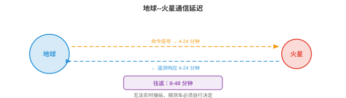
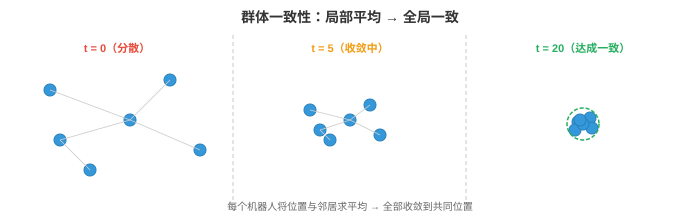
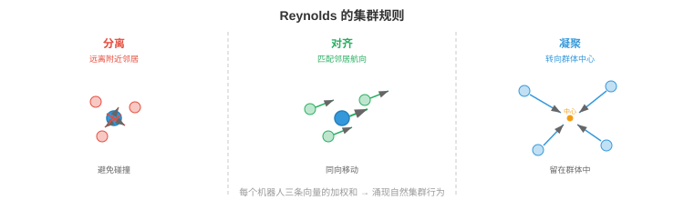
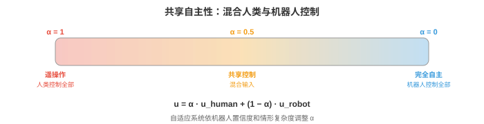

# 太空与极端环境机器人

*太空与极端环境机器人将自主性推向极限：通信延迟、辐射和非结构化地形都要求机器人独立思考。本节介绍行星探测车、在轨服务、受通信约束的自主性、抗辐射计算、水下机器人、搜救机器人、群体机器人和人机交互。*

- 本章前面研究的自主系统工作在相对温和的环境中：有车道线的道路、地面平坦的仓库、物体类别已知的厨房。但机器人最有影响力的一些应用，位于人类无法进入或人类在场成本极高的环境：火星表面、深海海底、核灾难现场和着火建筑物。

!!! note "大白话"
    前面那些机器人像在条件较好的室内做事；这里的机器人要替人去人根本去不了、或去了会很危险的地方。

- 这些**极端环境（extreme environments）**有共同挑战：通信受限或有延迟，地形非结构化且不可预测，硬件必须在恶劣条件下存活，发生故障时附近没有人可修复。机器人必须真正自主，而不是“有人盯着屏幕的自主”。

!!! note "大白话"
    这类机器人不能把每一步都问人。它得自己看路、自己判断故障、自己先保住安全，等有机会再汇报。

## 太空机器人

- 太空是终极极端环境。那里没有空气，温度在 -170°C 到 +120°C 之间剧烈变化，辐射轰击电子设备，而帮助远在数百万公里之外。太空机器人必须具有极高的可靠性、能效和自主性。

!!! note "大白话"
    太空机器人没有维修店，也没有人能马上赶来。它既要抗严寒酷热和辐射，又要省电，还得尽量一次就把事情做对。

- **行星探测车（planetary rovers）**是在其他星球表面探索的移动机器人。NASA 的火星探测车 Spirit、Opportunity、Curiosity 和 Perseverance 是最著名的例子。每一代的自主性都超过前一代。

!!! note "大白话"
    行星探测车就是开到别的星球上替人勘察的遥远车辆。越新的探测车，越能自己选路和处理情况。



- 根本约束是**通信延迟（communication delay）**。火星的无线电单程距离为 4--24 分钟，取决于轨道位置，因此往返通信要 8--48 分钟。探测车无法实时用操纵杆控制。它若遇到岩石，不能向地球求助后等待答复，必须自行决定。

!!! note "大白话"
    从地球按下指令，火星车可能几十分钟后才收到；等它回话又要几十分钟。遇到石头时等人指挥，车早就停死了，所以必须自己判断。

- 早期探测车 Spirit 和 Opportunity 高度依赖地面人员参与规划：人类研究图像、规划路径、上传命令，探测车执行命令。一次行驶周期要花费完整的一个火星日（sol），每个火星日大约只能行驶 50--100 米。

!!! note "大白话"
    早期方式像远程下达一整天的行车计划：地球团队先想好，车再照做。因此反应慢，能走的距离也有限。

- Curiosity 和 Perseverance 上的 **AutoNav**（自主导航，Autonomous Navigation）大幅提高了自主性。探测车使用双目相机构建局部三维地图（回顾第 8 章的双目深度），评估地形可通行性（坡度、粗糙度、岩石尺寸），并利用带有可通行性代价地图的栅格规划器规划安全路径。人类团队休息时，探测车自主行驶，使每日行驶距离提高到 100 米以上。

!!! note "大白话"
    AutoNav 让探测车像有了能看立体路况的驾驶助手：自己识别哪里陡、哪里有大石头，再从安全路线里挑一条走。地球团队不在线时，它也能继续前进。

- 火星探测车的感知流水线受抗辐射处理器限制，这类处理器比消费级硬件慢几个数量级，下文会进一步说明。算法必须节省计算：采用传统双目匹配而非深度神经网络，采用简单代价地图规划器而非学习策略。

!!! note "大白话"
    火星车的电脑不能像你的显卡那样猛。算法必须先考虑“算得动、够可靠”，不能只追求最先进、最耗算力的方案。

- **在轨服务（orbital servicing）**是指用机器人在轨检查、维修、加注燃料或使卫星离轨。随着太空日益拥挤，这是一个不断增长的领域。**OSAM-1**（NASA）等任务和 Astroscale、Northrop Grumman MEV 等商业项目，使用机械臂和对接机构为卫星提供服务。

!!! note "大白话"
    卫星坏了或燃料快用完时，过去往往只能报废；在轨服务就是派机器人去太空给它检查、修理或加油。

- 挑战在于**近距离操作（proximity operations）**：服务飞行器必须接近目标卫星，目标可能在翻滚、不配合且没有对接接口，并在微重力环境中完成精密操作。基于视觉的位姿估计，即从相机图像确定目标的三维位置与朝向，是关键能力。它使用第 8 章的技术：特征检测、PnP（Perspective-n-Point）求解，以及较新的基于深度学习的位姿估计器。

!!! note "大白话"
    这像在失重环境里接住一个不断翻转、没有把手的物体。机器人先要从相机画面里看清它在哪里、朝哪边转，才可能安全靠近。

- **卫星检查（satellite inspection）**使用小型航天器目视检查其他卫星有无损坏或异常。检查器必须自主绕目标航行、避免碰撞，并从最佳视角采集高分辨率图像。这是一个规划问题：在满足燃料约束、光照条件和避碰要求的同时，找出覆盖全部检查点的轨迹。

!!! note "大白话"
    检查卫星不是随便飞一圈拍照。它得在燃料有限、光线合适且绝不撞上的前提下，把所有需要看的位置都看全。

## 通信约束

- 在太空中，通信受光速、可用带宽和轨道几何限制。没有中继卫星时，位于火星背面的探测车完全无法与地球通信。

!!! note "大白话"
    通信不是想连就能连。距离造成延迟，信号容量有限，星球还会挡住信号；有时探测车就是完全失联的。

- 这些约束从根本上改变了自主系统架构。在地球上，机器人可将高清视频流传到云服务器，在 GPU 集群运行推理，并在毫秒内接收命令。在太空中，机器人必须在机载端完成全部工作。

!!! note "大白话"
    地面机器人可以把难题发到云端求算力，太空机器人不行。它必须把感知、判断和行动都装进自己这台有限的机载电脑里。

- **高延迟（high latency）**意味着机器人必须在没有人类实时指导的情况下规划和行动。自主软件必须处理正常操作、检测异常并响应危险，不能等待人类输入。这需要鲁棒的机载状态估计、故障检测和应急规划。

!!! note "大白话"
    信号来回太慢时，人只能事后指导。机器人得自己知道“我现在怎么样”“哪里不对劲”“出事先怎么保命”。

- **带宽有限（limited bandwidth）**意味着机器人无法传输原始传感器数据。一张高分辨率图像可能有数 MB，而地球直连链路的火星到地球数据率只有每秒数千比特。轨道中继会更高，但仍然受限。机器人必须积极压缩数据，决定优先发送哪些数据，并在本地做出绝大部分决策。

!!! note "大白话"
    通信像一根很细、很慢的管子，装不下所有原始图片和传感器读数。机器人必须先在本地筛选，优先把最有价值的信息发回去。

- **通信窗口（communication windows）**是间歇性的。火星探测车只能在特定轨道几何条件下与地球通信，通常每个火星日经由中继卫星通信数小时。窗口之外，探测车完全靠自己。

!!! note "大白话"
    探测车不是随时能打电话回地球，只能在每天特定的几个时段联络。其余时间，它必须按既定目标独立工作。

- 这对 AI 的含义是，**机载自主性（onboard autonomy）**必须极其可靠。系统需要发现是否出了问题，例如车轮卡住、传感器失效、前方地形无法通行，决定安全响应，并持续运行到下一个通信窗口，届时才能报告情况并接收更新指令。

!!! note "大白话"
    机载 AI 不能只会正常走路，还要会发现异常、及时停下或换方案，并把系统维持到能再次和地球联系的时候。

## 抗辐射计算

- 太空充满电离辐射：宇宙射线、太阳粒子事件和被行星磁场俘获的辐射。高能粒子会翻转内存位，即**单粒子翻转（single-event upsets, SEUs）**；永久损坏晶体管，即**总电离剂量（total ionising dose, TID）**；或导致电路发生破坏性闩锁。

!!! note "大白话"
    辐射会直接干扰电子电路：轻则把一个 0 改成 1，重则把芯片慢慢损坏甚至弄坏电路。太空电脑首先得能扛住这些随机攻击。

- **抗辐射（radiation-hardened，rad-hard）**处理器专为承受这种环境而设计。它们使用更大的晶体管几何尺寸、冗余逻辑，即三模冗余，每个电路复制三份并对输出投票，以及专用制造工艺。代价是性能：先进抗辐射处理器可能只有 200 MIPS，而消费级 GPU 每秒可进行数十亿次操作。

!!! note "大白话"
    抗辐射芯片的做法是“宁可慢，也要不容易错”：同一件事让三套电路一起算，再按多数结果决定答案。可靠性换来了明显更低的速度。

- **RAD750**（BAE Systems）为 Curiosity 和许多其他航天器提供计算能力。它以 200 MHz 运行，处理能力约 400 MIPS，相当于 20 世纪 90 年代中期的台式机。Perseverance 使用同类处理器。在这种硬件上运行拥有数百万参数、数十亿次乘加运算的现代神经网络不可行。

!!! note "大白话"
    这类航天电脑的速度接近很早的家用电脑。把今天的大模型直接搬上去，通常不是慢一点，而是根本跑不起来。

- **模型压缩（model compression）**至关重要。第 6 章的量化、剪枝和知识蒸馏等技术用于缩小神经网络，使其适应极端的计算预算。笔记本 GPU 上毫秒级运行的模型，在抗辐射处理器上可能需要数分钟，或者根本无法装入内存。

!!! note "大白话"
    模型压缩就是给神经网络减重：少占内存、少做计算，才能塞进航天电脑。普通电脑上一眨眼的计算，在那里可能要等很久。

- 另一种方法是使用**商用现货（commercial off-the-shelf, COTS）**处理器，并在软件中进行辐射缓解：纠错码、看门狗定时器、周期性内存擦洗和优雅降级策略。一些现代任务采用该方法，以更高的软件复杂度和风险换取更强计算能力。

!!! note "大白话"
    也可以用更快但天生不抗辐射的普通芯片，再靠软件反复查错、重启和降级运行。这样算力更强，但软件必须承担更多风险。

- 未来行星任务正在探索 **FPGA** 和专用 AI 加速器，它们可以具有耐辐射能力，同时提供显著多于传统抗辐射 CPU 的计算能力，可能首次实现机载深度学习。

!!! note "大白话"
    未来目标是同时拿到可靠性和足够算力：让更强的专用硬件也能耐受辐射，使深度学习真的能在飞船上实时工作。

## 非结构化地形中的自主导航

- 地球上的道路平坦、标记清晰且已有地图。火星、月球或灾难现场没有道路，地形是非结构化的：岩石、斜坡、沙地、裂缝，以及可能无法承受机器人重量的表面。

!!! note "大白话"
    在这类地方没有导航地图可照抄，地面还可能会塌、会陷。机器人要边走边弄清楚哪里能落脚。

- **地形分类（terrain classification）**评估每一块地面是否安全可通过。特征包括坡度，来自三维重建；粗糙度，即表面法线的方差；岩石密度和土壤类型。传统方法从双目深度图计算这些特征；现代方法则在视觉和几何特征上使用学习得到的分类器。

!!! note "大白话"
    地形分类就是给眼前地面打标签：平不平、陡不陡、石头多不多、会不会陷车。标签结果决定机器人敢不敢往那里开。

- **视觉惯性里程计（Visual-Inertial Odometry, VIO）**通过跨相机帧跟踪视觉特征并与 IMU 测量融合，估计机器人的运动。它是适配极端条件的核心 SLAM 组件，第 8 章已介绍。在火星上，VIO 必须处理缺少可跟踪视觉特征的无纹理沙地、极端阴影造成的严苛光照和有限的计算能力。

!!! note "大白话"
    VIO 把“相机看到的变化”和“惯性传感器感觉到的加速、转动”合起来推断自己走了多远。在沙地和强阴影里，看不清固定特征，这件事就更难。

- 估计过程使用**扩展卡尔曼滤波器（Extended Kalman Filter, EKF）**或因子图优化融合视觉与惯性数据。状态向量包括位置、速度、朝向和 IMU 偏置。预测步骤使用 IMU 积分：

$$\mathbf{x}_{t+1} = f(\mathbf{x}_t, \mathbf{u}_t)$$

!!! note "大白话"
    这一步先根据上一刻状态和 IMU 读数猜测下一刻的位置、速度和朝向。它是“先按运动规律往前推一遍”的预测。

- 其中，$\mathbf{u}_t$ 是 IMU 测量，即加速度和角速度。更新步骤利用视觉特征观测修正预测。这是第 5 章的贝叶斯估计：IMU 提供先验，视觉观测更新信念。

!!! note "大白话"
    IMU 会一点点积累误差，所以不能只信它。看到可靠视觉特征后，就用画面把刚才的预测拉回更可信的位置。

- **危险规避（hazard avoidance）**在行星着陆期间至关重要。航天器向地表下降时，必须用机载相机或 LiDAR 实时识别安全着陆区。Perseverance 上 NASA 的**地形相对导航（Terrain Relative Navigation, TRN）**系统将机载相机图像与预加载的轨道地图对比，以确定下降过程中的位置，再避开危险地形。它使航天器得以降落在 Jezero Crater，一个科学价值丰富但地形危险、此前任务风险过高的地点。

!!! note "大白话"
    着陆时没有重来机会。TRN 像在下降途中拿眼前画面和地图对照，确认自己落在哪里，再主动躲开大石头和危险坡地。

## 水下机器人

- 深海与太空一样陌生：巨大的压力，完整海洋深度超过 1,000 个大气压；几乎为零的能见度；没有 GPS；通信受限。水下机器人对海洋科学、海上基础设施检查、深海采矿和搜寻行动不可或缺。

!!! note "大白话"
    深海的问题和太空很像：人难以进入、看不清、不能用 GPS、也不好通信。水下机器人因此必须自己完成大量判断。

- **自主水下航行器（Autonomous Underwater Vehicles, AUVs）**不系缆运行，自带能源和计算设备。它们遵循预编程的勘测模式，或利用机载智能适应新发现。AUV 用于海底测绘、管线检查和环境监测。

!!! note "大白话"
    AUV 像没有绳子拴着的水下无人机，带着电池和电脑独自执行任务。它适合大范围、长时间地扫描海底。

- **遥控潜水器（Remotely Operated Vehicles, ROVs）**通过一根提供电力和通信的缆线连接到水面船只。它们用于需要人类实时控制的任务：深海操纵、施工和维修。缆线消除了通信限制，却限制航程并增加运行复杂性。

!!! note "大白话"
    ROV 像用一根长线连着船的水下机械手。人能实时操控它，但线会限制它能走多远，也容易让任务变麻烦。

- **声学通信（acoustic communication）**是主要的水下通信手段，因为无线电波在水中迅速衰减。声学调制解调器在数公里范围内的数据率为 1--10 kbps，而陆地无线电可达每秒吉比特。这比火星通信更受限，迫使 AUV 具有高度自主性。

!!! note "大白话"
    无线电在水里不好用，只能更多靠声音传消息。但声音通信慢得多，水下机器人不能把每个决定都交给水面的人。

- **水下 SLAM（underwater SLAM）**尤其困难。声呐可提供距离测量，但角分辨率差且噪声显著，例如海底和水面造成的多径反射。相机只能在很短距离工作，清水中为数米，浑浊条件下更短。基于特征的视觉 SLAM（第 8 章）必须适配水下场景特有的视觉特性：颜色衰减，红光最先被吸收；后向散射；以及造成亮点和深阴影的人工照明。

!!! note "大白话"
    水下定位建图缺少清晰稳定的画面：声呐噪声大，相机看得近，光还会被水吸收和散射。所以陆地上好用的方法到水下要重新适配。

- 没有 GPS 时，导航采用**航位推算（dead reckoning）**：通过多普勒速度计（Doppler Velocity Log, DVL）积分速度，DVL 利用声学多普勒频移测量相对于海底的速度；再借助偶尔上浮获得 GPS 修正，或利用水面应答器进行声学定位。这与仅使用 IMU 导航的漂移问题相同：小速度误差会在长任务中不断累积。

!!! note "大白话"
    没有 GPS 时，机器人只能从自己的速度一路累加来估计位置。每一步一点点偏差，走很久后就会偏很远，所以要偶尔上浮或借助外部信标校正。

## 搜救机器人

- 地震、建筑物坍塌或工业事故后，机器人能够进入对人类救援人员过于危险的空间：结构不稳定的建筑物、有毒环境、火场或狭窄空间。

!!! note "大白话"
    搜救机器人先进去探路，能降低救援人员直接进入坍塌、有毒或着火区域的风险。

- 要求包括：快速部署，按分钟而非小时计；在 GPS 拒止环境中运行，如建筑内部和地下；穿过墙体和瓦砾保持鲁棒通信；并能在有碎片、尘土、光线差且部分坍塌的高度杂乱空间中导航。

!!! note "大白话"
    灾后现场等不起，也不给机器人准备好的路和网络。它得很快到位，在黑暗、拥挤、断网的环境里还能找到路和保持联络。

- **多机器人协同（multi-robot coordination）**对搜救很有价值，因为一组机器人能比单个机器人更快覆盖大面积区域。挑战在于协同：机器人必须划分搜索区域、避免重复劳动并共享发现。

!!! note "大白话"
    一台机器人搜得慢，很多台一起搜才快；但它们必须分工，否则大家扎进同一片区域，其他地方仍没人检查。

- **基于前沿的探索（frontier-based exploration）**将机器人分配给已探索空间与未探索空间之间的边界，即“前沿（frontier）”。每个机器人导航至最近的未探索前沿，完成建图后继续前进。中央或分布式规划器把前沿分配给机器人，以最小化总探索时间。这是一个覆盖优化问题。

!!! note "大白话"
    “前沿”就是地图里已知区域和未知区域的交界。让机器人去这些边界继续扩图，能一步步把没搜过的地方填满。

- 穿过瓦砾的通信不可靠。机器人可能与操作员及彼此失去联系。系统必须对间歇通信保持鲁棒：每个机器人都应能独立工作，构建自己的局部地图并做出自己的决策，通信恢复后再合并信息。

!!! note "大白话"
    瓦砾会挡住信号，所以不能假设机器人一直在线。断联时每台都要继续做自己的事，重新连上后再把各自发现拼起来。

## 群体机器人

- **群体机器人（swarm robotics）**使用大量简单、低成本机器人，通过局部交互实现复杂集体行为。任何单个机器人都没有足够能力，但群体整体可以完成任何个体都无法完成的任务。

!!! note "大白话"
    群体机器人不靠一台特别强的机器人，而是靠很多简单机器人配合。单个能力有限，合起来却能完成大范围任务。

- 灵感来自生物群体：蚂蚁用身体搭桥，蜜蜂共同决定巢址，鱼群通过协调运动躲避捕食者。在每种情况下，简单的局部规则，如跟随邻居、避免碰撞、朝食物移动，都会产生复杂的全局行为。

!!! note "大白话"
    群体智能的核心直觉是：每个成员只遵守简单的近处规则，整体却能出现看似有人统一指挥的复杂结果。

- **去中心化控制（decentralised control）**意味着没有中央指挥者。每个机器人遵循相同的局部规则，只对邻居和即时环境作出反应。全局行为从这些局部交互中**涌现（emerges）**。这使群体天生鲁棒：一台机器人失效，群体仍会继续运行，没有单点故障。

!!! note "大白话"
    这里没有一个总控大脑。每台只看身边情况，但共同动作会自然形成整体策略；少几台坏掉，整个系统也不至于瘫痪。

- **一致性算法（consensus algorithms）**使群体仅通过局部通信就能对集体决策达成一致，例如向哪个方向移动、优先执行哪项任务。一个简单的一致性协议让每个机器人将自己的值与邻居的值取平均：

$$x_i(t+1) = \frac{1}{|N_i| + 1} \left( x_i(t) + \sum_{j \in N_i} x_j(t) \right)$$

!!! note "大白话"
    每台机器人不需要知道全体的意见，只要把自己的值和邻居的值平均一下。反复这样做，局部意见会慢慢变成全体一致。



- 其中 $N_i$ 是机器人 $i$ 的邻居集合。不断重复这一过程，直到所有机器人收敛到相同的值，即全局平均值。收敛速度取决于通信图的拓扑，具体说是它的代数连通度，即图拉普拉斯矩阵第二小特征值，这与第 2 章的特征值相连。

!!! note "大白话"
    谁能和谁交流决定了意见传得有多快。连接越通畅，信息越快传遍群体，大家越早达成一致。



- **集群算法（flocking algorithms）**，即 Reynolds 规则，通过每个机器人的三条简单规则产生协调的群体运动：
    - **分离（Separation）**：转向远离过近的邻居，以避免碰撞。

        !!! note "大白话"
            离得太近就避开，先保证不会撞在一起。
    - **对齐（Alignment）**：转向邻居的平均航向，以同向移动。

        !!! note "大白话"
            看周围大多数往哪走，自己也把方向调过去，群体就不会各走各的。
    - **凝聚（Cohesion）**：转向邻居的平均位置，以留在群体中。

        !!! note "大白话"
            别落单，朝伙伴的大致位置靠近，这样群体能维持在一起。

!!! note "大白话"
    三条规则分别解决“别撞”“同向”“别散”。它们叠加后，不需要中央命令也能形成整齐移动的群体。

- 每条规则都是对机器人速度的一个向量贡献。这些向量的加权和会产生自然的集群行为。这是第 1 章的向量线性组合，权重控制每种行为的相对重要性。

!!! note "大白话"
    机器人同时收到三种“该往哪儿走”的建议，再按重要程度加起来形成最终速度。调大某条规则的权重，就等于让它更有话语权。

- 群体机器人的应用包括环境监测，例如在大区域分布传感器；精准农业，例如协调无人机喷洒作物；施工，例如机器人集体装配结构；以及搜寻行动，例如高效覆盖大片区域。

!!! note "大白话"
    只要任务需要覆盖范围大、允许多台分工，群体机器人就有优势，比如巡查农田、搜索区域或布置传感器。

## 人机交互

- 大多数现实世界中的自主系统与人类并肩运行，而不是孤立运行。人和机器人如何交互、通信、共享控制并建立信任，与机器人的技术能力同样重要。

!!! note "大白话"
    机器人够不够聪明还不够。现实里人和它要一起做事，能否听懂意图、及时交接控制、让人敢用同样关键。



- **共享自主性（shared autonomy）**混合人类与机器人的控制。它既不是完整遥操作，即人类控制一切，也不是完全自主，即机器人控制一切；而是由人类提供高层意图，机器人处理低层执行。例如，人类可以指向一个物体并说“拿起那个”，机器人则自主规划抓取和机械臂运动。

!!! note "大白话"
    共享自主性就是人定“要做什么”，机器人解决“具体怎么做”。人不必操控每个关节，机器人也不会擅自决定目标。

- 在数学上，共享自主性可建模为人类输入 $\mathbf{u}_h$ 与机器人自主动作 $\mathbf{u}_r$ 的混合：

$$\mathbf{u} = \alpha \mathbf{u}_h + (1 - \alpha) \mathbf{u}_r$$

!!! note "大白话"
    最终动作是人和机器建议的加权混合。$\alpha$ 就是控制权的旋钮，决定更听人还是更听机器人。

- 其中 $\alpha \in [0, 1]$ 是混合参数。当 $\alpha = 1$ 时，人类拥有完全控制权，即遥操作；当 $\alpha = 0$ 时，机器人完全自主。自适应共享自主性根据情形调整 $\alpha$：机器人在有信心时承担更多控制，在不确定或情形新颖时让出控制权。

!!! note "大白话"
    $\alpha=1$ 是全程人开，$\alpha=0$ 是全程机器人开。更实用的做法是动态切换：机器人有把握时多帮忙，没把握时让人接管。

- **遥操作（teleoperation）**对于超出当前自主能力的任务仍然重要。人类操作员远程控制机器人，通过机器人的相机观察场景。挑战是**延迟（latency）**：即使 100 ms 延迟也会让遥操作困难，而太空中数秒级延迟几乎使精细操作不可能。预测显示，即显示机器人预测的未来状态，以及虚拟夹具，即阻止操作员下达危险运动指令的软件引导，有助于补偿这一问题。

!!! note "大白话"
    远程操控最怕画面和动作不同步。预测显示提前告诉操作者“再这样动会到哪儿”，虚拟夹具则像护栏，先拦住明显危险的指令。

- **信任校准（trust calibration）**是确保人类对机器人具有恰当信任的问题：不能太多，过度信任会导致自满，并在需要干预时未能干预；也不能太少，信任不足会导致不必要干预和利用不足。信任应与机器人的实际能力相匹配：在其擅长的情形中信任它，在接近能力边界的情形中保持怀疑。

!!! note "大白话"
    对机器人最危险的两种态度是盲信和完全不信。正确做法是知道它在哪些情况可靠，哪些情况必须让人盯紧。

- 研究表明，信任受以下因素影响：机器人的透明性，即它是否解释决策；可靠性，即它是可预测地失效还是随机失效；以及通信，即它是否表达不确定性。会说“我有 40% 把握认为这是一条安全路径，我应继续吗？”的机器人，比沉默地向前行驶的机器人更能帮助人类做出决策。

!!! note "大白话"
    人会更信任一个能说清依据、承认没把握的机器人，而不是一个沉默地做动作、出错还毫无预警的黑箱。

- 机器人运动中的**意图可辨识性（legibility）**是指，机器人以能向附近人类传达意图的方式运动。若机器人伸手去拿某个物体，它的路径应当在抵达之前就让人明显看出目标是哪一个。这涉及规划能最大化观察者尽早推断目标能力的轨迹，可形式化为：在给定已观察部分轨迹时，最大化真实目标的后验概率：

$$\pi^* = \arg\max_\pi P(G \mid \xi_{0:t})$$

!!! note "大白话"
    机器人不只要把动作做成，还要让旁边的人尽早看懂它要做什么。比如伸手时走一条明显朝目标物体去的路线，别人就更容易避让或配合。

- 其中 $G$ 是目标，$\xi_{0:t}$ 是至今观察到的轨迹。这使用第 5 章的贝叶斯推断：观察者对可能目标有一个先验，机器人轨迹提供更新该信念的证据。

!!! note "大白话"
    人会根据已看到的动作不断猜机器人的目标；动作越清楚，这个猜测越快、越准。这里的公式就是把“让人看懂意图”写成可优化的目标。

## 编程任务（使用 CoLab 或 Notebook）

1. 模拟群体机器人就目标位置达成一致的一致性算法。从随机初始位置开始，观察其收敛。
```python
import jax
import jax.numpy as jnp
import matplotlib.pyplot as plt

n_robots = 10
rng = jax.random.PRNGKey(0)
positions = jax.random.uniform(rng, (n_robots, 2), minval=-5, maxval=5)

# Communication graph: each robot talks to its 3 nearest neighbours
def get_neighbours(positions, k=3):
    dists = jnp.linalg.norm(positions[:, None] - positions[None, :], axis=-1)
    # For each robot, find k nearest (excluding self)
    neighbours = jnp.argsort(dists, axis=1)[:, 1:k+1]
    return neighbours

history = [positions.copy()]

for step in range(30):
    neighbours = get_neighbours(positions)
    new_positions = jnp.zeros_like(positions)
    for i in range(n_robots):
        nbr_pos = positions[neighbours[i]]
        new_positions = new_positions.at[i].set(
            (positions[i] + nbr_pos.sum(axis=0)) / (len(neighbours[i]) + 1)
        )
    positions = new_positions
    history.append(positions.copy())

# Plot convergence
fig, axes = plt.subplots(1, 3, figsize=(15, 4))
for ax, step_idx, title in zip(axes, [0, 10, 29], ["Initial", "Step 10", "Final"]):
    h = history[step_idx]
    ax.scatter(h[:, 0], h[:, 1], s=50)
    ax.set_xlim(-6, 6); ax.set_ylim(-6, 6)
    ax.set_aspect("equal"); ax.grid(True); ax.set_title(title)
plt.suptitle("Swarm Consensus: Robots Converge to Agreement")
plt.tight_layout()
plt.show()
```

2. 实现 Reynolds 的集群规则，分离、对齐和凝聚，并模拟一个共同移动的机器人群体。
```python
import jax
import jax.numpy as jnp
import matplotlib.pyplot as plt

n = 30
rng = jax.random.PRNGKey(1)
k1, k2 = jax.random.split(rng)
pos = jax.random.uniform(k1, (n, 2), minval=-5, maxval=5)
vel = jax.random.uniform(k2, (n, 2), minval=-0.5, maxval=0.5)

dt = 0.1
separation_radius = 1.0
neighbour_radius = 3.0

trajectories = [pos.copy()]

for _ in range(200):
    new_vel = jnp.zeros_like(vel)
    for i in range(n):
        diffs = pos - pos[i]
        dists = jnp.linalg.norm(diffs, axis=1)

        # Neighbours within radius (exclude self)
        nbr_mask = (dists < neighbour_radius) & (dists > 0)
        sep_mask = (dists < separation_radius) & (dists > 0)

        # Separation: steer away from very close neighbours
        if sep_mask.any():
            sep = -diffs[sep_mask].sum(axis=0)
        else:
            sep = jnp.zeros(2)

        # Alignment: match average velocity of neighbours
        if nbr_mask.any():
            align = vel[nbr_mask].mean(axis=0) - vel[i]
        else:
            align = jnp.zeros(2)

        # Cohesion: steer toward average position of neighbours
        if nbr_mask.any():
            cohesion = pos[nbr_mask].mean(axis=0) - pos[i]
        else:
            cohesion = jnp.zeros(2)

        new_vel = new_vel.at[i].set(vel[i] + 1.5 * sep + 0.5 * align + 0.3 * cohesion)

    # Limit speed
    speeds = jnp.linalg.norm(new_vel, axis=1, keepdims=True)
    vel = jnp.where(speeds > 2.0, new_vel / speeds * 2.0, new_vel)
    pos = pos + vel * dt
    trajectories.append(pos.copy())

# Plot snapshots
fig, axes = plt.subplots(1, 3, figsize=(15, 4))
for ax, idx, title in zip(axes, [0, 50, 199], ["Start", "Step 50", "Step 200"]):
    p = trajectories[idx]
    v = vel if idx == 199 else jnp.zeros_like(vel)
    ax.scatter(p[:, 0], p[:, 1], s=20, c="blue")
    ax.set_aspect("equal"); ax.grid(True); ax.set_title(title)
    lim = max(abs(p).max() + 1, 6)
    ax.set_xlim(-lim, lim); ax.set_ylim(-lim, lim)
plt.suptitle("Reynolds' Flocking: Separation + Alignment + Cohesion")
plt.tight_layout()
plt.show()
```

3. 模拟共享自主性的混合控制：人类提供带噪声的方向输入，机器人的自主系统提供通向目标的平滑路径。使用不同的 alpha 值进行混合。
```python
import jax
import jax.numpy as jnp
import matplotlib.pyplot as plt

goal = jnp.array([10.0, 5.0])
pos = jnp.array([0.0, 0.0])
dt = 0.1

rng = jax.random.PRNGKey(3)

fig, axes = plt.subplots(1, 3, figsize=(15, 4))
for ax, alpha in zip(axes, [1.0, 0.5, 0.0]):
    pos = jnp.array([0.0, 0.0])
    path = [pos.copy()]

    for step in range(150):
        # Robot autonomy: smooth path to goal
        direction = goal - pos
        u_robot = direction / (jnp.linalg.norm(direction) + 1e-6) * 1.0

        # Human input: roughly correct direction but noisy
        noise = jax.random.normal(jax.random.fold_in(rng, step), (2,)) * 0.5
        u_human = u_robot + noise

        # Blend
        u = alpha * u_human + (1 - alpha) * u_robot
        pos = pos + u * dt
        path.append(pos.copy())

        if jnp.linalg.norm(pos - goal) < 0.3:
            break

    path = jnp.stack(path)
    ax.plot(path[:, 0], path[:, 1], "b-", alpha=0.7)
    ax.plot(*goal, "r*", markersize=15)
    ax.plot(0, 0, "go", markersize=10)
    ax.set_title(f"α={alpha:.1f} ({'human' if alpha==1 else 'robot' if alpha==0 else 'shared'})")
    ax.set_xlim(-1, 12); ax.set_ylim(-3, 8)
    ax.set_aspect("equal"); ax.grid(True)

plt.suptitle("Shared Autonomy: Blending Human and Robot Control")
plt.tight_layout()
plt.show()
```
