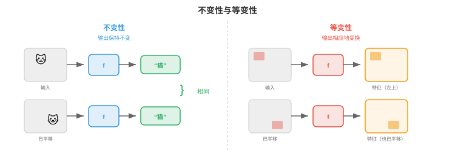
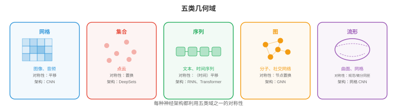

# 几何深度学习

*几何深度学习是一个统一框架，它揭示 CNN、Transformer 和 GNN 都是同一原则的实例：利用对称性。本节介绍对称群、群作用、不变性、等变性、五类几何域和尺度分离。*

- 在本书中，我们已经学习了许多架构：用于图像的 CNN（第 8 章）、用于语言的 Transformer（第 7 章），以及用于序列决策的强化学习策略（第 6 章）。它们看起来像是为完全不同问题设计的完全不同模型，但其中存在更深的模式。

!!! note "大白话"
    这些模型表面上各做各的事，但它们都在利用数据里某种“换个表示方式，核心内容不变”的规律。

- **几何深度学习（geometric deep learning）**揭示了这些架构都是同一思想的实例：构建尊重数据**对称性（symmetries）**的网络。CNN 利用图像中的平移对称性；Transformer 利用序列中的置换对称性，注意力不依赖绝对位置；GNN 利用图中的置换对称性。一旦看见这一点，纷繁的架构就成为一个连贯统一的框架。

!!! note "大白话"
    几何深度学习的核心是：先找出数据怎样变化不会改变问题，再让网络天生遵守这个规律，而不是让它从大量样本里反复猜。

## 对称性与群

- 一个对象的**对称性（symmetry）**是使对象保持不变的变换。正方形有 8 种对称：4 次旋转，0°、90°、180°、270°，以及 4 次反射。圆有无限多种：绕圆心的任意旋转。关键洞见是，对称性告诉你什么并不重要；而知道什么不重要，对学习极具威力。

!!! note "大白话"
    对称性就是“换个姿势，还是同一个东西”。知道哪些变化可以忽略，模型就不用为每一种摆放方式都重新学一遍。

- 用机器学习的语言说：如果一个任务具有某种对称性，那么无论模型看到输入的哪种“版本”，都应给出相同答案。无论猫在图像左上角还是右下角，猫检测器都应正常工作。这就是平移对称性。

!!! note "大白话"
    猫从画面左边移到右边，答案仍然应该是“猫”。模型不应把位置变化误当成类别变化。

- 对称性被形式化为**群（groups）**。一个群 $G$ 是具有四个性质的变换集合：

    - **封闭性（Closure）**：组合两个变换得到的仍是集合中的变换。旋转 90° 后再旋转 90° 得到 180°，它也在集合中。

        !!! note "大白话"
            规则里的任意两次合法操作连起来，结果仍然是合法操作。
    - **结合性（Associativity）**：$(g_1 \circ g_2) \circ g_3 = g_1 \circ (g_2 \circ g_3)$。分组顺序无关紧要，回顾第 2 章的矩阵乘法结合性。

        !!! note "大白话"
            三个变换的先后顺序固定时，先算哪一对不会改变最后结果。
    - **单位元（Identity）**：存在一个“不做任何事”的变换 $e$，使得 $e \circ g = g \circ e = g$。

        !!! note "大白话"
            单位元就是“什么也不改变”的操作，和任何变换组合都不会添乱。
    - **逆元（Inverse）**：每个变换都有一个撤销操作：$g \circ g^{-1} = e$。

        !!! note "大白话"
            每个操作都有一个能把它完全撤销的反向操作，就像向右走后向左走回来。

!!! note "大白话"
    这四条性质把“可组合、可撤销的变换”组织成一个可计算的体系。

- 这些公理与第 1 章向量空间的公理相同，只是这里处理的是变换而不是向量。联系很深：群作用于向量空间，而这种作用正是神经网络必须尊重的对象。

!!! note "大白话"
    向量空间研究的是怎样加向量，群研究的是怎样组合变换；两者结合后，就能描述“变换作用在数据上”这件事。

- 深度学习中出现的关键群包括：

    - **平移群（Translation group）** $(\mathbb{R}^n, +)$：移动图像或信号。这是 CNN 利用的对称性。

        !!! note "大白话"
            把图像整体挪动，图像中的局部规律仍然存在，这正是卷积共享滤波器的依据。
    - **对称群（Symmetric group）** $S_n$：$n$ 个元素的全部置换。这是 GNN 和 Transformer 利用的对称性，重排节点或词元不应改变结果。

        !!! note "大白话"
            只要元素之间的关系没变，给节点或词元换编号不应改变整体答案。
    - **旋转群（Rotation group）** $SO(n)$：$n$ 维空间中的全部旋转。$SO(2)$ 是平面旋转，$SO(3)$ 是三维旋转，对分子任务和三维视觉任务至关重要。

        !!! note "大白话"
            物体转个方向仍是同一个物体；模型若能尊重旋转，就不必为每个朝向单独训练。
    - **欧几里得群（Euclidean group）** $E(n)$：全部旋转、反射与平移，即物理空间的对称性。

        !!! note "大白话"
            这里把平移、转动和镜像反射都算作允许的空间变化。
    - **特殊欧几里得群（Special Euclidean group）** $SE(n)$：旋转与平移，不含反射，即刚体运动的对称性。

        !!! note "大白话"
            $SE(n)$ 描述刚体真正移动和转动的方式，不把镜像翻转混进来。

- **群作用（group action）**描述群如何变换数据。若 $G$ 是群、$X$ 是数据空间，则作用 $\rho: G \times X \to X$ 将每个群元素 $g$ 和数据点 $x$ 映射为变换后的点 $\rho(g, x)$。对于图像，平移群通过移动像素坐标作用；对于图，对称群通过重命名节点作用。

!!! note "大白话"
    群作用就是明确写出“某种变换怎样作用到某个数据上”。例如把图像像素挪位置，或给图节点重新编号。

## 不变性与等变性

- 给定一个对称群，函数与它之间有两种重要关系：

!!! note "大白话"
    接下来只需要区分两种情况：变换输入后答案不变，或者答案跟着输入一起按规则变化。

- 若输入被变换时输出不变，则函数 $f$ 对群 $G$ 是**不变的（invariant）**：

$$f(\rho(g, x)) = f(x) \quad \text{for all } g \in G$$

!!! note "大白话"
    输入怎么换，函数结果都一样。这适合分类这类只关心“是什么”、不关心“在哪里”的任务。

- 例如，平移图像不会改变图像的总亮度。图像分类应当对平移不变：无论猫位于何处，类别“猫”都相同。

!!! note "大白话"
    猫在左上角还是右下角，分类结果都应是同一个类别；位置不是这个任务要回答的信息。

- 若变换输入会以相应方式变换输出，则函数 $f$ 对 $G$ 是**等变的（equivariant）**：

$$f(\rho_{\text{in}}(g, x)) = \rho_{\text{out}}(g, f(x)) \quad \text{for all } g \in G$$

!!! note "大白话"
    输入移动多少，输出就按对应规则移动多少。模型不是丢掉位置，而是用一致的方式传递位置变化。

- 例如，若将图像向右平移 5 个像素，CNN 中的特征图也会向右平移 5 个像素。卷积运算对平移等变，它保留空间关系。目标检测应当等变：猫移动时，边界框也应随之移动。

!!! note "大白话"
    图像里的猫向右挪，特征图和边界框也向右挪；这样网络既认出猫，又保留它在画面中的位置。



- 这一区别很重要：**中间层（intermediate layers）**通常应当等变，以为下游层保留结构；而**最终输出（final output）**应当不变，答案不应依赖变换。CNN 通过堆叠等变卷积层，再在最后应用不变的全局池化来实现这一点。

!!! note "大白话"
    中间过程要保留“东西在哪里、怎样排列”，最后分类时再把无关位置因素汇总掉。

- 将等变性内建到架构中，远比从数据中学习它高效。具有权重共享的平移等变 CNN 所需参数远少于全连接网络；后者必须分别学习“位置 (10,10) 的猫”和“位置 (200,150) 的猫”。对称性约束会指数级缩小假设空间。

!!! note "大白话"
    把规律直接写进网络，就不用靠数据把同一规律重复教很多遍，因此参数更少、样本需求也更低。

## 五类几何域

- 几何深度学习识别出数据的**五个基本域（five fundamental domains）**，每一个都有自己的对称群。每种神经网络架构都可理解为利用其中一个域的对称性。

!!! note "大白话"
    数据的组织方式不同，对称性也不同；选网络前先判断数据属于哪种几何域。



- **1. 网格（Grids，欧几里得数据）**：图像、音频频谱图、体数据。底层结构是具有平移对称性的规则网格。其群是平移群，也可能包含旋转和反射。利用这种对称性的架构是 **CNN**：卷积正是对平移等变的运算。空间位置之间的权重共享，是平移等变性的具体体现。

!!! note "大白话"
    网格数据像整齐排成行列的像素。卷积在每个位置使用同一套小滤镜，所以图案换位置后仍能被同样识别。

- **2. 集合（Sets，无序集合）**：点云、粒子系统。其对称性是置换不变性，元素顺序无关紧要。架构是 **DeepSets**，以及第 8 章的 PointNet：先对每个元素应用共享函数，再用置换不变运算，如求和、均值或最大值，进行聚合。形式上，$f(\{x_1, \ldots, x_n\}) = \phi\left(\sum_i \psi(x_i)\right)$。

!!! note "大白话"
    集合只关心有哪些元素，不关心排列顺序。每个元素先用同一个函数处理，再求和或取最大值汇总。

- **3. 序列（Sequences，有序数据）**：文本、时间序列。序列是一个一维网格，但有一个变化：其对称性更微妙，绝对位置可能重要，也可能不重要。RNN 自回归地处理序列。带位置编码的 Transformer 可以关注任意位置，其自注意力在加入位置编码之前对置换等变。这正是 Transformer 泛化能力强的原因：它从置换等变出发，只加入恰好足够的位置结构。

!!! note "大白话"
    序列的顺序通常有意义，“我爱你”和“你爱我”不是一回事。Transformer 先用不依赖顺序的注意力处理内容，再用位置编码补回顺序信息。

- **4. 图（Graphs，关系数据）**：社交网络、分子、知识图谱。其对称性是节点置换：重命名节点不应改变图的属性。对应架构是 **GNN**：在相连节点之间传递消息，使用不依赖节点排序的共享函数。这是本章余下部分的重点。

!!! note "大白话"
    图数据最重要的是“谁和谁相连”。节点编号换了但连接关系没变，图表达的事实也不应改变。

- **5. 流形与网格曲面（Manifolds and meshes）**：曲面、三维形状。对称性包含微分同胚，即平滑形变。架构使用由曲面自身几何定义的内蕴算子，例如 Laplace-Beltrami 算子，而不依赖曲面如何嵌入空间。这与微分几何相连，适用于形状分析、球面上的气候建模和蛋白质表面分析。

!!! note "大白话"
    曲面可以弯曲、换一种姿势嵌入空间，但它自身的邻接和几何关系仍在。内蕴方法直接利用曲面本身，不依赖拍摄角度。

- 该框架的力量在于统一性。CNN 是网格图上的 GNN；Transformer 是完全连接图上的 GNN；DeepSets 是没有边的 GNN。把它们看作同一原则的实例，有助于设计新架构：识别数据的对称性，再构建尊重它的网络。

!!! note "大白话"
    CNN、Transformer、DeepSets 和 GNN 可以看成同一套“按关系传递信息”的不同特例。设计新模型时，先找关系和对称性，比先背模型名字更重要。

## 尺度分离与粗化

- 现实数据在多个尺度上具有结构。图像有细粒度纹理，即像素层面；局部模式，如边与角；物体部件，如车轮与窗户；以及全局结构，即整个场景。分子也有原子级特征、官能团和整体分子形状。

!!! note "大白话"
    同一个对象既有很小的细节，也有较大的部件和整体形状。只看一个尺度，信息一定不完整。

- **尺度分离（scale separation）**是指这些细节层次可以分层处理：先捕捉局部结构，再逐步聚合为更粗的表示。这称为**粗化（coarsening）**或**池化（pooling）**。

!!! note "大白话"
    先看像素和邻居，再把它们合成边、部件和整体，就像先看字词，再理解句子和文章。

- 在 CNN 中，池化层，如最大池化和平均池化，会下采样空间分辨率，迫使更高层捕捉更大尺度的模式。按照第 8 章的感受野视角，更深层“看到”图像中更大的范围。这就是尺度分离的实际作用。

!!! note "大白话"
    池化会减少图像尺寸，让后面的层少纠结细小位置差异，转而关注更大范围的形状和结构。

- 在图中，粗化意味着把节点群聚为“超节点（supernodes）”，产生保留本质结构的较小图。这就是图池化，第 3 节会详细介绍。它与图像池化直接类比：在保留重要特征的同时降低分辨率。

!!! note "大白话"
    图池化把关系相近的一群节点合成一个“超节点”，让图变小但尽量保留关键关系。

- 在序列中，层次处理，如句子 → 段落 → 文档，捕捉不同时间尺度或语义尺度的结构。第 8 章的 Swin Transformer 通过其移位窗口层次将这一思想用于图像。

!!! note "大白话"
    序列也可以从局部片段逐层合成更大的单位，例如词组成句子、句子组成段落。

- 在数学上，粗化定义了一个**日益抽象的表示层次（hierarchy of increasingly abstract representations）**：

$$x \xrightarrow{\text{local features}} h^{(1)} \xrightarrow{\text{coarsen}} h^{(2)} \xrightarrow{\text{coarsen}} \cdots \xrightarrow{\text{global}} y$$

!!! note "大白话"
    这个箭头表示信息从局部特征逐层压缩成全局表示：越往后越抽象，但也越接近最终任务答案。

- 在每一层，表示对该层的对称群等变。最终全局表示是不变的：它捕捉输入本质，而不对无关变换敏感。

!!! note "大白话"
    中间层仍然跟着结构变化，最后汇总出的结果则忽略不重要的摆放、编号或姿态变化。

- 这层层次结构解释了深度网络为何比浅层网络更适合结构化数据：每一层增加一个抽象层次，许多等变层的复合从简单局部特征建立复杂不变特征。

!!! note "大白话"
    深度的价值不只是层数多，而是能一层层把简单关系组合成复杂概念，最后得到稳定的整体判断。

## 编程任务（使用 CoLab 或 Notebook）

1. 验证卷积的平移等变性。先对图像应用卷积，再平移图像并重新卷积。检查两个输出是否互为平移版本。
```python
import jax
import jax.numpy as jnp

# 1D signal and a simple filter
signal = jnp.array([0, 0, 0, 1, 2, 3, 2, 1, 0, 0, 0], dtype=float)
kernel = jnp.array([1, 0, -1], dtype=float)

# Convolve then shift
conv_result = jnp.convolve(signal, kernel, mode="same")
shifted_signal = jnp.roll(signal, 3)
conv_shifted = jnp.convolve(shifted_signal, kernel, mode="same")
shifted_conv = jnp.roll(conv_result, 3)

print(f"Conv then shift:  {shifted_conv}")
print(f"Shift then conv:  {conv_shifted}")
print(f"Equivariant: {jnp.allclose(shifted_conv, conv_shifted, atol=1e-5)}")
```

2. 验证 DeepSets 风格聚合的置换不变性。对集合的每个元素应用共享函数，求和结果，并检查无论元素顺序如何，输出是否相同。
```python
import jax
import jax.numpy as jnp

# A "set" of 4 vectors (order should not matter)
x = jnp.array([[1.0, 2.0], [3.0, 4.0], [5.0, 6.0], [7.0, 8.0]])

# Simple shared function: element-wise square
psi = lambda v: v ** 2

# Aggregate by sum
def deepsets(points):
    return jnp.sum(jax.vmap(psi)(points), axis=0)

# Original order
result1 = deepsets(x)

# Permuted order
perm = jnp.array([2, 0, 3, 1])
result2 = deepsets(x[perm])

print(f"Original order:  {result1}")
print(f"Permuted order:  {result2}")
print(f"Invariant: {jnp.allclose(result1, result2)}")
```

3. 探索群结构。通过检查封闭性、结合性、单位元和逆元，验证二维旋转矩阵构成一个群。
```python
import jax.numpy as jnp

def rot2d(theta):
    return jnp.array([[jnp.cos(theta), -jnp.sin(theta)],
                       [jnp.sin(theta),  jnp.cos(theta)]])

R1 = rot2d(jnp.pi / 6)
R2 = rot2d(jnp.pi / 4)
R3 = rot2d(jnp.pi / 3)

# Closure: product of two rotations is a rotation
R12 = R1 @ R2
print(f"Closure (det=1, orthogonal): det={jnp.linalg.det(R12):.4f}, "
      f"R^T R = I: {jnp.allclose(R12.T @ R12, jnp.eye(2), atol=1e-5)}")

# Associativity
print(f"Associative: {jnp.allclose((R1 @ R2) @ R3, R1 @ (R2 @ R3), atol=1e-5)}")

# Identity
I = rot2d(0.0)
print(f"Identity: {jnp.allclose(R1 @ I, R1, atol=1e-5)}")

# Inverse
R1_inv = rot2d(-jnp.pi / 6)
print(f"Inverse: {jnp.allclose(R1 @ R1_inv, jnp.eye(2), atol=1e-5)}")
```
