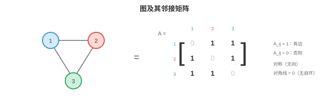
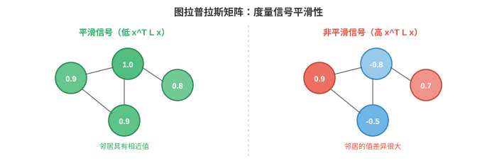

# 图论

*图论提供描述实体间关系的数学语言。本节介绍节点、边、邻接矩阵、图的类型、度与连通性、图拉普拉斯矩阵、谱图论和现实世界中的图应用。纯计算机科学章节会更深入地介绍图。*

- 到目前为止，本书的数据都存在于规则结构上：第 1 章中 $\mathbb{R}^n$ 的向量，第 2 章中作为数字网格的矩阵，第 8 章中作为像素网格的图像，以及第 7 章中作为有序列表的序列。但许多现实系统是**不规则的（irregular）**：社交网络没有网格结构，分子没有从左到右的顺序，道路网络也无法整齐地铺成行和列。

!!! note "大白话"
    前面的数据像整齐的表格或队列，而现实里的关系常常没有固定位置和顺序。图就是用来描述这种“谁和谁有关”的不规则结构。

- **图（graphs）**是表示这些不规则关系结构的数学工具。图捕捉**实体（entities）**，即节点，以及实体之间的**关系（relationships）**，即边。将数据表示为图后，我们便可应用第 1 节的几何深度学习原则来学习它。

!!! note "大白话"
    节点代表东西，边代表东西之间的联系。把现实问题翻成这两类对象，很多关系就能用统一数学方法处理。

## 节点、边与邻接关系

- 一个**图（graph）** $G = (V, E)$ 由一组**节点（nodes）**，或称顶点，$V = \{v_1, v_2, \ldots, v_n\}$，以及一组连接节点对的**边（edges）** $E \subseteq V \times V$ 构成。

!!! note "大白话"
    $V$ 是所有节点的清单，$E$ 是所有连接的清单；图就是“对象集合 + 关系集合”。

- 节点表示实体：人、原子、城市、网页、神经元。边表示关系：友谊、化学键、道路、超链接、突触。

!!! note "大白话"
    同一套图结构可以换不同解释：节点可以是人，也可以是原子；边可以是友谊，也可以是化学键。

- **邻接矩阵（adjacency matrix）** $A$ 是图的矩阵表示。对于有 $n$ 个节点的图，$A$ 是一个 $n \times n$ 矩阵：若 $A_{ij} = 1$，则节点 $i$ 到节点 $j$ 有边；否则 $A_{ij} = 0$。

!!! note "大白话"
    邻接矩阵把“有没有连接”写成表格：第 $i$ 行第 $j$ 列为 1，就表示两个节点相连。

- For example, a triangle graph (3 nodes, all connected) has:

!!! note "大白话"
    三角形图里每个节点都和另外两个节点相连，所以矩阵的非对角位置都是 1。

```math
A = \begin{bmatrix} 0 & 1 & 1 \\ 1 & 0 & 1 \\ 1 & 1 & 0 \end{bmatrix}
```



- 对角线为零，因为默认节点不与自身连接，即没有自环。邻接矩阵是第 2 章布尔矩阵的直接应用：每个元素都是二元关系。

!!! note "大白话"
    对角线记录“自己连自己”，这里默认没有这种边；其余格子只回答“连了还是没连”。

- 邻接矩阵完整编码图的结构。对 $A$ 的矩阵运算会揭示图的性质：$A^2_{ij}$ 统计节点 $i$ 与 $j$ 之间长度为 2 的路径数，回顾第 2 章的矩阵乘法，每个元素都是对中间节点进行乘积求和。更一般地，$A^k_{ij}$ 统计长度为 $k$ 的路径。

!!! note "大白话"
    矩阵乘法会自动数路径：$A^2$ 数走两条边能到达多少种方式，$A^k$ 就数走 $k$ 条边的方式。

- 每个节点可携带一个**特征向量（feature vector）** $\mathbf{x}_i \in \mathbb{R}^d$。在社交网络中，它可以是用户的个人资料信息；在分子中，它编码原子类型、电荷和其他属性。全部节点特征构成矩阵 $X \in \mathbb{R}^{n \times d}$，其中每一行是一节点的特征。

!!! note "大白话"
    图结构只说明“谁和谁相连”，节点特征还说明“每个节点自身是什么样”。把每个节点的特征排成行，就得到矩阵 $X$。

- 边也可以携带特征：分子中的键类型、空间图中的距离、知识图谱中的关系类型。边 $(i, j)$ 的**边特征（edge feature）**是向量 $\mathbf{e}_{ij} \in \mathbb{R}^{d_e}$。

!!! note "大白话"
    连接本身也可能有信息，例如道路长度、化学键类型或关系类别，不能只记录“有没有边”。

## 图的类型

- **无向图（undirected graph）**具有对称边：若 $i$ 连接到 $j$，则 $j$ 也连接到 $i$。其邻接矩阵是对称的：$A = A^T$，即第 2 章的对称矩阵。友谊和化学键都是无向的。

!!! note "大白话"
    无向边像双向街道：从 $i$ 到 $j$ 成立，反方向也成立，所以矩阵沿主对角线对称。

- **有向图（directed graph，digraph）**的边有方向：一条从 $i$ 到 $j$ 的边并不意味着有一条从 $j$ 到 $i$ 的边。邻接矩阵不对称。Twitter 关注、网页超链接和引用网络都是有向的。

!!! note "大白话"
    有向边像单向箭头：我关注你，不代表你也关注我；方向不能被忽略。

- **加权图（weighted graph）**为每条边赋予数值权重。邻接矩阵具有实数值元素而非二元值：$A_{ij} = w_{ij}$。道路网络中的距离、脑连接中的相关强度和社交网络中的交互频率都是加权的。

!!! note "大白话"
    加权图不只记录“相连”，还记录联系有多强、路有多长或代价有多大。

- **二部图（bipartite graph）**有两个互不相交的节点集合，边只存在于两个集合之间，绝不在集合内部。用户与产品构成二部图：用户评价产品，但用户不评价用户。二部图的邻接矩阵具有块结构：

```math
A = \begin{bmatrix} 0 & B \\ B^T & 0 \end{bmatrix}
```

!!! note "大白话"
    二部图把节点分成两类，边只能跨类连接；用户连产品，用户之间和产品之间都不直接连。

- 其中 $B$ 是两个节点集合之间的二部邻接矩阵。

!!! note "大白话"
    $B$ 只记录第一类到第二类的连接，另外几个零块则表示同类节点之间没有边。

- **多重图（multigraph）**允许同一对节点之间存在多条边，和/或存在自环。知识图谱通常是多重图：两个实体可以有多种关系，如“出生于”“居住于”“工作于”。

!!! note "大白话"
    同两个人或实体之间可以同时存在多种关系，甚至自己连自己；一条边不够表达时就允许多条。

- **超图（hypergraph）**将边推广为一次连接两个以上节点。一个**超边（hyperedge）**连接一个节点集合，表示高阶关系。一篇由 5 人合著的研究论文，就是一条连接 5 个作者节点的超边。

!!! note "大白话"
    普通边一次连两个节点，超边可以一次连一群节点，适合表示“这几个人共同参与同一件事”。

- **完全图（complete graph）** $K_n$ 在每一对节点间都有边。这是全连接层的图对应物，也是 Transformer 所运行的结构：每个词元都关注其他每个词元。

!!! note "大白话"
    完全图里人人都直接相连，信息一步就能从任意节点传到任意另一个节点。

## 度、路径与连通性

- 节点的**度（degree）**是与它连接的边数。在无向图中，节点 $i$ 的度为 $d_i = \sum_j A_{ij}$。高度节点是连接很多的“枢纽（hubs）”。

!!! note "大白话"
    度就是一个节点有多少条连接。度很高的节点像交通枢纽或社交中心，往往对整体网络影响更大。

- **度矩阵（degree matrix）** $D$ 是一个在对角线上放置度的对角矩阵：$D_{ii} = d_i$。这个矩阵贯穿图论和 GNN 公式。

!!! note "大白话"
    度矩阵只在对角线上放每个节点的连接数，其他位置为零；它把“每个节点有多忙”集中记下来。

- 两个节点间的**路径（path）**是连接它们的一系列边。$i$ 与 $j$ 间的**最短路径（shortest path）**，或测地线，是边数最少的路径，或在加权图中总权重最低的路径。**Dijkstra 算法（Dijkstra's algorithm）**在 $O((|V| + |E|) \log |V|)$ 时间内求最短路径。

!!! note "大白话"
    路径是从一个节点走到另一个节点的路线；最短路径就是步数最少或总代价最低的走法。

- 若每对节点之间都有路径，图就是**连通的（connected）**。否则，它有多个**连通分量（connected components）**，即相互之间没有边的孤立子图。

!!! note "大白话"
    连通图里任意两点都能通过某条路线互相到达；断开的各块就是不同连通分量。

- 图的**直径（diameter）**是任意节点对之间最长的最短路径。它衡量图有多“分散”。社交网络有著名的小直径，即“六度分隔”。

!!! note "大白话"
    直径关注网络中最远的那一对节点要走多远，可以粗略看出网络是否容易互相找到。

- **环（cycle）**是一条起点和终点为同一节点的路径。没有环的图是**树（tree）**。树是最简单的连通图：有 $n$ 个节点，恰有 $n-1$ 条边。

!!! note "大白话"
    沿着边走一圈又回到起点就是环；树像没有绕路回圈的连接骨架，$n$ 个节点只需要 $n-1$ 条边。

- **中心性（centrality）**衡量节点的重要性。**度中心性（degree centrality）**就是度本身；**介数中心性（betweenness centrality）**统计有多少条最短路径经过一个节点；**特征向量中心性（eigenvector centrality）**按邻居的重要性赋予节点重要性，由此得到特征向量方程 $A\mathbf{x} = \lambda \mathbf{x}$，见第 2 章。Google 的 PageRank 是有向图中特征向量中心性的一种变体。

!!! note "大白话"
    “重要”有不同含义：连接多、经常处在别人必经路上，或连接了其他重要节点。中心性指标分别捕捉这些情况。

## 图拉普拉斯矩阵

- **图拉普拉斯矩阵（graph Laplacian）**也许是图论中最重要的矩阵，定义为：

$$L = D - A$$

!!! note "大白话"
    拉普拉斯矩阵用“自己连接了多少”减去“和谁连接”，把图的结构变成一个便于计算的矩阵。

- 其中 $D$ 是度矩阵，$A$ 是邻接矩阵。对前面的三角形示例：

```math
L = \begin{bmatrix} 2 & 0 & 0 \\ 0 & 2 & 0 \\ 0 & 0 & 2 \end{bmatrix} - \begin{bmatrix} 0 & 1 & 1 \\ 1 & 0 & 1 \\ 1 & 1 & 0 \end{bmatrix} = \begin{bmatrix} 2 & -1 & -1 \\ -1 & 2 & -1 \\ -1 & -1 & 2 \end{bmatrix}
```

!!! note "大白话"
    这个三角形例子把每个节点的度放到对角线，再在相连位置放负值，完整体现了 $L=D-A$。

- 拉普拉斯矩阵具有显著性质：

    - 它总是**对称（symmetric）**且**半正定（positive semi-definite）**，回顾第 2 章，所有特征值都满足 $\geq 0$。对于任意向量 $\mathbf{x}$：

$$\mathbf{x}^T L \mathbf{x} = \sum_{(i,j) \in E} (x_i - x_j)^2$$

        !!! note "大白话"
            这个公式把每条边两端的差异平方后相加，所以结果一定不会为负；节点值越不一致，结果越大。



    - 这个二次型度量图上信号 $\mathbf{x}$ 跨边变化的程度。若相邻节点的值相近，$\mathbf{x}^T L \mathbf{x}$ 很小；若它们差异剧烈，结果很大。拉普拉斯矩阵度量图上信号的**平滑性（smoothness）**。

        !!! note "大白话"
            如果相邻节点的数值差不多，信号在图上就很平滑；如果相邻点忽高忽低，就不平滑。

    - 最小特征值总是 0，对应特征向量 $\mathbf{1} = [1, 1, \ldots, 1]^T$，因为常值信号没有变化。零特征值的个数等于连通分量的个数。

        !!! note "大白话"
            所有节点都取同一个值时，任何边两端都没有差异，因此产生零特征值；图断成几块，就会出现对应数量的零值。

    - 第二小特征值 $\lambda_2$ 是**代数连通度（algebraic connectivity）**，即 Fiedler 值。它度量图的连通程度：$\lambda_2 = 0$ 表示图不连通，较大的 $\lambda_2$ 表示图连通紧密。

        !!! note "大白话"
            $\lambda_2$ 可以理解成网络“整体连得有多牢”。为零说明有断块，越大通常说明越不容易被切开。

- **归一化拉普拉斯矩阵（normalised Laplacian）**按度进行缩放：

$$\hat{L} = D^{-1/2} L D^{-1/2} = I - D^{-1/2} A D^{-1/2}$$

!!! note "大白话"
    归一化是在比较节点前先消除“有的节点连接特别多”造成的尺度差异，让不同度数的节点更公平地参与计算。

- 这种归一化保证拉普拉斯矩阵的性质不依赖节点度的绝对尺度。项 $D^{-1/2} A D^{-1/2}$ 是**对称归一化邻接矩阵（symmetrically normalised adjacency）**，它直接出现于第 3 节的 GCN 公式中。

!!! note "大白话"
    归一化邻接矩阵会压低超级枢纽的单次影响，避免一个连接太多的节点把所有信息传播都主导了。

## 谱图论

- 图拉普拉斯矩阵的特征值和特征向量定义图的**谱（spectrum）**，并充当图上的傅里叶变换对应物。

!!! note "大白话"
    图的谱就是拉普拉斯矩阵的特征值和特征向量；它们在图上扮演普通信号处理中频率的角色。

- 在经典信号处理中，傅里叶变换将信号分解为频率分量，即正弦和余弦。在图上，拉普拉斯矩阵的特征向量扮演这些频率基的角色。低特征值的特征向量在图上缓慢变化，即低频且平滑；高特征值的特征向量快速变化，即高频且振荡。

!!! note "大白话"
    低频表示相邻节点变化慢，高频表示相邻节点变化快。图上的“频率”不是时间快慢，而是沿着边变化得有多剧烈。

- 图上信号 $\mathbf{x}$ 的**图傅里叶变换（Graph Fourier Transform, GFT）**为：

$$\hat{\mathbf{x}} = U^T \mathbf{x}$$

!!! note "大白话"
    GFT 把每个节点上的信号换成一组图频率系数，告诉我们每种平滑或振荡模式占了多少。

- 其中 $U$ 是拉普拉斯矩阵特征向量组成的矩阵，回顾第 2 章的特征分解：$L = U \Lambda U^T$。逆变换为 $\mathbf{x} = U \hat{\mathbf{x}}$。

!!! note "大白话"
    $U$ 是图上的频率基；先乘 $U^T$ 是分解，乘回 $U$ 就能把频率系数还原成各节点的原始信号。

- 谱域中的**图卷积（graph convolution）**是频域中的逐点乘法，正如空间域卷积对应傅里叶域乘法，第 8 章的卷积定理：

$$g_\theta \star \mathbf{x} = U \left( (U^T g_\theta) \odot (U^T \mathbf{x}) \right) = U \, \text{diag}(\hat{g}_\theta) \, U^T \mathbf{x}$$

!!! note "大白话"
    图卷积先把信号拆成图频率，再按滤波器调整各频率强弱，最后变回节点上的信号。

- 滤波器 $\hat{g}_\theta$ 是特征值的可学习函数。这是谱 GNN 的基础，第 3 节会将其简化为实用的 GCN。

!!! note "大白话"
    模型学习的是“哪些图频率该保留、哪些该削弱”，这就是图上的滤波。

- 计算瓶颈是 $L$ 的特征分解：它的代价为 $O(n^3)$，对于有 $n$ 个节点的图。这对大型图，数百万节点，不可行。多项式近似，即 Chebyshev 多项式，完全避免特征分解，而这种近似直接导向 GCN。

!!! note "大白话"
    直接求大图的全部特征分解太贵，实际方法用多项式近似绕开这一步，只做局部矩阵运算。

## 社区发现

- 许多现实图具有**社区结构（community structure）**：节点簇内部连接密集，簇间连接稀疏。社交网络有好友群，生物网络有功能模块，引用网络有研究领域。

!!! note "大白话"
    社交圈、研究领域和生物功能模块都表现为“组内联系多，组间联系少”，这就是社区结构。

- **谱聚类（spectral clustering）**利用拉普拉斯矩阵特征向量寻找社区。方法是：使用 $k$ 个 $L$ 的最小非平凡特征向量嵌入每个节点，再在该嵌入空间中应用 k-means，第 6 章已介绍。同一社区的节点会在谱嵌入中彼此接近。

!!! note "大白话"
    谱聚类先把每个节点换成一组由特征向量决定的新坐标，再在新坐标里把相近节点分成一组。

- 这是可行的，因为 Fiedler 向量，即 $\lambda_2$ 的特征向量，会自然将图分为两组：取正值的节点与取负值的节点，在最稀疏连接处切开。更高的特征向量会将其细化为更多群组。

!!! note "大白话"
    Fiedler 向量常能把网络自然切成两边，正负号提供一个简单分组线索；更多特征向量可以继续细分。

- **模块度（modularity）** $Q$ 度量社区划分的质量。它比较社区内边数和随机图中的期望边数：

$$Q = \frac{1}{2|E|} \sum_{ij} \left( A_{ij} - \frac{d_i d_j}{2|E|} \right) \delta(c_i, c_j)$$

!!! note "大白话"
    模块度问的是：这个分组里的内部连接，是否明显多于“随机连边”本来会产生的数量。$Q$ 越高，社区越像真的。

- 其中 $c_i$ 是节点 $i$ 的社区分配；若节点在同一社区，$\delta$ 为 1。$Q$ 的范围从 $-0.5$ 到 $1$，值越高表示社区结构越强。

!!! note "大白话"
    $\delta$ 只在两个节点属于同一组时保留这条边的贡献，因此公式只奖励社区内部的异常密集连接。

## 现实世界中的图

- **社交网络（social networks）**：节点是人，边是友谊或交互。Facebook 有数十亿节点和数千亿边。这些图通常是稀疏的，每个人有数百好友而非数十亿好友；具有小世界性质，即平均路径短；并具有重尾度分布，即少量枢纽拥有数百万连接。

!!! note "大白话"
    社交网络看似巨大，但每个人只直接连接少数人；少数超级枢纽和很短的平均路径让信息仍能快速传播。

- **分子图（molecular graphs）**：节点是原子，边是化学键。每个原子有特征，如元素类型、电荷、杂化；每条键也有特征，如单键、双键、三键、芳香键。分子图规模小，通常数十到数百节点，却高度结构化。从图结构预测分子性质是 GNN 的重要应用。

!!! note "大白话"
    分子图把“原子是什么”和“原子怎样连接”同时交给模型，因此可以从结构预测溶解度、活性等性质。

- **知识图谱（knowledge graphs）**：节点是实体，人、地点、概念；边是有类型的关系，如“出生于”“首都”“实例”。知识图谱支撑搜索引擎、推荐系统和问答。它们通常是有数百万实体、数十亿关系的有向多重图。

!!! note "大白话"
    知识图谱像一张带标签的事实网络：不仅知道两点相连，还知道这条连接具体是什么关系。

- **引用网络（citation networks）**：节点是论文，边是引用，是有向的。聚类可揭示研究社区。节点特征包括标题、摘要和发表年份。

!!! note "大白话"
    论文引用方向能显示知识从哪篇流向哪篇，聚在一起的论文往往属于同一研究主题。

- **蛋白质相互作用网络（protein interaction networks）**：节点是蛋白质，边表示物理相互作用或功能关联。理解这些图有助于识别药物靶点和疾病机制。

!!! note "大白话"
    把蛋白质当节点、相互作用当边，可以从网络结构寻找关键蛋白和疾病相关通路。

- **道路网络与交通（road networks and transportation）**：节点是交叉路口，边是带距离或时间权重的道路段。这些图上的最短路径算法支撑导航系统。第 11 章的自动驾驶运动预测把参与体交互表示为图。

!!! note "大白话"
    导航软件本质上是在一张加权图上找代价最低的路线；路口是节点，道路是带时间或距离的边。

## 编程任务（使用 CoLab 或 Notebook）

1. 用邻接矩阵构建一个小图，并计算基本性质：每个节点的度、长度为 2 的路径数，以及图是否连通。
```python
import jax.numpy as jnp

# A simple graph: 5 nodes
# 0-1, 0-2, 1-2, 2-3, 3-4
A = jnp.array([[0, 1, 1, 0, 0],
               [1, 0, 1, 0, 0],
               [1, 1, 0, 1, 0],
               [0, 0, 1, 0, 1],
               [0, 0, 0, 1, 0]], dtype=float)

# Degree
degrees = A.sum(axis=1)
print(f"Degrees: {degrees}")

# Paths of length 2
A2 = A @ A
print(f"Paths of length 2 (node 0 to 3): {int(A2[0, 3])}")

# Connected? Check if A^(n-1) has all nonzero entries
An = jnp.linalg.matrix_power(A + jnp.eye(5), 4)  # (A+I)^4 for reachability
connected = jnp.all(An > 0)
print(f"Connected: {connected}")
```

2. 计算图拉普拉斯矩阵及其特征值。验证最小特征值为 0，且对应特征向量为常量。
```python
import jax.numpy as jnp

A = jnp.array([[0, 1, 1, 0, 0],
               [1, 0, 1, 0, 0],
               [1, 1, 0, 1, 0],
               [0, 0, 1, 0, 1],
               [0, 0, 0, 1, 0]], dtype=float)

D = jnp.diag(A.sum(axis=1))
L = D - A

eigenvalues, eigenvectors = jnp.linalg.eigh(L)
print(f"Eigenvalues: {eigenvalues}")
print(f"Smallest eigenvector: {eigenvectors[:, 0]}")
print(f"Fiedler value (algebraic connectivity): {eigenvalues[1]:.4f}")

# Verify: x^T L x measures smoothness
x = jnp.array([1.0, 1.0, 1.0, -1.0, -1.0])  # two groups
smoothness = x @ L @ x
print(f"Smoothness of two-group signal: {smoothness:.2f}")
```

3. 对一个包含两个社区的图执行谱聚类。使用 Fiedler 向量嵌入节点，并按符号将它们分开。
```python
import jax.numpy as jnp
import matplotlib.pyplot as plt

# Two communities of 5 nodes each, weakly connected
A = jnp.zeros((10, 10))
# Community 1: nodes 0-4 (dense)
for i in range(5):
    for j in range(i+1, 5):
        A = A.at[i, j].set(1).at[j, i].set(1)
# Community 2: nodes 5-9 (dense)
for i in range(5, 10):
    for j in range(i+1, 10):
        A = A.at[i, j].set(1).at[j, i].set(1)
# One bridge edge
A = A.at[2, 7].set(1).at[7, 2].set(1)

D = jnp.diag(A.sum(axis=1))
L = D - A
eigenvalues, eigenvectors = jnp.linalg.eigh(L)

# Fiedler vector (2nd smallest eigenvalue)
fiedler = eigenvectors[:, 1]
communities = (fiedler > 0).astype(int)

print(f"Fiedler vector: {fiedler}")
print(f"Clusters: {communities}")

plt.bar(range(10), fiedler, color=["#3498db" if c == 0 else "#e74c3c" for c in communities])
plt.xlabel("Node"); plt.ylabel("Fiedler vector value")
plt.title("Spectral Clustering via Fiedler Vector")
plt.show()
```
