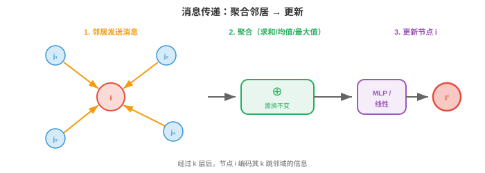
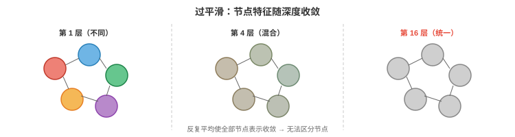

# 图神经网络

*图神经网络通过相连节点之间传递消息，从图结构数据中学习。本节介绍消息传递框架、GCN、GraphSAGE、GIN、过平滑、图池化以及节点、边和图级任务。这些是支撑分子性质预测、社交网络分析与推荐系统的核心架构。*

- 在前两节中，我们建立了数学基础：第 1 节的几何深度学习告诉我们利用对称性，第 2 节的图论给出了节点、边和邻接关系的语言。现在开始构建直接在图上运行的神经网络。

!!! note "大白话"
    前面学的是图的规律和数学工具，这一节开始让神经网络真正沿着图的连接传播和学习。

- 核心挑战是图数据**不规则（irregular）**。不同于图像的固定网格或序列的固定顺序，图的节点数可变、连通关系可变，且没有规范的节点排序。图神经网络必须处理这一切，同时保持置换等变性，重命名节点不应改变输出。

!!! note "大白话"
    图没有统一的行列和编号顺序，节点数量也会变化。GNN 必须只依赖关系本身，而不能偷偷依赖节点编号。

## 消息传递框架

- 几乎所有 GNN 都遵循同一配方，称为**消息传递（message passing）**，也称邻域聚合。思想简单而优雅：每个节点通过收集邻居的信息来更新自身表示。

!!! note "大白话"
    每个节点都向邻居“打听消息”，把收到的信息汇总后更新自己；一层就是一次邻域交流。

- 在每一层 $l$，每个节点 $i$ 做三件事：

    1. **消息（Message）**：每个邻居 $j$ 都根据自己的当前特征，向节点 $i$ 计算消息 $\mathbf{m}_{j \to i}$。

        !!! note "大白话"
            每个邻居先把自己的情况整理成一条发给节点 $i$ 的消息。
    2. **聚合（Aggregate）**：节点 $i$ 收集所有传入消息，并用置换不变函数，如求和、均值或最大值，将它们合并。

        !!! note "大白话"
            节点把所有邻居的消息合并起来，且不在乎消息到达的顺序。
    3. **更新（Update）**：节点 $i$ 将聚合消息与自身特征结合，生成新表示。

        !!! note "大白话"
            最后把邻居意见和自己的旧状态放在一起，算出下一轮的新状态。

- 形式上：

$$\mathbf{m}_i^{(l)} = \bigoplus_{j \in \mathcal{N}(i)} \phi^{(l)}\left(\mathbf{h}_i^{(l)}, \mathbf{h}_j^{(l)}, \mathbf{e}_{ij}\right)$$

$$\mathbf{h}_i^{(l+1)} = \psi^{(l)}\left(\mathbf{h}_i^{(l)}, \mathbf{m}_i^{(l)}\right)$$

!!! note "大白话"
    第一条公式先把邻居消息合并，第二条公式再用“自己原来的状态 + 合并结果”更新节点表示。

- 其中 $\mathcal{N}(i)$ 是节点 $i$ 的邻居集合，$\bigoplus$ 是置换不变的聚合操作，即求和、均值或最大值，$\phi$ 是消息函数，$\psi$ 是更新函数，$\mathbf{e}_{ij}$ 是可选的边特征。

!!! note "大白话"
    这些符号分别表示邻居是谁、怎样合并消息、怎样生成消息和怎样更新状态；边特征可以作为额外条件加入。



- 聚合操作 $\bigoplus$ 必须置换不变，即邻居以何种顺序处理无关紧要，才能保证整体函数置换等变。这直接实现第 1 节的对称性原则。

!!! note "大白话"
    把邻居名单打乱，结果仍应相同。这样换节点编号不会改变模型的判断。

- 经过 $k$ 层消息传递后，每个节点的表示会编码其**$k$ 跳邻域（k-hop neighbourhood）**的信息：在 $k$ 条边内可达的所有节点。第 1 层看到直接邻居，第 2 层看到邻居的邻居，依此类推。局部信息正是这样传播并建立全局理解。

!!! note "大白话"
    一层只能听到一步之外，二层能听到两步之外；层数就是信息能沿边传播的最大距离。

- GNN 的感受野随深度增长，正如第 8 章 CNN 的感受野随层数增长。但它不同于规则网格上的 CNN：感受野形状会随图拓扑而因节点不同。

!!! note "大白话"
    每个节点能看到的范围会随层数扩大，但这个范围由它周围的连接决定，不一定是整齐的方形。

## 图卷积网络（GCN）

- **GCN**（Kipf & Welling，2017）是基础性的 GNN 架构。它将第 2 节的谱图卷积简化为优雅而高效的公式。

!!! note "大白话"
    GCN 把谱图论里很重的计算改成简单的邻接矩阵乘法，因此既保留图卷积思想，又更容易实际运行。

- 从谱卷积 $g_\theta \star \mathbf{x} = U \, \text{diag}(\hat{g}_\theta) \, U^T \mathbf{x}$ 出发，Kipf 和 Welling 使用一阶 Chebyshev 多项式近似谱滤波器，完全避免计算特征分解。简化后，逐层更新为：

$$H^{(l+1)} = \sigma\left(\hat{A} H^{(l)} W^{(l)}\right)$$

!!! note "大白话"
    先用归一化邻接矩阵混合邻居特征，再乘可学习权重，最后过激活函数；这就是一层 GCN 的主流程。

- 其中：
    - $H^{(l)} \in \mathbb{R}^{n \times d}$ 是第 $l$ 层的节点特征矩阵。

        !!! note "大白话"
            它记录这一层所有节点当前的特征，每一行对应一个节点。
    - $W^{(l)} \in \mathbb{R}^{d \times d'}$ 是可学习权重矩阵。

        !!! note "大白话"
            这是网络训练出来的特征变换，把旧的特征维度换成新的维度。
    - $\hat{A} = \tilde{D}^{-1/2} \tilde{A} \tilde{D}^{-1/2}$ 是带自环的对称归一化邻接矩阵。

        !!! note "大白话"
            它规定每个节点怎样公平地接收邻居信息，并把节点自己也算进来。
    - $\tilde{A} = A + I$ 添加自环，因此每个节点也接收自己的消息。

        !!! note "大白话"
            加上单位矩阵就是给每个节点补一条“自己到自己”的边，防止更新时丢掉自身信息。
    - $\tilde{D}$ 是 $\tilde{A}$ 的度矩阵。

        !!! note "大白话"
            它记录加上自环后每个节点有多少条连接，用于做归一化。
    - $\sigma$ 是非线性激活函数，如第 6 章的 ReLU。

        !!! note "大白话"
            激活函数给网络加入弯曲能力，否则多层线性变换合起来仍只是一层线性变换。

- 矩阵乘法 $\hat{A} H^{(l)}$ 是聚合步骤：对每个节点计算其邻居特征的加权平均，加上经由自环传来的自身特征。权重矩阵 $W^{(l)}$ 是在所有节点之间共享的可学习变换；激活函数引入非线性。

!!! note "大白话"
    GCN 对所有节点使用同一套变换规则，只是每个节点收到的邻居不同，所以能共享参数又适应不同局部结构。

- 它非常简单：只是矩阵乘法，之后接学习到的线性映射和激活。完整 GCN 层可写成一行代码。$\tilde{D}^{-1/2}$ 的归一化防止有大量邻居的节点占据主导：高度节点的消息会被缩小。

!!! note "大白话"
    归一化像给每个人的发言按连接数量分摊音量，避免一个邻居特别多的枢纽把所有人的信息盖住。

- 在消息传递框架中，GCN 使用：
    - 消息：$\phi(\mathbf{h}_j) = \mathbf{h}_j$，即直接发送特征。

        !!! note "大白话"
            邻居不先做复杂加工，直接把自己的特征发过来。
    - 聚合：归一化求和，按度加权。

        !!! note "大白话"
            收到的特征按连接数量调整后相加，得到稳定的邻域汇总。
    - 更新：线性变换加激活。

        !!! note "大白话"
            汇总结果再经过可学习变换和非线性，成为下一层节点表示。

## GraphSAGE

- GCN 是**传导式（transductive）**的：训练时需要完整图，无法处理新出现、未见过的节点。若社交网络加入新用户，GCN 必须在整个图上重新训练。**GraphSAGE**（Hamilton 等，2017）使用**归纳式（inductive）**方法解决这一问题。

!!! note "大白话"
    GCN 像先看到整张关系网再学习；GraphSAGE 则学会一套可复用的邻居采样规则，新节点来了也能直接套用。

- 关键思想是**邻域采样（neighbourhood sampling）**：不使用全部邻居，而是采样固定大小的子集。这让计算不依赖完整图结构，并可泛化到未见节点和未见图。

!!! note "大白话"
    一个节点的邻居可能成千上万，不必全看；随机抽一小批代表性邻居，就能把计算量控制住。

- 节点 $i$ 的 GraphSAGE 更新为：

$$\mathbf{h}_i^{(l+1)} = \sigma\left(W^{(l)} \cdot \text{CONCAT}\left(\mathbf{h}_i^{(l)}, \text{AGG}\left(\{\mathbf{h}_j^{(l)} : j \in \mathcal{S}(i)\}\right)\right)\right)$$

!!! note "大白话"
    GraphSAGE 把“自己的特征”和“抽样邻居的汇总”分开，再拼起来学习下一层表示。

- 其中 $\mathcal{S}(i)$ 是邻居的**采样（sampled）**子集，例如从 500 个邻居中随机采样 10 个。CONCAT 操作明确分开节点自身特征和聚合后的邻居特征，使网络能为“自身”和“邻域”学习不同变换。

!!! note "大白话"
    抽样集合 $\mathcal{S}(i)$ 只是邻居中的小样本；拼接操作让模型能区别“我自己是什么”和“我周围是什么”。

- GraphSAGE 支持多种聚合函数：
    - **均值（Mean）**：$\text{AGG} = \frac{1}{|\mathcal{S}|} \sum_{j \in \mathcal{S}} \mathbf{h}_j$，简单且有效。

        !!! note "大白话"
            均值聚合把邻居意见平均，适合得到一个平稳的总体印象。
    - **LSTM**：将采样邻居输入 LSTM，但这会引入排序依赖，在某种程度上违背置换不变性。

        !!! note "大白话"
            LSTM 能按序处理邻居，但邻居本来没有天然顺序，所以这种做法可能把人为排序带来的差异学进去。
    - **池化（Pool）**：$\text{AGG} = \max(\{\sigma(W_{\text{pool}} \mathbf{h}_j + \mathbf{b})\})$，即先非线性变换再取最大值。

        !!! note "大白话"
            池化先加工每个邻居，再挑出每个特征维度最突出的信号，像从一群人里找最强的提醒。

- 采样策略使 GraphSAGE 能扩展至非常大的图。训练使用节点小批量：对每个目标节点，在第 1 层采样 $k_1$ 个邻居，再为其中每个节点在第 2 层采样 $k_2$ 个邻居。当 $k_1 = k_2 = 10$ 且有 2 层时，每个节点的计算树最多只有 $10 \times 10 = 100$ 个节点，无论图有多大。

!!! note "大白话"
    即使整张图特别大，每个训练样本只展开有限层、有限数量的邻居，因此计算规模由采样数决定，而不是由全图大小决定。

## 图同构网络（GIN）

- 不同的 GNN 架构具有不同的**表达能力（expressive power）**，即区分结构不同图的能力。GCN 和 GraphSAGE 虽在实践中有效，但理论上能区分的图结构有限。

!!! note "大白话"
    表达能力就是模型能否看出两张图其实不同。模型实用，不代表它理论上能区分所有结构。

- 度量 GNN 表达能力的理论工具是**Weisfeiler-Lehman（WL）检验**，这是检验图同构，即两个图结构是否相同的经典算法。WL 检验通过哈希每个节点的标签与其邻居标签多重集，迭代细化节点标签。

!!! note "大白话"
    WL 检验反复收集“我是谁、邻居是谁”的标签并重新编码；标签最后仍分不出来，说明这个检验看不出两张图的差别。

- **GIN**（Xu 等，2019）被设计为与 WL 检验同样有表达力，使其成为最强的消息传递 GNN，限于消息传递的理论边界之内。关键洞见是：聚合函数必须对多重集**单射（injective）**，不同的邻居特征多重集必须产生不同聚合值。

!!! note "大白话"
    GIN 追求的目标是：不同的邻居组合尽量不要被压成同一个结果，只有这样模型才不会把结构差异弄丢。

- 求和聚合对多重集是单射的，$\{1, 1, 2\}$ 的和为 4，$\{1, 3\}$ 的和也为 4，但在维度足够的特征向量上，不同多重集的和通常不同。均值和最大值不是单射：均值无法区分 $\{1, 1\}$ 与 $\{2, 2\}$，最大值无法区分 $\{1, 2, 3\}$ 与 $\{1, 1, 3\}$。

!!! note "大白话"
    平均值和最大值可能把不同的邻居集合压成同一个数字；求和配合足够丰富的特征，通常能保留更多“出现了几次”的信息。

- GIN 的更新为：

$$\mathbf{h}_i^{(l+1)} = \text{MLP}^{(l)}\left((1 + \epsilon^{(l)}) \cdot \mathbf{h}_i^{(l)} + \sum_{j \in \mathcal{N}(i)} \mathbf{h}_j^{(l)}\right)$$

!!! note "大白话"
    GIN 先把自己的特征和邻居特征求和，再用 MLP 做非线性变换；可学习的 $\epsilon$ 控制自己原来的信息有多重要。

- 其中 $\epsilon$ 是可学习标量，也可固定为 0；MLP 提供非线性、单射的映射。求和聚合保留多重集结构，MLP 能学习区分任意两种不同的聚合值。

!!! note "大白话"
    $\epsilon$ 可以训练，也可以固定；关键是求和先保留邻居数量和组合，MLP 再把这些差别加工出来。

## 过平滑

- GNN 的一个重大挑战是**过平滑（over-smoothing）**：随着层数增加，所有节点表示收敛为相同值，失去区分不同节点的能力。

!!! note "大白话"
    层数太深时，大家反复互相平均，最后每个节点都长得一样，模型就分不清谁是谁了。



- 其机制很直观。每一层消息传递都会将节点特征与邻居特征平均。经过多轮平均后，每个节点都已看到并混合了其连通分量中的所有其他节点。特征变为统一平均值，这相当于反复模糊图像，直至其成为纯色。

!!! note "大白话"
    这和不断给照片打马赛克、最后变成一片纯色很像：局部差异在反复平均中逐渐消失。

- 形式上，重复应用归一化邻接矩阵 $\hat{A}$ 会收敛到秩为 1 的矩阵，每一行都与图上随机游走的平稳分布成比例。这与第 2 章幂迭代收敛到主特征向量的过程相同。

!!! note "大白话"
    数学上，反复乘同一个归一化邻接矩阵会让所有节点方向趋同，最终只剩下一种主导的整体模式。

- 过平滑将 GNN 限制为浅层，通常 2--4 层；不同于可以从数十或数百层受益的 CNN 与 Transformer。这意味着每个节点只能看到有限邻域，对需要长距离信息的任务是问题。

!!! note "大白话"
    GNN 不能简单地无限加深；通常几层后就要想办法防止信息被抹平，否则长距离信息和节点区别会同时受损。

- 缓解方法包括：
    - **残差连接（residual connections）**，来自第 8 章 ResNet：$\mathbf{h}_i^{(l+1)} = \mathbf{h}_i^{(l+1)} + \mathbf{h}_i^{(l)}$，保留早期层的信息。

        !!! note "大白话"
            残差连接把旧表示直接加回来，给早期特征留一条不会被邻居平均冲掉的通道。
    - **跳跃知识（jumping knowledge）**：连接或注意力池化所有层的表示，而不只使用最后一层。

        !!! note "大白话"
            不只看最后一层，而是把浅层和深层的信息一起参考，避免某一层把有用细节丢掉。
    - **DropEdge**：训练期间随机移除边，减慢信息扩散。

        !!! note "大白话"
            训练时偶尔删掉一些边，让信息别扩散得太快，也能减少模型过度依赖某些固定连接。
    - **图 Transformer（Graph Transformers）**，第 4 节：利用全局注意力绕开局部消息传递瓶颈。

        !!! note "大白话"
            图 Transformer 可以直接关注远处节点，不必一层层沿边传很久。

## 图池化

- 对于**图级任务（graph-level tasks）**，如预测整个图的属性，例如分子毒性，需要将全部节点表示压缩成单个图级向量。这就是**图池化（graph pooling）**，是第 8 章 CNN 全局平均池化的图对应物。

!!! note "大白话"
    节点级表示很多，但图级任务只需要一个“整张图的摘要”。图池化就是把所有节点信息压缩成一个向量。

- 最简单的方法是**读出（readout）**：对全体节点特征集合应用置换不变函数：

$$\mathbf{h}_G = \text{READOUT}(\{\mathbf{h}_i^{(L)} : i \in V\}) = \sum_i \mathbf{h}_i^{(L)} \quad \text{or} \quad \frac{1}{|V|} \sum_i \mathbf{h}_i^{(L)} \quad \text{or} \quad \max_i \mathbf{h}_i^{(L)}$$

!!! note "大白话"
    读出可以把所有节点求和、求平均或取最大值；三种方式都不在乎节点排列顺序。

- 这是第 1 节的 DeepSets 聚合，应用在最后一层 GNN 之后。求和保留规模信息，100 个节点的图会有比 10 个节点的图更大的和；均值则按规模归一化。

!!! note "大白话"
    求和能反映图有多大，均值则更像“每个节点平均是什么样”，选择哪种取决于任务是否关心规模。

- **层次池化（hierarchical pooling）**逐步粗化图，类似 CNN 逐步下采样图像。每一层都将一组节点合并为“超节点（supernodes）”：

!!! note "大白话"
    层次池化不是一次把所有节点压掉，而是逐层合并，让模型同时看到局部群组和更高层结构。

- **DiffPool**，即可微池化（Differentiable Pooling），学习一个将每个节点分配给聚类的软分配矩阵 $S^{(l)} \in \mathbb{R}^{n_l \times n_{l+1}}$：

$$X^{(l+1)} = S^{(l)T} H^{(l)}, \quad A^{(l+1)} = S^{(l)T} A^{(l)} S^{(l)}$$

!!! note "大白话"
    DiffPool 学一个“每个节点属于哪些超节点”的软分配表，再同时压缩节点特征和连接关系。

- 分配矩阵由另一个 GNN 预测，使聚类端到端可微。这形成一个层次：原始图 → 节点更少的粗化图 → 更粗化的图 → 单个节点，即图表示。

!!! note "大白话"
    分组不是手工指定，而是由另一个 GNN 学出来；整个合并过程可以和主任务一起训练。

- **TopKPool** 使用更简单的方法：为每个节点学习标量分数，保留评分最高的 $k$ 个节点，丢弃其余节点。这是硬选择，而非软分配，计算成本低于 DiffPool。

!!! note "大白话"
    TopKPool 像按分数筛选，只留下最重要的 $k$ 个节点，简单便宜，但被丢掉的节点不会保留。

## 异构图

- 到目前为止，所有 GNN 都假设**同构图（homogeneous graph）**，即一种节点类型、一种边类型。但大多数现实图是**异构的（heterogeneous）**：有多种节点类型和多种边类型。知识图谱有人、组织和地点节点，由“工作于”“出生于”“位于”边连接。推荐系统有用户节点和物品节点，由“已购买”“已浏览”“已评分”边连接。

!!! note "大白话"
    现实关系网往往不是“同一种东西互相连接”，而是人、组织、地点和多种关系混在一起，因此模型必须知道节点和边分别属于哪一类。

- 异构图有一个**模式（schema）**，也称元图（metagraph），定义允许的节点类型和边类型。每种边类型连接特定源类型和特定目标类型。例如，“工作于”连接 Person → Organisation。

!!! note "大白话"
    模式就是一张“类型规则表”，规定哪些类型的节点之间允许出现哪些类型的边。

- **关系 GCN（Relational GCN, R-GCN）**（Schlichtkrull 等，2018）为每种边类型使用独立权重矩阵来处理异构边：

$$\mathbf{h}_i^{(l+1)} = \sigma\left(\sum_{r \in \mathcal{R}} \sum_{j \in \mathcal{N}_r(i)} \frac{1}{|\mathcal{N}_r(i)|} W_r^{(l)} \mathbf{h}_j^{(l)} + W_0^{(l)} \mathbf{h}_i^{(l)}\right)$$

!!! note "大白话"
    R-GCN 按关系类型分别处理邻居消息：工作关系用一套权重，出生关系用另一套权重，同时保留节点自己的信息。

- 其中 $\mathcal{R}$ 是边类型集合，$\mathcal{N}_r(i)$ 是连接到节点 $i$、通过关系 $r$ 的邻居集合，$W_r$ 是关系 $r$ 专用的权重矩阵。自连接 $W_0$ 单独处理节点自身特征。

!!! note "大白话"
    每种关系有自己的邻居集合和变换矩阵，自连接矩阵 $W_0$ 则专门处理“我自己”的特征。

- 问题在于关系类型多时，参数量会爆炸，每种关系有一个 $d \times d$ 矩阵。R-GCN 用**基分解（basis decomposition）**缓解：$W_r = \sum_{b=1}^{B} a_{rb} V_b$，其中 $V_b$ 是共享基矩阵，$a_{rb}$ 是每种关系的标量系数。这类似第 2 章的低秩分解：关系专用矩阵位于低维子空间中。

!!! note "大白话"
    关系种类太多时，不为每种关系都单独存一整块矩阵，而是共享几块基础矩阵，再用少量系数组合出各关系的权重。

- **异构图 Transformer（Heterogeneous Graph Transformer, HGT）**（Hu 等，2020）将注意力机制用于异构图。关键洞见是注意力应同时取决于节点类型与连接它们的边类型。HGT 对查询、键和值使用类型专用的投影矩阵：

$$\text{Attention}(i, j) = \left(W_{\tau(i)}^Q \mathbf{h}_i\right)^T \cdot \frac{W_{\phi(i,j)}^{\text{ATT}}}{\sqrt{d}} \cdot \left(W_{\tau(j)}^K \mathbf{h}_j\right)$$

!!! note "大白话"
    HGT 计算注意力时同时看“这是什么节点”和“它们是什么关系”，所以关注作者和关注参考文献可以使用不同规则。

- 其中 $\tau(i)$ 是节点 $i$ 的类型，$\phi(i,j)$ 是它们之间的边类型。这确保模型以不同方式关注不同关系：论文关注其作者时，应使用不同于关注其参考文献的注意力权重。

!!! note "大白话"
    $\tau$ 标记节点类别，$\phi$ 标记关系类别；这两个标签决定消息该怎样被理解。

- **基于元路径的方法（metapath-based methods）**定义穿过模式的有意义路径，例如用于合著关系的 Author → Paper → Author，并沿这些路径聚合信息。**HAN**（Heterogeneous Attention Network）在两个层面应用注意力：每条元路径内，路径上的哪些邻居重要；以及元路径之间，哪些关系模式重要。

!!! note "大白话"
    元路径把多步关系串成有意义的模式，例如“作者—论文—作者”代表合著；HAN 再学习哪条路径、哪位邻居更重要。

## 链接预测与知识图谱补全

- **链接预测（link prediction）**问的是：给定已有边，哪些缺失边很可能存在？这是知识图谱补全，即预测缺失事实，推荐，即预测用户会喜欢哪些物品，和社交网络分析，即预测未来友谊的核心任务。

!!! note "大白话"
    链接预测就是根据已有关系猜下一条关系：谁可能成为朋友、用户可能喜欢什么，或知识图谱缺了哪条事实。

- **基于嵌入的方法（embedding-based methods）**为每个实体学习一个向量，为每种关系学习一个变换，再按照实体与关系的匹配程度对潜在边评分：

!!! note "大白话"
    先把实体和关系都变成向量，再看“头实体经过这条关系后”是否接近尾实体，以此给候选边打分。

- **TransE** 将关系建模为嵌入空间中的平移：若 $(h, r, t)$ 是有效三元组，即头实体、关系、尾实体，则 $\mathbf{h} + \mathbf{r} \approx \mathbf{t}$。其评分函数为 $f(h, r, t) = -\|\mathbf{h} + \mathbf{r} - \mathbf{t}\|$。直观上，关系向量在嵌入空间中将头实体“移动”到尾实体。

!!! note "大白话"
    TransE 把关系想成一支箭头：从头实体沿这支箭头走，应该走到尾实体附近。

- **RotatE** 将关系建模为复数空间中的旋转：$\mathbf{t} = \mathbf{h} \circ \mathbf{r}$，其中 $\circ$ 是逐元素复数乘法，$|\mathbf{r}_i| = 1$，单位复数就是旋转。它可以建模 TransE 无法建模的对称、反对称、逆和复合模式。

!!! note "大白话"
    RotatE 不只把向量平移，还允许按关系把它旋转，因此能表达更丰富的对称、逆向和复合关系。

- **ComplEx** 使用具有 Hermitian 点积的复值嵌入，因而能建模非对称关系，例如 A 是 B 的老板不意味着 B 是 A 的老板。

!!! note "大白话"
    ComplEx 用复数向量保留方向差异，所以能表达“我是你的上级，但你不是我的上级”这类非对称关系。

- 基于 GNN 的链接预测利用消息传递计算节点嵌入，再利用端点嵌入为边评分。它结合 GNN 的结构推理与嵌入方法的关系建模。GNN 编码器可捕捉单一嵌入方法遗漏的多跳邻域结构。

!!! note "大白话"
    GNN 先把多跳邻居带来的结构信息揉进节点向量，再判断两个端点连边是否合理，比只看单个实体向量更有上下文。

## 任务类型

- GNN 解决三类任务：

!!! note "大白话"
    区别在于最终要预测的是节点、边，还是整张图。

- **节点级任务（node-level tasks）**：预测每个节点的属性。例如，对社交网络用户分类，机器人或人类；预测相互作用网络中每个蛋白质的功能；半监督节点分类，标记少数节点后预测其余节点。输出是经分类器处理的节点嵌入 $\mathbf{h}_i^{(L)}$。

!!! note "大白话"
    节点级任务是给每个节点贴标签或预测数值，重点是“这个节点是什么”。

- **边级任务（edge-level tasks）**：预测每条边的属性或边是否存在。例如，链接预测，即两名用户会不会成为朋友；知识图谱补全，即两个实体间关系是否成立；药物-药物相互作用预测。输出通常使用两个端点节点的嵌入：$\hat{y}_{ij} = f(\mathbf{h}_i, \mathbf{h}_j)$，其中 $f$ 可以是点积、拼接加 MLP 或其他组合。

!!! note "大白话"
    边级任务关心“这两个节点之间是什么关系，或有没有关系”。

- **图级任务（graph-level tasks）**：预测整个图的属性。例如，分子性质预测，即分子是否有毒；图分类，即社交网络是否为机器人网络；图生成，即设计具备期望性质的分子。输出使用图池化产生 $\mathbf{h}_G$，再进行分类或回归。

!!! note "大白话"
    图级任务把整张关系网当成一个对象，例如判断一个分子是否有毒或一张社交图是否像机器人网络。

## 编程任务（使用 CoLab 或 Notebook）

1. 使用归一化邻接矩阵从零实现单个 GCN 层。将其应用到一个小图，观察节点特征如何被平滑。
```python
import jax
import jax.numpy as jnp

# Graph: 5 nodes, simple chain with a branch
A = jnp.array([[0, 1, 0, 0, 0],
               [1, 0, 1, 0, 0],
               [0, 1, 0, 1, 1],
               [0, 0, 1, 0, 0],
               [0, 0, 1, 0, 0]], dtype=float)

# Add self-loops
A_hat = A + jnp.eye(5)
D_hat = jnp.diag(A_hat.sum(axis=1))
D_inv_sqrt = jnp.diag(1.0 / jnp.sqrt(A_hat.sum(axis=1)))
A_norm = D_inv_sqrt @ A_hat @ D_inv_sqrt

# Node features: one-hot identity
H = jnp.eye(5)

# Weight matrix (random initialisation)
rng = jax.random.PRNGKey(0)
W = jax.random.normal(rng, (5, 3)) * 0.5

# GCN layer: H' = ReLU(A_norm @ H @ W)
H_new = jax.nn.relu(A_norm @ H @ W)

print("Original features (one-hot):")
print(H)
print("\nAfter GCN layer:")
print(jnp.round(H_new, 3))
print("\nNotice: connected nodes now have similar representations")
```

2. 实现使用求和聚合的消息传递，GIN 风格，并与均值聚合，GCN 风格，比较。展示求和能区分而均值无法区分的多重集。
```python
import jax.numpy as jnp

# Two different neighbourhood multisets that have the same mean
# Node A: neighbours have features [1, 1, 1, 1]  (four neighbours, all 1)
# Node B: neighbours have features [2, 2]          (two neighbours, all 2)

neighbours_A = jnp.array([[1.0], [1.0], [1.0], [1.0]])
neighbours_B = jnp.array([[2.0], [2.0]])

# Mean aggregation
mean_A = neighbours_A.mean(axis=0)
mean_B = neighbours_B.mean(axis=0)
print(f"Mean A: {mean_A}, Mean B: {mean_B}, Same: {jnp.allclose(mean_A, mean_B)}")

# Sum aggregation
sum_A = neighbours_A.sum(axis=0)
sum_B = neighbours_B.sum(axis=0)
print(f"Sum A:  {sum_A},  Sum B:  {sum_B},  Same: {jnp.allclose(sum_A, sum_B)}")
print("\nSum distinguishes these multisets; mean does not!")
```

3. 演示过平滑。反复应用归一化邻接矩阵，观察节点特征收敛。
```python
import jax.numpy as jnp
import matplotlib.pyplot as plt

# Random graph
A = jnp.array([[0,1,1,0,0,0],
               [1,0,1,0,0,0],
               [1,1,0,1,0,0],
               [0,0,1,0,1,1],
               [0,0,0,1,0,1],
               [0,0,0,1,1,0]], dtype=float)

A_hat = A + jnp.eye(6)
D_inv_sqrt = jnp.diag(1.0 / jnp.sqrt(A_hat.sum(axis=1)))
A_norm = D_inv_sqrt @ A_hat @ D_inv_sqrt

# Initial features: distinct per node
H = jnp.array([[1,0], [0,1], [1,1], [-1,0], [0,-1], [-1,-1]], dtype=float)

distances = []
for k in range(20):
    H = A_norm @ H
    # Measure how distinct the features are (std across nodes)
    spread = jnp.std(H, axis=0).mean()
    distances.append(float(spread))

plt.plot(distances, "o-")
plt.xlabel("Number of message-passing rounds")
plt.ylabel("Feature spread (std across nodes)")
plt.title("Over-Smoothing: Features Converge with Depth")
plt.show()
```
