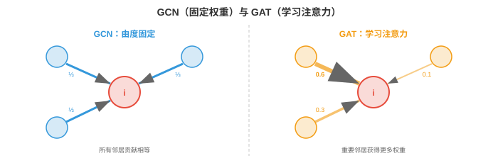

# 图注意力网络

*图注意力网络用学习得到、依赖数据的权重替代统一的邻居聚合。本节介绍 GAT、多头图注意力、GATv2、图 Transformer、位置与结构编码以及可扩展性。*

- 在第 3 节 GCN 中，每个节点使用由图结构，即归一化邻接矩阵，决定的固定权重聚合邻居特征。一个有 3 个邻居的节点会给每个邻居大致相同的权重，$\approx 1/3$。但并非所有邻居同样重要：来自密切合作者的消息应比来自远方熟人的消息更重要。

- **图注意力网络（Graph Attention Networks）**使用支撑第 7 章 Transformer 的同一注意力机制，通过学习**该关注哪些邻居**来解决此问题。每个节点不再使用固定的、基于结构的权重，而是在邻居上计算动态的、基于内容的注意力得分。

## GAT：图注意力网络

- **GAT**（Veličković 等，2018）计算每个节点与其邻居间的注意力系数。对于节点 $i$ 和邻居 $j$：

$$e_{ij} = \text{LeakyReLU}\left(\mathbf{a}^T \left[W\mathbf{h}_i \| W\mathbf{h}_j\right]\right)$$

- 其中 $W \in \mathbb{R}^{d' \times d}$ 是共享线性变换，$\|$ 表示拼接，$\mathbf{a} \in \mathbb{R}^{2d'}$ 是可学习注意力向量。得分 $e_{ij}$ 衡量节点 $j$ 的特征对节点 $i$ 有多重要。

- 原始得分使用 softmax 在所有邻居上归一化：

$$\alpha_{ij} = \text{softmax}_j(e_{ij}) = \frac{\exp(e_{ij})}{\sum_{k \in \mathcal{N}(i)} \exp(e_{ik})}$$

- 这确保每个节点邻域内的注意力权重之和为 1，正如第 7 章的 Transformer 注意力。节点更新后的特征为：

$$\mathbf{h}_i' = \sigma\left(\sum_{j \in \mathcal{N}(i)} \alpha_{ij} W\mathbf{h}_j\right)$$



- 与 GCN 的关键差异是，权重 $\alpha_{ij}$ 是**从数据中学习的（learned from the data）**，不是由图结构固定的。节点可以学习聚焦最有信息的邻居，忽略噪声或无关邻居。

- 注意力只在边上计算，即节点 $i$ 只关注其邻居 $\mathcal{N}(i)$，而非所有节点对。这使计算量与边数成比例，而不是与节点数平方成比例。

## 多头图注意力

- 正如第 7 章的 Transformer，**多头注意力（multi-head attention）**并行运行 $K$ 个独立注意力机制，每个都有自己的参数 $W^k$ 和 $\mathbf{a}^k$。结果在中间层拼接，在最终层求平均：

$$\mathbf{h}_i' = \Big\|_{k=1}^{K} \sigma\left(\sum_{j \in \mathcal{N}(i)} \alpha_{ij}^k W^k \mathbf{h}_j\right)$$

- 每个头可以关注邻域的不同方面：一个头可能关注结构特征，另一个关注语义相似性。这与 Transformer 多头注意力的动机相同：不同头捕捉不同类型的关系。

- 有 $K$ 个头且每个头的输出维度为 $d'$ 时，拼接输出的维度为 $K \times d'$。最终层通常不拼接而取平均，以产生固定大小输出。

## GATv2：修复静态注意力

- 原始 GAT 有一个微妙的限制：它的注意力函数是**静态的（static）**，也称基于排序。注意力得分依赖拼接 $[W\mathbf{h}_i \| W\mathbf{h}_j]$，但因为注意力向量 $\mathbf{a}$ 在拼接后应用，它可分解为两个独立部分：$\mathbf{a}^T [W\mathbf{h}_i \| W\mathbf{h}_j] = \mathbf{a}_1^T W\mathbf{h}_i + \mathbf{a}_2^T W\mathbf{h}_j$。

- 这意味着给定节点 $i$ 的邻居排序完全由邻居特征 $\mathbf{h}_j$ 决定，项 $\mathbf{a}_1^T W\mathbf{h}_i$ 在 $i$ 的所有邻居间恒定。注意力排序并不真正依赖查询节点特征。节点 $i$ 与节点 $k$ 会将同一组邻居排序为相同顺序，限制了表达能力。

- **GATv2**（Brody 等，2022）通过在注意力向量之前应用非线性修复它：

$$e_{ij} = \mathbf{a}^T \text{LeakyReLU}\left(W \left[\mathbf{h}_i \| \mathbf{h}_j\right]\right)$$

- 将 LeakyReLU 移到计算内部后，注意力得分成为联合特征的非线性函数，无法分解为独立项。这使注意力变为**动态的（dynamic）**：邻居排序如今依赖具体查询节点。GATv2 没有额外计算成本，却严格比 GAT 更有表达力。

## 图 Transformer

- 标准消息传递 GNN 受图拓扑限制：节点只能关注直接邻居。经过 $k$ 层后，来自 $k$ 跳邻居的信息已在多步聚合中混合，保真度下降。这一局部瓶颈，加上第 3 节的过平滑，限制了捕捉长距离依赖的能力。

- **图 Transformer（Graph Transformers）**对所有节点对应用**全局自注意力（global self-attention）**，无论它们是否共享边，从而打破该瓶颈。每个节点可以在单层中关注每一个其他节点，正如第 7 章标准 Transformer。

- 基本思想是将所有节点视为词元，并应用 Transformer 自注意力：

$$\text{Attention}(Q, K, V) = \text{softmax}\left(\frac{QK^T}{\sqrt{d_k}}\right)V$$

- 其中 $Q = XW_Q$、$K = XW_K$、$V = XW_V$ 是节点特征 $X$ 的查询、键和值投影，与第 7 章完全相同。这是在完全连接图，即第 2 节完全图 $K_n$ 上运行的 GNN。

- 问题是完全连接图忽略了真实图结构：边信息，即实际谁与谁相连，丢失了。有两种方法恢复它：

- **Graphormer**（Ying 等，2021）通过注意力得分中的**偏置项（bias terms）**将图结构注入 Transformer：

$$A_{ij} = \frac{(\mathbf{h}_i W_Q)(W_K^T \mathbf{h}_j^T)}{\sqrt{d_k}} + b_{\text{spatial}}(i, j) + b_{\text{edge}}(i, j)$$

- 空间偏置 $b_{\text{spatial}}$ 编码节点 $i$ 与 $j$ 间的最短路径距离；边偏置 $b_{\text{edge}}$ 编码最短路径上的边特征。此外，Graphormer 使用**中心性编码（centrality encoding）**，将节点度添加到输入嵌入，使模型获得各节点结构角色的信息。

- **GPS**，即通用、强大、可扩展图 Transformer（General, Powerful, Scalable Graph Transformer，Rampášek 等，2022），在每层结合局部消息传递和全局注意力：

$$\mathbf{h}_i' = \text{MLP}\left(\mathbf{h}_i^{\text{MPNN}} + \mathbf{h}_i^{\text{Attention}}\right)$$

- 每层同时应用标准 GNN，用于局部结构，和 Transformer，用于全局上下文，再合并结果。这兼得二者之长：消息传递提供局部结构，注意力提供长距离依赖。

## 位置与结构编码

- 序列上的 Transformer 使用第 7 章的位置编码注入顺序信息。图没有规范排序，因此需要图专用编码。

- **拉普拉斯特征向量编码（Laplacian eigenvector encodings）**将第 2 节图拉普拉斯矩阵的特征向量作为位置特征。最小的 $k$ 个非平凡特征向量提供图的谱嵌入：图中“相近”的节点具有相似特征向量值。这些值与节点特征拼接。

- 一个细节是，拉普拉斯特征向量具有符号歧义：若 $\mathbf{u}$ 是特征向量，$-\mathbf{u}$ 也是。模型必须对这些符号翻转不变。解决方法包括训练中使用随机符号翻转作为数据增强，或学习符号不变变换。

- **随机游走编码（random walk encodings）**计算从节点 $i$ 出发的随机游走回到节点 $i$ 的概率，经过 $k$ 步，其中 $k = 1, 2, \ldots, K$。这些概率编码局部结构信息：稠密簇的节点回返概率高，稀疏区域节点的回返概率低。落点概率为 $p_{ii}^{(k)} = (A_{\text{rw}}^k)_{ii}$，其中 $A_{\text{rw}} = D^{-1}A$ 是随机游走转移矩阵。

- **度编码（degree encodings）**仅将节点度作为特征添加。这出乎意料地有效，因为度是强结构信号：叶节点，度为 1，桥接节点和枢纽节点行为不同。

- 这些编码提供朴素 Transformer 缺少的结构信息，使图 Transformer 在需要长距离推理的任务上优于标准消息传递 GNN。

## 可扩展性

- GNN 的根本可扩展性挑战在于：图可能有数百万节点、数十亿边。在完整图上训练 GNN 需要将所有节点特征和整个邻接矩阵存入内存，常常不可行。

- GNN 的**小批量训练（mini-batch training）**比图像或序列更复杂，因为节点相互连接。天真地采样一批节点会需要它们的邻居，第 1 层；邻居的邻居，第 2 层；依此类推。这种**邻域爆炸（neighbourhood explosion）**意味着一批 1,000 个目标节点可能需要计算图中的数百万节点。

- **邻域采样（neighbourhood sampling）**，GraphSAGE 风格，见第 3 节，通过每层为每个节点采样固定数量邻居，限制爆炸。使用 2 层、每层采样 15 个时，每个目标节点子图最多有 $15^2 = 225$ 个节点，与完整图规模无关。

- **Cluster-GCN**（Chiang 等，2019）使用图聚类算法，如 METIS，将图划分为多个簇，再一次只在一个簇上训练。簇内边稠密，大多数邻居位于同一簇，因此子图可捕捉相关结构。跨簇边通过偶尔纳入簇间边处理。

- **图 Transformer 的可扩展性**更困难，因为全局注意力是 $O(n^2)$。对于数百万节点的图，完整注意力不可行。解决方案包括：
    - 稀疏注意力模式，只关注图中 $k$ 个最近节点。
    - 线性注意力近似。
    - 将局部消息传递，成本低，为 $O(|E|)$，与粗化图上的全局注意力，节点更少，结合。

## 时序与动态图

- 迄今研究的图是**静态的（static）**：节点、边和特征固定不变。但许多现实图**随时间演化（evolve over time）**：新用户加入社交网络，金融交易创建边，全天交通模式变化，分子相互作用波动。

- **时序图（temporal graph）**为每条边附加时间戳：$(i, j, t)$ 表示节点 $i$ 与节点 $j$ 在时刻 $t$ 交互。挑战在于学习同时捕捉图结构和时间动态的表示。

- 有两种范式：

- **离散时间动态图（Discrete-time dynamic graphs, DTDG）**：将图表示为快照序列 $G_1, G_2, \ldots, G_T$，每个时间步一个。GNN 处理每个快照，RNN 或时间注意力机制捕捉快照间演化。它很简单，但会丢失细粒度时序信息，快照之间的事件会丢失，并且需要选择快照频率。

- **连续时间动态图（Continuous-time dynamic graphs, CTDG）**：事件被建模为带时间戳交互流。每个事件 $(i, j, t)$ 在它发生的确切时刻更新节点 $i$ 和 $j$ 的表示，从而保留全部时间信息。

- **时序图网络（Temporal Graph Network, TGN）**（Rossi 等，2020）是领先的 CTDG 架构。每个节点维护一个**记忆状态（memory state）** $\mathbf{s}_i(t)$，在节点参与交互时更新：

$$\mathbf{s}_i(t^+) = \text{GRU}\left(\mathbf{s}_i(t^-), \; \mathbf{m}_i(t)\right)$$

- 其中 $\mathbf{m}_i(t)$ 是根据交互计算出的消息，结合两个节点的特征、边特征与时间编码。第 6 章的 GRU 选择性保留和遗忘过去信息，使记忆既能捕捉长期模式，又能适应近期事件。

- **时间编码（time encoding）**将自上次交互以来的经过时间表示为特征向量，类似第 7 章 Transformer 中的位置编码。常用方法是可学习 Fourier 特征：

$$\Phi(t) = \left[\cos(\omega_1 t), \sin(\omega_1 t), \ldots, \cos(\omega_d t), \sin(\omega_d t)\right]$$

- 这使模型能丰富地表示时间间隔：“这个用户上次活跃在 5 分钟前”和“3 个月前”会得到不同嵌入。

- **时序图注意力（Temporal Graph Attention, TGAT）**在节点的时间邻域上应用自注意力，即最近交互的集合。每条交互既按特征相关性，类似 GAT，也按时间新近性加权。久远过去的交互会自然被降权。

- 应用包括欺诈检测，金融图中的异常交易模式；交通预测，根据历史流量模式预测拥堵；社交网络动态，预测病毒式内容传播；以及随时间进行的药物相互作用预测。

## 编程任务（使用 CoLab 或 Notebook）

1. 从零实现单个 GAT 注意力头。计算节点与邻居间的注意力权重，并验证它们之和为 1。
```python
import jax
import jax.numpy as jnp

rng = jax.random.PRNGKey(0)
k1, k2, k3 = jax.random.split(rng, 3)

n_nodes, d_in, d_out = 5, 4, 3

# Random node features
H = jax.random.normal(k1, (n_nodes, d_in))

# Learnable parameters
W = jax.random.normal(k2, (d_in, d_out)) * 0.5
a = jax.random.normal(k3, (2 * d_out,)) * 0.5

# Adjacency (node 0 connects to 1, 2, 3)
neighbours_of_0 = [1, 2, 3]

# Transform features
Wh = H @ W  # (n_nodes, d_out)

# Compute attention scores for node 0
h_i = Wh[0]
scores = []
for j in neighbours_of_0:
    h_j = Wh[j]
    e_ij = jnp.dot(a, jnp.concatenate([h_i, h_j]))
    e_ij = jax.nn.leaky_relu(e_ij, negative_slope=0.2)
    scores.append(float(e_ij))

scores = jnp.array(scores)
alpha = jax.nn.softmax(scores)

print(f"Raw scores: {scores}")
print(f"Attention weights: {alpha}")
print(f"Sum of weights: {alpha.sum():.4f}")

# Weighted aggregation
h_new = sum(alpha[k] * Wh[neighbours_of_0[k]] for k in range(len(neighbours_of_0)))
print(f"Updated node 0 features: {h_new}")
```

2. 比较 GCN，固定权重，和 GAT，学习权重，的聚合。展示 GAT 可以为邻居分配不同权重，而 GCN 对它们一视同仁。
```python
import jax
import jax.numpy as jnp

# 4 nodes: node 0 connects to 1, 2, 3
A = jnp.array([[0,1,1,1],
               [1,0,0,0],
               [1,0,0,0],
               [1,0,0,0]], dtype=float)

# Features: node 1 is very relevant, node 2 is noise, node 3 is moderate
H = jnp.array([[0.0, 0.0],   # node 0
               [1.0, 0.0],   # node 1 (signal)
               [0.0, 0.0],   # node 2 (noise)
               [0.5, 0.0]])  # node 3 (moderate)

# GCN: normalised adjacency weights
A_hat = A + jnp.eye(4)
D_inv = jnp.diag(1.0 / A_hat.sum(axis=1))
gcn_weights = (D_inv @ A_hat)[0]  # weights for node 0
print(f"GCN weights for node 0: {gcn_weights}")
print("  → All neighbours get roughly equal weight")

# GAT: learned attention (simulated)
# Suppose the attention mechanism learns to focus on node 1
gat_weights = jnp.array([0.1, 0.7, 0.05, 0.15])  # learned
print(f"\nGAT weights for node 0: {gat_weights}")
print("  → Node 1 (informative) gets most attention")

gcn_output = gcn_weights @ H
gat_output = gat_weights @ H
print(f"\nGCN output: {gcn_output}  (diluted by noise)")
print(f"GAT output: {gat_output}  (focused on signal)")
```

3. 演示位置编码的收益。为图计算拉普拉斯特征向量编码，并展示结构相似节点得到相似编码。
```python
import jax.numpy as jnp
import matplotlib.pyplot as plt

# Barbell graph: two cliques connected by a bridge
n = 10
A = jnp.zeros((n, n))
# Clique 1: nodes 0-4
for i in range(5):
    for j in range(i+1, 5):
        A = A.at[i,j].set(1).at[j,i].set(1)
# Clique 2: nodes 5-9
for i in range(5, 10):
    for j in range(i+1, 10):
        A = A.at[i,j].set(1).at[j,i].set(1)
# Bridge
A = A.at[4,5].set(1).at[5,4].set(1)

D = jnp.diag(A.sum(axis=1))
L = D - A
eigenvalues, eigenvectors = jnp.linalg.eigh(L)

# Use first 3 non-trivial eigenvectors as positional encoding
pe = eigenvectors[:, 1:4]

print("Laplacian Positional Encodings:")
for i in range(n):
    group = "Clique 1" if i < 5 else "Clique 2"
    bridge = " (bridge)" if i in [4, 5] else ""
    print(f"  Node {i} ({group}{bridge}): {pe[i]}")

plt.scatter(pe[:5, 0], pe[:5, 1], c="#3498db", s=80, label="Clique 1")
plt.scatter(pe[5:, 0], pe[5:, 1], c="#e74c3c", s=80, label="Clique 2")
plt.scatter(pe[[4,5], 0], pe[[4,5], 1], c="black", s=120, marker="*",
            label="Bridge nodes", zorder=5)
plt.legend(); plt.grid(True)
plt.title("Laplacian Eigenvector Positional Encodings")
plt.xlabel("Eigenvector 1"); plt.ylabel("Eigenvector 2")
plt.show()
```
