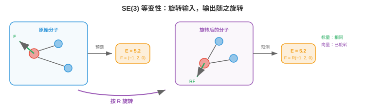

# 三维图网络

*三维图网络将 GNN 扩展到带空间几何的数据，必须正确处理旋转与平移。本节介绍几何图、SE(3)/E(n) 等变性、SchNet、DimeNet、EGNN、张量场网络，以及分子性质预测、蛋白质结构、材料科学和药物发现中的应用。这些架构从三维物理世界学习。*

- 第 3、4 节的 GNN 运行于抽象图：节点有特征，边编码连通性，但没有三维空间概念。社交网络图没有几何结构。但 GNN 最有影响力的许多应用涉及存在于**物理三维空间（physical 3D space）**的数据：分子、蛋白质、晶体、点云。对这些数据，节点空间位置承载抽象 GNN 忽略的关键信息。

- 挑战是三维数据具有第 1 节的**几何对称性（geometric symmetries）**：旋转分子不改变其性质，平移也不改变。三维 GNN 必须尊重这些对称性。旋转分子后改变的能量预测在物理上是错误的。

## 几何图

- **几何图（geometric graph）**是嵌入三维空间的图。每个节点 $i$ 除位置 $\mathbf{r}_i \in \mathbb{R}^3$ 外，还有特征向量 $\mathbf{h}_i$。边可由空间邻近性定义，即连接距离 $r_{\text{cut}}$ 内的节点，而非显式键。

- 对分子，几何图以原子为节点，特征包括元素类型、电荷等，以化学键为边。三维位置 $\mathbf{r}_i$ 是由量子力学或实验测量，如 X 射线晶体学、冷冻电镜，确定的原子坐标。

- 对来自 LiDAR 或三维扫描仪，第 8、11 章，的点云，每个点都是带位置和可选特征，如颜色、强度，的节点。边连接附近点，形成**k 近邻图（k-nearest-neighbour, kNN graph）**或半径图。

- 用于消息传递的关键几何量包括：

    - **原子间距离（interatomic distances）**：$d_{ij} = \|\mathbf{r}_i - \mathbf{r}_j\|$。距离对旋转和平移不变。原子间距离相同的两个分子形状相同，无论朝向如何。

    - **键角（bond angles）**：角 $\theta_{ijk}$ 位于向量 $\mathbf{r}_j - \mathbf{r}_i$ 与 $\mathbf{r}_k - \mathbf{r}_i$ 之间，且位于节点 $i$ 处。角度捕捉超出成对距离的局部几何。

    - **二面角，扭转角（dihedral angles）**：角 $\phi_{ijkl}$ 位于由 $(i, j, k)$ 和 $(j, k, l)$ 定义的两个平面之间。二面角捕捉结构在三维中的扭转，对蛋白质骨架几何至关重要。

    - **相对位置向量（relative position vectors）**：$\mathbf{r}_{ij} = \mathbf{r}_j - \mathbf{r}_i$。它们对平移不变，但不对旋转不变。使用它们需要等变，而不只是不变，的架构。

## SE(3) 与 E(n) 等变性

- 三维物理数据的对称群是**欧几里得群（Euclidean group）** $E(3)$，由全部旋转、反射和平移组成。其子群**$SE(3)$**，特殊欧几里得群，包含旋转和平移，但不包含反射。

- 三维 GNN 应当具备：
    - 对标量输出，如能量、结合亲和力，**平移不变（translation-invariant）**：将全部原子平移同一个向量不应改变预测。
    - 对标量输出**旋转不变（rotation-invariant）**：旋转分子不应改变能量。
    - 对向量/张量输出，如力、偶极矩，**旋转等变（rotation-equivariant）**：旋转分子应使预测力向量按同一旋转旋转。



- 形式上，对标量预测 $f$ 和旋转 $R \in SO(3)$：

$$f(R\mathbf{r}_1, R\mathbf{r}_2, \ldots) = f(\mathbf{r}_1, \mathbf{r}_2, \ldots) \quad \text{(invariance)}$$

- 对向量预测 $\mathbf{F}$：

$$\mathbf{F}(R\mathbf{r}_1, R\mathbf{r}_2, \ldots) = R \cdot \mathbf{F}(\mathbf{r}_1, \mathbf{r}_2, \ldots) \quad \text{(equivariance)}$$

- 这些约束直接映照第 1 节的不变性/等变性框架，只是现在专门应用到三维旋转和平移群。

- 有两种设计路径：
    1. **不变架构（invariant architectures）**：只使用不变几何特征，距离、角度，作为消息传递输入。内部表示是标量，即不变。简单、高效，但不破坏对称性便无法产生向量输出。
    2. **等变架构（equivariant architectures）**：在整个网络中维护向量，以及高阶张量，表示，确保每一层等变。表达力更强，可自然预测向量和张量，但更复杂。

## SchNet：基于距离的消息传递

- **SchNet**（Schütt 等，2017）是基础性的不变三维 GNN。其关键创新是**连续滤波器卷积（continuous filter convolution）**：SchNet 不使用固定边类型集合，例如分子 GNN 中的键类型，而是直接从原子间距离生成消息滤波器。

- 距离 $d_{ij}$ 先使用**径向基函数（radial basis functions, RBFs）**扩展为特征向量：

$$\text{RBF}(d_{ij}) = \left[\exp\left(-\gamma_1 (d_{ij} - \mu_1)^2\right), \ldots, \exp\left(-\gamma_K (d_{ij} - \mu_K)^2\right)\right]$$

- 每个基函数都是以 $\mu_k$ 为中心、宽度为 $\gamma_k$ 的高斯函数。这类似可学习的距离位置编码：连续距离被映射到高维特征空间，网络可在该空间学习依赖距离的相互作用。中心 $\mu_k$ 通常从 0 到截断半径均匀分布。

- 从节点 $j$ 到节点 $i$ 的 SchNet 消息为：

$$\mathbf{m}_{j \to i} = \mathbf{h}_j \odot W_{\text{filter}}(\text{RBF}(d_{ij}))$$

- 其中 $W_{\text{filter}}$ 是将 RBF 展开映射为滤波向量的 MLP，$\odot$ 是逐元素乘法，即第 2 章 Hadamard 积。滤波器依赖距离，因此附近原子与远处原子的相互作用不同。逐元素乘法类似第 6 章的门控机制：依赖距离的滤波器控制每个特征维度通过多少。

- SchNet 仅使用不变的距离，因此整个模型自动对旋转和平移不变。除这一设计选择外，不需要特殊处理对称性。

## DimeNet 与 SphereNet：角度和二面角

- 仅凭距离无法完整确定三维结构。两个不同分子构象可以有相同成对距离，却有不同键角，这就是“距离几何歧义”。**DimeNet**（Gasteiger 等，2020）将**键角（bond angles）**纳入消息传递。

- DimeNet 使用**方向性消息传递（directional message passing）**：消息沿有向边流动，边 $(j \to i)$ 上的消息受边 $(k \to j)$ 和 $(j \to i)$ 间角度影响：

$$\mathbf{m}_{kj \to ji} = f\left(\mathbf{m}_{kj}, d_{ji}, \theta_{kji}\right)$$

- 角度 $\theta_{kji}$ 使用球贝塞尔函数和球谐函数展开，它们是球面角度信息的自然基，对距离而言类似 RBF。这让模型访问方向信息，同时保持不变性。

- **SphereNet**（Liu 等，2022）更进一步，纳入**二面角（dihedral angles）** $\phi_{lkji}$，捕捉完整三维扭转结构。层次如下：
    - 距离 → 捕捉成对邻近性。
    - 角度 → 捕捉局部几何，弯曲与线性。
    - 二面角 → 捕捉三维扭转，对蛋白质骨架和药物结合至关重要。

- 每一层都以计算复杂度为代价增加几何分辨率：距离为 $O(|E|)$，角度为 $O(|E| \cdot k)$，二面角为 $O(|E| \cdot k^2)$，其中 $k$ 是平均度。

## E(n) 等变 GNN（EGNN）

- **EGNN**（Satorras 等，2021）采用等变路径：它不只使用不变特征，而是在每层同时更新节点特征**和（and）**节点位置，全程保持等变性。

- 节点 $i$ 的 EGNN 更新为：

$$\mathbf{m}_{ij} = \phi_e\left(\mathbf{h}_i, \mathbf{h}_j, d_{ij}^2, a_{ij}\right)$$

$$\mathbf{r}_i' = \mathbf{r}_i + C \sum_{j \neq i} (\mathbf{r}_i - \mathbf{r}_j) \cdot \phi_r(\mathbf{m}_{ij})$$

$$\mathbf{h}_i' = \phi_h\left(\mathbf{h}_i, \sum_j \mathbf{m}_{ij}\right)$$

- 关键是位置更新：节点位置按相对位置向量 $(\mathbf{r}_i - \mathbf{r}_j)$ 的加权和调整。权重来自消息函数 $\phi_r$，它仅依赖不变量，即特征和距离。这种构造**可证明等变（provably equivariant）**：若所有输入位置被 $R$ 旋转，所有输出位置也被同一个 $R$ 旋转。

- EGNN 很优雅，因为它无需显式使用球谐函数或不可约表示即可实现等变性。相对位置向量携带方向信息，不变消息函数控制如何使用这些方向信息。

- 简单性带来取舍：EGNN 只使用向量表示，即 1 阶表示。没有扩展时，它无法表示四极矩或应力张量等高阶张量。

## 张量场网络与高阶表示

- **张量场网络（Tensor Field Networks）**（Thomas 等，2018）及其后继模型，**SE(3)-Transformers**、**MACE**、**Equiformer**，使用旋转群**不可约表示（irreducible representations）**的完整工具构建等变层。

- 在表示论中，与第 2 章线性代数相连，三维旋转可分解为由整数阶 $\ell$ 表示的不可约分量：
    - $\ell = 0$：标量，1 个分量，不变。例如能量、电荷。
    - $\ell = 1$：向量，3 个分量，像位置向量一样旋转。例如力、偶极矩。
    - $\ell = 2$：二阶对称无迹张量，5 个分量。例如四极矩、应力张量。
    - 更高 $\ell$：捕捉越来越复杂的角结构。

- 它们称为**球张量（spherical tensors）**，在旋转 $R$ 下经由**Wigner-D 矩阵（Wigner-D matrices）** $D^\ell(R)$ 变换：标量不变，向量按 $R$ 旋转，二阶张量按更复杂的矩阵旋转。

- 使用球张量的**等变消息传递（equivariant message passing）**借助**Clebsch-Gordan 张量积（Clebsch-Gordan tensor product）**组合不同阶的特征：

$$(\mathbf{f}^{\ell_1} \otimes \mathbf{f}^{\ell_2})^{\ell_{\text{out}}} = \sum_{m_1, m_2} C^{\ell_{\text{out}}, m_{\text{out}}}_{\ell_1, m_1, \ell_2, m_2} \cdot f^{\ell_1}_{m_1} \cdot f^{\ell_2}_{m_2}$$

- Clebsch-Gordan 系数 $C$ 是保证张量积等变的固定数学常数。这是 SO(3) 等变的矩阵乘法对应物。

- **MACE**（Batatia 等，2022）使用高阶消息，即多个邻居特征的乘积，以更少消息传递层取得高精度。通过构造按体排序的相互作用，距离给出二体、角度给出三体、张量积给出多体，MACE 高效捕捉复杂原子相互作用。

- **Equiformer**（Liao 与 Smidt，2023）将等变球张量特征与第 4 节的 Transformer 注意力机制结合，形成 SE(3) 等变图 Transformer。注意力得分从不变特征计算，而值聚合在等变张量特征上操作。

## 应用

- **分子性质预测（molecular property prediction）**：给定分子的三维结构，预测能量、力、偶极矩、HOMO-LUMO 能隙、毒性、溶解度等性质。这是三维 GNN 最成熟的应用。在量子化学数据集，如 QM9、OC20，上训练的模型能对许多性质达到化学精度，可虚拟筛选数百万候选分子。

- **分子动力学加速（molecular dynamics acceleration）**：使用量子力学，即密度泛函理论 DFT，计算原子间力极其昂贵：为 $O(n^3)$，对于 $n$ 个电子。经训练可预测力的三维 GNN 可在分子动力学模拟中替代 DFT，在保持接近 DFT 的精度时实现 $10^3$--$10^6$ 倍加速。这使更大系统、更长时间尺度的模拟成为可能，揭示传统方法不可见的现象。

- **蛋白质结构（protein structure）**：蛋白质是折叠为复杂三维结构的氨基酸链。蛋白质骨架是几何图，节点为残基，边连接空间邻近残基。三维 GNN 用于蛋白质功能预测、结合位点识别和蛋白质设计，逆折叠：给定期望结构，预测氨基酸序列。**AlphaFold** 使用几何与基于图的推理，从序列预测蛋白质结构。

- **材料科学与催化（materials science and catalysis）**：晶体材料具有周期性三维结构。GNN 建模重复单元晶胞，预测材料性质：带隙、形成能、机械强度。开放催化剂项目 OC20/OC22 基准测试 GNN 在催化表面预测吸附能的能力，加快为可再生能源寻找新催化剂。

- **药物发现（drug discovery）**：三维 GNN 预测药物分子如何与目标蛋白质结合。结合亲和力取决于药物与蛋白质结合口袋之间的三维形状互补性和化学相互作用。**DiffDock** 等模型结合等变 GNN 与第 8 章扩散模型，预测结合位姿，即药物在蛋白质口袋中的三维朝向。

## 图生成

- 上述所有架构都在**分析（analyse）**已有图；**图生成（graph generation）**创建新图：设计具备期望性质的分子，生成用于测试的合成社交网络，或提出新颖蛋白质结构。这是图级预测的生成式对应物。

- 挑战在于图是离散、可变大小且组合性的。生成图意味着决定创建多少节点、节点具有什么特征、连接哪些节点对。可能图的空间随节点数超指数增长。

- **自回归生成（autoregressive generation）**一次构建一个节点，或一条边。**GraphRNN**（You 等，2018）顺序生成图：RNN 维护状态，每步生成一个新节点，并决定与哪些已有节点连接。生成顺序给固有无序图强加人为序列，但 BFS 排序通过使最近生成节点保持相关而有所帮助。

- **基于 VAE 的生成（VAE-based generation）**使用 GNN 编码器将图编码到连续潜在空间，再从采样潜在向量解码新图。**GraphVAE** 一次生成概率邻接矩阵 $\hat{A} \in [0, 1]^{n \times n}$，但其扩展性为 $O(n^2)$，产生必须阈值化的稠密输出。潜在空间允许平滑插值：在两个分子嵌入之间移动，产生化学有效的中间结构。

- **基于扩散的生成（diffusion-based generation）**将第 8 章扩散框架用于图。前向过程逐步向节点特征和边结构加入噪声；反向过程学习去噪，从噪声生成有效图。**DiGress**（Vignac 等，2023）将离散扩散同时应用于节点类型和边类型，自然处理图数据的类别性质。

- 对**分子生成（molecular generation）**，关键约束是**化学有效性（chemical validity）**：生成分子必须遵守化合价规则，如碳形成 4 个键、氧形成 2 个键。**Junction Tree VAE（JT-VAE）**等方法将分子分解为有效子结构，环、链、官能团，再通过组装这些构件生成，因此从构造上保证有效性。

- **目标导向生成（goal-directed generation）**针对特定性质优化：生成与目标蛋白具有高结合亲和力、低毒性和良好溶解度的分子。它在循环中结合图生成与性质预测，使用三维 GNN 作为性质评估器：生成 → 评估 → 优化。第 6 章强化学习或贝叶斯优化引导在化学空间中的搜索。

- **DiffDock**（Corso 等，2023）使用 SE(3) 等变扩散预测药物分子如何对接到蛋白质结合口袋。该模型从随机放置去噪生成三维结合位姿，即相对蛋白质的位置与朝向，将本节三维等变网络与第 8 章扩散框架结合。

## 编程任务（使用 CoLab 或 Notebook）

1. 使用原子间距离构建一个简单的不变三维消息传递层。将其应用于小分子，水：H-O-H，并验证输出对旋转不变。
```python
import jax
import jax.numpy as jnp

# Water molecule: O at origin, two H atoms
positions = jnp.array([[0.0, 0.0, 0.0],     # O
                        [0.96, 0.0, 0.0],    # H1
                        [-0.24, 0.93, 0.0]])  # H2

# Node features: [atomic number]
features = jnp.array([[8.0], [1.0], [1.0]])

# Compute pairwise distances (invariant)
def pairwise_distances(pos):
    diff = pos[:, None, :] - pos[None, :, :]
    return jnp.sqrt(jnp.sum(diff**2, axis=-1) + 1e-8)

# Simple distance-based message passing
def invariant_message_pass(features, positions):
    dists = pairwise_distances(positions)
    # RBF expansion with 4 centres
    centres = jnp.array([0.5, 1.0, 1.5, 2.0])
    rbf = jnp.exp(-5.0 * (dists[:, :, None] - centres[None, None, :]) ** 2)

    # Message: features weighted by distance-dependent filter
    messages = jnp.einsum("ij,jd->id", rbf.sum(axis=-1), features)
    return messages

output1 = invariant_message_pass(features, positions)

# Rotate the molecule by 90 degrees around z-axis
R = jnp.array([[0, -1, 0], [1, 0, 0], [0, 0, 1]], dtype=float)
rotated_positions = (R @ positions.T).T

output2 = invariant_message_pass(features, rotated_positions)

print(f"Original output:\n{output1}")
print(f"\nRotated output:\n{output2}")
print(f"\nInvariant: {jnp.allclose(output1, output2, atol=1e-5)}")
```

2. 计算三个原子间的键角，并验证它对旋转不变。
```python
import jax.numpy as jnp

def bond_angle(r_i, r_j, r_k):
    """Angle at node j between edges j->i and j->k."""
    v1 = r_i - r_j
    v2 = r_k - r_j
    cos_angle = jnp.dot(v1, v2) / (jnp.linalg.norm(v1) * jnp.linalg.norm(v2))
    return jnp.arccos(jnp.clip(cos_angle, -1, 1))

# Three atoms
r1 = jnp.array([1.0, 0.0, 0.0])
r2 = jnp.array([0.0, 0.0, 0.0])
r3 = jnp.array([0.0, 1.0, 0.0])

angle_original = bond_angle(r1, r2, r3)
print(f"Original angle: {jnp.degrees(angle_original):.1f}°")

# Apply random rotation
R = jnp.array([[0.36, 0.48, -0.80],
               [-0.80, 0.60, 0.00],
               [0.48, 0.64, 0.60]])
r1_rot, r2_rot, r3_rot = R @ r1, R @ r2, R @ r3

angle_rotated = bond_angle(r1_rot, r2_rot, r3_rot)
print(f"Rotated angle:  {jnp.degrees(angle_rotated):.1f}°")
print(f"Invariant: {jnp.allclose(angle_original, angle_rotated, atol=1e-4)}")
```

3. 演示等变位置更新，EGNN 风格。使用按距离加权的相对向量更新节点位置，并验证等变性。
```python
import jax
import jax.numpy as jnp

def egnn_position_update(positions, features):
    """Simple EGNN-style equivariant position update."""
    n = positions.shape[0]
    new_positions = jnp.zeros_like(positions)

    for i in range(n):
        shift = jnp.zeros(3)
        for j in range(n):
            if i != j:
                r_ij = positions[i] - positions[j]
                d_ij = jnp.linalg.norm(r_ij)
                # Weight based on distance (simple: inverse distance)
                weight = 1.0 / (d_ij + 1.0)
                # Scale by feature similarity
                feat_sim = jnp.dot(features[i], features[j])
                shift = shift + weight * feat_sim * r_ij
        new_positions = new_positions.at[i].set(positions[i] + 0.1 * shift)

    return new_positions

# 3 atoms
pos = jnp.array([[0.0, 0.0, 0.0], [1.0, 0.0, 0.0], [0.0, 1.0, 0.0]])
feat = jnp.array([[1.0, 0.5], [0.5, 1.0], [0.8, 0.3]])

# Update positions
pos_new = egnn_position_update(pos, feat)

# Now rotate input, update, and check if output is rotated consistently
R = jnp.array([[0.0, -1.0, 0.0], [1.0, 0.0, 0.0], [0.0, 0.0, 1.0]])
pos_rot = (R @ pos.T).T
pos_new_from_rot = egnn_position_update(pos_rot, feat)

# Should be the same as rotating the original output
pos_new_then_rot = (R @ pos_new.T).T

print(f"Update then rotate:\n{jnp.round(pos_new_then_rot, 4)}")
print(f"\nRotate then update:\n{jnp.round(pos_new_from_rot, 4)}")
print(f"\nEquivariant: {jnp.allclose(pos_new_then_rot, pos_new_from_rot, atol=1e-4)}")
```
