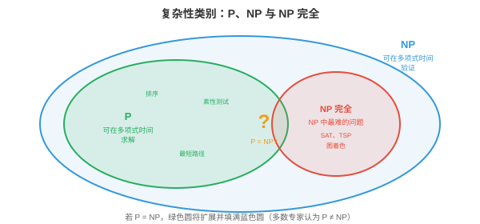

# 离散数学

*离散数学研究可数且彼此分离的结构，是计算机赖以建立的数学基础。本节涵盖命题逻辑和谓词逻辑、证明方法、集合、关系、函数、图论基础与递推关系。*

- 前面的章节讨论的是连续数学：微积分（第 3 章）、概率分布（第 5 章），以及对实值参数的优化（第 6 章）。但计算机从根本上是**离散的（discrete）**机器：它们存储比特（0 或 1）、处理整数、遵循分支逻辑，并操作有限的数据结构。**离散数学（discrete maths）**为推理这些结构提供了形式化语言。

!!! note "大白话"
    计算机不是在处理连续曲线，而是在处理一个个明确的比特、整数和分支选择；离散数学就是描述这些对象的规则书。

- 本章的一切都以离散数学为基础：处理器逻辑门是布尔代数，调度算法需要正确性证明，内存管理使用集合运算，算法分析需要递推关系。

!!! note "大白话"
    后面学到的硬件、操作系统和算法，底层都会反复用到逻辑、证明、集合和递推。

## 命题逻辑

- **命题逻辑（propositional logic）**是真/假陈述的代数。**命题（proposition）**是非真即假的陈述，绝不会同时为真和假。“正在下雨”是命题；“现在几点？”不是命题，因为它是问题，而不是具有真值的陈述。

!!! note "大白话"
    命题逻辑只处理能明确判定真或假的句子；问题、命令和模糊说法不属于它。

- 命题可通过**逻辑连接词（logical connectives）**组合：

    - **与（AND）**（合取，$p \wedge q$）：仅当 $p$ 和 $q$ 都为真时为真。

        !!! note "大白话"
            AND 很严格，两个条件必须同时满足。
    - **或（OR）**（析取，$p \vee q$）：$p$ 或 $q$ 至少有一个为真时为真。

        !!! note "大白话"
            OR 只要至少一个条件成立就通过，也允许两个都成立。
    - **非（NOT）**（否定，$\neg p$）：翻转真值。

        !!! note "大白话"
            NOT 把真变假、把假变真。
    - **蕴含（IMPLIES）**（implication，$p \to q$）：仅当 $p$ 为真而 $q$ 为假时为假。“如果下雨，地面就是湿的”仅在下雨且地面干燥时被违背。

        !!! note "大白话"
            “如果 p 则 q”只禁止一种情况：p 已发生，q 却没发生。
    - **当且仅当（IFF）**（双条件，$p \leftrightarrow q$）：两者真值相同时为真。

        !!! note "大白话"
            IFF 表示两个命题同真同假，彼此完全等价。

!!! note "大白话"
    这些连接词就是程序里条件判断的数学版本。

- **真值表（truth table）**穷尽列出所有可能的输入组合及其输出。对于 $n$ 个命题，真值表有 $2^n$ 行。这是验证逻辑等价式的方法：

!!! note "大白话"
    真值表把所有可能情况一条不漏地列出来，因此能直接检查两个逻辑表达式是否永远相同。

| $p$ | $q$ | $p \wedge q$ | $p \vee q$ | $p \to q$ |
|-----|-----|--------------|------------|-----------|
| T | T | T | T | T |
| T | F | F | T | F |
| F | T | F | T | T |
| F | F | F | F | T |

- $p$ 为假时的蕴含行值得注意：$F \to q$ 恒为真，无论 $q$ 如何。这称为**空真（vacuous truth）**。“如果猪会飞，那么我是英格兰国王”在逻辑上为真，因为前提为假。它看似违反直觉，却是数学推理的必要条件。

!!! note "大白话"
    前提根本没发生时，“如果前提就结论”没有被任何反例推翻，所以逻辑上算真；它不是说结论真的成立。

- **逻辑等价式（logical equivalences）**是在所有真值下均成立的恒等式：

    - **德摩根定律（De Morgan's laws）**：$\neg(p \wedge q) \equiv \neg p \vee \neg q$ 以及 $\neg(p \vee q) \equiv \neg p \wedge \neg q$。否定一个“与”时，否定每个部分并换成“或”（反之亦然）。它们直接出现在编程中：`!(a && b)` 等价于 `(!a || !b)`。

        !!! note "大白话"
            否定“两个都满足”就是“至少一个不满足”；写条件判断时非常常用。

    - **逆否命题（contrapositive）**：$p \to q \equiv \neg q \to \neg p$。“如果下雨，地面就是湿的”等价于“如果地面不是湿的，就没有下雨”。这是强有力的证明方法。

        !!! note "大白话"
            直接证明“p 导致 q”困难时，可以改证“q 不成立就说明 p 不成立”。

    - **双重否定（double negation）**：$\neg(\neg p) \equiv p$。

        !!! note "大白话"
            不是真的“非 p”，就等于 p 本身。

    - **分配律（distributive）**：$p \wedge (q \vee r) \equiv (p \wedge q) \vee (p \wedge r)$。

        !!! note "大白话"
            逻辑运算也能像普通代数一样展开和重组。

!!! note "大白话"
    逻辑等价式让你可以在不改变意思的前提下改写条件、简化证明和代码。

- 在所有真值赋值下始终为真的公式是**重言式（tautology）**；始终为假的公式是**矛盾式（contradiction）**；有时为真、有时为假的公式是**偶然式（contingent）**。例如，$p \vee \neg p$ 是重言式，而 $p \wedge \neg p$ 是矛盾式。

!!! note "大白话"
    永真式是无条件成立的规则，矛盾式永远不可能成立，普通命题则要看具体输入。

## 谓词逻辑与量词

- 命题逻辑无法表达关于一个集合中*所有*或*某些*元素的陈述。“每个大于 2 的素数都是奇数”需要**谓词逻辑（predicate logic）**，它在命题逻辑上扩展了变量、谓词和量词。

!!! note "大白话"
    命题逻辑只能处理完整句子；要表达“每个人”“存在一个数”这类范围，就需要变量和量词。

- **谓词（predicate）**是依赖于变量的陈述：$P(x)$ = “$x$ 是偶数”。当给定 $x$ 的具体值后，它成为命题：$P(4)$ 为真，$P(7)$ 为假。

!!! note "大白话"
    谓词像带空位的判断模板，填进具体对象后才得到真或假的完整命题。

- **量词（quantifiers）**表达作用范围：

    - **全称量词（universal quantifier）**（$\forall$）：“对于所有”。$\forall x \, P(x)$ 表示“$P(x)$ 对定义域内每个 $x$ 都为真”。

        !!! note "大白话"
            $\forall$ 要求一个规律对范围内每个对象都成立，找出一个反例就能推翻它。
    - **存在量词（existential quantifier）**（$\exists$）：“存在”。$\exists x \, P(x)$ 表示“至少存在一个 $x$ 使 $P(x)$ 为真”。

        !!! note "大白话"
            $\exists$ 只需要找到一个满足条件的对象，就足以证明它。

!!! note "大白话"
    全称是在说“全部都这样”，存在是在说“至少有一个这样”，两者的证明方法正好相反。

- 否定量词会将它们互换：$\neg(\forall x \, P(x)) \equiv \exists x \, \neg P(x)$。“并非每个人都通过了”意为“有人失败了”。而 $\neg(\exists x \, P(x)) \equiv \forall x \, \neg P(x)$。“不存在完美算法”意为“每个算法都有缺陷”。

!!! note "大白话"
    否定“所有人都”会变成“至少有人不”，否定“有人”会变成“所有人都不”。

- 嵌套量词表达复杂关系。$\forall x \, \exists y \, (y > x)$ 表示“对每个数，都存在一个更大的数”（对整数为真）。量词顺序很重要：$\exists y \, \forall x \, (y > x)$ 表示“存在一个比所有其他数都大的数”（对整数为假）。

!!! note "大白话"
    量词顺序不能随便换：“每个人都有一把伞”和“有一把伞属于每个人”显然不是同一件事。

- 谓词逻辑是形式化规格说明的语言。称一个算法“正确”时，指的是 $\forall \text{inputs} \, x, \, \text{output}(x) = \text{desired}(x)$。称它“终止”时，指的是 $\forall x \, \exists t \, \text{halts}(x, t)$。

!!! note "大白话"
    算法正确不是“多数例子看起来对”，而是对每个合法输入都给出目标结果；终止则要求每个输入最终都能停下来。

## 证明方法

- **证明（proof）**是将一个陈述的真确立为无可置疑的逻辑论证。经验证据只能表明某物对已测试情形有效；证明则保证它对所有情形有效。这是计算机科学中正确性的标准。

!!! note "大白话"
    测试只能说“这些例子没出错”，证明才能说“所有符合前提的情况都不会出错”。

- **直接证明（direct proof）**：假设前提，通过逻辑步骤推出结论。要证明“若 $n$ 为偶数，则 $n^2$ 为偶数”：设 $n = 2k$，其中 $k$ 为整数，那么 $n^2 = 4k^2 = 2(2k^2)$，因此为偶数。

!!! note "大白话"
    直接证明就是从已知条件出发，一步步推到结论，不绕弯。

- **反证法（proof by contradiction）**：假设陈述为假并推出矛盾。要证明 $\sqrt{2}$ 是无理数：设 $\sqrt{2} = a/b$（已约至最简）。则 $2 = a^2/b^2$，所以 $a^2 = 2b^2$，这意味着 $a^2$ 是偶数，因此 $a$ 是偶数，设 $a = 2c$。则 $4c^2 = 2b^2$，所以 $b^2 = 2c^2$，这意味着 $b$ 也是偶数。但我们已说 $a/b$ 是最简分数，这就矛盾了。

!!! note "大白话"
    反证法先假装结论不对，再把这个假设推到自相矛盾；矛盾说明最初的反面假设不可能成立。

- **数学归纳法（proof by induction）**：要证明一个陈述对所有自然数成立，需说明：(1) **基例（base case）**成立，通常为 $n = 0$ 或 $n = 1$；以及 (2) **归纳步骤（inductive step）**：若陈述对 $n = k$ 成立，即归纳假设，则它对 $n = k + 1$ 也成立。

!!! note "大白话"
    归纳法像多米诺骨牌：先推倒第一块，再证明每一块倒下都会推倒下一块。

- 例如，证明 $\sum_{i=1}^{n} i = \frac{n(n+1)}{2}$：
    - 基例：$n = 1$：$1 = \frac{1 \cdot 2}{2} = 1$。成立。

        !!! note "大白话"
            先确认最小情况真的成立，这是整串骨牌的起点。
    - 归纳步骤：假设 $\sum_{i=1}^{k} i = \frac{k(k+1)}{2}$。则 $\sum_{i=1}^{k+1} i = \frac{k(k+1)}{2} + (k+1) = \frac{k(k+1) + 2(k+1)}{2} = \frac{(k+1)(k+2)}{2}$。这正是 $n = k+1$ 时的公式。证毕。

        !!! note "大白话"
            假设第 $k$ 步正确，再证明多加一个数后第 $k+1$ 步也正确，链条就能无限延伸。

!!! note "大白话"
    这个例子完整展示了归纳法的两个必要部分：起点正确，且能从任意一步走到下一步。

- 归纳法是证明递归算法和数据结构性质的主力工具。每个递归算法都有隐含的正确性归纳证明：基例是终止条件，归纳步骤是递归调用。

!!! note "大白话"
    递归代码本来就依赖“更小问题已经能解决”，所以它的正确性证明天然适合用归纳法。

- **强归纳法（strong induction）**假设该陈述对截至 $k$ 的所有值都成立，而非只对 $k$ 成立，然后证明它对 $k + 1$ 成立。当递归依赖的不只是前一个值时，这很有用。

!!! note "大白话"
    强归纳允许第 $k+1$ 步借用所有以前步骤的结果，适合依赖多个更小子问题的递归。

- **抽屉原理（pigeonhole principle）**：若将 $n+1$ 个对象放入 $n$ 个盒子，至少一个盒子含有两个对象。它简单却出奇有力。它可证明任意 13 人中至少两人出生于同一个月份。在网络中，它证明当项目数多于桶数时，哈希碰撞不可避免。

!!! note "大白话"
    东西比格子多，就必然有格子被塞进至少两个东西；哈希碰撞不是实现失误，而是容量不足时的必然结果。

## 集合

- **集合（set）**是由互异元素构成的无序集合。集合是数学中最原始的数据结构，是从类型系统到数据库查询的一切基础。

!!! note "大白话"
    集合只关心有哪些不同元素，不关心排列顺序，也不重复计数。

- **集合运算（set operations）**，与第 5 章中用于概率的运算相连：

    - **并集（union）** $A \cup B$：属于 $A$、$B$ 或两者的元素。

        !!! note "大白话"
            并集把两边的元素合在一起，重复的只算一次。
    - **交集（intersection）** $A \cap B$：同时属于 $A$ 和 $B$ 的元素。

        !!! note "大白话"
            交集只留下两边共同拥有的元素。
    - **补集（complement）** $\bar{A}$：不属于 $A$ 的元素，相对于全集而言。

        !!! note "大白话"
            补集是从全部允许对象里，排除属于 $A$ 的那些之后剩下的部分。
    - **差集（difference）** $A \setminus B$：属于 $A$ 而不属于 $B$ 的元素。

        !!! note "大白话"
            差集是从 $A$ 里删掉同时也在 $B$ 里的元素。
    - **笛卡尔积（Cartesian product）** $A \times B$：所有有序对 $(a, b)$，其中 $a \in A, b \in B$。

        !!! note "大白话"
            笛卡尔积把 A 的每个元素和 B 的每个元素逐一配对，生成所有可能组合。

!!! note "大白话"
    这些运算在数据库筛选、权限规则和概率事件中都会反复出现。

- **幂集（power set）** $\mathcal{P}(A)$ 是 $A$ 的全部子集组成的集合。若 $|A| = n$，则 $|\mathcal{P}(A)| = 2^n$。对于 $A = \{1, 2\}$：$\mathcal{P}(A) = \{\emptyset, \{1\}, \{2\}, \{1, 2\}\}$。

!!! note "大白话"
    每个元素只有“选或不选”两种状态，$n$ 个元素就有 $2^n$ 个子集；这也是组合问题容易爆炸的原因。

- **基数（cardinality）**衡量集合大小。有限集合的基数为整数。无限集合有不同的大小：自然数 $\mathbb{N}$ 和有理数 $\mathbb{Q}$ 是**可数无限（countably infinite）**的，可以列举；实数 $\mathbb{R}$ 则是**不可数无限（uncountably infinite）**的，不能列举，康托尔对角线论证证明了这一点。该区别在可计算性理论中很重要：函数有不可数多个，程序却只有可数多个，因此绝大多数函数不可计算。

!!! note "大白话"
    无限也有大小区别：有些无限对象能排成清单，有些连清单都排不完。程序可枚举，函数却多得不可枚举，所以大多数函数不可能由程序实现。

## 关系

- **关系（relation）** $R$ 定义在集合 $A$ 上，是 $A \times A$ 的一个子集：它是指定哪些元素彼此相关的有序对集合。例如，整数上的 $\leq$ 是集合 $\{(a, b) : a \leq b\}$。

!!! note "大白话"
    关系就是一张“哪些对象和哪些对象有关”的配对表。

- 关系的重要性质：

    - **自反（reflexive）**：每个元素都与自身相关。$a R a$ 对所有 $a$ 都成立。例如 $\leq$，每个数都 $\leq$ 自身。

        !!! note "大白话"
            自反表示每个对象都和自己满足这条关系。
    - **对称（symmetric）**：若 $a R b$，则 $b R a$。例如“是某人的兄弟姐妹”。

        !!! note "大白话"
            对称表示关系反过来也成立，例如互为朋友。
    - **反对称（antisymmetric）**：若 $a R b$ 且 $b R a$，则 $a = b$。例如 $\leq$。

        !!! note "大白话"
            反对称不是“不对称”，而是双向都成立时只能是同一个对象。
    - **传递（transitive）**：若 $a R b$ 且 $b R c$，则 $a R c$。例如 $<$、$\leq$ 和“是某人的祖先”。

        !!! note "大白话"
            传递表示关系能沿链条接下去，例如 A 小于 B、B 小于 C，就能推出 A 小于 C。

!!! note "大白话"
    这四个性质用来精确区分不同关系结构，后面会决定能否排序、分组或并行执行。

- **等价关系（equivalence relation）**是自反、对称且传递的关系。它将集合划分为**等价类（equivalence classes）**：同一类中的所有元素彼此相关，而与其他类中的元素不相关。模运算是等价关系：$a \equiv b \pmod{n}$ 将整数划分为 $n$ 个类。编程语言中的类型等价是等价关系。

!!! note "大白话"
    等价关系把所有对象按“可视为同一类”的规则分组，组内互相等价，组间不混。

- **偏序（partial order）**是自反、反对称且传递的关系。它定义“小于或等于”式的结构，其中一些元素可能不可比较。文件系统目录形成偏序，父子目录可比较，但同级目录不可比较。**全序（total order）**是任意一对元素都可比较的偏序，例如整数上的 $\leq$。

!!! note "大白话"
    偏序允许有些对象没有先后高低，例如两个同级文件夹；全序则要求任意两个对象都能比较。

- 偏序对并发至关重要：事件的“先发生于（happens-before）”关系是偏序。没有被先发生于关系排序的事件是并发的，可以按任意相对顺序执行。

!!! note "大白话"
    并发系统不要求所有事件排成一条线，只有有依赖的事件必须有先后；互不依赖的事件可以同时发生。

## 函数

- **函数（function）** $f: A \to B$ 将 $A$，定义域，中的每个元素映射到 $B$，陪域，中的恰好一个元素。函数是确定性计算的数学模型：给定一个输入，恰有一个输出。

!!! note "大白话"
    函数像确定的机器：同一个输入放进去，只会得到一个确定输出。

- **单射（injective）**，一一映射：不同输入总产生不同输出。$f(a) = f(b) \implies a = b$。无损压缩是单射：不同输入必须压缩为不同输出，否则无法唯一解压。

!!! note "大白话"
    单射不允许两个不同输入撞到同一个输出，否则从输出倒推时会分不清原来的输入。

- **满射（surjective）**，映上：$B$ 中每个元素都被 $A$ 中某个元素映射到。值域等于陪域。当字符串数量少于可能的哈希值数量时，将字符串映射到 256 位哈希的哈希函数不是满射。

!!! note "大白话"
    满射要求目标集合里没有闲置的输出，每个目标值至少都能被某个输入命中。

- **双射（bijective）**：既是单射又是满射。它在 $A$ 与 $B$ 间建立完美的一一对应。双射有逆函数。加密必须是双射：每个明文映射到唯一密文，解密函数是其逆。

!!! note "大白话"
    双射既不重叠也不遗漏，所以可以无损地正向映射和反向还原。

- **复合（composition）** $(g \circ f)(x) = g(f(x))$：先应用 $f$，再应用 $g$。函数复合满足结合律，第 2 章中的矩阵乘法也是如此。软件中的流水线就是函数复合：数据流经一串变换。

!!! note "大白话"
    函数复合就是把多个处理步骤接成流水线，前一步的输出立刻成为后一步的输入。

## 图论基础

- 我们在第 12 章，图神经网络，中已广泛讨论图，包括邻接矩阵、图类型、拉普拉斯矩阵和谱理论。这里聚焦与计算机科学相关的**算法性（algorithmic）**和**结构性（structural）**性质。

!!! note "大白话"
    这里不重复图神经网络，而是关注图在算法中怎样用来组织数据、找路径、连通和分配资源。

- **树（tree）**是无环连通图。等价地，它有 $n$ 个节点和 $n-1$ 条边。树是文件系统、XML/HTML 文档、决策过程和递归分解的结构。**根树（rooted tree）**有一个指定根节点；每个其他节点恰有一个父节点。

!!! note "大白话"
    树把节点连成没有回路的层级结构，从任意节点到另一个节点只有一条简单路线。

- 图 $G$ 的**生成树（spanning tree）**是一棵用 $G$ 的部分边包含其全部节点的树。**最小生成树（minimum spanning trees, MST）**使边权总和最小。Kruskal 算法，先排序边，贪心地加入不会形成环的最轻边，和 Prim 算法，从起始节点扩展树、始终向新节点加入最轻的边，都能在 $O(|E| \log |V|)$ 时间内找到 MST。

!!! note "大白话"
    生成树要用最少的边把所有节点连起来；最小生成树则要求总成本也尽量低，适合网络布线等问题。

- **平面性（planarity）**：若图可在平面中绘制且没有边交叉，则该图是平面图。根据**欧拉公式（Euler's formula）**，对于连通平面图：$|V| - |E| + |F| = 2$，其中 $|F|$ 是面，区域，包含外部面，的数量。这推出平面图满足 $|E| \leq 3|V| - 6$，故平面图是稀疏的。电路板布线和地图着色利用平面性。

!!! note "大白话"
    平面图能不交叉地画出来。欧拉公式把节点、边和区域数量锁在一起，也说明这种图不可能特别稠密。

- **图着色（graph colouring）**为节点分配颜色，使任意相邻节点颜色不同。所需的最少颜色数为**色数（chromatic number）** $\chi(G)$。**四色定理（four-colour theorem）**指出，对任意平面图都有 $\chi(G) \leq 4$。在计算机科学中，图着色建模寄存器分配，为变量分配 CPU 寄存器，使同时存活的变量使用不同寄存器，和调度，为任务分配时间槽，使冲突任务不重叠。

!!! note "大白话"
    着色是在给互相冲突的对象分不同资源：相邻节点不能同色，就像同时活跃的变量不能抢同一个寄存器。

- **欧拉路径（Euler paths）**恰好一次访问每条边。当且仅当图中度数为奇数的节点恰有 0 个或 2 个时，欧拉路径存在。**哈密顿路径（Hamiltonian paths）**恰好一次访问每个节点。判定哈密顿路径是否存在是 NP 完全问题，是计算机科学中的经典难题之一。这种对比，欧拉问题为多项式时间，哈密顿问题为 NP 完全，说明听起来相似的问题可能有截然不同的计算复杂度。

!!! note "大白话"
    欧拉路径关心边，哈密顿路径关心节点。名字相近，难度却天差地别，不能只凭表面描述判断算法复杂度。

## 递推关系

- **递推关系（recurrence relation）**定义一个序列，其中每项依赖前面的项。它们自然地出现于递归算法。

!!! note "大白话"
    递推式用更小规模的问题描述当前问题，正好对应递归程序怎样调用自己。

- 最简单例子是 $T(n) = T(n-1) + 1$，且 $T(0) = 0$。展开可得：$T(n) = T(n-1) + 1 = T(n-2) + 2 = \cdots = n$。它是 $O(n)$，即简单循环的时间复杂度。

!!! note "大白话"
    每次规模减 1、工作多 1，总工作量就是把 1 累加 $n$ 次，因此线性增长。

- **归并排序（merge sort）**给出 $T(n) = 2T(n/2) + O(n)$：将数组一分为二，得到两个规模为 $n/2$ 的子问题，递归排序每半部分，再合并，工作量为 $O(n)$。解为 $T(n) = O(n \log n)$。

!!! note "大白话"
    每层把问题拆成两半，但这一层合并所有元素仍要线性工作；一共约有 $\log n$ 层，所以得到 $n\log n$。

- **主定理（Master Theorem）**求解形如 $T(n) = aT(n/b) + O(n^d)$ 的递推式：

    - 若 $d > \log_b a$：$T(n) = O(n^d)$，每层工作量占主导。

        !!! note "大白话"
            每层额外工作增长更快时，最外层的工作决定总成本。
    - 若 $d = \log_b a$：$T(n) = O(n^d \log n)$，各层工作量平衡。

        !!! note "大白话"
            拆分工作和每层额外工作势均力敌，累计多个层级后多出一个 $\log n$。
    - 若 $d < \log_b a$：$T(n) = O(n^{\log_b a})$，子问题数量占主导。

        !!! note "大白话"
            子问题分得太多时，最底层大量小问题的总数主导成本。

!!! note "大白话"
    主定理是处理常见“分治递归”复杂度的速查规则，关键是比较拆分数量和每层额外工作谁增长更快。

- 对归并排序：$a = 2, b = 2, d = 1$。由于 $d = \log_2 2 = 1$，它属于平衡情形：$T(n) = O(n \log n)$。

!!! note "大白话"
    归并排序正好落在平衡情形，所以每一层工作量差不多，层数决定额外的对数因子。

- **斐波那契递推式（Fibonacci recurrence）** $F(n) = F(n-1) + F(n-2)$，且 $F(0) = 0, F(1) = 1$，其闭式解为 $F(n) = \frac{\phi^n - \psi^n}{\sqrt{5}}$，其中 $\phi = \frac{1+\sqrt{5}}{2}$，黄金比例，且 $\psi = \frac{1-\sqrt{5}}{2}$。这表明斐波那契数列按 $O(\phi^n)$ 指数增长，这正是朴素递归斐波那契算法指数级缓慢的原因。

!!! note "大白话"
    朴素递归会重复计算同样的小问题，调用树像分叉一样爆炸，因此需要记忆化或动态规划避免重复。

- **组合数学（combinatorics）**，排列、组合、二项式定理和容斥原理，已在第 5 章，概率论，讨论。这些计数技术对算法分析不可缺少，例如可能输入数和比较次数，但这里不再重复。

!!! note "大白话"
    算法分析经常要数“有多少种可能”，组合数学就是做这种计数的工具箱。

## 可计算性

- 并非一切都可计算。这是全部数学中最深刻的结论之一，它设定了计算机能力的根本边界。

!!! note "大白话"
    计算机能力不是“再快一点就全能”，有些问题在数学上就没有通用程序能解决。

- **图灵机（Turing machine）**是计算的抽象模型：由一条无限单元格纸带，每格保存一个符号、一个读写头和一组有限状态以及转移规则构成。尽管简单，图灵机可以计算任何真实计算机能计算的事物。这就是**丘奇-图灵论题（Church-Turing thesis）**：任何有效可计算函数都可由图灵机计算。

!!! note "大白话"
    图灵机把程序抽象成“读符号、写符号、移动纸带、切换状态”，虽然极简，却足以代表现代计算机能做的所有计算。

- 每种编程语言，Python、C、Haskell，都是**图灵完备（Turing complete）**的：它能模拟图灵机，因而计算任何可计算的事物。语言的差异在于便利性、速度和安全性，而不在于其根本可计算的内容。

!!! note "大白话"
    只要语言图灵完备，理论上能表达同一批可计算问题；区别主要在写起来是否方便、跑得是否快、是否安全。

- **停机问题（halting problem）**问的是：给定一个程序和输入，该程序最终会停止，还是会永远运行？图灵在 1936 年证明，任何算法都无法在一般情形下解决此问题。证明使用反证法：假设存在停机检测器 $H(P, x)$。构造一个程序 $D$，它运行 $H(D, D)$ 并执行与 $H$ 所说相反的行为。若 $H$ 说 $D$ 停机，$D$ 就无限循环；若 $H$ 说 $D$ 循环，$D$ 就停机。矛盾。

!!! note "大白话"
    不可能写出一个对所有程序都准确预言“会不会停”的检查器；把它假设存在，就能构造出专门反着做的程序。

- 这不是当前技术的局限，而是数学上的不可能。无论有多少算力、聪明才智或 AI，都无法在一般情形下解决停机问题。它是计算机科学中对应于哥德尔不完备定理的结论。

!!! note "大白话"
    这不是硬件慢或算法不够聪明，而是问题本身没有普适解；增加算力也不会改变结论。

- 实际后果是：你无法编写完美的死锁检测器、完美的病毒扫描器或完美的优化编译器。这些都要求在一般情形下解决停机问题，或等价的不可判定问题。真实工具使用在常见情形有效的启发式方法和近似方法，却无法保证对所有输入都正确。

!!! note "大白话"
    工具可以在常见场景下很可靠，但不能保证对所有可能程序都完美判断；实际工程必须接受启发式和误报漏报。

- 若存在总会终止并给出正确“是/否”答案的算法，则问题是**可判定（decidable）**的；若不存在这样的算法，则是**不可判定（undecidable）**的。停机问题不可判定。素性测试可判定。大多数编程语言中的类型检查被设计为可判定。

!!! note "大白话"
    可判定问题有一个最终会停、并且永远答对的程序；不可判定问题不存在这种通用程序。

## 复杂性理论

- 即使在可计算的问题中，有些问题也比另一些难得多。**复杂性理论（complexity theory）**按输入增长时解决问题所需的资源，时间和空间，对问题进行分类。

!!! note "大白话"
    可计算不等于容易计算；复杂性理论研究输入变大时，时间和内存会以多快的速度增长。



- **P**，多项式时间：可在 $O(n^k)$ 时间内解决的问题，其中 $k$ 为某个常数。排序，$O(n \log n)$、最短路径，$O(|V|^2)$、矩阵乘法，$O(n^3)$，均属此类。它们被视为“高效”或“可处理”的问题。

!!! note "大白话"
    P 类问题的运行时间像输入规模的固定次方增长，规模扩大时通常仍有希望实际处理。

- **NP**，非确定性多项式时间：即使**找到（finding）**一个解可能需要指数时间，所给出的候选解仍可在多项式时间内被**验证（verified）**的问题。例如，给定一条声称存在的哈密顿路径，检查每条边即可在 $O(n)$ 时间内验证它。但寻找这样的路径可能需尝试指数多个可能性。

!!! note "大白话"
    NP 的关键是“给你答案后很好检查”，但自己从零找到答案可能非常慢。

- P 中每个问题也都在 NP 中，若能快速求解，当然能快速验证一个解。核心问题是 $P = NP$ 是否成立：每个其解能被快速验证的问题，也都能被快速求解吗？这是计算机科学中最重要的开放问题，悬赏为克雷数学研究所百万美元千禧年大奖。

!!! note "大白话"
    P 是否等于 NP，就是问“容易验答案”是否也意味着“容易找答案”；目前仍没人证明或推翻。

- 多数专家相信 $P \neq NP$，即某些问题在根本上比验证更难求解。若 $P = NP$，密码学将崩溃，破解加密属于 NP，优化、调度和药物设计也将变得轻而易举。

!!! note "大白话"
    如果 P=NP，许多现在只能验证的难题都会变得可快速求解，现有密码体系和大量工程假设都会受到冲击。

- **NP 完全（NP-complete）**问题是 NP 中最难的问题。若一个问题：(1) 属于 NP；且 (2) 每个其他 NP 问题都可在多项式时间内**归约（reduced）**到它，那么它就是 NP 完全问题。若能高效解决任一 NP 完全问题，就能解决全部 NP 问题，即 $P = NP$。

!!! note "大白话"
    NP 完全问题像一组“最难代表”：其中任何一个被快速解决，就能把所有 NP 问题一起快速解决。

- **归约（reduction）**将一个问题转换为另一个问题。若问题 A 可归约到问题 B，则 B 至少与 A 一样难。Cook 在 1971 年证明 **SAT**，布尔可满足性：给定逻辑公式，是否存在使其为真的变量赋值，属于 NP 完全。Karp 在 1972 年通过将 SAT 归约到 21 个其他经典问题，证明它们也是 NP 完全。

!!! note "大白话"
    归约就是把 A 的实例翻译成 B 的实例；如果 B 很好解，A 也就能跟着好解。

- 著名的 NP 完全问题：
    - **旅行商问题（Travelling Salesman Problem, TSP）**：找出恰好一次访问全部城市的最短路线。

        !!! note "大白话"
            要在所有城市中找一条最短的完整巡回路线，城市一多，可能路线会爆炸。
    - **图着色（graph colouring）**：用 $k$ 种颜色为节点着色，使相邻节点不同色，$k \geq 3$。

        !!! note "大白话"
            要用有限颜色避开所有相邻冲突，颜色少时组合搜索会很难。
    - **子集和（subset sum）**：给定一个整数集合，是否存在一个子集之和等于目标值？

        !!! note "大白话"
            从许多数字里挑一部分刚好凑出目标值，选择组合数会随输入快速增长。
    - **布尔可满足性（Boolean satisfiability, SAT）**：是否存在满足一个逻辑公式的真值赋值？

        !!! note "大白话"
            SAT 要找一组变量真假值，让整条逻辑公式成立，是大量难题归约的共同中转站。
    - **哈密顿路径（Hamiltonian path）**，在上面的图论部分已提及。

        !!! note "大白话"
            它要求每个节点恰好访问一次，和欧拉路径“每条边一次”是另一种看法。

!!! note "大白话"
    这些问题共同说明：规则很容易写清楚，但寻找满足全部约束的答案可能极其昂贵。

- 实践中遇到 NP 完全问题时，不能对大输入精确求解。应改用：**近似算法（approximation algorithms）**，找出与最优解相差有保证倍数的解、**启发式方法（heuristics）**，如贪心、局部搜索、模拟退火，或**特例求解器（special-case solvers）**，许多 NP 完全问题在受限输入上很容易。现代 SAT 求解器会利用实际实例的结构，虽然最坏情形复杂度为指数级，仍可常规解决含数百万变量的实例。

!!! note "大白话"
    工程上通常不死磕最坏情况：可以接受有保证的近似、使用经验启发式，或利用实际输入的特殊结构。

- **NP 困难（NP-hard）**问题至少和 NP 完全问题一样难，但未必属于 NP，它们的解甚至未必能在多项式时间内验证。NP 完全问题的优化版本通常是 NP 困难的：“找出最短 TSP 巡回路线”是 NP 困难，而“是否存在一条短于 $k$ 的 TSP 巡回路线？”则是 NP 完全。

!!! note "大白话"
    NP 困难只说明“至少同样难”，不保证候选答案容易验证；优化版常常比对应的判断版更难。

## 编程任务（使用 CoLab 或 Notebook）

1. 构建一个真值表生成器。给定一个逻辑表达式，枚举所有输入组合并计算输出。
```python
import itertools

def truth_table(n_vars, expr_fn):
    """Generate truth table for a boolean function of n_vars variables."""
    headers = [f"p{i}" for i in range(n_vars)]
    print(" | ".join(headers + ["result"]))
    print("-" * (len(headers) * 4 + 10))
    for vals in itertools.product([False, True], repeat=n_vars):
        result = expr_fn(*vals)
        row = [str(v)[0] for v in vals] + [str(result)[0]]
        print(" | ".join(f"{r:>2}" for r in row))

# De Morgan's law: NOT(p AND q) == (NOT p) OR (NOT q)
print("De Morgan's Law verification:")
truth_table(2, lambda p, q: (not (p and q)) == ((not p) or (not q)))
```

2. 用归纳法证明求和公式，先对多个数值进行验证，再实现闭式解。
```python
import jax.numpy as jnp

# Verify sum formula: sum(1..n) = n(n+1)/2
for n in [1, 5, 10, 100, 1000, 10000]:
    brute = sum(range(1, n + 1))
    formula = n * (n + 1) // 2
    print(f"n={n:5d}  sum={brute:>10d}  formula={formula:>10d}  match={brute == formula}")
```

3. 用主定理求解归并排序的递推式，并通过计数操作进行经验验证。
```python
import jax.numpy as jnp

def merge_sort_ops(n):
    """Count comparisons in merge sort (recurrence: T(n) = 2T(n/2) + n)."""
    if n <= 1:
        return 0
    half = n // 2
    return merge_sort_ops(half) + merge_sort_ops(n - half) + n

for n in [8, 64, 512, 4096, 32768]:
    ops = merge_sort_ops(n)
    predicted = n * jnp.log2(n)
    ratio = ops / predicted
    print(f"n={n:5d}  ops={ops:>10d}  n log n={int(predicted):>10d}  ratio={ratio:.3f}")
```
