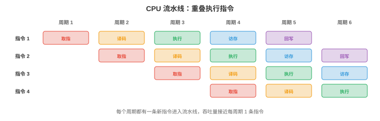
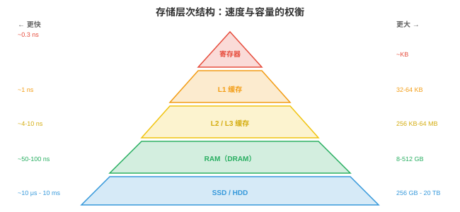

# 计算机体系结构

*计算机体系结构研究如何构建执行指令的机器。本节涵盖数制、逻辑门、CPU 设计、指令集体系结构、流水线、存储层次结构和虚拟内存，这是每个程序、框架和 AI 模型最终运行的硬件基础。*

- 每个神经网络、每个训练循环、每次推理调用，最终都会变成流过晶体管的一串电信号。对严肃的机器学习从业者而言，理解硬件不是可选项：它解释了为何矩阵乘法很快、为何内存是瓶颈、为何 GPU 主导 AI 训练，以及为何缓存友好的代码能比朴素代码快 100 倍。

## 数制

- 计算机把一切表示为**二进制（binary）**，即 0 和 1 的序列。每一位数字是一个**比特（bit）**。8 个比特构成一个**字节（byte）**。二进制数 $b_{n-1} b_{n-2} \ldots b_1 b_0$ 的值为 $\sum_{i=0}^{n-1} b_i \cdot 2^i$。

- 例如，$1011_2 = 1 \cdot 8 + 0 \cdot 4 + 1 \cdot 2 + 1 \cdot 1 = 11_{10}$。

- **十六进制（hexadecimal）**，基数为 16，是二进制的紧凑记法。每个十六进制位表示 4 个比特：$0\text{-}9$ 对应 $0000\text{-}1001$，$A\text{-}F$ 对应 $1010\text{-}1111$。因此，$\text{0xFF} = 1111\,1111_2 = 255_{10}$。内存地址和颜色代码通常以十六进制书写。

- **二进制补码（two's complement）**表示有符号整数。对一个 $n$ 位数，最高有效位的权重是 $-2^{n-1}$，而非 $+2^{n-1}$。8 位补码的范围为 $-128$ 至 $+127$。要取一个数的相反数：翻转所有位并加 1。这种表示使加法和减法使用同一硬件电路，这正是它被普遍采用的原因。

- **IEEE 754 浮点数（floating point）**将实数表示为 $(-1)^s \times 1.m \times 2^{e-\text{bias}}$，其中 $s$ 是符号位，$m$ 是尾数，小数部分，$e$ 是带偏置的指数。


    - **float32**，单精度：1 个符号位 + 8 个指数位 + 23 个尾数位 = 32 位。范围：$\approx \pm 3.4 \times 10^{38}$；精度：$\approx 7$ 个十进制数字。
    - **float64**，双精度：1 个符号位 + 11 个指数位 + 52 个尾数位 = 64 位。范围：$\approx \pm 1.8 \times 10^{308}$；精度：$\approx 15$ 个十进制数字。
    - **float16**，半精度：1 + 5 + 10 = 16 位。范围和精度有限，但内存与带宽消耗减半。它广泛用于机器学习训练，混合精度，第 6 章。
    - **bfloat16**：1 + 8 + 7 = 16 位。指数范围与 float32 相同，但精度更低。Google 专为机器学习设计了它：完整指数范围防止训练期间溢出，而降低的精度对梯度更新可以接受。

- 浮点运算**并不精确（not exact）**。在 float64 中，$0.1 + 0.2 \neq 0.3$，结果是 $0.30000000000000004$。原因是 $0.1$ 没有精确的二进制表示，正如 $1/3$ 没有精确的十进制表示。在数百万次操作，例如梯度下降，中累积这些误差，可能导致数值不稳定；因此才会有损失缩放，第 6 章，和 Kahan 求和等技术。

## 逻辑门

- 所有计算都可归结为**逻辑门（logic gates）**：实现布尔运算，即第 1 节命题逻辑，的物理电路。

- 基本逻辑门：
    - **与（AND）**：仅当两个输入均为 1 时，输出为 1。
    - **或（OR）**：至少一个输入为 1 时，输出为 1。
    - **非（NOT）**，反相器：翻转输入。
    - **与非（NAND）**，非与：通用门。只用 NAND 门就能构建任意其他门，因此 NAND 是数字电路的基本构件。
    - **异或（XOR）**，排他或：输入不同时输出为 1。它对加法至关重要，二进制加法的和位是 XOR，也用于密码学。

- **半加器（half adder）**使用 XOR，求和，和 AND，进位，来相加两个单比特。**全加器（full adder）**将两个比特与一个输入进位相加，多个全加器串联形成 $n$ 位加法器。这就是 CPU 执行整数加法的方式：一串简单逻辑门。

- **多路复用器（multiplexer, MUX）**依据控制信号选择多个输入之一。使用 $n$ 个控制位时，它可从 $2^n$ 个输入中选择。多路复用器是 if-else 链的硬件等价物，在 CPU 数据通路中广泛用于路由数据。

- 现代处理器含有数十亿个晶体管，每个晶体管都像微型开关一样工作。晶体管要么导通，表示 1，要么关闭，表示 0。逻辑门由晶体管构成，加法器由逻辑门构成，ALU 由加法器构成，CPU 由 ALU 构成。整套计算层次都建立在此基础上。

## CPU 体系结构

- **中央处理器（Central Processing Unit, CPU）**执行指令。其核心部件包括：

    - **ALU**，算术逻辑单元：执行整数算术，加、减、乘，和逻辑运算，与、或、异或、移位。真正的计算在此发生；它由上文的逻辑门构建。

    - **寄存器（registers）**：CPU 内部微小、极快的存储位置。现代 CPU 有数十个通用寄存器，每个保存一个字，64 位 CPU 上为 64 位。寄存器是系统中最快的内存：访问约需 0.3 纳秒。

    - **程序计数器（Program Counter, PC）**：保存下一条待执行指令的内存地址。

    - **控制单元（Control Unit）**：解码指令并协调数据通路，告诉 ALU 执行什么操作以及使用哪些寄存器。

- **指令周期（instruction cycle）**，取指、译码、执行，每秒重复数十亿次：

    1. **取指（Fetch）**：从 PC 所保存地址的内存中读取指令。
    2. **译码（Decode）**：确定指令做什么，加法、从内存加载、分支？以及它使用哪些操作数。
    3. **执行（Execute）**：执行操作，ALU 计算、内存访问或分支。
    4. PC 加 1，除非该指令是分支或跳转。

- 主频为 4 GHz 的 CPU 每秒执行 40 亿个周期。每个周期耗时 0.25 纳秒。在这段时间里，光约传播 7.5 厘米，因此芯片物理尺寸很重要：信号无法在一个周期内穿过大芯片。

## 指令集体系结构

- **指令集体系结构（Instruction Set Architecture, ISA）**是硬件与软件之间的契约：它定义 CPU 所理解的指令、寄存器集合、内存模型和编码格式。

- **CISC**，复杂指令集计算机：指令可以复杂、变长，并且可直接访问内存。单条指令可能将两个内存值相乘并保存结果。**x86**，Intel/AMD，是占主导地位的 CISC ISA，为大多数桌面和服务器提供动力。它的向后兼容性，现代 x86 CPU 仍可运行 20 世纪 80 年代的代码，既是优势也是负担。

- **RISC**，精简指令集计算机：指令简单、定长，且只操作寄存器。内存访问需要独立的加载/存储指令。更简单的指令支持更高时钟频率和更容易的流水线化。

    - **ARM**：移动设备的主导 RISC ISA，也越来越多地用于服务器和笔记本电脑，Apple M 系列芯片即 ARM。ARM 的能效使其适合电池供电和受散热限制的设备。
    - **RISC-V**：开源 RISC ISA。任何人均可设计 RISC-V 芯片而无需授权费。它在嵌入式系统、研究和 AI 加速器中日益普及。

- CISC 与 RISC 的差别已变得模糊：现代 x86 CPU 在内部会把复杂 CISC 指令解码为更简单的微操作，实质上内部为 RISC，从而兼得两种体系的优点。

## 流水线

- 没有流水线时，CPU 会在开始下一条指令前完整完成当前指令。这会浪费硬件：ALU 执行时，取指和译码单元处于闲置状态。



- **流水线（pipelining）**像装配线一样，让指令执行重叠。当指令 1 在执行时，指令 2 在译码，指令 3 在取指。五级流水线，取指、译码、执行、内存访问、回写，可以同时有 5 条指令在途。

- 吞吐量接近每周期一条指令，尽管每条指令完成需要 5 个周期。这与机器学习中的流水线原理相同：数据并行使计算和通信重叠，第 6 章。

- **冒险（hazards）**是使流水线失效的情形：

    - **数据冒险（data hazard）**：指令 2 需要指令 1 尚未产生的结果。“Add R1, R2, R3”之后紧接“Sub R4, R1, R5”，第二条指令需要 R1，而第一条仍在计算它。**转发（forwarding）**，旁路，直接将结果从一个流水级路由到另一个流水级，无需等待回写阶段，从而解决该问题。

    - **控制冒险（control hazard）**：分支指令，if-else，意味着 CPU 在分支结果确定前不知道下一条该取哪条指令。**分支预测（branch prediction）**猜测分支走向，并沿预测路径推测性取指。现代预测器通过历史表和类似神经网络的模式匹配达到超过 95% 的准确率。一次错误预测约损失 15 个周期，流水线必须清空并重启。

    - **结构冒险（structural hazard）**：两条指令同时需要同一硬件资源，例如都需要内存端口。可通过复制资源或插入停顿解决。

## 存储层次结构

- 计算机内存存在根本张力：快内存昂贵且容量小，便宜内存缓慢且容量大。**存储层次结构（memory hierarchy）**利用**局部性（locality）**弥合这一差距：程序倾向反复访问相同数据，时间局部性，并访问相邻数据，空间局部性。



- 从最快到最慢的层次：

    - **寄存器**：约 0.3 ns 访问，总容量约 KB，位于 CPU 内。
    - **L1 缓存**：约 1 ns，每核心 32-64 KB，分为指令缓存和数据缓存。
    - **L2 缓存**：约 4 ns，每核心 256 KB-1 MB。
    - **L3 缓存**：约 10 ns，跨核心共享的 8-64 MB。
    - **RAM（DRAM）**：约 50-100 ns，8-512 GB，主内存。
    - **SSD**：约 10-100 μs，256 GB-8 TB，持久化存储。
    - **HDD**：约 5-10 ms，1-20 TB，机械式存储，随机访问极慢。

- 寄存器和 RAM 的速度差约为 300 倍；寄存器和磁盘的差距约为 30,000,000 倍。缓存层次隐藏了该差距：若 CPU 所需数据位于 L1 缓存，称为**缓存命中（cache hit）**，访问就很快；若不在，称为**缓存未命中（cache miss）**，CPU 必须停顿，等待从更慢层级取回数据。

- **缓存相联度（cache associativity）**决定内存地址可存放在缓存的哪个位置：
    - **直接映射（direct-mapped）**：每个地址恰好映射到一条缓存行。简单，但会产生冲突。
    - **全相联（fully associative）**：任意地址可存放在任意位置。灵活，但搜索成本高。
    - **组相联（set-associative）**，$k$ 路：每个地址映射到一组 $k$ 个位置。它是实际 CPU 采用的折中方案，通常为 4 路或 8 路。

- **缓存一致性（cache coherence）**确保所有 CPU 核心看到一致的内存视图。当核心 1 写入核心 2 已缓存的地址时，一致性协议，例如 MESI，会使核心 2 的副本失效或更新它。它对并发编程，第 4 节，至关重要，也是共享内存并行困难的原因之一。

- 对机器学习从业者，存储层次结构解释了为何：
    - 矩阵操作应顺序访问内存，行主序与列主序布局很重要。
    - 批大小会影响性能：更大批次可分摊内存延迟。
    - 混合精度，float16/bfloat16，使有效内存带宽翻倍，而带宽往往就是瓶颈。

## 虚拟内存

- **虚拟内存（virtual memory）**让每个进程都仿佛拥有自己的连续大内存空间，尽管物理 RAM 有限且由多个进程共享。

- 地址空间被划分为固定大小的**页（pages）**，通常为 4 KB。**页表（page table）**把虚拟页号映射为物理页框号。程序访问虚拟地址 0x1234 时，CPU 通过查找页表将其转换为物理地址。

- **转换后备缓冲器（Translation Lookaside Buffer, TLB）**是页表项的缓存。由于页表位于 RAM 中，速度较慢，TLB 在快速硬件中保存最近使用的转换。TLB 未命中需要在内存中遍历页表，耗费数百个周期。

- 当程序访问不在物理 RAM 中的页面时，会发生**缺页（page fault）**。操作系统从磁盘加载该页，换页，这需要数百万个周期。过多的缺页，称为**颠簸（thrashing）**，会严重破坏性能。这正是机器学习训练需要足够 RAM 来容纳模型、优化器状态和合理批量数据的原因。

- **页面置换（page replacement）**算法在 RAM 已满时决定逐出哪一页：
    - **LRU**，最近最少使用：逐出最长时间未被访问的页面。它对大多数工作负载在实践中接近最优。硬件用**时钟算法（clock algorithm）**近似实现，即带引用位的循环列表。
    - **FIFO**：逐出最早进入的页面。简单，但可能逐出频繁使用的页。
    - **最优（Optimal）**，Bélády：逐出未来最长时间不会使用的页。它无法实现，需要知道未来，却可作为理论基准。

- 虚拟内存还提供**隔离（isolation）**：每个进程都有独立的虚拟地址空间。一个进程中的 bug 不能破坏另一个进程的内存，因为它们的虚拟地址映射到不同物理页框。这是操作系统安全性与稳定性的基础。

## I/O、中断与 DMA

- CPU 需要与外部世界通信：磁盘、网卡、键盘和 GPU。这就是**I/O 子系统（I/O subsystem）**。

- **程序控制 I/O（programmed I/O）**，轮询：CPU 在循环中反复检查设备状态寄存器，等待数据就绪。它简单，却使 CPU 周期空转而非完成有用工作。

- **中断驱动 I/O（interrupt-driven I/O）**：数据就绪时，设备发送硬件**中断（interrupt）**。CPU 继续正常执行，直至中断到达；随后运行**中断处理程序（interrupt handler）**，即内核函数，处理数据。它远比轮询高效，因为 CPU 无需在等待时空闲。

- 中断机制：
    1. 设备经由硬件线路发出中断信号。
    2. CPU 完成当前指令，将当前状态，寄存器与程序计数器，保存到栈上。
    3. CPU 在**中断向量表（interrupt vector table）**中查找中断处理程序地址，该表是每种中断类型对应一个函数指针的表。
    4. 处理程序在内核模式下运行，处理 I/O 后返回。
    5. CPU 恢复已保存状态，并继续被中断的程序。

- 这与上下文切换，第 3 节，采用同样的保存/恢复模式，只是它由硬件而非定时器触发。

- **DMA**，直接内存访问：对于大数据传输，磁盘读取、网络数据包、GPU 内存复制，让 CPU 逐字节复制数据是浪费。**DMA 控制器（DMA controller）**无需 CPU 参与，直接在设备和 RAM 之间传输数据。CPU 设置传输，源、目的地、大小，DMA 控制器执行它，完成后 CPU 收到中断。

- DMA 对机器学习至关重要：调用 `model.to('cuda')` 时，数据经 PCIe 总线通过 DMA 从系统 RAM 传输到 GPU 内存。训练时，跨 GPU 的梯度同步使用基于 DMA 的 RDMA，远程 DMA，进行高带宽、低延迟传输，第 6 章。

- **总线（bus）**连接 CPU、内存和 I/O 设备。现代系统使用 **PCIe**，高速外设互连，连接高速设备，GPU、NVMe SSD、网卡。每个 x16 插槽的 PCIe 4.0 带宽约为 32 GB/s；PCIe 5.0 将其翻倍。总线带宽往往是 GPU 训练的瓶颈：GPU 计算速度可能快于数据供给速度。

- **MMIO**，内存映射 I/O：设备寄存器被映射到内存地址。CPU 使用普通加载/存储指令读写这些地址，硬件将访问路由到设备而非 RAM。它将内存与 I/O 访问统一为一种机制，简化硬件和软件。

## 编程任务（使用 CoLab 或 Notebook）

1. 探索 IEEE 754 浮点表示。将浮点数转换为二进制表示，并观察符号、指数和尾数字段。
```python
import struct

def float_to_bits(f):
    """Show the IEEE 754 binary representation of a float32."""
    packed = struct.pack('>f', f)
    bits = ''.join(f'{byte:08b}' for byte in packed)
    sign = bits[0]
    exponent = bits[1:9]
    mantissa = bits[9:]
    return sign, exponent, mantissa

for val in [1.0, -1.0, 0.1, 0.5, 3.14, float('inf'), float('nan')]:
    s, e, m = float_to_bits(val)
    print(f"{val:>10}  sign={s}  exp={e} ({int(e, 2) - 127:>4d})  mantissa={m[:10]}...")
```

2. 模拟直接映射缓存。为一串内存访问跟踪命中和未命中。
```python
def simulate_cache(accesses, cache_size=8, block_size=1):
    """Simulate a direct-mapped cache."""
    cache = [None] * cache_size
    hits, misses = 0, 0

    for addr in accesses:
        cache_line = addr % cache_size
        if cache[cache_line] == addr:
            hits += 1
            status = "HIT "
        else:
            misses += 1
            cache[cache_line] = addr
            status = "MISS"
        print(f"  Access {addr:3d} → line {cache_line}: {status}")

    print(f"\nHits: {hits}, Misses: {misses}, Hit rate: {hits/(hits+misses):.1%}")

# Sequential access (good locality)
print("Sequential access:")
simulate_cache([0, 1, 2, 3, 4, 5, 6, 7, 0, 1, 2, 3])

# Strided access (conflict misses)
print("\nStrided access (stride = cache size):")
simulate_cache([0, 8, 0, 8, 0, 8])
```

3. 演示为何浮点算术不满足结合律。展示 $(a + b) + c \neq a + (b + c)$ 的情形。
```python
import jax.numpy as jnp

a = jnp.float32(1e8)
b = jnp.float32(1.0)
c = jnp.float32(-1e8)

left = (a + b) + c   # (1e8 + 1) + (-1e8)
right = a + (b + c)  # 1e8 + (1 + (-1e8))

print(f"(a + b) + c = {left}")   # should be 1.0
print(f"a + (b + c) = {right}")  # might lose the 1.0
print(f"Equal: {left == right}")
print(f"\nThe 1.0 is lost when added to 1e8 because float32 has only ~7 digits of precision")
```
