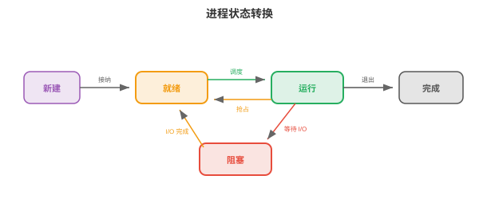
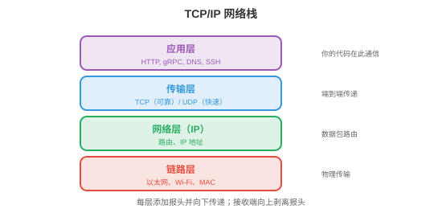
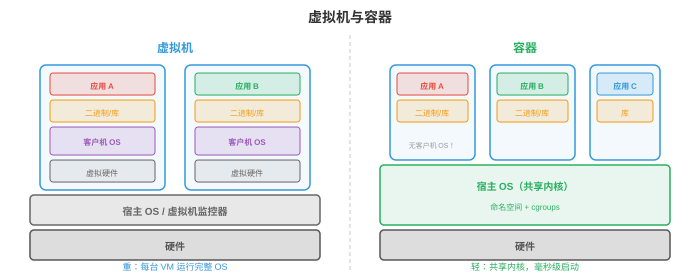

# 操作系统

*操作系统是硬件与应用程序之间的软件层，负责管理资源、提供抽象并强制隔离。本节涵盖操作系统的职责、进程、线程、CPU 调度、内存管理、文件系统和系统调用。*

- 没有操作系统的计算机，就像没有厨师的厨房：食材，硬件，虽然都在，却没有人协调谁用炉子、餐具放在哪里，以及如何避免两个人同时抢同一把刀。**操作系统（OS）**就是这个协调者。

- 对机器学习从业者而言，操作系统概念解释了：为何 `nvidia-smi` 会按进程显示 GPU 内存使用量、为何训练会因“out of memory”崩溃、为何 `fork()` 会复制 Python 进程，以及为何 Docker 容器能提供隔离环境。

## 操作系统的职责

- 操作系统有三项核心职责：

    - **抽象（abstraction）**：以整洁接口隐藏硬件复杂性。程序读写“文件”时不必知道底层存储是 SSD、HDD 还是网络驱动器；它们分配“内存”时不必管理物理 RAM 芯片；它们运行在“CPU”上时不必担心中断和缓存一致性。

    - **资源管理（resource management）**：多个程序共享 CPU、内存、磁盘和网络。操作系统决定谁在何时获得什么资源、获得多久。公平高效的分配策略使系统保持响应。

    - **隔离与保护（isolation and protection）**：程序不能彼此干扰。浏览器中的 bug 不应使内核崩溃；恶意程序不应读取其他程序的密码。操作系统借助硬件支持，特权级和虚拟内存，强制实施边界。

## 进程

- **进程（process）**是正在运行的程序，是操作系统的基本工作单元。每个进程拥有：

    - **代码（code）**，只读的程序指令。
    - **数据（data）**，全局变量和堆分配。
    - **栈（stack）**，函数调用帧和局部变量。
    - **状态（state）**，寄存器值、程序计数器、打开的文件等。

- **进程控制块（Process Control Block, PCB）**是操作系统用于跟踪进程的数据结构。它存储进程 ID，PID、状态、程序计数器、寄存器内容、内存映射、打开的文件描述符和调度优先级。操作系统从一个进程切换到另一个进程时，将当前进程状态保存到其 PCB，并加载下一个进程状态。这是一次**上下文切换（context switch）**。

- 上下文切换代价高：保存和恢复寄存器、清空缓存、使 TLB 条目失效均需微秒量级。在运行数千个进程的系统中，开销可能显著。这正是每请求一个进程的服务器架构，例如旧版 Apache，被基于线程或事件驱动的架构取代的原因。

- Unix 通过 `fork()` 和 `exec()` 创建进程：

    - `fork()` 创建当前进程的**副本（copy）**。子进程获得父进程内存、文件描述符和状态的副本。两个进程都从同一位置继续执行，但子进程中 `fork()` 返回 0，父进程中返回子进程 PID。

    - `exec()` 用新程序替换当前进程的代码。调用 `fork()` 后，子进程通常调用 `exec()` 运行另一个程序。

    - 这种先 fork 再 exec 的模型很优雅：创建新进程，fork，和加载新程序，exec，是可独立定制的两个操作。在 fork 与 exec 之间，子进程可以重定向 I/O、修改环境变量或放弃特权。



- **进程状态（process states）**：进程处于以下状态之一：
    - **运行（Running）**：当前正在某个 CPU 核心上执行。
    - **就绪（Ready）**：等待 CPU 核心，可运行但尚未被调度。
    - **阻塞（Blocked）**，等待：在某个事件发生前无法继续，I/O 完成、获得锁或定时器到期。
    - **终止（Terminated）**：已完成执行，等待父进程收集退出状态。

## 线程

- **线程（thread）**是进程内轻量的执行单元。一个进程中的所有线程共享相同的代码、数据和堆，但各自拥有自己的栈和寄存器状态。

- 相对多个进程的优势是：线程共享内存，因此通信很快，只需读写共享变量。进程则需要进程间通信，管道、套接字、共享内存映射，速度更慢且更复杂。

- 缺点是共享内存很危险。两个线程同时写同一变量会造成**竞争条件（race condition）**，结果取决于哪个线程先运行。这引出了第 4 节讨论的同步问题。

- **内核线程（kernel threads）**由操作系统调度器管理。每个线程独立调度到 CPU 核心上。创建和切换内核线程涉及系统调用，开销与进程上下文切换相近，但较小。

- **用户线程（user threads）**，绿色线程，由用户空间的运行时库管理，对操作系统不可见。它们创建和切换更便宜，无需系统调用；但一个用户线程的阻塞操作会阻塞进程内全部线程，因为操作系统只看到一个内核线程。

- 现代系统使用**混合模型（hybrid models）**：将许多用户线程映射到较少的内核线程上，M:N 线程模型。Go 的 goroutine 和 Erlang 的进程都是由语言运行时调度到 OS 线程上的用户级线程。

- **线程池（thread pools）**预先创建固定数量的线程以等待任务。任务到来时分配给空闲线程。这避免了为每项任务创建和销毁线程的开销。Web 服务器、数据库引擎和机器学习推理服务器都使用线程池。

## CPU 调度

- **调度器（scheduler）**决定每时刻由哪个进程/线程在哪个 CPU 核心上运行。目标是最大化 CPU 利用率、最小化交互任务的响应时间、最大化批处理任务吞吐量，并确保公平。

- **先来先服务（First Come First Served, FCFS）**：按到达顺序运行进程。它简单，却有**护航效应（convoy effect）**：一个长运行进程阻塞其后全部短进程。

- **最短作业优先（Shortest Job First, SJF）**：先运行最短的进程。它可证明地最小化平均等待时间，但需要预先知道作业时长，一般不可能。其抢占式版本**最短剩余时间优先（Shortest Remaining Time First, SRTF）**会在有更短作业到来时中断当前作业。

- **时间片轮转（Round Robin, RR）**：每个进程获得固定**时间片（time quantum）**，例如 10 ms，随后被抢占并移到队列尾部。它公平且响应好，但时间片很关键：过小会造成大量上下文切换，过大则退化为 FCFS。

- **优先级调度（priority scheduling）**：每个进程有优先级，高优先级进程先运行。危险是**饥饿（starvation）**：若高优先级进程持续到来，低优先级进程可能永远不运行。**老化（aging）**解决此问题：进程等待越久，其优先级越高。

- **多级反馈队列（Multilevel Feedback Queues, MLFQ）**：包含多个具有不同优先级和时间片的队列。新进程从最高优先级队列，短时间片，开始；若进程用完整个时间片，CPU 密集型，则被降至低优先级队列，更长时间片。交互进程会在用完时间片前因 I/O 而阻塞，因此自然留在高优先级队列。它无需预先知道作业类型即可适应工作负载。

- **完全公平调度器（Completely Fair Scheduler, CFS）**是 Linux 调度器。它维护一棵按“虚拟运行时间”排序的红黑树，红黑树是平衡二叉搜索树，虚拟运行时间即进程已消耗的 CPU 时间。虚拟运行时间最小的进程下一个运行。这确保长期看每个进程都获得公平份额。CFS 每次调度决策为 $O(\log n)$。

## 内存管理

- 操作系统管理物理 RAM，将其分配给进程，并在不再需要时回收。

- **分页（paging）**，见第 2 节，将虚拟内存划分为固定大小的页，将物理内存划分为页框。页表把页映射到页框。因为所有页大小相同，分页消除了外部碎片，分配间被浪费的空间。

- **请求分页（demand paging）**只在页面首次被访问时才将其加载至 RAM，而非进程启动时。这节省内存：一个有 1 GB 代码的程序在典型运行中可能只使用 50 MB，其余部分永远不会被加载。

- RAM 已满又需要新页时，操作系统必须**逐出（evict）**已有页面。第 2 节的**页面置换（page replacement）**算法，LRU、FIFO、时钟算法，决定逐出哪一页。好的置换最小化缺页；糟糕的置换导致颠簸。

- **分段（segmentation）**把内存划分为变长段，代码、数据、栈、堆，每段有自己的基地址和长度。分段提供逻辑组织，分页提供物理管理。现代系统极少使用分段，主要用于保护，并依赖分页管理内存。

- **堆（heap）**保存动态分配的内存，C 中为 `malloc`/`free`，Java 中为 `new`，Python 中为隐式分配。操作系统向进程提供大块内存，**内存分配器（memory allocator）**，例如 `glibc malloc`、`jemalloc`、`tcmalloc`，再将其细分为较小分配。分配器设计影响性能：碎片浪费空间，线程间竞争浪费时间。

## 文件系统

- **文件系统（file system）**将持久化存储，SSD、HDD，上的数据组织为由名称构成层次结构的文件和目录。

- **inode**，索引节点，存储文件元数据：大小、所有权、权限、时间戳和磁盘数据块指针。文件名保存在目录中，目录将名称映射到 inode 编号。这种分离意味着一个文件可有多个名称，称为**硬链接（hard links）**，指向同一 inode。

- **FAT**，文件分配表：用于 USB 驱动器和 SD 卡的简单文件系统。表将每个簇，块，映射到文件中的下一个簇，形成链表。它简单，但对权限、日志和大文件的支持较差。

- **ext4**：默认 Linux 文件系统。它使用 inode 的直接、一级间接、二级间接和三级间接块指针来处理任意大小的文件。它支持**区段（extents）**，连续的数据块范围，以高效处理大文件。最大文件大小为 16 TB，最大分区为 1 EB。

- **日志（journaling）**防止崩溃导致损坏。修改文件系统结构前，先将变更写入**日志（journal）**。若系统在操作中崩溃，重启时会重放日志，以完成或撤销该操作。没有日志时，写入中崩溃可能留下不一致的文件系统，例如文件数据块已更新但 inode 未更新，或反过来。

- **基于 B 树的文件系统（B-tree based file systems）**，Btrfs、ZFS，使用 B 树，平衡搜索树，组织数据与元数据，从而支持高效搜索、写时复制快照和用于数据完整性的内置校验和。这与数据库索引使用的是同一种 B 树。

## 系统调用与内核模式

- **系统调用（system call）**是用户程序与操作系统内核之间的接口。程序需要完成特权操作，读取文件、分配内存、创建进程、发送网络数据包，时会发起系统调用。

- CPU 在两种模式下运行：
    - **用户模式（User mode）**：受限。程序可执行自己的代码并访问自己的内存，但不能直接访问硬件、其他进程的内存或操作系统数据结构。
    - **内核模式（Kernel mode）**：不受限。操作系统内核可访问全部硬件和内存。系统调用是从用户模式进入内核模式的受控入口。

- 程序调用 `read()` 时，会发生以下过程：
    1. 程序将参数放入寄存器并触发**陷阱（trap）**，软件中断。
    2. CPU 切换到内核模式，并跳转至系统调用处理程序。
    3. 内核验证参数、执行 I/O 操作，并将数据复制到用户缓冲区。
    4. 内核切回用户模式并返回结果。

- 常见系统调用：`open`、`read`、`write`、`close`，文件；`fork`、`exec`、`wait`、`exit`，进程；`mmap`、`brk`，内存；`socket`、`bind`、`listen`、`accept`，网络。

- **中断（interrupts）**是迫使 CPU 暂停当前工作并运行中断处理程序，位于内核中，的硬件信号。按下键盘键、网络数据包到达或定时器滴答均会产生中断。定时器中断尤为重要：它使操作系统能抢占正在运行的进程并切换到另一进程，即抢占式多任务。

## 网络基础

- 网络栈是使机器间通信成为可能的操作系统子系统。理解它能够解释分布式训练如何同步梯度、模型服务如何处理请求，以及为何延迟很重要。



- **TCP/IP 模型（TCP/IP model）**将网络组织为多层，每一层向其上层提供抽象：

    - **链路层（Link layer）**：处理单一物理链路上的通信，以太网、Wi-Fi，处理 MAC 地址和帧。
    - **网络层（Network layer, IP）**：将数据包从源地址跨多个网络路由至目的地。每台机器有一个**IP 地址（IP address）**，如 IPv4 的 192.168.1.1，或 128 位 IPv6 地址。路由器根据目的 IP 逐跳转发数据包。
    - **传输层（Transport layer, TCP/UDP）**：提供应用程序之间的端到端通信。
    - **应用层（Application layer）**：应用程序直接使用的 HTTP、DNS、gRPC 等协议。

- **TCP**，传输控制协议，提供可靠、有序的传递。它建立连接，三次握手：SYN、SYN-ACK、ACK，保证全部数据按序到达，使用序列号和确认，重传丢失的数据包，并控制发送速率以避免压垮网络，称为**拥塞控制（congestion control）**。代价是延迟：握手增加一次往返，重传增加延迟。

- **UDP**，用户数据报协议，提供不可靠、无序的传递。没有握手、重传和顺序保证，其延迟远低于 TCP。它用于速度比可靠性更重要的场景：视频流、在线游戏、DNS 查询。在机器学习中，一些梯度同步协议为降低延迟使用基于 UDP 的 RDMA。

- **套接字（sockets）**是操作系统的网络通信 API。**套接字（socket）**是由 IP 地址和端口号标识的端点。服务器创建套接字，将其绑定到端口，例如 HTTP 使用 80，监听连接并接受连接。客户端创建套接字并连接到服务器的地址:端口。随后数据通过套接字读写，如同文件。

- **DNS**，域名系统，将人类可读名称，google.com，转换为 IP 地址，142.250.80.46。它是分布式、分层数据库：机器询问本地解析器，解析器询问根服务器，根服务器为每个域委派权威服务器。

- **HTTP**，超文本传输协议，是 Web 的请求-响应协议。客户端发送请求，方法 + URL + 报头 + 可选主体，服务器发送响应，状态码 + 报头 + 主体。机器学习模型服务，例如 TensorFlow Serving、Triton，将模型暴露为 HTTP 或 gRPC 端点。

- **延迟与带宽（latency vs bandwidth）**：延迟是一个数据包从源到目的地的时间，取决于物理距离和网络跳数；带宽是数据率，每秒可传输多少字节。高带宽高延迟连接，卫星互联网，可以传输大量数据，但每个字节到达都要很久。对分布式训练，**延迟**影响同步屏障，所有 GPU 必须等待最慢者，**带宽**影响大梯度张量传输，第 6 章。

## 虚拟化与容器

- **虚拟化（virtualisation）**在一台物理机器上运行多个操作系统。**虚拟机监控器（hypervisor）**，VMware、KVM、Xen，创建**虚拟机（virtual machines, VMs）**，每台虚拟机均有自己的虚拟 CPU、内存、磁盘和网络接口。每台 VM 运行完整操作系统，客户机 OS，且认为自己拥有专用硬件。

- VM 提供强隔离，一台 VM 崩溃不影响其他 VM，且很灵活，可在同一机器运行 Linux 与 Windows、在物理主机间迁移 VM。代价是开销：每台 VM 都运行完整 OS 内核，消耗内存和 CPU 来完成与宿主 OS 重复的 OS 操作。



- **容器（containers）**，Docker、Podman，提供更轻量的替代方案。容器不是虚拟化整个硬件，而是共享宿主 OS 内核，并借助内核特性隔离进程：

    - **命名空间（Namespaces）**隔离进程可见的内容：每个容器有自己的进程树视图，PID 命名空间、网络接口，网络命名空间、文件系统挂载点，挂载命名空间和主机名，UTS 命名空间。容器内的进程无法看到其他容器进程。

    - **Cgroups**，控制组，限制进程可使用的资源：CPU 时间、内存、磁盘 I/O、网络带宽。容器不能消耗超过其 cgroup 允许的资源，从而避免一个容器使其他容器饥饿。

- 容器以毫秒级启动，无需引导 OS，开销极小，共享内核，并由**Dockerfile**定义，其中指定基础镜像、依赖与命令。因此容器具有可复现性：`docker build` 可在任何地方生成相同环境。

- 对机器学习，容器解决“在我的机器上能运行”的问题。具有指定版本 CUDA、cuDNN、PyTorch 和 Python 的训练环境被打包为容器镜像，任何人可在任意机器精确复现该环境。云训练平台，AWS SageMaker、GCP Vertex AI，在容器中运行训练作业。

- **Kubernetes**，K8s，在大规模上编排容器：它将容器调度到机器集群，重启失败容器，根据负载扩缩容，并管理容器间网络。大规模机器学习服务，数千模型副本处理数百万请求，运行在 Kubernetes 上。

## 安全基础

- 操作系统通过多种机制实施安全：

- **权限（Permissions）**：每个文件都有所有者、组和权限位，所有者、组和其他用户的读/写/执行。进程带着启动它的用户身份，UID，运行，且只能访问权限位允许的文件。**root** 用户，UID 0，绕过全部权限检查，因此以 root 运行很危险。

- **特权分离（Privilege separation）**：进程以完成任务所需的最小特权运行。Web 服务器不需要 root 访问；应以受限用户运行，该用户仅能读取 Web 文件并绑定端口 80。若服务器被攻破，攻击者的访问受限于该用户能做什么。

- **沙箱（Sandboxing）**：在文件权限之外进一步限制进程可做的事。**seccomp**，Linux，限制进程可发起的系统调用；**AppArmor** 与 **SELinux**定义强制访问控制策略。容器组合命名空间、cgroups 和 seccomp，实现多层隔离。

- **地址空间布局随机化（Address Space Layout Randomisation, ASLR）**：每次程序运行时随机化栈、堆和库的内存位置。它使攻击者更难利用内存损坏 bug，缓冲区溢出，因为攻击者无法预测代码或数据所在内存位置。

- 安全是系统范围的关切：链条强度取决于最弱环节。模型服务系统需要安全网络通信，TLS/HTTPS、经身份验证的 API 访问，API 密钥、OAuth、输入验证，防止对抗输入，以及隔离执行，采用最小特权容器。

## 编程任务（使用 CoLab 或 Notebook）

1. 探索进程创建。使用 Python 的 `os.fork()`，仅 Unix，创建子进程，并观察父进程和子进程均从同一位置继续执行。
```python
import os

pid = os.fork()

if pid == 0:
    # Child process
    print(f"Child: my PID is {os.getpid()}, parent PID is {os.getppid()}")
else:
    # Parent process
    print(f"Parent: my PID is {os.getpid()}, child PID is {pid}")
    os.wait()  # wait for child to finish
```

2. 模拟时间片轮转调度。给定一组具有运行时间的进程，模拟调度并计算平均等待时间。
```python
def round_robin(processes, quantum=3):
    """Simulate round-robin scheduling.
    processes: list of (name, burst_time) tuples.
    """
    queue = [(name, burst, 0) for name, burst in processes]  # (name, remaining, wait)
    time = 0
    log = []

    while queue:
        name, remaining, waited = queue.pop(0)
        waited += (time - waited - (processes[[p[0] for p in processes].index(name)][1] - remaining))
        run_time = min(quantum, remaining)
        log.append(f"  t={time:3d}: {name} runs for {run_time} (remaining: {remaining - run_time})")
        time += run_time
        remaining -= run_time

        if remaining > 0:
            queue.append((name, remaining, time))
        else:
            log.append(f"  t={time:3d}: {name} DONE (turnaround: {time})")

    for line in log:
        print(line)

print("Round Robin (quantum=3):")
round_robin([("P1", 10), ("P2", 4), ("P3", 6)], quantum=3)
```

3. 使用 LRU 模拟页面置换。给定一串页面访问和固定数量页框，统计缺页次数。
```python
def lru_page_replacement(pages, n_frames):
    """Simulate LRU page replacement."""
    frames = []
    faults = 0

    for page in pages:
        if page in frames:
            frames.remove(page)
            frames.append(page)  # move to most recently used
            status = "HIT "
        else:
            faults += 1
            if len(frames) >= n_frames:
                evicted = frames.pop(0)  # remove least recently used
                status = f"MISS (evict {evicted})"
            else:
                status = "MISS (cold)"
            frames.append(page)
        print(f"  Page {page}: {status}  frames={frames}")

    print(f"\nTotal faults: {faults}/{len(pages)} ({faults/len(pages):.0%})")

print("LRU with 3 frames:")
lru_page_replacement([1, 2, 3, 4, 1, 2, 5, 1, 2, 3, 4, 5], n_frames=3)
```
