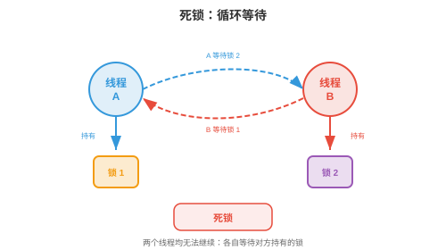
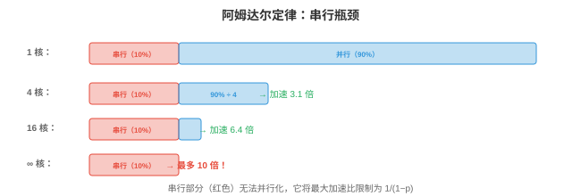

# 并发与并行

*并发与并行使程序能够同时处理多件事。本节涵盖并发和并行的区别、同步原语、经典并发问题、死锁、无锁数据结构、并行编程模型、异步编程与扩展定律，这些概念支撑着多线程服务器、分布式训练和每个现代应用程序。*

- 单个 CPU 核心一次执行一条指令。但现代系统拥有 8 个、64 个乃至数千个核心，GPU。即使在单核上，我们也希望处理多项任务：下载文件、渲染 UI 与处理用户输入并行推进。**并发（concurrency）**和**并行（parallelism）**是管理多项活动的两种策略。

!!! note "大白话"
    并发解决“多件事怎么安排着做”，并行解决“多件事能不能真的同时做”。

## 并发与并行


- **并发（concurrency）**关乎*管理（managing）*多项任务。任务通过交错执行来推进：任务 A 运行一会儿，接着任务 B，再回到 A。在单核上，并发制造了同时执行的假象。任务并非真正同时发生，而是轮流进行。

!!! note "大白话"
    单核并发像一个人来回切换几项工作，表面上都在推进，实际上同一时刻只做一件。

- **并行（parallelism）**关乎*执行（executing）*多项任务。使用 $n$ 个核心时，$n$ 个任务可以真正同时运行。并行需要多个硬件执行单元。

!!! note "大白话"
    并行需要多个执行单元，像多名工人各自同时干活，是真正的同时进行。

- 类比来说，并发是一名厨师在切菜和搅拌锅中食物间交替；并行是两名厨师各自同时完成一项任务。系统可以并发而不并行，单核、任务交错；可以并行而不并发，多个核心运行互不交互的独立程序；也可以两者兼具，多个核心运行会交互的交错任务。

!!! note "大白话"
    “轮流做”是并发，“多人同时做”是并行；现代程序常常两者一起用。

- 在机器学习中，并发出现在数据加载中，数据预处理与 GPU 计算重叠；并行出现在分布式训练中，多个 GPU 同时计算梯度，第 6 章。

!!! note "大白话"
    训练时可以一边准备下一批数据、一边计算当前批次，这是并发；多张 GPU 一起算梯度，这是并行。

## 同步原语

- 多个线程共享数据时，**同步（synchronisation）**防止竞争条件。竞争条件发生在结果依赖不可预测的线程执行顺序时。

!!! note "大白话"
    同步就是给共享数据定规矩，保证线程不会在同一时刻乱改，结果也不会靠运气决定。

- 考虑两个线程都递增共享计数器：`counter += 1`。它实际是三个操作：(1) 读取计数器，(2) 加 1，(3) 写回计数器。若两个线程读取相同值，例如 5，均加 1 且均写入 6，计数器最终为 6 而非正确的 7。一次递增丢失了。

!!! note "大白话"
    “加一”不是不可分割的一步；两个线程可能读到同一个旧值，后写入的人把前一个人的更新覆盖掉。

- **互斥锁（mutex）**，互斥锁定，确保同一时间仅一个线程访问临界区。线程进入临界区前**获取（acquires）**锁，结束后**释放（releases）**锁。其他尝试获取已持有锁的线程会阻塞，直至锁被释放。

!!! note "大白话"
    互斥锁像卫生间钥匙，同一时间只能一个线程进入关键区域，出来后别人才能用。

```
lock.acquire()
counter += 1      # only one thread at a time here
lock.release()
```

- 互斥锁是正确的，却引入**竞争（contention）**：若许多线程争用同一把锁，它们会等待而非计算。这限制了可扩展性。极端情形是所有线程都想要同一把锁，整个程序被串行化。

!!! note "大白话"
    锁能保正确，却可能让大家排队；锁争得越厉害，程序越像单线程。

- **信号量（semaphore）**推广了互斥锁。计数信号量维护一个计数器：`wait()` 递减计数器，若会变成负数则阻塞；`signal()` 递增它。初始化为 1 的信号量如同互斥锁；初始化为 $n$ 的信号量最多允许 $n$ 个线程同时进入临界区，适合数据库连接等资源池。

!!! note "大白话"
    信号量不是只有一把钥匙，而是维护多张名额牌；有 $n$ 张牌就允许最多 $n$ 个线程同时使用资源。

- **条件变量（condition variable）**让线程等待特定条件满足。线程释放一把锁，在条件变量上等待；另一个线程发出条件信号时，它会被唤醒。这避免忙等待，即在循环中反复检查条件、浪费 CPU。

!!! note "大白话"
    条件变量让线程“睡到条件满足再叫醒”，不用一直循环检查把 CPU 浪费掉。

- **管程（monitor）**将互斥锁、条件变量和共享数据封装为单一抽象。Java 的 `synchronized` 关键字和 Python 的 `threading.Condition` 实现了类似管程的语义。

!!! note "大白话"
    管程把数据和保护数据的锁、等待机制打包在一起，调用者不必自己拼装同步细节。

- **读写锁（read-write locks）**区分读者，读取不会修改数据，因而可共享访问，和写者，需要独占访问。多个读者可同时持锁，但一个写者会阻塞全部读者和其他写者。当读取远多于写入时，它最优，例如缓存模型服务的预测。

!!! note "大白话"
    读可以多人同时看，写必须独占改；当读很多、写很少时，这比一把普通互斥锁更有效。

## 经典并发问题

- **生产者-消费者（Producer-Consumer）**，有界缓冲区：生产者生成项目并将其放入固定大小缓冲区；消费者取出项目。挑战在于：缓冲区满时生产者必须等待，缓冲区空时消费者必须等待，双方都必须避免破坏缓冲区。

!!! note "大白话"
    生产者负责放货，消费者负责取货，中间的货架有限：满了不能再放，空了不能再取。

- 解决方案使用两个信号量，一个计数空槽，一个计数满槽，再加一把用于缓冲区自身的互斥锁。这是大多数消息队列、日志系统和数据流水线背后的模式。

!!! note "大白话"
    两个信号量分别记录“还有多少空位”和“已有多少货”，互斥锁保护货架结构不被同时改坏。

- **读者-写者（Readers-Writers）**：多个读者可同时读取，但写者需要独占访问。挑战在于公平性：若读者持续到来，写者可能饥饿，永远得不到访问。解决方案可优先读者、优先写者，或公平地交替。

!!! note "大白话"
    读者能并行看资料，但写者要清场修改；调度规则必须防止某一方一直被饿着。

- **哲学家就餐（Dining Philosophers）**：五名哲学家围桌而坐，彼此之间有五把叉子。每人需要两把叉子才能进餐。若五人同时拿起左边叉子，无人能拿起右边叉子，所有人都饥饿，死锁。解决方法包括：原子地拿起两把叉子、引入不对称性，一名哲学家先拿右叉，或使用服务员，信号量限制就餐者为 4。

!!! note "大白话"
    这个故事说明：大家各拿着一半资源、互相等另一半时，所有人都会卡死；资源获取顺序必须设计好。

## 死锁

- **死锁（deadlock）**发生在一组线程各自等待该组另一线程持有的资源时，形成依赖环，因而谁也无法继续。

!!! note "大白话"
    死锁就是“你等我的锁、我等你的锁”，形成闭环后谁都走不下去。



- 死锁的四个**必要条件（necessary conditions）**，必须同时满足：

    1. **互斥（Mutual exclusion）**：资源只能被一个线程持有。
    2. **占有并等待（Hold and wait）**：线程持有一个资源，同时等待另一个资源。
    3. **不可抢占（No preemption）**：不能强制从线程手中夺走资源。
    4. **循环等待（Circular wait）**：等待图中存在一个环。

!!! note "大白话"
    四个条件同时出现才会死锁：资源独占、拿着一个等另一个、不能被抢走、等待关系成环。

- **死锁预防（deadlock prevention）**破坏四个条件之一：
    - 消除循环等待：对资源施加全序。所有线程按相同顺序获取资源。若每个线程始终在锁 B 前获取锁 A，循环不可能形成。
    - 消除占有并等待：要求线程一次性，原子地，请求全部资源。

!!! note "大白话"
    预防的思路是提前破坏至少一个必要条件，例如统一加锁顺序，让等待环根本无法形成。

- **死锁避免（deadlock avoidance）**动态决定授予资源请求是否可能导致死锁。**银行家算法（Banker's algorithm）**维护每个线程的最大可能需求，仅授予使系统仍处于“安全状态”，即所有线程最终均能完成，的请求。该算法每个请求为 $O(n^2 m)$，$n$ 为线程数、$m$ 为资源类型数，对大多数真实系统过于昂贵。

!!! note "大白话"
    避免算法每次发资源前都先模拟未来，确认“发出去后大家仍能收尾”；安全但计算昂贵。

- **死锁检测（deadlock detection）**允许死锁发生，再检测它们，通过查找等待图中的环，并恢复，终止一个线程或回滚一个事务。

!!! note "大白话"
    检测策略接受少量风险，发现等待环后杀掉一个任务或撤销操作来解围。

- 实践中，大多数系统对常见情形使用预防，资源排序，对少见情形使用检测。数据库系统是经典例子：它们检测事务间的死锁，并中止一个事务来打破环。

!!! note "大白话"
    工程上通常先用简单规则减少死锁，再为偶发死锁准备检测和恢复机制。

## 无锁与无等待数据结构

- 锁会引入竞争、优先级反转和死锁风险。**无锁（lock-free）**数据结构完全避免锁，而是使用硬件提供的**原子操作（atomic operations）**。

!!! note "大白话"
    无锁结构不让线程排队等一把锁，而是依靠硬件保证某些更新不可被拆开。

- 关键原子操作是**比较并交换（Compare-And-Swap, CAS）**：原子地检查内存位置是否具有期望值，若是，则将其替换为新值。伪代码如下：

!!! note "大白话"
    CAS 像“只有现场仍是我刚才看到的样子，才允许我更新；否则说明别人先改过，我重试”。

```
CAS(address, expected, new_value):
    if *address == expected:
        *address = new_value
        return true
    else:
        return false
```

- CAS 作为单条硬件指令实现，因此即使没有锁也具有原子性。无锁算法在重试循环中使用 CAS：读取当前值、计算新值、尝试 CAS。若其间另一线程修改了该值，CAS 失败，线程重试。

!!! note "大白话"
    多个线程可以同时尝试，只有一个成功提交，其余线程读新值再算一次，不会把别人更新悄悄覆盖掉。

- **无锁（Lock-free）**：在有限步数内至少有一个线程取得进展，不可能死锁，但在竞争下个别线程可能无限重试。

!!! note "大白话"
    无锁保证系统整体不会停摆，但不保证每个线程都很快成功。

- **无等待（Wait-free）**：每个线程均在有界步数内取得进展，这是最强保证，也最难实现。

!!! note "大白话"
    无等待更强：每个线程都有明确的最多步骤，不会因为竞争被无限拖延。

- 无锁栈、队列和哈希表广泛用于高性能系统。Java 的 `ConcurrentHashMap` 和 Go 的原子操作都建立在 CAS 上。

!!! note "大白话"
    这类结构适合高并发场景，但实现和验证比普通加锁代码更难。

## 并行编程模型

- **共享内存（Shared memory）**并行：全部线程访问同一内存空间，同步由程序员负责。**OpenMP** 提供将循环并行化的编译器指令：

!!! note "大白话"
    共享内存模型像多人共用一块白板，沟通方便，但必须自己规定谁什么时候写。

```c
#pragma omp parallel for
for (int i = 0; i < n; i++) {
    result[i] = compute(data[i]);
}
```

- 编译器将循环迭代分到可用核心上。OpenMP 对数据并行工作负载，同一操作应用于许多数据点，很有效，在科学计算中广泛使用。

!!! note "大白话"
    OpenMP 可以把“对每个元素做同样事情”的循环分给多个核心一起算。

- **消息传递（Message passing）**并行：每个进程都有自己的内存，通过发送和接收消息通信。**MPI**，消息传递接口，是跨节点分布式计算的标准：

!!! note "大白话"
    消息传递模型让每个进程有自己的房间，靠显式发消息交流，适合跨机器扩展。

```c
MPI_Send(data, count, MPI_FLOAT, dest, tag, MPI_COMM_WORLD);
MPI_Recv(data, count, MPI_FLOAT, src, tag, MPI_COMM_WORLD, &status);
```

- MPI 可扩展至数千个节点，因为没有需要同步的共享状态。分布式深度学习，第 6 章，使用 `MPI_AllReduce`，环形 all-reduce，等集合操作同步跨 GPU 梯度。

!!! note "大白话"
    没有共享内存就少了很多锁冲突，但程序必须明确发送什么、发给谁、何时接收。

- **GPU 并行（GPU parallelism）**遵循 **SIMT**，单指令多线程，模型：数千个线程在不同数据上执行同一条指令。这特别适合矩阵运算，第 2 章，其中相同的乘加应用于每个元素。后续章节将详细讨论 GPU 编程。

!!! note "大白话"
    GPU 像一大群动作统一的工人，同时对不同数据做同一种小操作，所以矩阵运算特别适合它。

## 异步与事件驱动编程

- 并非所有并发都需要线程。**异步（Asynchronous）**编程通过一个**事件循环（event loop）**，使用单线程处理许多 I/O 密集型任务。

!!! note "大白话"
    异步程序可以只用一个线程轮流照看许多等待 I/O 的任务，不必每个任务都占一个线程。

- 事件循环维护一个任务队列。任务需要等待 I/O，网络响应、文件读取，时，会注册回调并交出控制权。事件循环选取下一个就绪任务。I/O 完成时，回调被入队并最终执行。等待期间没有线程阻塞。

!!! note "大白话"
    任务遇到“等数据”就先登记并让出位置，事件循环去处理别的任务，数据回来后再接着做。

- **协程（Coroutines）**是可暂停和恢复的函数。`async/await` 语法，Python、JavaScript、Rust，使协程看起来像常规顺序代码：

!!! note "大白话"
    协程像可以随时按下暂停键的函数，暂停时把执行权让给别人，之后从原位置继续。

```python
async def fetch_data(url):
    response = await http_get(url)  # suspends here, event loop runs other tasks
    return process(response)         # resumes when response arrives
```

- `await` 关键字暂停协程并将控制权交回事件循环。被等待的操作完成后，协程从离开处恢复。这是协作式多任务：协程自愿让出执行权；与之相对的是抢占式多任务，操作系统强制切换线程。

!!! note "大白话"
    `await` 不是把线程卡住，而是主动说“我先等着”，让事件循环安排其他工作。

- 异步适合具有大量并发连接的**I/O 密集型（I/O-bound）**工作负载，例如处理数千客户端的 Web 服务器。它不适合**CPU 密集型（CPU-bound）**工作，因为单线程事件循环无法利用多个核心。CPU 密集型工作应使用线程或进程。

!!! note "大白话"
    等网络、磁盘时异步很划算；一直算数学时异步帮不上忙，应把计算分到线程或进程。

- Python 的**全局解释器锁（Global Interpreter Lock, GIL）**阻止线程实现真正的并行：同一时刻仅一个线程可执行 Python 字节码。因此 Python 用多进程，独立进程各有自己的解释器，处理 CPU 并行，用异步处理 I/O 并发。Python 3.13+ 正在移除 GIL，自由线程 Python，这将实现真正的多线程并行。

!!! note "大白话"
    在带 GIL 的 Python 中，多线程适合 I/O 等待，不适合让 Python 代码同时占满多个核心；CPU 计算通常用多进程。

## 扩展定律

- **阿姆达尔定律（Amdahl's law）**描述并行化程序的理论加速比。若程序中比例 $p$ 可并行，其余 $1 - p$ 为串行：

$$\text{Speedup}(n) = \frac{1}{(1-p) + \frac{p}{n}}$$

!!! note "大白话"
    只要程序还有一部分必须串行，增加核心就不可能带来无限加速。



- 其中 $n$ 是处理器数。当 $n \to \infty$ 时，最大加速比趋近于 $\frac{1}{1-p}$。若程序 95% 可并行，最大加速比为 $\frac{1}{0.05} = 20\times$，无论增加多少核心。串行部分是瓶颈。

!!! note "大白话"
    95% 能并行也不代表能加速 100 倍；剩下的 5% 串行部分把上限锁在 20 倍。

- 这对机器学习有深远影响：若数据加载占训练时间的 10% 且为串行，增加 GPU 最多只能将训练加速 10 倍。10% 的串行瓶颈限制一切，这正是高效数据流水线和计算与 I/O 重叠很重要的原因，第 6 章。

!!! note "大白话"
    如果训练有 10% 时间只能串行加载数据，再多 GPU 也只能把这部分当瓶颈；必须先优化数据流水线。

- **古斯塔夫森定律（Gustafson's law）**提供了更乐观的视角。它不固定问题大小再增加处理器，而是固定总时间，并问能完成多少更多工作。若并行部分随问题大小扩展：

$$\text{Speedup}(n) = 1 - p + p \cdot n$$

!!! note "大白话"
    古斯塔夫森定律换了问题：不要求同样任务更快完成，而是在相同时间里用更多核心处理更大的任务。

- 它关于 $n$ 是线性的。其观点是：有更多处理器时，我们解决更大的问题，而不是更快解决同一个问题。在机器学习中，这对应于用更多 GPU 增大批大小，弱扩展，而非保持批大小固定，强扩展。

!!! note "大白话"
    只要并行部分能随规模增长，增加处理器带来的可处理工作量可以近似线性增加，这就是弱扩展的直觉。

## 编程任务（使用 CoLab 或 Notebook）

1. 演示竞争条件。两个线程在未同步的情况下递增共享计数器，并观察丢失的更新。
```python
import threading

counter = 0

def increment(n):
    global counter
    for _ in range(n):
        counter += 1  # NOT atomic: read, add, write

threads = [threading.Thread(target=increment, args=(100000,)) for _ in range(4)]
for t in threads: t.start()
for t in threads: t.join()

print(f"Expected: {4 * 100000}")
print(f"Actual:   {counter}")
print(f"Lost updates: {4 * 100000 - counter}")
```

2. 使用锁修复竞争条件，并测量开销。
```python
import threading
import time

lock = threading.Lock()
counter = 0

def increment_locked(n):
    global counter
    for _ in range(n):
        with lock:
            counter += 1

start = time.time()
threads = [threading.Thread(target=increment_locked, args=(100000,)) for _ in range(4)]
for t in threads: t.start()
for t in threads: t.join()
elapsed = time.time() - start

print(f"Counter: {counter} (correct: {4 * 100000})")
print(f"Time with lock: {elapsed:.3f}s")
```

3. 可视化阿姆达尔定律。为不同并行比例绘制加速比与处理器数的关系。
```python
import jax.numpy as jnp
import matplotlib.pyplot as plt

n_procs = jnp.arange(1, 65)

for p, color in [(0.5, "#e74c3c"), (0.9, "#f39c12"), (0.95, "#27ae60"), (0.99, "#3498db")]:
    speedup = 1 / ((1 - p) + p / n_procs)
    plt.plot(n_procs, speedup, color=color, linewidth=2, label=f"p={p}")
    # Max speedup line
    plt.axhline(1 / (1 - p), color=color, linestyle="--", alpha=0.3)

plt.xlabel("Number of processors")
plt.ylabel("Speedup")
plt.title("Amdahl's Law: Serial Fraction Limits Speedup")
plt.legend()
plt.grid(True)
plt.show()
```
