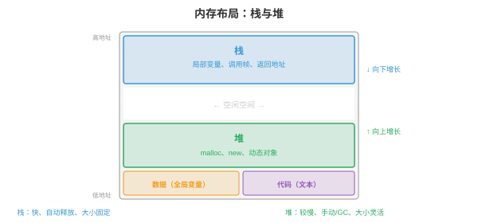
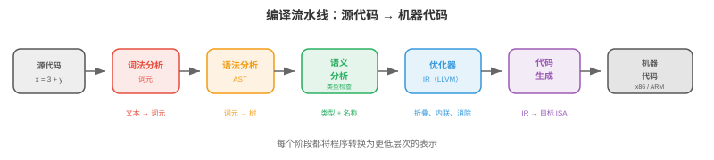

# 编程语言

*编程语言是人类意图与机器执行之间的接口。本节涵盖语言范式、类型系统、内存管理策略、编译流水线、解释与 JIT 编译、关键语言特性、领域特定语言和设计权衡。*

- 每一段软件、每个机器学习模型、每个操作系统都用编程语言编写。但有数百种语言，各有不同优势。为什么？因为语言设计涉及根本权衡：性能与安全、表达力与简洁、控制与抽象。理解这些权衡有助于你为工作选择正确工具，并理解所处环境的约束。

!!! note "大白话"
    编程语言没有“万能冠军”；不同语言是在速度、安全、好不好写和能控制多底层之间做不同取舍。

## 语言范式

- **范式（paradigm）**是一种编程风格：一套指导你如何组织代码、如何思考问题的原则。

!!! note "大白话"
    范式就是写程序时采用的思路和组织方式，相当于不同的解题套路。

- **命令式（imperative）**编程将计算描述为改变状态的一串命令。“将 x 设为 5；为 x 加 3；若 x > 7，则打印它。”C、Python 和 Java 的核心都是命令式。其思维模型是一台拥有内存、你逐步修改它的机器。

!!! note "大白话"
    命令式编程像写操作清单：先做什么、再改哪个变量、最后判断什么，程序状态一步步变化。

- **面向对象（object-oriented, OOP）**编程围绕**对象（objects）**组织代码：对象是数据，属性，和行为，方法，的组合。对象通过相互发送消息交互。关键思想是**封装（encapsulation）**，将内部状态隐藏在公共接口之后、**继承（inheritance）**，通过扩展已有类创建新类，和**多态（polymorphism）**，通过共享接口一致地处理不同类型。Java、C++ 和 Python 都支持 OOP。

!!! note "大白话"
    OOP 把数据和操作数据的函数绑在一起，外部只通过公开接口使用对象，不必知道内部怎么实现。

- **函数式编程（functional programming, FP）**将计算视为数学函数的求值。核心原则包括：**不可变性（immutability）**，数据创建后不改变、**纯函数（pure functions）**，输出仅取决于输入、没有副作用，和**一等函数（first-class functions）**，函数是可作为参数传递、由其他函数返回并保存到变量的值。Haskell 是纯函数式语言；Python、JavaScript 和 Scala 支持函数式风格。

!!! note "大白话"
    函数式编程尽量像做数学题：输入相同就得到相同输出，少改共享状态，因此更容易测试和并行。

- 纯函数易于推理、测试和并行化，没有共享可变状态就没有竞争条件。这正是函数式思想日益用于分布式系统和数据流水线的原因。本书始终使用的 JAX 是函数式的：`jax.grad` 能工作，是因为 JAX 函数是纯函数。

!!! note "大白话"
    不到处偷偷改数据，程序行为就更可预测；JAX 正是利用这种纯函数特性来自动求导和变换代码。

- **逻辑编程（logic programming）**描述什么应当为真，而非如何计算。你陈述事实和规则，运行时寻找解。Prolog 是经典例子：给出“苏格拉底是人”和“所有人都会死”，引擎便能推导“苏格拉底会死”。逻辑编程用于 AI 知识库和类型检查。

!!! note "大白话"
    逻辑编程只声明事实和规则，把“怎么找答案”交给系统推理。

- 大多数现代语言是**多范式（multi-paradigm）**的：Python 支持命令式、OOP 和函数式；Rust 支持命令式和函数式。范式是工具，不是宗教。

!!! note "大白话"
    实际项目常混用多种风格；根据问题选合适工具，比死守一种范式更重要。

## 类型系统

- **类型（type）**对值分类，并决定哪些操作有效。整数 3 与字符串 “3” 是不同类型：可以相加整数，却不能相加字符串，虽然可以拼接字符串，但那是不同操作。

!!! note "大白话"
    类型像给数据贴标签，标签决定哪些操作合法，能避免把数字和文字胡乱相加。

- **静态类型（Static typing）**：类型在程序运行前的**编译时（compile time）**检查，类型错误会及早发现。C、Java、Rust 和 Go 是静态类型语言。你必须声明类型，或由编译器推断类型：

```rust
let x: i32 = 5;     // Rust: x is a 32-bit integer
let y: f64 = 3.14;  // y is a 64-bit float
// let z = x + y;    // compile error: cannot add i32 and f64
```

!!! note "大白话"
    静态类型把一部分错误提前到运行前发现，程序还没上线就能拦住不匹配的类型。

- **动态类型（Dynamic typing）**：类型在操作实际执行时的**运行时（runtime）**检查。它更灵活，但类型错误只有代码运行时才暴露。Python、JavaScript 和 Ruby 是动态类型语言：

```python
x = 5       # x is an int (for now)
x = "hello" # now x is a string -- no error
```

!!! note "大白话"
    动态类型允许变量换标签，试验很快，但错误可能要等代码真正跑到那一行才暴露。

- **强类型（Strong typing）**：语言阻止隐式类型强制转换。Python 是强类型语言：`"3" + 5` 会抛出 TypeError。**弱类型（Weak typing）**：语言静默转换类型。JavaScript 是弱类型语言：`"3" + 5` 得到 `"35"`，数字被转换为字符串；C 也是弱类型语言，可以把指针转换为整数。

!!! note "大白话"
    强类型遇到不兼容数据会直接报错；弱类型可能自作主张帮你转换，方便但容易埋下误解。

- **类型推断（Type inference）**让编译器无需显式注解即可推导类型：

```rust
let x = 5;        // compiler infers: i32
let y = x + 3.0;  // compile error: mixed types, even with inference
```

!!! note "大白话"
    类型推断是编译器根据上下文替你补标签，但它不会允许本来就不兼容的类型混在一起。

- **泛型（Generics）**，参数多态，允许编写适用于任意类型的代码：

```rust
fn largest<T: PartialOrd>(list: &[T]) -> &T {
    let mut max = &list[0];
    for item in &list[1..] {
        if item > max { max = item; }
    }
    max
}
// Works for integers, floats, strings -- any type that supports comparison
```

!!! note "大白话"
    泛型让同一份算法适用于多种类型，只要这些类型都满足算法需要的操作。

- 对机器学习而言，Python 的动态类型加快实验，却会隐藏 bug。生产级机器学习系统日益使用类型提示，`def train(model: nn.Module, lr: float) -> float`，和静态分析工具，mypy，在部署前发现错误。PyTorch 和 JAX 用 Python 获得灵活性；TensorRT 和 ONNX Runtime 用 C++ 获得性能。

!!! note "大白话"
    Python 适合快速试验，但上线前最好用类型提示和静态检查把隐蔽错误提前找出来。

## 内存管理

- 每个程序都会分配和释放内存。如何管理内存是最具影响力的语言设计决策之一。

!!! note "大白话"
    程序用内存放数据，也必须及时归还；语言如何处理这件事会直接影响安全和性能。



- **栈（stack）**保存局部变量和函数调用帧。分配很简单，移动栈指针，释放自动完成，函数返回时弹出栈帧。栈访问很快，因为它始终位于缓存中。但栈大小固定，通常为 1-8 MB，并且仅支持 LIFO，后进先出，分配。

!!! note "大白话"
    栈像一摞盘子，函数进入时放一层，返回时从最上面拿走；速度快，但空间有限。

- **堆（heap）**保存动态分配的数据，对象、数组以及编译时大小未知的字符串。堆分配较慢，需要查找空闲块，且需要显式或自动释放。堆可增长至填满可用内存。

!!! note "大白话"
    堆像一间可以按需租用的仓库，能放大对象和未知大小的数据，但找空位、回收空间都更费事。

- **手动内存管理（Manual memory management）**，C、C++：程序员显式分配，`malloc`，和释放，`free`，堆内存。它提供最大控制力和性能，却极易出错：
    - **释放后使用（Use-after-free）**：访问已释放内存，导致崩溃或安全漏洞。
    - **重复释放（Double free）**：同一内存释放两次，破坏分配器内部数据结构。
    - **内存泄漏（Memory leak）**：分配内存却从不释放，程序缓慢耗尽所有可用 RAM。

!!! note "大白话"
    手动管理给你最大控制权，但每次借内存都要自己记得归还；忘记或归还两次都会出问题。

- **垃圾收集（Garbage collection, GC）**：运行时自动检测并释放不再可达的内存，程序员从不调用 `free`。

!!! note "大白话"
    GC 像清洁工，自动找出程序已经够不着的对象并回收，开发者省心但运行时要付清理成本。

    - **追踪 GC（Tracing GC）**，Java、Go、Python 的循环收集器：定期从“根”，栈变量和全局变量，遍历全部可达对象，并释放不可达对象。它简单，却会造成**GC 暂停（GC pauses）**：收集器运行时程序停止。现代收集器，Go 的并发 GC、Java 的 ZGC，将暂停时间降至亚毫秒。

        !!! note "大白话"
            追踪 GC 从仍在使用的“根”一路查找，没查到的对象就能清掉；清理期间程序可能短暂停顿。

    - **引用计数（Reference counting）**，Python 的主要机制、Swift、Objective-C：每个对象跟踪指向它的引用数量。计数降到 0 时，对象立即释放。没有暂停，却无法处理**环（cycles）**，A 引用 B、B 引用 A，二者计数均大于 0，却都不可达。Python 用单独的循环检测器处理它。

        !!! note "大白话"
            引用计数看“还有几个人指向它”；计数归零就立刻释放，但互相指着的环需要额外检查。

- **所有权（Ownership）**，Rust：编译器在编译时强制执行内存安全规则，运行时开销为零。

!!! note "大白话"
    Rust 把“谁负责归还内存”的规则交给编译器检查，换来无 GC 的内存安全。

    - 每个值恰有一个**所有者（owner）**。所有者离开作用域时，值被丢弃，释放。

        !!! note "大白话"
            每个值只有一个负责人，负责人离开作用域时，值就自动清理。
    - 值可被**借用（borrowed）**，引用，但编译器强制规定：要么一个可变引用，要么任意数量不可变引用，绝不能同时存在。

        !!! note "大白话"
            可以借给别人看，但不能一边多人读、一边有人改，避免读写冲突。
    - 这在编译时防止释放后使用、重复释放、数据竞争和悬垂指针。没有 GC，没有运行时成本。

        !!! note "大白话"
            许多常见内存和线程错误在编译阶段就被拦下，运行时不用再为垃圾收集付费。

- **借用检查器（borrow checker）**是 Rust 的杀手级特性，也是最陡峭的学习曲线。它无需垃圾收集即可保证内存安全和线程安全，因此 Rust 日益用于性能关键系统，操作系统内核、游戏引擎、机器学习推理运行时，如 Candle 和 Burn。

!!! note "大白话"
    借用检查器严格但可靠：代码必须证明引用关系安全，换来系统级性能和更少的运行时崩溃。

## 编译流水线

- **编译器（compiler）**在程序运行前将源代码翻译为机器代码，或另一种目标语言。流水线包含多个阶段：

!!! note "大白话"
    编译器像翻译工厂，先读懂源代码，再检查、优化，最后生产目标机器能执行的形式。



1. **词法分析（Lexing）**，词元化：将源文本转换为词元流。`x = 3 + y` 变成 `[IDENT("x"), EQUALS, INT(3), PLUS, IDENT("y")]`。词法分析器去除空白和注释。

!!! note "大白话"
    词法分析先把字符切成有意义的“词”，类似把句子拆成单词、数字和符号。

2. **语法分析（Parsing）**：从词元流构建**抽象语法树（Abstract Syntax Tree, AST）**。AST 表示程序的层级结构。`3 + y * 2` 被解析为 `Add(3, Mul(y, 2))`，乘法优先级更高。语法分析器在此检查语法：不匹配的括号和缺失的分号。

!!! note "大白话"
    语法分析把词元组装成树，明确谁先算、谁包含谁，并找出括号或分号这类结构错误。

3. **语义分析（Semantic analysis）**：检查类型、解析变量名、验证函数调用参数是否正确。静态类型检查在此发生，输出是带类型与注释的 AST。

!!! note "大白话"
    语义分析检查代码“意思上说不说得通”，例如变量是否存在、参数类型是否匹配。

4. **优化（Optimisation）**：在不改变行为的前提下转换程序使其运行更快。常见优化包括：
    - **常量折叠（Constant folding）**：在编译时计算 `3 + 5`，将其替换为 `8`。
    - **死代码消除（Dead code elimination）**：移除永远不会执行的代码。
    - **循环展开（Loop unrolling）**：用重复的内联代码替换循环，减少分支开销。
    - **内联（Inlining）**：用函数体替换函数调用，消除调用开销。

!!! note "大白话"
    优化是在结果不变的前提下改写代码，让它少做无用功、少跳转、少调用。

5. **代码生成（Code generation）**：将优化后的表示转换为目标机器代码，x86、ARM，或中间表示。

!!! note "大白话"
    代码生成把已经检查和优化好的程序，翻译成具体 CPU 或运行时真正能执行的指令。

- **LLVM**是主导的编译器基础设施。它提供通用中间表示，LLVM IR，许多语言都编译到该表示。LLVM 的优化器作用于该 IR，其后端为多个目标生成机器代码。Clang，C/C++、Rust、Swift、Julia 和其他许多语言都使用 LLVM。这意味着 LLVM 优化器的改进会同时让所有这些语言受益。

!!! note "大白话"
    LLVM 像共享的编译平台：不同语言先变成统一中间形式，再由同一套优化和后端生成不同 CPU 的代码。

## 解释与 JIT 编译

- **解释器（interpreter）**逐行，或逐语句，执行程序，不产生机器代码。这使启动快、开发可交互，却使执行较慢，每一行每次运行时都要重新分析。

!!! note "大白话"
    解释器边读边执行，启动和试错方便，但每次运行都要付理解代码的成本。

- 大多数解释型语言实际会编译为**字节码（bytecode）**：一种比源代码简单、但不针对特定机器的中间表示。字节码运行在**虚拟机（virtual machine, VM）**上。

!!! note "大白话"
    字节码是介于源代码和机器码之间的通用指令，交给虚拟机执行，同一份字节码可以跨平台。

    - **CPython**，标准 Python 实现，将 Python 源代码编译为字节码，`.pyc` 文件，由 CPython VM 运行。VM 每次解释执行一条字节码指令。这是 Python 在计算密集任务上比 C 慢约 100 倍的原因。

        !!! note "大白话"
            CPython 先把 Python 变成字节码，再由虚拟机逐条解释，所以纯 Python 循环通常比 C 慢很多。

    - **JVM**，Java 虚拟机：Java 编译为 JVM 字节码，`.class` 文件。JVM 初始解释字节码，随后将频繁执行的代码路径，即“热点”，**JIT 编译（JIT-compiles）**为原生机器代码。这是 Java 启动比 C 慢，解释开销，但长期运行时可接近 C 速度，JIT 优化热点，的原因。

        !!! note "大白话"
            JVM 先解释着跑，发现某段代码很热门后再把它编成机器码；启动慢一点，长期运行可以很快。

- **JIT（Just-In-Time）编译**在运行时将代码编译为机器代码，利用仅在执行期间可得的信息。JIT 可依据实际运行时数据优化：若函数始终以整数参数调用，JIT 会生成专门的纯整数机器代码，跳过类型检查。

!!! note "大白话"
    JIT 等程序跑起来后再观察真实情况，针对常见路径生成专用快代码。

- **PyPy**是带 JIT 编译器的替代 Python 实现。它通过 JIT 将热点循环编译为机器代码，可使大多数 Python 代码比 CPython 快 5-10 倍。然而，它与 C 扩展模块，NumPy、PyTorch，的兼容性有限，因此在机器学习中的使用受限。

!!! note "大白话"
    PyPy 能把热点 Python 代码编快，但和大量 C 扩展的兼容性不如 CPython，所以机器学习里不一定适合。

- 从解释到编译的光谱不是二元的：
    - 纯解释：Bash shell 脚本。
    - 字节码解释：CPython。
    - 字节码 + JIT：JVM、.NET CLR、LuaJIT、PyPy。
    - 提前（Ahead-of-time, AOT）编译：C、C++、Rust、Go。
    - AOT + 运行时代码生成：JAX 的 `jax.jit` 在首次调用时将 Python 函数编译为优化的 XLA 代码，随后缓存已编译版本。

!!! note "大白话"
    “解释型”和“编译型”不是两格开关，而是一条连续谱；很多系统会先解释、再编译热点，或在运行时生成代码。

## 关键语言特性

- **闭包（Closures）**：捕获其外围作用域中变量的函数。该函数“闭合于”定义它的环境：

```python
def make_adder(n):
    def add(x):
        return x + n  # n is captured from the enclosing scope
    return add

add5 = make_adder(5)
print(add5(3))  # 8
```

!!! note "大白话"
    闭包会把定义时用到的外部变量一起带走，所以函数返回后仍记得当时的环境。

- 闭包是回调、装饰器和偏应用背后的机制，也是函数式编程的基础。

!!! note "大白话"
    回调和装饰器之所以能“记住配置”，通常就是因为背后有闭包保存上下文。

- **模式匹配（Pattern matching）**：一种强大的控制流机制，可解构数据并按其形状分支：

```rust
match value {
    Some(x) if x > 0 => println!("Positive: {}", x),
    Some(0)           => println!("Zero"),
    Some(x)           => println!("Negative: {}", x),
    None              => println!("Nothing"),
}
```

!!! note "大白话"
    模式匹配先看数据长什么样，再按不同形状进入对应分支，比堆很多 if-else 更系统。

- 模式匹配比 if-else 链更有表达力：它检查数据结构，它是 Some 还是 None？是否含有满足条件的值？，而非仅检查相等性。Python 在 3.10 中加入结构化模式匹配，`match`/`case`。

!!! note "大白话"
    它不仅比较一个值是否相等，还能同时拆开数据并检查内部条件。

- **代数数据类型（Algebraic data types, ADTs）**：可为多个变体之一的类型，每个变体携带不同数据。`Result` 类型要么是 `Ok(value)`，要么是 `Err(error)`；`Tree` 要么是 `Leaf(value)`，要么是 `Node(left, right)`。ADT 与模式匹配结合，可穷尽处理所有情形，消除整类 bug，空指针异常、未处理的错误码。

!!! note "大白话"
    ADT 把“可能出现的几种情况”明确列出来，配合模式匹配逐一处理，少漏掉异常分支。

- **特征与接口（Traits and interfaces）**：定义类型必须实现的一组方法，但不指定如何实现。这启用多态：接受“实现了 Display trait 的任何对象”的函数可处理整数、字符串和自定义类型。Rust 使用 trait，Java 使用接口，Go 使用隐式接口，Python 使用鸭子类型，“如果它走起路来像鸭子……”。

!!! note "大白话"
    接口只规定“必须会哪些动作”，不管内部怎么做；只要满足接口，函数就能统一使用不同对象。

## 领域特定语言

- **领域特定语言（domain-specific language, DSL）**为特定问题领域设计，在该领域中以通用性换取表达力。

!!! note "大白话"
    DSL 不求什么都能做，而是把某一类问题写得特别直接、特别清楚。

- **SQL**：关系数据库语言。`SELECT name FROM users WHERE age > 30` 比等价的命令式循环更可读、更易优化。数据库引擎优化查询执行计划，自动选择连接策略和索引使用方式。

!!! note "大白话"
    SQL 只描述“要哪些数据”，数据库负责决定怎样查，开发者不用手写遍历和索引细节。

- **正则表达式（Regular expressions）**：用于文本模式匹配的微型语言。`\d{3}-\d{4}` 匹配如 “555-1234” 的电话号码。正则引擎将模式编译为有限自动机，以实现高效匹配。

!!! note "大白话"
    正则表达式是一套专门描述文字形状的简短规则，适合找格式相似的文本。

- **着色器语言（Shader languages）**，GLSL、HLSL、Metal Shading Language：运行在 GPU 核心上、计算像素颜色、顶点位置或计算操作的程序。着色器是大规模并行的：每次调用独立处理一个像素或一个元素。这与 CUDA 用于机器学习计算的执行模型相同。

!!! note "大白话"
    着色器是交给 GPU 大量并行执行的小程序，每个线程通常负责一个像素或一个数据元素。

- 在机器学习中，PyTorch 和 JAX 等框架本质上是嵌入 Python 的张量计算 DSL。它们提供领域特定抽象，张量、自动微分、设备放置，同时利用 Python 生态系统。

!!! note "大白话"
    PyTorch 和 JAX 让你用 Python 写高层张量操作，底层再把这些操作交给高效的计算内核。

## 语言设计权衡

- 没有语言在所有方面都是最好的。设计就是选择做哪些权衡：

!!! note "大白话"
    选语言就是选取舍：某方面更强，往往意味着另一方面要付出代价。

- **性能与安全（Performance vs safety）**：C 提供原始速度与硬件控制，却允许破坏内存；Rust 以编译时内存安全提供相近速度；Java 通过垃圾收集开销换取内存安全；Python 以慢 100 倍的执行换取最高安全性和表达力。

!!! note "大白话"
    越接近硬件通常越快但越容易犯内存错误；越强调自动保护，开发更省心，运行时可能更有开销。

- **表达力与简洁（Expressiveness vs simplicity）**：Haskell 的类型系统可表达非常精确的约束，却有陡峭学习曲线；Go 为简洁而有意省略泛型，直到最近才加入、继承和异常；Python “应当有一种显而易见的做法”的哲学使语言易学。

!!! note "大白话"
    语言功能越丰富，能表达的东西越细，但学习和理解成本也会上升；简洁语言则更容易上手。

- **控制与抽象（Control vs abstraction）**：C/C++ 让你控制内存布局、缓存行为和硬件交互；Python 隐藏所有这些。对机器学习训练，GPU 计算占主导，Python 开销可忽略；对机器学习推理，每微秒都重要，可能需要 C++ 或 Rust。

!!! note "大白话"
    抽象帮你少操心，底层控制让你能榨出最后一点性能；训练和推理对这两者的侧重点不同。

- **编译速度与运行速度（Compilation speed vs runtime speed）**：Go 数秒内编译，类型系统简单、优化少；Rust 数分钟编译，类型系统复杂、优化激进。这是在开发者迭代速度与部署性能间的权衡。

!!! note "大白话"
    编译快能让开发者频繁试错，编译慢但优化强则可能换来更快的上线程序。

- 机器学习生态系统体现了这些权衡：Python 用于实验与训练，表达力胜出；C++/CUDA 用于内核与推理，性能胜出；Rust 用于基础设施和安全关键系统，安全胜出。

!!! note "大白话"
    实际工程常常分工合作：Python 负责灵活编排，C++/CUDA 负责极致计算，Rust 负责可靠的底层基础设施。

## 编程任务（使用 CoLab 或 Notebook）

1. 探索闭包与高阶函数。实现简单函数工厂，并验证闭包捕获其环境。
```python
def make_multiplier(factor):
    """Returns a function that multiplies by factor."""
    def multiply(x):
        return x * factor
    return multiply

double = make_multiplier(2)
triple = make_multiplier(3)

print(f"double(5) = {double(5)}")  # 10
print(f"triple(5) = {triple(5)}")  # 15

# Closures capture by reference, not by value
def make_counter():
    count = [0]  # mutable container to allow modification
    def increment():
        count[0] += 1
        return count[0]
    return increment

counter = make_counter()
print(f"counter() = {counter()}")  # 1
print(f"counter() = {counter()}")  # 2
print(f"counter() = {counter()}")  # 3
```

2. 比较动态与静态类型行为。展示 Python 的动态类型如何允许灵活性，却可能隐藏 bug。
```python
def add(a, b):
    return a + b

# Works with different types -- flexible!
print(add(3, 5))           # 8 (int + int)
print(add("hello ", "world"))  # "hello world" (str + str)
print(add([1, 2], [3, 4]))    # [1, 2, 3, 4] (list + list)

# But type errors only surface at runtime:
try:
    print(add("hello", 5))  # TypeError! str + int
except TypeError as e:
    print(f"Runtime error: {e}")
    print("A static type checker would catch this before running")
```

3. 为计算密集型任务测量解释型 Python 与编译/JIT 方法的性能差异。
```python
import time
import jax
import jax.numpy as jnp

n = 1_000_000

# Pure Python loop (interpreted)
start = time.time()
total = 0.0
for i in range(n):
    total += i * i
python_time = time.time() - start

# JAX (compiled via XLA)
@jax.jit
def sum_squares_jax(n):
    return jnp.sum(jnp.arange(n, dtype=jnp.float32) ** 2)

_ = sum_squares_jax(10)  # warm up JIT
start = time.time()
result = sum_squares_jax(n)
jax_time = time.time() - start

print(f"Python loop: {python_time:.4f}s")
print(f"JAX (JIT):   {jax_time:.6f}s")
print(f"Speedup:     {python_time / jax_time:.0f}x")
```
