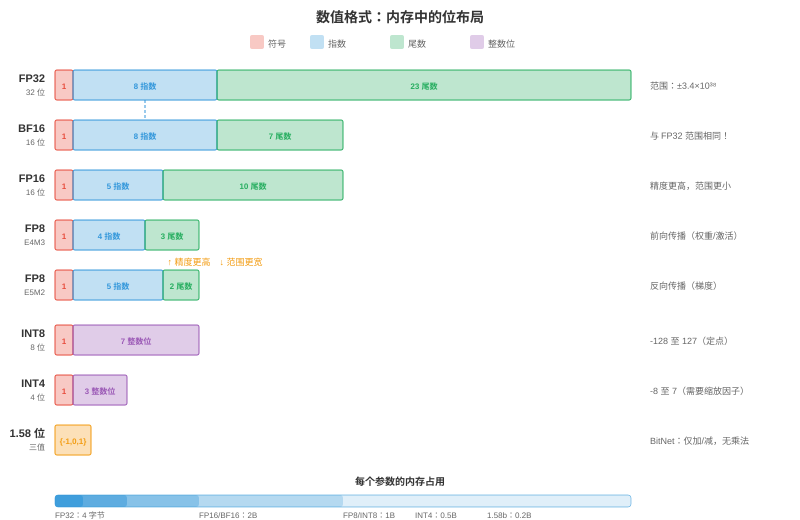
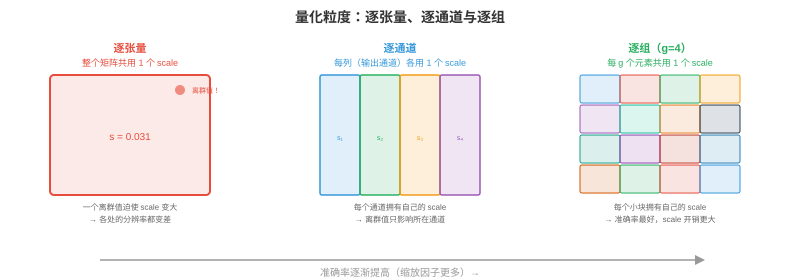

# 量化

*量化降低模型权重和激活值的精度，使模型更小、运行更快、更便宜。本节涵盖数值格式、训练后量化、量化感知训练、仅权重量化方法（GPTQ、AWQ）、激活量化、混合精度和 KV-cache 量化。*

- 一个 float16 的 700 亿参数模型需要 140 GB 内存，超过任何单张 GPU。量化为 INT4 后它可放进 35 GB（一张 A100），甚至通过卸载放进 20 GB（消费级 RTX 4090）。量化不是锦上添花的优化，而是让大模型部署具备经济可行性的前提。

- 根本权衡是：低精度意味着更少内存、更高吞吐量和更低功耗，却会引入**量化误差**，可能降低模型质量。量化的艺术在于最小化这种退化。

!!! note "大白话"
    量化就是用更少的格子近似原来的连续数字。模型更小、更快，但格子太少会把重要差异挤没，关键是把误差控制在模型还能接受的范围内。

## 为何量化

- **降低内存**：INT8 比 FP16 小 2 倍，INT4 小 4 倍。对于 LLM，模型权重主导内存占用；精度减半，内存需求减半。

- **提升吞吐量**：低精度意味着每秒更多运算。NVIDIA Tensor Core（第 16 章）相较 FP32 可使 FP16 吞吐量翻倍，相较 FP16 可使 INT8 再翻倍，相较 INT8 可使 INT4 再翻倍。H100 在 FP8 下达 989 TFLOPS，而 FP32 为 67 TFLOPS，差距为 15 倍。

- **节省带宽**：LLM 推理通常**受内存带宽限制**（第 16 章 roofline 模型）。瓶颈是从 GPU 内存加载权重，而非用权重计算。更小权重意味着传输字节更少，直接提高每秒 token 数。因此，量化常使 LLM 推理获得近线性的加速。

- **节省能耗**：较低精度每次运算能耗更低。对于拥有数千 GPU 的数据中心，这会显著降低电费。

!!! note "大白话"
    量化的收益不只在“文件变小”：权重少搬几字节、硬件一次多算几个值、耗电也更低。LLM 推理常在等权重从显存读出来，所以体积缩小通常能直接换来更多 token/s。

## 数值格式

- 第 13 章（计算机体系结构）介绍过 IEEE 754 浮点数。以下是机器学习完整精度图景：



| 格式 | 位数 | 指数 | 尾数 | 范围 | 使用场景 |
|--------|------|----------|----------|-------|----------|
| FP32 | 32 | 8 | 23 | ±3.4×10³⁸ | 训练（金标准） |
| TF32 | 19 | 8 | 10 | ±3.4×10³⁸ | Tensor Core 训练（A100+） |
| FP16 | 16 | 5 | 10 | ±65504 | 混合精度训练 |
| BF16 | 16 | 8 | 7 | ±3.4×10³⁸ | 训练（与 FP32 相同范围） |
| FP8 E4M3 | 8 | 4 | 3 | ±448 | 前向传播（Hopper+） |
| FP8 E5M2 | 8 | 5 | 2 | ±57344 | 梯度（范围更宽） |
| INT8 | 8 | — | — | -128 至 127 | PTQ 推理 |
| INT4 | 4 | — | — | -8 至 7 | 仅权重量化 |
| INT2/三值 | 2 | — | — | {-1, 0, 1} | 极限压缩 |

- **FP8** 有两种变体：用于前向传播的 **E4M3**（4 位指数、3 位尾数，范围较窄但精度更高），以及用于梯度的 **E5M2**（5 位指数、2 位尾数，范围较宽但精度较低）。Transformer Engine（第 16 章）会按张量自动切换。

- **BF16 与 FP16**：BF16 有与 FP32 相同的指数范围，无溢出风险，但尾数精度较低。FP16 精度更高，但范围窄，最大值为 65504，训练时需 loss scaling。推理中二者都能良好工作；训练中 BF16 更安全。

!!! note "大白话"
    指数决定数字能有多大或多小，尾数决定细节有多精。BF16 优先保证不溢出，FP16 优先保留更多小数细节；训练中的梯度范围很大，因此 BF16 往往更省心。

- **整数格式**没有指数，表示定点值。在 float 与 int 间转换需**缩放因子**，可选地还需**零点**：$x_{\text{float}} = \text{scale} \times (x_{\text{int}} - \text{zero\_point})$。

!!! note "大白话"
    INT8 本身只会表示有限的整数，`scale` 告诉我们每一格相当于现实数轴上的多大距离，`zero_point` 告诉哪一格代表 0。没有这两个约定，整数就无法还原为模型需要的数值。

## 量化方程

- 所有量化方法都将浮点值映射为整数再映射回来：

$$x_q = \text{clamp}\left(\text{round}\left(\frac{x}{\text{scale}}\right) + \text{zero\_point}, \; q_{\min}, \; q_{\max}\right)$$

$$\hat{x} = \text{scale} \times (x_q - \text{zero\_point})$$

!!! note "大白话"
    先除以 `scale` 把浮点数放到整数格子上，四舍五入并截断到可表示范围；反量化时再乘回 `scale`。舍入和截断造成的差，就是量化误差的来源。

- **缩放因子（scale）**决定分辨率：$\text{scale} = \frac{x_{\max} - x_{\min}}{q_{\max} - q_{\min}}$。对于 INT8，$q_{\min} = -128$，$q_{\max} = 127$。

- **对称量化**令 $\text{zero\_point} = 0$，所以 $\text{scale} = \frac{\max(|x|)}{127}$。它更简单、更快，因为推理中不需减去零点。

- **非对称量化**使用非零 $\text{zero\_point}$ 处理不对称分布，例如 ReLU 输出全为非负。它将 $[x_{\min}, x_{\max}]$ 映射至无符号 INT8 的 $[0, 255]$。

!!! note "大白话"
    对称量化把正负两边平均分配格子，计算简单；数据全是非负时会浪费一半格子。非对称量化把格子挪到真正有数据的一边，通常更精细，但推理多一点零点处理。



- **量化粒度**：有多少值共用一个缩放因子：
    - **逐张量**：整个张量一个缩放因子。最简单但准确率最低，一个离群值会扭曲整个张量的 scale。
    - **逐通道**：每个输出通道（卷积）或每一行（线性层）一个缩放因子。几乎无额外开销，准确率高得多。
    - **逐组**：每 $g$ 个元素一组，共用一个缩放因子，如 $g = 128$。准确率最好，用于现代仅权重量化（GPTQ、AWQ）。
    - **逐 token**：每个 token 的激活值使用一个缩放因子，能处理不同 token 激活幅度非常不同的事实。

!!! note "大白话"
    一个 `scale` 管得越多，存储和计算越简单，却越容易被少数极端值带偏。逐组或逐通道相当于给不同小区域各配一把刻度尺，能更贴合数据分布。

## 训练后量化（PTQ）

- **PTQ** 无需重新训练即可量化预训练模型。让一个**校准集**，通常为 128 至 512 个代表性样本，通过模型以收集激活统计量，再计算最优缩放因子。

!!! note "大白话"
    PTQ 是模型训练完再压缩，成本低得多。校准集不是用来学习新知识，而是让量化器看看真实输入下数值通常落在哪些范围。

### 校准方法

- **Min-max**：根据观测到的最小和最大值设定 scale。简单但对离群值敏感，一个极端值会将大部分量化范围浪费在罕用数值上。

- **百分位数**：使用第 99.99 百分位而非绝对最大值。它截断极端离群值，为大多数值提供更好分辨率；截断值会饱和为 $q_{\min}$ 或 $q_{\max}$。

- **MSE 最优**：寻找最小化原始张量与量化张量间均方误差的 scale。这是一维优化，搜索可能截断值，通常给出最佳 PTQ 准确率。

- **基于熵**（KL 散度）：寻找最小化原始和量化值分布间 KL 散度的 scale。用于 TensorRT 的 INT8 校准。

!!! note "大白话"
    校准方法都在回答同一问题：有限格子应该覆盖多大数值范围。范围太大，常见值挤在少数格子里；范围太小，极端值被截断，必须按数据分布权衡。

### PTQ 实践

```python
# Simplified PTQ with PyTorch (conceptual)
import torch

def quantise_tensor_symmetric(tensor, bits=8):
    qmax = 2 ** (bits - 1) - 1  # 127 for INT8
    scale = tensor.abs().max() / qmax
    quantised = torch.clamp(torch.round(tensor / scale), -qmax, qmax).to(torch.int8)
    return quantised, scale

def dequantise(quantised, scale):
    return quantised.float() * scale

# Quantise a weight matrix
weight = torch.randn(512, 512)  # pretrained weight
weight_q, scale = quantise_tensor_symmetric(weight, bits=8)
weight_reconstructed = dequantise(weight_q, scale)

# Quantisation error
error = (weight - weight_reconstructed).abs().mean()
print(f"Mean absolute error: {error:.6f}")
print(f"Compression: {weight.numel() * 4 / (weight_q.numel() * 1 + 4):.1f}x")  # +4 bytes for scale
```

- PTQ 在大多数模型上对 INT8 工作良好，准确率退化小于 1%。对于 INT4，PTQ 质量会显著下降，仅权重方法能更好处理 INT4。

!!! note "大白话"
    INT8 格子还算足够密，直接 PTQ 往往就能用；降到 INT4 后每层只有很少等级，误差会明显放大。位数越低，越需要使用更聪明的量化策略或重新训练。

## 量化感知训练（QAT）

- **QAT** 在训练图中插入伪量化操作：前向传播中权重和激活被量化、反量化，而梯度流动时假定没有量化，即使用**直通估计器（straight-through estimator）**。

$$\text{Forward: } \hat{W} = \text{dequant}(\text{quant}(W))$$
$$\text{Backward: } \frac{\partial L}{\partial W} \approx \frac{\partial L}{\partial \hat{W}}$$

- 模型在训练中学习抵抗量化噪声。QAT 通常能恢复 PTQ 损失的大部分乃至全部准确率，尤其在低位宽（INT4、INT2）下。

- **成本**：QAT 要求重新训练或微调，对大模型很贵。700 亿参数模型 QAT 的计算成本可能为 $10,000-$100,000；PTQ 几乎不花成本，仅需校准。

- **何时使用 QAT**：PTQ 质量不可接受时，通常为 INT4 或更低；部署于有严格延迟预算的边缘设备时；或模型将被量化数百万次、一次性 QAT 成本可摊销时。

!!! note "大白话"
    QAT 是让模型在训练时提前适应“数字会被粗略取整”这件事，所以最终质量通常更好。代价是又要训练一次，大模型上很贵，不能把它当默认流程。

## 仅权重量化

- 对 LLM 推理，瓶颈是从内存加载权重而不是用其计算，即受内存带宽限制。**仅权重量化**将权重量化为 INT4 或 INT3，同时将激活保持在 FP16。计算在 FP16 中进行，权重运行时即时反量化；内存消耗和带宽却降低 4 至 8 倍。

!!! note "大白话"
    仅压权重是一种现实折中：最占显存、最常被读取的是权重，先把它缩小；变化快又难量化的激活仍保留 FP16。这样能拿到大部分带宽收益，又避免完全整数计算的难题。

### GPTQ

- **GPTQ**（Frantar 等，2022）逐列量化权重，通过调整后续列补偿每列误差。它使用**Hessian**，即校准集中的二阶信息，决定最优量化顺序和误差补偿：

$$\hat{W}_{:,j} = \text{quant}(W_{:,j}), \quad W_{:,j+1:} \mathrel{-}= \frac{(\hat{W}_{:,j} - W_{:,j}) \cdot H_{j,j+1:}}{H_{j,j}}$$

- 核心洞见：量化第 $j$ 列会带来误差，GPTQ 立刻调整剩余所有列，使该层整体输出 $XW$ 尽可能少变。这是应用于 Transformer 的**最优脑量化（OBQ）**。

!!! note "大白话"
    GPTQ 不只把每列单独四舍五入，而是看它对整层输出造成的影响，再让后面的列补偿。它像先改一个零件，再微调其余零件，让整台机器的行为尽量不变。

- 使用 4 位组量化（组大小 128）的 GPTQ 在多数 LLM 上的困惑度退化小于 1%。在单 GPU 上量化一个 700 亿模型约需 1 小时。

### AWQ

- **AWQ**（Activation-Aware Weight Quantisation，Lin 等，2023）发现小部分权重通道，约 1-3%，远比其余通道重要，它们对应幅度较大的激活通道。保护这些显著通道可显著降低量化误差。

- AWQ 在量化前将这些重要通道按因子 $s$ 缩放，使其更大因而较少受舍入影响，并将对应激活按 $1/s$ 缩放以保持输出。scale $s$ 在每组上优化，最小化总量化误差。

- AWQ 比 GPTQ 简单，不需要计算 Hessian，运行更快且质量相当，已成为许多开源 LLM 量化管线的默认方案。

!!! note "大白话"
    AWQ 发现并保护少数真正重要的通道，而不是平均照顾每个权重。重要通道少受一点取整误差，模型输出就能保住大部分质量。

### GGUF / llama.cpp 量化

- **GGUF**（GGML Universal Format）是 llama.cpp 用于 CPU 推理的格式，支持多种量化方案：
    - **Q4_0**：4 位、32 元素块、对称。
    - **Q4_K_M**：4 位，为重要通道使用混合精度（k-quants）。
    - **Q5_K_M**：5 位 k-quants，质量更高。
    - **Q8_0**：8 位，简单且快。

- “K” 变体（k-quants）为重要权重块分配更多位，洞见类似 AWQ，但在格式层实现。Q4_K_M 对大多数模型是甜点：平均 4 位，质量损失极小。

!!! note "大白话"
    GGUF 是方便 CPU 本地推理的模型文件格式，量化方案会直接写进文件。`Q4_K_M` 的含义不是所有位置死板地 4 位，而是把有限的额外精度优先分给更重要的块。

### QuIP 与 QuIP#

- **QuIP**（Chee 等，2023）引入**非相干处理（incoherence processing）**：量化前用随机正交变换旋转权重矩阵。这会将信息扩散到全部权重，防止少数离群权重主导量化误差。

- 直觉是：若一个权重为 100、其余约为 1，用同一个 scale 量化会把 INT4 范围大多浪费给离群值。正交旋转保持矩阵数学性质，旋转后所有权重幅度接近，均匀量化效果好得多。

- **QuIP#** 通过**格码本（lattice codebooks）**扩展此法：不是映射到均匀整数网格，而是映射到最优格点，即 8 维 E8 格。格码能在同一位数中容纳更多量化点，相比均匀量化有更好率失真。QuIP# 在 **2 位**精度仍可获得可用质量，只有典型 INT4 方法的一半位数。

!!! note "大白话"
    QuIP 先把少数特别大的权重“摊匀”，避免它们霸占全部量化范围；QuIP# 再用更聪明的码本挑选近似点。它们都在努力让极低位数不至于把信息压坏。

### SpQR

- **SpQR**（Dettmers 等，2023）观察到极少部分权重，约 0.1-1%，是对输出质量贡献不成比例的**离群值**。SpQR 不将全部权重压到相同精度，而是：

    1. 用敏感性分析识别离群权重，即量化该权重会如何改变层输出。
    2. 在稀疏格式中以**全精度**（FP16）存储离群值。
    3. 将其余权重量化为 INT3 或 INT4。

- 结果是约 99% 权重被激进量化，体积小；关键的 1% 保留全精度，准确。稀疏离群值存储只增加极少开销，少于总体积 5%。

!!! note "大白话"
    SpQR 承认并非每个权重都能一视同仁地压缩。让绝大多数走低比特路径，把极少数敏感离群值单独保留，整体仍然很小。

### HQQ

- **HQQ**（Half-Quadratic Quantisation，Badri & Shaji，2023）是**零样本**权重量化方法，完全不需要校准数据。它将量化表述为半二次优化问题，迭代求解最优量化权重和缩放因子。

- 优势是无校准集意味着无数据依赖、即时量化、不会有校准数据失配风险。HQQ 特别适合没有代表性校准数据或数据敏感的模型。

!!! note "大白话"
    HQQ 只看权重本身，不需要拿真实用户数据跑校准。没有合适样本、或者数据不能外泄时，这种零样本方法很实用。

### AQLM

- **AQLM**（Egiazarian 等，2024）对 LLM 应用**加性量化**，即多码本向量量化。它不独立量化每个权重，而是将权重分组为向量，并将每个向量表示为多个学习到的码本条目之和：

$$\mathbf{w} \approx \mathbf{c}_1^{(1)} + \mathbf{c}_2^{(2)} + \cdots + \mathbf{c}_M^{(M)}$$

- 其中 $\mathbf{c}_i^{(m)}$ 是码本 $m$ 的条目。使用 $M = 2$ 个各有 256 条目的码本时，一个 8 元素向量由两个 8 位索引编码，即 2 字节表示 8 个权重，等效为**每权重 2 位**。AQLM 在 2 位精度达到当时最佳质量，在这种极限压缩下优于 GPTQ 和 AWQ。

!!! note "大白话"
    AQLM 不逐个存权重，而是把一小段权重用几个“字典向量”的组合表示。存索引比存原数字省得多，但解码和内核实现也会更复杂。

### BitNet 与 1 位 LLM

- **BitNet**（Wang 等，2023）将量化推至极限：权重为三值 $\{-1, 0, +1\}$，每个权重只需约 1.58 位。矩阵乘法变成**仅加法与减法**，无需浮点乘法。

- **BitNet b1.58**（Ma 等，2024）将每个权重限制为 $\{-1, 0, +1\}$。“1.58 位”来自 $\log_2(3) \approx 1.58$。在此精度下，700 亿模型可放进约 15 GB，推理不需乘法，只需加、减和符号翻转。

- matmul 变为：

$$y_j = \sum_i W_{ij} \cdot x_i = \sum_{i: W_{ij}=+1} x_i - \sum_{i: W_{ij}=-1} x_i$$

- 相较任意硬件上的 FP16 matmul，这便宜得多，并可能使没有浮点单元的设备也能进行 LLM 推理。对当前模型，质量权衡仍显著，但会随规模和训练期量化感知改善。

!!! note "大白话"
    三值权重只有加、减和跳过三种情况，乘法几乎消失。它的压缩潜力极大，但必须从训练阶段就围绕这种限制设计，不能指望普通模型随便压成 1 位还能不掉质量。

### 微缩放（MX）格式

- **微缩放（MX）**格式是新的行业标准，由 AMD、Arm、Intel、Meta、Microsoft、NVIDIA 和 Qualcomm 支持。它使用**块浮点数**：一组元素共享一个指数，每个元素保留自己的尾数。

| 格式 | 共享指数 | 元素位数 | 总计（每元素） | 等价物 |
|--------|----------------|-------------|--------------------|----|
| MXFP8 | 每块 8 位 | 8（E4M3/E5M2） | 约 8 | 类似 FP8，范围更好 |
| MXFP6 | 每块 8 位 | 6 | 约 6.5 | 介于 FP8 与 INT4 |
| MXFP4 | 每块 8 位 | 4 | 约 4.5 | 类似 INT4，具浮点式行为 |
| MXINT8 | 每块 8 位 | 8（整数） | 约 8.5 | 具共享缩放的 INT8 |

- 共享指数将指数成本分摊至一个块，通常为 16 至 32 个元素。每个元素比使用单独指数时保留更多尾数位，因此每位精度更好。MX 格式预计将在未来硬件中替代独立 FP8 与 INT8 格式。

!!! note "大白话"
    MX 像让一小组相近数字共用一个数量级，再把宝贵位数留给各自的细节。它介于浮点和整数之间，试图用较少位数同时保留范围和精度。

### FP8 训练

- NVIDIA Hopper 与 Blackwell GPU 上已可实用地使用 FP8 训练，而不只是推理。配方如下：

    - **前向传播**：权重与激活用 E4M3，精度较高、范围较窄。Transformer Engine 用延迟缩放动态计算逐张量 scale，即跟踪前一次迭代统计量并应用到当前迭代。

    - **反向传播**：梯度用 E5M2，范围较宽、精度较低。梯度值范围比权重/激活宽，额外指数位可防溢出。

    - **主权重**：为优化器状态保留 FP32，类似使用 FP16 的标准混合精度训练（第 6 章）。FP8 计算仅用于 matmul，而不用于权重更新。

    - **损失缩放**：FP8 仍需，与 FP16 一样。动态 loss scaler 调整 scale，使梯度处于 FP8 可表示范围。

- 对大多数模型大小，FP8 训练质量可与 BF16 训练相当，吞吐量约提升 2 倍。它是 H100 集群上新大型训练运行的默认选择。

!!! note "大白话"
    FP8 训练不是把所有东西都粗暴改成 8 位：前向、反向和主权重用不同格式和缩放策略分工。这样既能借助低精度 Tensor Core，又保住优化器更新的稳定性。

## 激活量化

- 激活值，即层间流动的中间张量，也可以量化，从而实现完全 INT8 计算，权重和激活都是 INT8，以 INT32 累加。

- **动态量化**：从实际激活值在运行时计算 scale。准确性更高，可适应每个输入，但有开销，每层要计算 min/max 或百分位。

- **静态量化**：在校准时一次性计算 scale 并固定。推理更快，没有运行时统计，但校准数据缺乏代表性时准确性较低。

- **逐 token 量化**：为序列中的每个 token 单独计算 scale。它对 LLM 至关重要，因为不同 token 的激活幅度可相差 100 倍。

- 激活量化比权重量化难，因为激活依赖数据、每个输入都会变，而权重固定。“离群值”问题尤其严重：少数激活通道有极端值，达均值的 100 倍，用与普通通道相同 scale 量化会浪费精度。

!!! note "大白话"
    权重是固定的，可以慢慢研究怎么压；激活随每个输入变化，运行时才知道范围。一个异常大的通道会迫使其他普通值共享很粗的刻度，这就是激活量化更难的原因。

- **SmoothQuant**（Xiao 等，2022）通过将量化困难从激活，即受离群值影响难量化的部分，数学上迁移到易量化权重来解决：激活乘 $1/s$，权重乘 $s$，其中 $s$ 平衡难度。输出 $XW = (X \cdot \text{diag}(s^{-1})) \cdot (\text{diag}(s) \cdot W)$ 不变。

!!! note "大白话"
    SmoothQuant 不改变最终矩阵乘法结果，只是把数值范围从难压的激活挪到相对好压的权重。它像在等式两边同时乘除同一个数，让最麻烦的部分变得平缓。

## 混合精度量化

- 并非每层对量化同样敏感。注意力层通常容忍 INT4，嵌入层与最终分类器却需要更高精度。

- **敏感性分析**：单独量化每层并测量准确率影响。高敏感层分配更多位，低敏感层分配更少位。

- Transformer Engine（第 16 章，NVIDIA Hopper）在操作级实现动态混合精度：每次 matmul 根据张量统计量在 FP8 与 FP16 间选择，最大化吞吐量且保持质量。

!!! note "大白话"
    模型各层不是同样脆弱，最敏感的层多给几位，不敏感的层少给几位更划算。混合精度把有限的内存和计算预算花在最影响质量的地方。

## KV-cache 量化

- LLM 生成期间，**KV-cache** 保存所有先前 token 的 key 和 value 张量。对长序列，它主导内存：

$$\text{KV-cache size} = 2 \times n_{\text{layers}} \times n_{\text{heads}} \times d_{\text{head}} \times \text{seq\_len} \times \text{bytes\_per\_element}$$

- 一个 700 亿模型，80 层、64 个头、128 维头、序列长 128K，在 FP16 下：$2 \times 80 \times 64 \times 128 \times 131072 \times 2 = 330$ GB，超过 GPU 内存。

!!! note "大白话"
    KV-cache 会随对话长度线性增长，而且每一层、每个注意力头都要存一份。模型权重再大也不会随聊天变长，长上下文时真正爆掉的往往是这个缓存。

- **KV-cache 量化**通过将缓存 key 和 value 从 FP16 改存 INT8 或 INT4 来缩减。量化误差随序列累积，因为每个新 token 都关注全部缓存 K/V，但使用逐通道或逐头量化时退化可接受。

- **KV-cache 量化具有乘数效益**：它支持更长序列，更多上下文；更大 batch size，更多并发用户；以及更快推理，更少内存带宽加载缓存。这是 LLM 服务中影响最大的优化之一。

!!! note "大白话"
    把 KV-cache 压小一次，会同时释放上下文长度、并发用户数和访存速度三方面的空间。对长文本服务，它常比只压模型权重更能改变可服务规模。

## 编程任务（使用 CoLab 或 notebook）

1. 从零实现对称 INT8 量化：量化权重矩阵、反量化，并测量重构误差如何随值分布变化。
```python
import jax.numpy as jnp
import jax

def quantise_int8(tensor):
    scale = jnp.max(jnp.abs(tensor)) / 127.0
    quantised = jnp.clip(jnp.round(tensor / scale), -127, 127).astype(jnp.int8)
    return quantised, scale

def dequantise(quantised, scale):
    return quantised.astype(jnp.float32) * scale

# Normal weights (typical for trained models)
key = jax.random.PRNGKey(0)
weights = jax.random.normal(key, (1024, 1024)) * 0.02

q, s = quantise_int8(weights)
recon = dequantise(q, s)

print(f"Original:     {weights.nbytes / 1024:.0f} KB")
print(f"Quantised:    {q.nbytes / 1024:.0f} KB ({weights.nbytes / q.nbytes:.0f}x smaller)")
print(f"Mean abs err: {jnp.abs(weights - recon).mean():.6f}")
print(f"Max abs err:  {jnp.abs(weights - recon).max():.6f}")
print(f"Relative err: {jnp.abs(weights - recon).mean() / jnp.abs(weights).mean():.4%}")
```

2. 展示离群值问题：创建含少量极端通道的激活值，说明逐张量量化为何失败而逐通道量化为何成功。
```python
import jax.numpy as jnp
import jax

key = jax.random.PRNGKey(42)

# Activations: most channels are normal, 2 channels have 100x outliers
activations = jax.random.normal(key, (32, 512)) * 0.1
activations = activations.at[:, 0].set(activations[:, 0] * 100)   # outlier channel
activations = activations.at[:, 1].set(activations[:, 1] * 50)    # outlier channel

# Per-tensor quantisation (one scale for entire tensor)
scale_tensor = jnp.max(jnp.abs(activations)) / 127.0
q_tensor = jnp.clip(jnp.round(activations / scale_tensor), -127, 127)
recon_tensor = q_tensor * scale_tensor

# Per-channel quantisation (one scale per channel)
scales_channel = jnp.max(jnp.abs(activations), axis=0) / 127.0
q_channel = jnp.clip(jnp.round(activations / scales_channel), -127, 127)
recon_channel = q_channel * scales_channel

err_tensor = jnp.abs(activations - recon_tensor).mean()
err_channel = jnp.abs(activations - recon_channel).mean()

print(f"Per-tensor error: {err_tensor:.6f}")
print(f"Per-channel error: {err_channel:.6f}")
print(f"Per-channel is {err_tensor / err_channel:.1f}x better")
print(f"\nOutlier channels waste {(activations.shape[1] - 2) / activations.shape[1]:.0%} "
      f"of the quantisation range for {2 / activations.shape[1]:.1%} of channels")
```

3. 计算不同模型大小与序列长度下的 KV-cache 内存，说明长上下文模型为何必须使用 KV-cache 量化。
```python
def kv_cache_gb(n_layers, n_heads, d_head, seq_len, bytes_per_elem):
    return 2 * n_layers * n_heads * d_head * seq_len * bytes_per_elem / 1e9

models = [
    ("Llama-7B",  32, 32, 128),
    ("Llama-70B", 80, 64, 128),
    ("GPT-4 (est)", 120, 96, 128),
]

print(f"{'Model':<15} {'SeqLen':>8} {'FP16 (GB)':>10} {'INT8 (GB)':>10} {'INT4 (GB)':>10}")
print("-" * 60)

for name, layers, heads, d_head in models:
    for seq_len in [4096, 32768, 131072]:
        fp16 = kv_cache_gb(layers, heads, d_head, seq_len, 2)
        int8 = kv_cache_gb(layers, heads, d_head, seq_len, 1)
        int4 = kv_cache_gb(layers, heads, d_head, seq_len, 0.5)
        print(f"{name:<15} {seq_len:>8} {fp16:>9.1f}  {int8:>9.1f}  {int4:>9.1f}")
    print()
```
