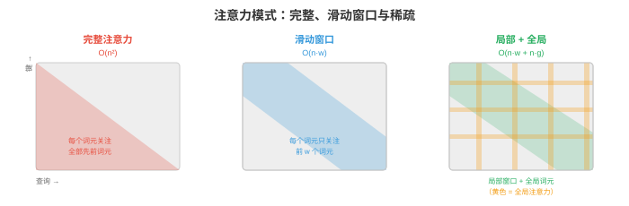
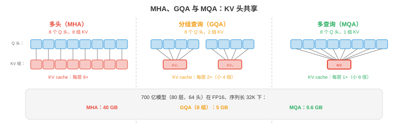

# 高效架构

*让模型更快不仅依赖低精度，还依赖每个 token 做更少工作的聪明架构。本节涵盖 StreamingLLM、稀疏和线性注意力、多查询与分组查询注意力、推理时的专家混合、知识蒸馏、剪枝与神经架构搜索。*

- 量化（第 1 节）让每项操作更便宜，本节从源头减少操作数量。二者互补：既有高效架构又完成量化的模型，可比原始模型快 10 至 100 倍。

## StreamingLLM：无限长度生成

- 标准 Transformer 将所有先前 token 存入 KV-cache，缓存随序列长度线性增长。某一时刻缓存超过 GPU 内存，生成失败。**StreamingLLM**（Xiao 等，2023）通过固定大小的**滚动 KV-cache**解决此问题。

- 关键观察：无论内容如何，序列的前几个 token 都会获得不成比例地高的注意力分数，这些被称为**注意力汇（attention sinks）**。若将它们从缓存中驱逐，注意力分布会坍塌，生成质量灾难性下降。

- StreamingLLM 的方案是在缓存中永久保留少量**汇 token**，即前 1 至 4 个 token，再加上最近 $w$ 个 token 的**滚动窗口**。总缓存大小为 $	ext{sink} + w$，无论已生成多少 token 都固定。

$$\text{Cache} = [\text{token}_0, \text{token}_1, \text{token}_{t-w+1}, \ldots, \text{token}_t]$$

- 注意力汇锚定 softmax 分布，滚动窗口提供近期上下文。这样能以常量内存实现**无限长度生成**，代价是失去访问序列中段上下文的能力。

- 对自然产生注意力汇的模型，多数预训练 LLM 均如此，StreamingLLM 无需重训练即可工作；对不能自然产生的模型，训练时加入一个可学习汇 token 即可修复。

## 稀疏注意力

- 完整自注意力在序列长度 $n$ 上为 $O(n^2)$，因为每个 token 都关注所有其他 token。$n = 128K$ 时，注意力矩阵有 $128K^2 = 160$ 亿个条目。**稀疏注意力**通过限制 token 的关注对象来降低复杂度。



- **滑动窗口注意力**（Mistral、Gemma）：每个 token 只关注前 $w$ 个 token，例如 $w = 4096$。注意力从 $O(n^2)$ 变为 $O(n \cdot w)$。信息可通过多层传播到窗口之外，$L$ 层后的有效上下文为 $L \times w$。

- **局部 + 全局注意力**（Longformer、BigBird）：大多数 token 使用滑动窗口注意力，即局部注意力；少数指定 token，如 [CLS] 或每 512 个 token，关注全部 token，即全局注意力。它同时捕获局部模式与长距离依赖。

- **膨胀注意力**：在窗口内关注每第 $k$ 个 token，以相同注意力分数数量覆盖更大范围。跨层提高膨胀率可创建与第 8 章膨胀卷积类似的层级模式。

- 现代 LLM 的实践胜者是**交错使用滑动窗口与完整注意力**：部分层使用滑动窗口，成本低、处理局部上下文；部分层使用完整注意力，成本高、捕获长距离信息。Mistral/Mixtral 使用此模式。

## 线性注意力与状态空间模型

- 能否完全替代 $O(n^2)$ 注意力？**线性注意力**与**状态空间模型（SSM）**通过避免显式注意力矩阵，在 $O(n)$ 时间处理序列。

- **线性注意力**用核近似替换 softmax 注意力：

$$\text{Standard: } O = \text{softmax}(QK^T / \sqrt{d}) V$$
$$\text{Linear: } O = \phi(Q) (\phi(K)^T V)$$

- 先结合 $K^T V$，它是与序列长度无关的 $d \times d$，复杂度从 $O(n^2 \cdot d)$ 变成 $O(n \cdot d^2)$。对于 $n \gg d$ 的长序列，节省巨大。

- **RWKV** 结合 RNN 和 Transformer 思想。它用循环形式顺序处理 token，如 RNN，但训练时可并行，如 Transformer。推理时每 token 为 $O(1)$，内存恒定，KV-cache 不增长。

- **Mamba**（Gu & Dao，2023）是选择性状态空间模型，通过学习到的状态转移处理序列：

$$h_t = \bar{A} h_{t-1} + \bar{B} x_t, \quad y_t = C h_t$$

- 其中 $\bar{A}$ 与 $\bar{B}$ 依赖输入，具有选择性，令 Mamba 能动态关注或忽略输入部分。不同于固定 SSM，这种选择性使 Mamba 在语言任务上能与 Transformer 竞争，同时保持 $O(n)$ 缩放。

- **权衡**：线性注意力和 SSM 对长序列更快，但在需要精确长程检索的任务上通常不如完整注意力。混合架构，即部分 Transformer 层 + 部分 Mamba 层，常能兼得二者之长。

## 多查询与分组查询注意力

- 标准多头注意力（MHA，第 7 章）为每个头使用独立的 $K$、$V$ 投影。对 $h$ 个头，KV-cache 中有 $h$ 组独立 key 与 value 张量。**多查询注意力（MQA）**和**分组查询注意力（GQA）**对此做了缩减。

- **MQA**（Shazeer，2019）：所有头共享一组 $K, V$ 投影，每头仍有自己的 $Q$ 投影。KV-cache 缩小 $h$ 倍，例如 32 个头时缩小 32 倍。

- **GQA**（Ainslie 等，2023）：折中方案。头被分组，每组共享一组 $K, V$ 投影。若 $h = 32$ 个头、$g = 8$ 组，则每组 4 个头共享 K/V，KV-cache 缩小 $h/g = 4$ 倍。

$$\text{MHA: } h \text{ heads, } h \text{ K/V sets} \quad \to \quad \text{GQA: } h \text{ heads, } g \text{ K/V sets} \quad \to \quad \text{MQA: } h \text{ heads, } 1 \text{ K/V set}$$



- 大多数现代 LLM 使用 GQA，如 Llama 2/3、Gemma、Mistral。它降低 KV-cache 内存与推理延迟，相比 MHA 几乎无质量损失。

### 多头潜在注意力（MLA）

- **MLA**（DeepSeek-V2，2024）比 GQA 更进一步，将 KV-cache 压缩到**低秩潜在空间**。它不缓存完整 key 与 value 向量，而是为每个 token 缓存压缩潜在向量 $\mathbf{c}_t$，并在注意力时即时重建 K/V：

$$\mathbf{c}_t = W_{\text{compress}} \cdot [\mathbf{k}_t; \mathbf{v}_t], \quad \mathbf{k}_t = W_K^{\text{up}} \cdot \mathbf{c}_t, \quad \mathbf{v}_t = W_V^{\text{up}} \cdot \mathbf{c}_t$$

- 压缩向量 $\mathbf{c}_t$ 比原始 K 和 V 合计小得多。DeepSeek-V2 相较 MHA 将 KV-cache 大小减少 **93.3%**，甚至优于 MQA，同时保持 MHA 级质量。

- 权衡是：从潜在变量重建 K/V 会为每次注意力操作增加少量计算。但 LLM decode 受内存带宽限制而非计算限制，因此这是净收益：少加载的内存大于每 token 略增的计算。

### Flash Attention

- **Flash Attention**（Dao 等，2022，第 16 章第 05 节详述）不是架构改变，而是任何高效注意力讨论都应包括的实现优化。它以如下方式计算精确的标准注意力：

    - 以 **O(n) 内存**替代 O(n²)，注意力矩阵不在 HBM 物化。
    - 比标准注意力**快 2 至 4 倍**，通过 tile 和在线 softmax 将数据留在 SRAM。
    - **没有质量损失**，输出与标准注意力数学上相同。

- Flash Attention 现已是 PyTorch，`torch.nn.functional.scaled_dot_product_attention`、JAX 和所有主流推理框架的默认注意力实现。若在 2024 年及以后运行注意力，几乎必定在使用 Flash Attention。

### Ring Attention

- **Ring Attention**（Liu 等，2023）将注意力计算分发到多设备，服务于即使使用 Flash Attention 也无法装入单张 GPU 内存的超长序列。

- 方法是将序列分到 $N$ 台设备。每台持有 $n/N$ 个 token 的 Q、K、V，设备排成环。每一步：
    1. 每台设备计算局部注意力，即本机 Q 对本机 K/V。
    2. 每台设备将 K/V 块发送给环中下一台。
    3. 每台设备从上一台接收 K/V 并对其计算注意力。
    4. $N$ 步后，每台设备已关注全部 K/V 块。

- 通信与计算**重叠**：当前 K/V 块的注意力计算进行时，下一块正在传输，几乎完全隐藏通信延迟。

- Ring Attention 通过在 GPU 环间分布 KV-cache 支持**百万 token 上下文窗口**。每设备内存为 O(n/N)，任意长序列都可行，限制仅在设备数量。

## 推理时的专家混合

- MoE 模型（第 7 章）每 token 仅激活一部分参数，通常 8 个专家中 2 个。推理中独有挑战是**专家缓存**：全部专家都必须在内存中，因为任意 token 都可能路由给任意专家，但每 token 只有 2 个活跃。

- 对 Mixtral 8x7B：总参数 = 47B，8 × 7B 专家加共享组件；每 token 活跃参数约为 13B，2 个专家加共享层。该模型有 LLM-70B 级质量、LLM-13B 级推理成本，但内存中需有 47B 参数。

- **专家卸载**：GPU 内存受限部署中，将不活跃专家保留在 CPU 或 SSD，按需加载。它可行，是因为 token 路由足够可预测，可预取可能的专家。

- **专家缓存**：在 GPU 内存维护最近使用专家的 LRU 缓存。若相同专家反复激活，常见于领域内数据，缓存命中率很高。

## 知识蒸馏

- **蒸馏**（第 6 章）训练小型“学生”模型模仿大型“教师”。学生从教师的软预测，即类别概率分布中学习，其中包含比硬标签更多的信息。

$$\mathcal{L} = \alpha \cdot \text{KL}(p_{\text{teacher}}^{T} \| p_{\text{student}}^{T}) + (1 - \alpha) \cdot \mathcal{L}_{\text{CE}}(y, p_{\text{student}})$$

- 其中 $T$ 是温度，更高 $T$ 使分布更平滑、揭示教师不确定性；$\alpha$ 平衡蒸馏损失与标准交叉熵损失。

- **对于 LLM**：蒸馏用于从大的、强大的模型创建小型快速模型。例如由 GPT-4 蒸馏出一个 7B 学生，以较低成本捕获其在某具体任务上的大部分行为。学生服务成本可低 10 至 100 倍。

- **任务专用蒸馏**：仅在部署任务相关数据上蒸馏。一个在医疗问答上由 70B 教师蒸馏出的 7B 模型，可能在该具体任务上超过 70B，因为其有限容量完全聚焦目标领域。

## 剪枝

- **剪枝**移除不必要权重，将它们置零，降低模型大小与计算量。

- **非结构化剪枝**，基于幅度，移除绝对值最小的单个权重，形成稀疏矩阵。它易于实现且压缩有效，但当前硬件，GPU，无法高效加速稀疏操作，除非稀疏性遵循特定模式。

- **结构化剪枝**移除完整单元，如注意力头、MLP 神经元或层。它产生较小的稠密模型，可在标准硬件直接加速，代价是粒度更粗，移除一个完整头可能同时移除有用和无用权重。

- **2:4 稀疏性**（NVIDIA Ampere+）是硬件支持的稀疏模式，每 4 个权重中有 2 个为零。GPU 稀疏 Tensor Core 跳过零乘法，获得约 2 倍加速。这是当下唯一具实用硬件加速的稀疏模式。

- **彩票假设**（Lottery Ticket Hypothesis，Frankle & Carlin，2019）：随机初始化网络中存在一个子网络，即“中奖彩票”，可单独训练并匹配完整网络性能。发现这些子网络，训练、剪枝、回退，成本很高，但该洞见推动剪枝研究。

## 神经架构搜索（NAS）

- **NAS** 通过搜索可能架构空间自动完成架构设计，以找到满足硬件约束，延迟、内存、功耗，且准确率最高的架构。

- **EfficientNet**（第 8 章）由 NAS 找到，平衡深度、宽度、分辨率的复合缩放规则来自搜索，而非人类直觉。

- 对推理效率，NAS 可为特定硬件目标寻找架构：“寻找在 iPhone Neural Engine 上延迟小于 5ms、ImageNet 准确率高于 80% 的模型。”搜索空间包括层类型、宽度、激活函数和注意力模式。

- **一次训练、多种部署网络（once-for-all networks）**训练单个过参数化网络，并为不同部署目标提取子网络。一次训练可产出云 GPU、移动 GPU、CPU 模型，各自为目标优化。

## 编程任务（使用 CoLab 或 notebook）

1. 实现滑动窗口注意力，并与完整注意力比较内存使用。
```python
import jax
import jax.numpy as jnp

def full_attention(Q, K, V):
    """Standard O(n^2) attention."""
    scores = Q @ K.T / jnp.sqrt(Q.shape[-1])
    weights = jax.nn.softmax(scores, axis=-1)
    return weights @ V

def sliding_window_attention(Q, K, V, window_size=128):
    """Sliding window attention: each token attends to window_size previous tokens."""
    n = Q.shape[0]
    d = Q.shape[-1]
    output = jnp.zeros_like(Q)

    for i in range(n):
        start = max(0, i - window_size + 1)
        k_window = K[start:i+1]
        v_window = V[start:i+1]
        scores = Q[i] @ k_window.T / jnp.sqrt(d)
        weights = jax.nn.softmax(scores)
        output = output.at[i].set(weights @ v_window)

    return output

n, d = 512, 64
key = jax.random.PRNGKey(0)
Q = jax.random.normal(key, (n, d))
K = jax.random.normal(jax.random.PRNGKey(1), (n, d))
V = jax.random.normal(jax.random.PRNGKey(2), (n, d))

print(f"Full attention memory:    O(n^2) = {n*n} entries")
print(f"Window (w=128) memory:   O(n*w) = {n*128} entries")
print(f"Reduction: {n*n / (n*128):.1f}x")
```

2. 比较 MHA、GQA、MQA 的 KV-cache 大小，展示 GQA 为何是实践中的平衡点。
```python
def kv_cache_size(n_heads, n_kv_heads, d_head, seq_len, bytes=2):
    """KV-cache size in MB."""
    return 2 * n_kv_heads * d_head * seq_len * bytes / 1e6

n_heads = 32
d_head = 128
seq_len = 32768

mha = kv_cache_size(n_heads, n_heads, d_head, seq_len)       # 32 KV heads
gqa = kv_cache_size(n_heads, 8, d_head, seq_len)              # 8 KV heads
mqa = kv_cache_size(n_heads, 1, d_head, seq_len)              # 1 KV head

print(f"MHA (32 KV heads): {mha:.0f} MB per layer")
print(f"GQA (8 KV heads):  {gqa:.0f} MB per layer ({mha/gqa:.0f}x smaller)")
print(f"MQA (1 KV head):   {mqa:.0f} MB per layer ({mha/mqa:.0f}x smaller)")
```

3. 通过从随机注意力层中删除最不重要的注意力头来模拟结构化剪枝，并测量输出变化。
```python
import jax
import jax.numpy as jnp

key = jax.random.PRNGKey(0)
n_heads, seq_len, d_head = 8, 64, 32

# Random multi-head attention output (one per head)
head_outputs = jax.random.normal(key, (n_heads, seq_len, d_head))

# Full output: concatenate all heads
full_output = head_outputs.reshape(seq_len, n_heads * d_head)

# Importance: measure each head's contribution by its norm
head_norms = jnp.linalg.norm(head_outputs, axis=(1, 2))
print("Head importance (by norm):", jnp.round(head_norms, 2))

# Prune least important heads
for n_keep in [8, 6, 4, 2]:
    top_heads = jnp.argsort(head_norms)[-n_keep:]
    pruned = head_outputs[top_heads].reshape(seq_len, n_keep * d_head)

    # Pad to original size for comparison (zero out pruned heads)
    full_pruned = jnp.zeros_like(head_outputs)
    full_pruned = full_pruned.at[top_heads].set(head_outputs[top_heads])
    full_pruned = full_pruned.reshape(seq_len, n_heads * d_head)

    error = jnp.linalg.norm(full_output - full_pruned) / jnp.linalg.norm(full_output)
    print(f"Keep {n_keep}/{n_heads} heads: relative error = {error:.4f}, "
          f"memory = {n_keep/n_heads:.0%}")
```
