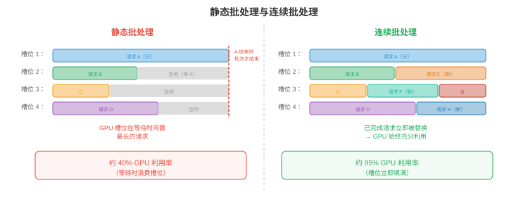
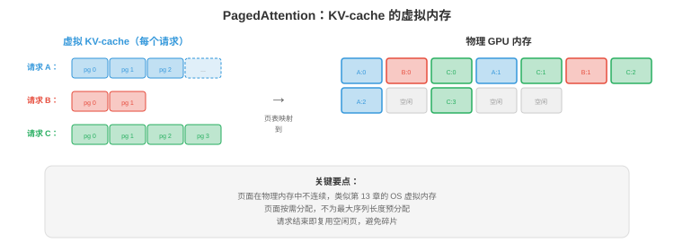

# 服务与批处理

*向数千并发用户提供 LLM 服务，远不止加载模型并运行推理。本节涵盖 prefill-decode 分离、连续批处理、PagedAttention 与 vLLM、调度策略、解耦服务、多模型与 LoRA 服务，以及关键指标。*

- 单个 LLM 推理请求很简单：输入 token，生成输出 token。但要以低延迟、高吞吐向 10,000 位并发用户提供服务，是系统问题。朴素方案，一次处理一个请求，会浪费 90% 以上的 GPU 容量。智能批处理和调度无需增加硬件即可将吞吐量提升 10 至 50 倍。

## Prefill 与 Decode：两个完全不同的阶段

- LLM 推理有两个计算特征根本不同的阶段：

- **Prefill**，提示词处理：同时处理全部输入 token。这是一次大矩阵乘法：$O(\text{prompt\_length} \times d_{\text{model}}^2)$。提示词可并行处理，因为所有 token 已知。Prefill **受计算限制**，GPU ALU 是瓶颈。

- **Decode**，生成 token：自回归地一次生成一个 token。每个新 token 都需通过 KV-cache 关注所有先前 token。Decode **受内存带宽限制**，GPU 大部分时间在从内存加载模型权重和 KV-cache，而非计算。每个 decode 步仅产生一个 token，却需加载完整模型，70B 的 FP16 模型约 140 GB。

- 其含义：

| | Prefill | Decode |
|--|---------|--------|
| 处理 token | 一次全部处理，并行 | 一次一个，顺序 |
| 瓶颈 | 计算，FLOPS | 内存带宽 |
| 算术强度 | 高 | 很低 |
| GPU 利用率 | 高，50-80% | 不批处理时低，1-10% |
| 延迟指标 | **首 token 时间（TTFT）** | **每输出 token 时间（TPOT）** |

- TTFT 决定用户体验，即响应多久开始流式输出；TPOT 决定感知生成速度。用户可容忍较高 TTFT，1 至 5 秒，却期待快速 TPOT，对话应用通常每 token 30 至 100 ms。

## 静态批处理（朴素）

- 最简单批处理：收集 $B$ 个请求，将它们填充至相同长度，作为单个 batch 处理。

- **问题 1**：请求的提示词长度与生成输出 token 数不同。短请求会提前完成，但必须等 batch 中最长请求结束，下一 batch 才能开始。GPU 只为剩下的长请求生成时会闲置。

- **问题 2**：填充浪费计算。最长提示词为 2000 token、最短为 50 时，batch 被填充至 2000；GPU 为短请求处理 1950 个 padding token，纯浪费。



## 连续批处理

- **连续批处理**，也称迭代级批处理，通过以单个 decode 步而非完整请求为粒度来解决两个问题。

- 每个 decode 步：
    1. 所有进行中请求以 batch 并行生成一个 token。
    2. 已完成的请求，生成 EOS token，立即从 batch **移除**。
    3. 队列中的新请求立即**插入**释放的槽位。

- Batch 大小每步动态变化。GPU 不会因尾部请求闲置，也没有浪费的 padding，每个请求只使用所需槽位。

- **影响**：连续批处理相较静态批处理通常提升 2 至 10 倍吞吐量，不改变模型质量，也几乎不增加延迟。

## PagedAttention 与 vLLM

- KV-cache 造成内存管理噩梦。每个请求都有随生成 token 增长的 KV-cache，不同请求处于不同阶段，缓存大小不同。为每个请求分配连续内存会浪费空间，必须为最大可能长度预留，即使请求只生成少数 token。



- **PagedAttention**（Kwon 等，2023）将第 13 章操作系统的虚拟内存概念用于 KV-cache。缓存被划分为固定大小的**页面**，即 token 位置块。页面按需分配，物理 GPU 内存中可不连续。

- 优点：
    - **无碎片**：页面大小一致，请求之间没有浪费内存的“空洞”。
    - **延迟分配**：只在实际生成 token 时分配内存，不为最大长度预分配。
    - **写时复制**：具有共同前缀，例如系统提示词的请求，共享相同 KV-cache 页面；仅在请求分叉时复制页面。

- **vLLM** 是围绕 PagedAttention 构建的推理引擎。它通过几乎消除 KV-cache 内存浪费，比静态分配服务，例如没有 paged attention 的 HuggingFace text-generation-inference，获得 2 至 4 倍吞吐量。

## 调度策略

- 当多个请求等待、GPU 只能处理有限 batch 时，**调度**决定服务哪些请求：

- **先到先服务（FCFS）**：按到达顺序处理。简单但不公平，一个提交 10K token 生成的用户会阻塞其后的所有用户。

- **最短作业优先（SJF）**：先处理最早完成的请求。它最小化平均延迟，但惩罚长期请求，可能饿死。实践中输出长度未知，SJF 使用启发式，如提示词长度和用户历史。

- **抢占**：高优先级请求到达时，暂停低优先级的进行中请求，将其 KV-cache 换出至 CPU 内存或 SSD，服务高优先级请求，再恢复暂停请求。vLLM 支持此模式。

- **基于优先级**：为用户或请求类型分配优先级。实时交互查询优先于批处理任务。与抢占结合，可确保高优先级流量的延迟 SLO。

- **Token 预算**：限制活跃 batch 中 token 总数，避免少量长请求垄断 GPU 内存并使新请求饥饿。

## 解耦服务

- Prefill 与 decode 有相反计算特征。在同一 GPU 上运行二者，会使 GPU 在受计算限制的 prefill 和受内存带宽限制的 decode 间交替，任何一种资源都不能完全利用。

- **解耦服务**将它们分开：
    - **Prefill 节点**：为计算优化的 GPU，高 FLOPS、可能内存较少，处理所有传入提示词。
    - **Decode 节点**：为内存带宽优化的 GPU，大 KV-cache 容量、高内存带宽，处理全部 token 生成。

- Prefill 节点计算初始 KV-cache，经 NVLink 或网络将它发送到 decode 节点。Decode 节点使用接收缓存生成 token。

- 这是 **Mooncake**，Moonshot AI 的架构，也被多个 LLM 服务团队探索。收益是每种 GPU 类型都匹配工作负载特征，提高整体利用率。

## 多模型与 LoRA 服务

- 生产环境常提供多个模型，不同大小对应不同服务等级，不同微调变体对应不同任务。

- **模型复用**：在同一 GPU 上加载多个模型，并将请求路由到适当模型。GPU 内存共享，例如 40 GB GPU 可同时保存 13B 模型，26 GB，与 7B 模型，14 GB。

- **LoRA 服务**：不部署独立微调模型，而是部署一个基础模型与多个 **LoRA adapter**，第 6 章。每个 adapter 增加少于 1% 的参数，推理时请求路由到合适 adapter。

- **S-LoRA**（Sheng 等，2023）从单个基础模型服务数千 LoRA adapter。Adapter 存在 CPU 上，按需分页到 GPU 内存。基础模型 KV-cache 与权重共享，仅每个请求的小 LoRA 矩阵不同。

- **Punica**（Chen 等，2023）用自定义 CUDA 内核对不同 LoRA adapter 的请求进行批处理，让同一 batch 中不同请求应用不同 LoRA 矩阵，避免逐请求切换 adapter 的开销。

## 受约束与引导生成

- 许多应用需要 LLM 输出特定格式：有效 JSON、SQL 查询、某语言代码，或符合 schema 的响应。**受约束生成**保证输出符合语法或 schema。

- **语法约束解码**：每个解码步骤掩蔽违反语法的 token。若当前输出为 `{"name": "Alice", "age":`，语法要求下一个为整数，就掩蔽除数字外所有 token。LLM 概率分布在有效 token 上重新归一化。

- **Outlines**（Willard & Louf，2023）将 JSON schema 或正则表达式编译为有限状态机（FSM）。每个解码步骤，FSM 决定哪些 token 是有效延续；无效 token 概率设为 0。它以零重试实现 100% schema 合规。

- **SGLang** 原生集成受约束生成：在 Python 中指定输出结构，引擎高效处理 token 掩蔽与缓存。它与 RadixAttention，前缀缓存，结合，使结构化输出复用已缓存前缀。

- **为何重要**：没有受约束生成时，自由生成、解析输出并在失败时重试。复杂 JSON schema 的重试率常为 10 至 30%，浪费计算；受约束生成完全消除重试。

## 请求路由

- 并非每个查询都需最大模型。**请求路由**按估计难度将查询发送至不同模型：

- **级联**：先尝试小模型。若小模型置信度低于阈值，例如最高 token 的 softmax 概率小于 0.8，再升级到大模型。简单查询，80% 以上流量，可由小模型低价服务，只有难查询使用昂贵模型。

- **学习式路由**：训练轻量分类器，或使用小模型困惑度，预测查询需要哪个模型等级。将“2+2 等于多少？”发到 3B 模型，将“解释量子纠缠的数学基础”发到 70B 模型。

- **影响**：若 80% 查询可由成本低 10 倍的模型处理，平均每查询成本降约 70%。这是多模型部署中影响最大的成本优化之一。

- **设备端 + 云端混合路由**：**Cactus**（[github.com/cactus-compute/cactus](https://github.com/cactus-compute/cactus)）在设备层实现请求路由。它通过自定义 ARM SIMD 内核在设备端，手机、笔记本、可穿戴设备，运行小模型；本地模型置信度低或查询超出设备能力时，自动路由至云端模型。应用对两条路径使用兼容 OpenAI 的 API，路由透明。这是基础设施级级联：第一层免费，设备端；第二层有成本，云 API。对于大多数查询简单的应用，如助手问答、自动补全、转写，设备端可在零边际成本下覆盖 70 至 90% 流量。

## 推理指标

- 正确指标取决于用例：

| 指标 | 衡量内容 | 目标（对话） | 目标（批处理） |
|--------|-----------------|------------------------|-----------------|
| **TTFT** | 首 token 时间 | <1 s | 不太重要 |
| **TPOT** | 每输出 token 时间 | <100 ms | 不太重要 |
| **吞吐量** | Token/秒，总量 | 不太重要 | 最大化 |
| **p99 延迟** | 最差 1% 请求 | <5 s | <30 s |
| **每 token 成本** | $/百万 token | 最小化 | 最小化 |
| **SLO 合规性** | 达到延迟目标的请求百分比 | >99% | >95% |

- **TTFT 与 TPOT 权衡**：激进批处理提高吞吐量，即总 token/s 更多，却会提高 TPOT，因为 GPU 每个 token 要处理更多请求。调度策略须平衡吞吐量，收入，与延迟，用户体验。

- **每 token 成本**是生产中的终极指标。它综合硬件成本，GPU 租赁，吞吐量，token/s，和利用率。GPU 利用率 50% 的系统，每 token 成本是利用率 100% 系统的 2 倍。这就是批处理、调度和 PagedAttention 如此重要的原因，它们提高利用率。

## 编程任务（使用 CoLab 或 notebook）

1. 模拟连续批处理和静态批处理，测量吞吐量差异。
```python
import random
import time

def simulate_static_batching(requests, batch_size=8):
    """Process requests in fixed batches. Wait for all to finish."""
    total_tokens = 0
    total_time = 0

    for i in range(0, len(requests), batch_size):
        batch = requests[i:i + batch_size]
        max_len = max(r['output_len'] for r in batch)
        # All requests in the batch take as long as the longest
        batch_time = max_len * 0.01  # 10ms per token
        total_time += batch_time
        total_tokens += sum(r['output_len'] for r in batch)

    return total_tokens / total_time  # tokens per second

def simulate_continuous_batching(requests, max_batch=8):
    """Process with continuous batching. Remove finished, add new."""
    total_tokens = 0
    total_time = 0
    active = []
    queue = list(requests)

    while active or queue:
        # Fill batch
        while len(active) < max_batch and queue:
            active.append({'remaining': queue.pop(0)['output_len']})

        if not active:
            break

        # One decode step: all active requests generate 1 token
        for req in active:
            req['remaining'] -= 1
        total_tokens += len(active)
        total_time += 0.01  # 10ms per step

        # Remove finished requests
        active = [r for r in active if r['remaining'] > 0]

    return total_tokens / total_time

# Generate requests with varied output lengths
random.seed(42)
requests = [{'output_len': random.randint(10, 500)} for _ in range(100)]

static_tps = simulate_static_batching(requests)
continuous_tps = simulate_continuous_batching(requests)

print(f"Static batching:     {static_tps:.0f} tokens/s")
print(f"Continuous batching: {continuous_tps:.0f} tokens/s")
print(f"Speedup: {continuous_tps / static_tps:.1f}x")
```

2. 计算 PagedAttention 带来的 KV-cache 内存节省，比较预分配，最坏情况，与分页，实际使用。
```python
def paged_vs_preallocated(n_requests, max_seq_len, avg_seq_len, page_size, kv_per_token_bytes):
    """Compare memory usage: preallocated vs paged KV-cache."""
    # Preallocated: every request gets max_seq_len slots
    preallocated_gb = n_requests * max_seq_len * kv_per_token_bytes / 1e9

    # Paged: allocate only what is used (with page granularity)
    import math
    avg_pages = math.ceil(avg_seq_len / page_size)
    paged_gb = n_requests * avg_pages * page_size * kv_per_token_bytes / 1e9

    waste_preallocated = (max_seq_len - avg_seq_len) / max_seq_len
    waste_paged = (avg_pages * page_size - avg_seq_len) / (avg_pages * page_size)

    print(f"Requests: {n_requests}, Max seq: {max_seq_len}, Avg seq: {avg_seq_len}")
    print(f"  Preallocated: {preallocated_gb:.1f} GB (waste: {waste_preallocated:.0%})")
    print(f"  Paged:        {paged_gb:.1f} GB (waste: {waste_paged:.0%})")
    print(f"  Savings:      {preallocated_gb - paged_gb:.1f} GB ({preallocated_gb/paged_gb:.1f}x)")
    print()

# Llama-70B: ~1.3 KB per token per layer, 80 layers = ~100 KB per token total
kv_bytes = 100_000

# Scenario 1: short requests, large max
paged_vs_preallocated(256, max_seq_len=4096, avg_seq_len=256, page_size=16, kv_per_token_bytes=kv_bytes)

# Scenario 2: varied lengths
paged_vs_preallocated(256, max_seq_len=8192, avg_seq_len=1024, page_size=16, kv_per_token_bytes=kv_bytes)

# Scenario 3: long context
paged_vs_preallocated(64, max_seq_len=131072, avg_seq_len=16000, page_size=16, kv_per_token_bytes=kv_bytes)
```
