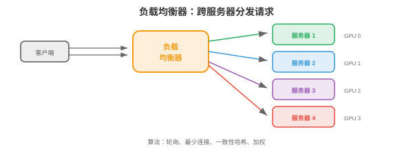
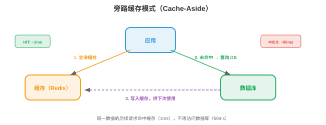
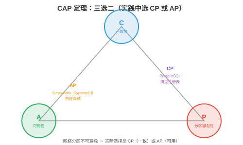

# 系统设计基础

*系统设计研究如何构建可在大规模下可靠运行的软件。本节涵盖客户端-服务器架构、网络协议、DNS、代理、负载均衡、缓存、数据库、消息队列、一致性模型和韧性模式。*

- 生产中的每个 ML 系统都是分布式系统。推荐引擎不只是一个模型，它还是 API 服务器、特征存储、模型注册表、缓存层、消息队列和监控栈，所有组件通过网络通信。理解系统设计，才是“我训练了模型”和“我构建了产品”之间的差别。

- 顶级科技公司，Google、Meta、Amazon、OpenAI，的系统设计面试会考察你能否设计这类系统。本章提供构件，本节、云基础设施，第 02 节、扩展模式，第 03 节、ML 专属设计，第 04 节，以及已完成的示例，第 05 节。

## 客户端-服务器架构

- 基本模式：**客户端（client）**发送请求，**服务器（server）**处理请求并返回响应。浏览器，客户端，向 google.com，服务器，发送 HTTP 请求，服务器返回 HTML。

- **请求-响应模型**：同步模型，客户端等待响应。它很简单，但会形成瓶颈：客户端在等待期间空闲，服务器也必须先处理当前请求才能继续。

- **无状态服务器（stateless server）**：服务器不记住先前请求。每个请求都含处理所需的全部信息，因此很容易扩展：任意服务器都可处理任意请求，只需在负载均衡器后增加服务器。

- **有状态服务器（stateful server）**：服务器在请求间维护状态，例如用户会话。它更难扩展，因为同一用户的请求必须进入同一服务器，会话亲和性。现代系统会避免将状态存入服务器，而将其保存到数据库或缓存，Redis。

## 网络协议

- 第 13 章已介绍网络，TCP/IP 分层、socket。本节聚焦系统设计使用的应用层协议：

- **HTTP/HTTPS**：Web 和大部分 API 的协议。请求方法：GET，读取，POST，创建/预测，PUT，更新，DELETE，移除。HTTPS 加入 TLS 加密，第 13 章安全。REST API，第 15 章第 03 节，建立在 HTTP 上。

- **WebSocket**：客户端和服务器之间的持久双向连接。HTTP 是 请求 → 响应 → 连接关闭，而 WebSocket 保持连接打开，支持实时流式传输。用途包括：LLM token 流，token 生成即发送、实时仪表板、聊天应用。

- **gRPC**：Google 的 RPC 框架。它在 HTTP/2 上使用 Protocol Buffers，二进制序列化，比 JSON 小且快约 10 倍，支持服务端、客户端和双向流。它用于看重性能的内部服务间通信。Triton Inference Server，第 15 章，和 TensorFlow Serving 都使用 gRPC。

- **Protocol Buffers**：在 `.proto` 文件中定义消息 schema：

```protobuf
message PredictRequest {
    repeated float features = 1;
    string model_version = 2;
}

message PredictResponse {
    float prediction = 1;
    float confidence = 2;
}

service ModelService {
    rpc Predict(PredictRequest) returns (PredictResponse);
}
```

- Schema 可被编译为任意语言，Python、C++、Go、Java，的客户端和服务器代码，类型安全、向后兼容和性能随之获得。

## DNS

- **DNS**，域名系统（Domain Name System），将人类可读名称转换为 IP 地址，第 13 章。在系统设计中，DNS 还提供：

- **基于 DNS 的负载均衡**：为同一域名返回不同 IP 地址，将流量分发到多台服务器。方法简单但粒度粗，DNS 结果被缓存数分钟至数小时，流量无法快速再平衡。

- **地理路由**：依客户端位置返回最近数据中心的 IP。东京用户获得日本数据中心，伦敦用户获得欧洲数据中心。

- **故障切换**：服务器故障后，DNS 不再返回其 IP，新客户端转向健康服务器。但缓存的 DNS 条目使部分客户端仍会在数分钟内访问故障服务器，这就是 TTL 问题。

## 代理

- **代理（proxy）**是客户端与服务器之间的中介：

- **反向代理（reverse proxy）**，位于服务器前方：客户端连接代理，由代理将请求转发至后端服务器。客户端不知道具体哪台服务器处理了请求。**Nginx** 和 **HAProxy** 是标准反向代理，提供负载均衡，分发请求、SSL 终止，在代理解密 HTTPS 并向后端发送明文 HTTP、缓存、速率限制和压缩。

- **API 网关（API gateway）**：面向 API 的专用反向代理。处理认证、速率限制、请求路由，不同路径 → 不同服务，和 API 版本控制。**Kong**、**AWS API Gateway**、**Envoy** 是常见选择。

- 用于 ML 服务时，API 网关位于模型服务器之前：认证 API key、限制免费层用户速率、将 `/v1/predict` 路由至模型服务器 A、将 `/v2/predict` 路由至模型服务器 B，并收集用量指标。

## 负载均衡

- 有多台服务器时，**负载均衡器（load balancer）**将传入请求分发给它们。



- **算法**：
    - **轮询（round robin）**：按顺序将请求发送给服务器，1、2、3、1、2、3。简单、公平，但不考虑服务器负载。
    - **最少连接（least connections）**：发送至活跃连接最少的服务器。它更适合处理时间不固定的请求，有些 LLM 请求生成 10 个 token，有些生成 1000 个。
    - **加权轮询（weighted round robin）**：容量更大的服务器接收更多请求。80 GB GPU 内存的服务器可处理 40 GB 服务器两倍的请求。
    - **一致性哈希（consistent hashing）**：将请求 key 哈希到指定服务器。同一 key 总进入同一服务器。适用于缓存，同一用户请求命中同一缓存、会话亲和性和前缀缓存，第 17 章：同一系统提示词的请求进入拥有对应 KV-cache 的服务器。

- **L4 与 L7 负载均衡**：
    - **L4**，传输层：依据 IP 和端口路由，快但不能查看请求内容。
    - **L7**，应用层：依据 HTTP 路径、header 或 body 路由。可将 `/api/chat` 路由至聊天服务器、`/api/embed` 路由至嵌入服务器，较慢但更灵活。

## 缓存

- **缓存（caching）**将频繁访问的数据存入快速存储层，RAM，以避免重复计算或获取。



- **缓存模式**：
    - **Cache-aside**，延迟加载：应用先查缓存，未命中时从数据库获取、存进缓存、再返回。这是最常见模式。
    - **Write-through**：每次写入同时进入缓存和数据库，保证缓存始终最新，但写入更慢。
    - **Write-back**：写入只进入缓存，缓存异步刷入数据库。写入最快，但缓存刷盘前崩溃会丢数据。

- **驱逐策略**，缓存满时：
    - **LRU**，Least Recently Used：驱逐最久未被访问的条目，最常见策略。
    - **LFU**，Least Frequently Used：驱逐访问次数最少的条目，适合一些条目持续热门的情形。
    - **TTL**，Time To Live：条目在固定时长后过期。用于会变陈旧的数据，例如预测缓存 5 分钟、特征值缓存 1 小时。

- **CDN**，内容分发网络（Content Delivery Network）：面向静态内容，图片、JavaScript、CSS，的全球分布式缓存。全球 100 多个地点的服务器从离用户最近的位置提供缓存内容。对 ML 而言，模型权重可缓存在 CDN 以加速下载。

- **Redis**：标准内存缓存/数据库，支持 string、list、set、sorted set、hash 和 stream，延迟低于毫秒。用于缓存模型预测、保存会话数据、速率限制，每位用户每分钟计数，和实时特征服务。

- 用于 ML 服务时，可缓存重复输入的预测。许多用户询问 “法国的首都是什么？”时，只计算一次答案并返回缓存结果。聊天机器人工作负载中 20-40% 的缓存命中率很常见，可按比例降低 GPU 成本。

## 数据库

### SQL（关系型）

- **SQL 数据库**，PostgreSQL、MySQL，将数据存入由行和列组成的表，表关系通过外键表达，使用 SQL 查询。**ACID** 保证：

    - **原子性（Atomicity）**：事务要么全部完成，要么全部回滚，没有部分更新。
    - **一致性（Consistency）**：数据库从一个有效状态转至另一个有效状态，约束，唯一键、外键，始终满足。
    - **隔离性（Isolation）**：并发事务互不干扰。
    - **持久性（Durability）**：已提交的数据可在崩溃后保留，确认前写入磁盘。

- SQL 数据库擅长：有关系的结构化数据、复杂查询，join、聚合、严格一致性需求和数据完整性。

### NoSQL

- **NoSQL 数据库**以部分 ACID 保证换取扩展性和灵活性：

    - **键值存储（key-value store）**，Redis、DynamoDB：最简单模型，按 key 快速查询，用于缓存、会话存储和特征存储。
    - **文档存储（document store）**，MongoDB、Firestore：存储 JSON 风格文档，schema 灵活，每份文档可有不同字段。用于用户资料、商品目录和配置。
    - **列族存储（column-family store）**，Cassandra、HBase：为写密集工作负载和时序数据优化。用于事件日志、指标和分析。
    - **图数据库（graph database）**，Neo4j：存储节点和边，为遍历查询优化。用于社交网络、知识图谱和推荐系统。
    - **向量数据库（vector database）**，Pinecone、Milvus、Weaviate、FAISS：存储高维嵌入，支持近似最近邻（ANN）搜索。它对语义搜索、RAG，检索增强生成，和推荐系统不可或缺。

### CAP 定理

- 在分布式数据库中，三项性质最多同时拥有两项：

    - **一致性（Consistency）**：每次读均返回最近一次写入。
    - **可用性（Availability）**：每个请求都得到响应，即使某些节点故障。
    - **分区容忍性（Partition tolerance）**：即使网络分区，节点不能通信，系统仍继续运行。



- 分布式系统中网络分区不可避免，实际选择是 **CP**，一致但分区期间可能不可用，例如 PostgreSQL，还是 **AP**，可用但分区期间可能返回陈旧数据，例如 Cassandra、DynamoDB。

- 对 ML：特征存储通常选择 AP，轻微陈旧的特征值好过没有预测；模型注册表选择 CP，提供错误模型版本会造成灾难。

### 分片

- **分片（sharding）**将数据库拆分到多台机器，每个 shard 保存部分数据。

- **哈希分片**：哈希 key 决定 shard：`shard = hash(user_id) % num_shards`。分布均匀，但无法进行范围查询。

- **范围分片**：每个 shard 保存一个 key 范围，A-G 用户在 shard 1、H-N 用户在 shard 2。它支持范围查询，却可能形成热点，例如大量用户名以 “S” 开头。

- **重新分片问题**：增加 shard 会使哈希映射失效。**一致性哈希**将数据移动量降至最低：添加第 $n$ 个 shard 时仅约 $1/n$ 的 key 需要迁移。

### 数据库索引

- **索引（index）**是以额外存储和更慢写入为代价加速查询的数据结构。没有索引时，查询扫描每行，**O(n)**；有索引时，在 **O(log n)** 找到目标。

- **B-tree 索引**，默认值：平衡树，第 13、14 章，每个节点含多个 key 和指针。B-tree 对缓存友好，宽节点可装入 cache line，并支持范围查询，`WHERE age BETWEEN 20 AND 30`。大多数 SQL 数据库使用 B-tree。

- **哈希索引**：通过哈希函数将 key 映射至行位置。查询为 $O(1)$，但不支持范围查询，用于精确匹配，`WHERE id = 12345`。

- **复合索引**：多个列上的索引。`CREATE INDEX ON users(country, city)` 加速按 country，或 country + city，过滤的查询，**不能**加速仅按 city 的查询，查询必须包含最左列。

- **取舍**：每个索引都会加速读取，却会减慢写入，每次 insert/update/delete 都必须更新索引，并占用存储，每个索引约为表大小的 10-30%。不要索引所有内容，只索引经常查询的列。

- **面向 ML 系统**：特征存储的在线数据库需要在实体 key，`user_id`、`item_id`，上建立索引，以快速查特征；实验跟踪数据库需要在 `(experiment_id, metric_name)` 上建索引供仪表板查询。

### API 设计

- 系统通过 API 通信。良好的 API 设计使系统可用、可演进且易调试：

- **REST 约定**：对资源使用名词，`/users`、`/models`，对动作使用 HTTP 方法，GET = 读取、POST = 创建、PUT = 更新、DELETE = 删除，对结果使用状态码，200 = OK、201 = created、400 = bad request、404 = not found、429 = rate limited、500 = server error。

- **分页**：返回列表的 endpoint 不应一次返回全部结果。使用基于 cursor 的分页，`GET /items?cursor=abc&limit=50`，或基于 offset 的分页，`GET /items?offset=100&limit=50`。大数据集用 cursor 更高效，offset 必须跳过行。

- **版本化**：为 API 路径加版本前缀，`/v1/predict`、`/v2/predict`，以便演进 API 而不破坏现有客户端。客户端按自己的节奏迁移到 v2；v1 被弃用，但在流量下降前不移除。

- **错误响应**：返回具有足够调试信息的结构化错误：

```json
{
    "error": {
        "code": "INVALID_INPUT",
        "message": "Feature 'user_age' must be a positive integer",
        "details": {"field": "user_age", "value": -5}
    }
}
```

## 消息队列

- **消息队列（message queue）**解耦生产者，产生工作项的服务，和消费者，处理工作项的服务。生产者将消息发送到队列，消费者就绪时拉取。

- **队列为何重要**：没有队列时，消费者慢或宕机就会阻塞生产者；有队列时，生产者发送后即可继续，队列缓冲消息直到消费者就绪。

- **Apache Kafka**：分布式、持久化、高吞吐消息队列。消息保存于 **topic**，每个 topic 在多个 broker 上分区。消费者从分区读取，并跟踪位置，**offset**。Kafka 保证分区内顺序，并可重放消息，日志是持久的。

- **发布/订阅（pub/sub）**：发布者向 topic 发送消息，该 topic 的所有订阅者各收到一份。用于事件驱动架构： “新模型已部署” 同时触发监控服务、A/B 测试服务和日志服务。

- 对 ML：预测请求经 HTTP 到达、放入 Kafka 队列、由 GPU worker 处理，再经回调或 WebSocket 返回结果。队列可缓冲流量突增，并确保 GPU worker 崩溃时不丢请求。

## 一致性模型

- 分布式系统的不同节点可能持有不同数据视图。**一致性模型（consistency model）**定义系统提供的保证：

- **强一致性（strong consistency）**：写入后，任意节点上的后续读取都会看到新值。易于推理，但慢，需要节点协调。

- **最终一致性（eventual consistency）**：写入后的一段时间内读可能看到旧数据，但最终会看到新值。快，不需协调，但应用必须处理陈旧读取。

- **因果一致性（causal consistency）**：若操作 A 在因果上先于 B，例如“写 X 后读 X”，系统保证 B 看到 A 的结果；无关操作可按任意顺序看到。

- **读己之写（read-your-writes）**：用户总能立即看到自己写入的值，即使其他用户会看到陈旧数据。这是大多数应用所需的最低一致性。

## 韧性模式

- **速率限制（rate limiting）**：限制每位用户每个时间窗口的请求数，防止滥用并保证公平访问。可用 Redis 中的 token bucket 或 sliding window counter 实现。

- **熔断器（circuit breaker）**：下游服务开始失败，错误率超过阈值，时，熔断器“打开”并停止向其发请求，立即返回降级响应。超时后它“半开”并发送一次测试请求；测试成功则“关闭”，恢复正常。这能防止级联故障：特征存储宕机时，模型服务器返回没有特征的预测，而不是让每个请求超时。

- **背压（backpressure）**：系统过载时向上游发出减速信号。与其接收请求后失败，不如提前拒绝多余请求，返回 429 或 503，客户端使用指数退避重试。

- **带指数退避的重试**：请求失败后等待 1 秒重试；再次失败则等待 2 秒，随后 4、8 秒等。加入抖动，随机延迟，避免全部客户端同时重试，即惊群问题。

- **幂等性（idempotency）**：操作执行两次与执行一次效果相同。`PUT /user/123 {"name": "Alice"}` 是幂等的，两次将名称设为 “Alice” 没问题；`POST /payments` 不是，支付两次是错误的。让操作具备幂等性即可安全重试。
