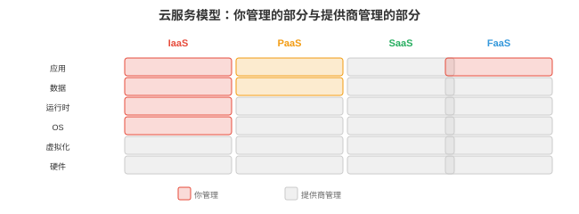

# 云计算

*云计算按需提供 ML 工作负载所需的基础设施，无需拥有硬件。本节涵盖服务模型、主要云服务商、容器与 Kubernetes、存储、云网络、无服务器计算、成本管理和基础设施即代码。*

- 训练前沿模型需要数千张 GPU 持续数月，没有初创公司拥有这样的硬件。云计算允许按小时租用：训练时扩容、推理时缩容，只为实际使用付费。任何要构建超出笔记本范围的 ML 系统的人，都必须理解云基础设施。

## 云服务模型



- 云服务按提供商管理程度分层：

| 模型 | 你管理 | 提供商管理 | 示例 |
|-------|-----------|-----------------|---------|
| **IaaS**，基础设施 | OS、运行时、应用 | 硬件、虚拟化、网络 | AWS EC2、GCP Compute Engine |
| **PaaS**，平台 | 应用、数据 | OS、运行时、扩缩容、打补丁 | AWS SageMaker、GCP Vertex AI |
| **SaaS**，软件 | 无，只需使用 | 一切 | OpenAI API、Weights & Biases |
| **FaaS**，函数 | 单个函数 | 其他一切 | AWS Lambda、GCP Cloud Functions |

- **面向 ML**：大多数团队混合使用。IaaS 用于自定义训练，完全控制 GPU 实例；PaaS 用于托管训练和服务，SageMaker、Vertex AI 处理编排；SaaS 用于工具，W&B 用于实验跟踪，OpenAI API 用于基线比较。

## 主要提供商

### AWS（Amazon Web Services）

- 最大的云服务商，约 32% 市场份额。主要 ML 服务：
    - **EC2**：虚拟机。GPU 实例：p4d，A100，p5，H100，g5，用于推理的 A10G。
    - **S3**：对象存储，数据集和模型权重的标准存储，容量近乎无限，约 $0.023/GB/月。
    - **SageMaker**：托管 ML 平台，处理训练、超参数调优、部署和监控。
    - **EKS**：托管 Kubernetes。
    - **Lambda**：无服务器函数，不适合 GPU 工作负载，但适合预处理和编排。

### GCP（Google Cloud Platform）

- Google 的云，约 11% 市场份额。主要 ML 服务：
    - **Compute Engine**：VM，提供 A100、H100 GPU 实例，**TPU VM** 用于访问 TPU。
    - **GCS**：对象存储，类似 S3。
    - **Vertex AI**：托管 ML 平台，原生支持 JAX/TPU。
    - **GKE**：托管 Kubernetes，Google 创建了 Kubernetes，因此它是最成熟的 K8s 产品。
    - **Cloud TPU**：GCP 独有，v5e 和 v5p 用于大规模训练。

### Azure（Microsoft）

- Microsoft 的云，约 23% 市场份额。主要 ML 服务：
    - **Azure VMs**：提供 A100、H100 的 GPU 实例。
    - **Azure Blob Storage**：对象存储。
    - **Azure ML**：托管 ML 平台。
    - **AKS**：托管 Kubernetes。
    - **OpenAI Service**：通过 Azure API 独家访问 OpenAI 模型。

## 容器与 Kubernetes

- 第 13 章，OS，已从概念上介绍容器，Docker，和 Kubernetes，第 15 章，部署，已从实践上介绍。本节聚焦**云特有**模式：

### 用于 ML 的 Kubernetes

- **Kubernetes（K8s）**在大规模下编排容器。关键概念：

    - **Pod**：最小可部署单元，包含一个或多个共享网络与存储的容器。模型服务 pod 可包含模型服务器容器和用于收集指标的 sidecar 容器。
    - **Deployment**：管理一组相同 pod，声明所需副本数；pod 崩溃时，K8s 自动创建替代品。
    - **Service**：一组 pod 的稳定网络端点。客户端连接 service，由 K8s 路由到健康 pod。类型：ClusterIP，内部，NodePort，经节点端口外部访问，LoadBalancer，经云 LB 外部访问。
    - **StatefulSet**：类似 Deployment，但用于有状态工作负载。每个 pod 具有持久标识和稳定存储，用于数据库及分布式训练，每个 worker 需要稳定标识来通信。
    - **DaemonSet**：在每个节点运行一个 pod。用于监控 agent，Prometheus node exporter，日志收集器，Fluentd，GPU device plugin，NVIDIA device plugin。

- **K8s 中的 GPU 调度**：NVIDIA device plugin 将 GPU 暴露为 K8s 资源，pod 请求 GPU：

```yaml
resources:
  limits:
    nvidia.com/gpu: 2  # this pod needs 2 GPUs
```

- K8s 将 pod 调度到有 2 张可用 GPU 的节点。云端 ML 平台正是这样为训练和推理分配 GPU。

### 自动扩缩容

- **Horizontal Pod Autoscaler（HPA）**：按指标，CPU 用量、请求率、自定义指标如 GPU 利用率或队列深度，扩缩 pod 数量。

- **Cluster Autoscaler**：扩缩节点数。如果 pod 因节点不足而无法调度，cluster autoscaler 由云服务商创建新 VM；节点利用不足时，它会排空并终止节点。

- **KEDA**，Kubernetes Event-Driven Autoscaling：按外部事件源，Kafka 队列深度、HTTP 请求率，扩缩。它很适合推理：请求队列增长时扩容模型服务器，队列为空时缩容。

## 存储

| 类型 | 特性 | 用例 | 示例 |
|------|----------------|----------|---------|
| **块存储** | 低延迟，挂载至单个 VM | OS 磁盘、数据库 | AWS EBS、GCP Persistent Disk |
| **对象存储** | 容量无限，经 HTTP 访问 | 数据集、模型权重、日志 | AWS S3、GCS、Azure Blob |
| **文件存储** | 多 VM 共享、POSIX | 共享训练数据 | AWS EFS、GCP Filestore、NFS |
| **数据湖** | 读时 schema、原始数据 | 分析、特征工程 | Delta Lake、Iceberg、Hudi |

- **用于 ML 训练**：数据集存于对象存储，S3/GCS，训练脚本从对象存储读取到 RAM。为了快速随机访问，打乱后的数据加载，可选择：(1) 训练前将数据集下载到本地 SSD；(2) 使用高吞吐文件系统，Lustre、FSx；(3) 使用高效流式和缓存的数据加载库，WebDataset、FFCV。

- **模型权重**：使用版本化对象存储。FP16 的 70B 模型约 140 GB；以 1 GB/s 从 S3 加载需约 2.5 分钟。在本地 SSD 缓存可减少推理冷启动时间。

## 云网络

- **VPC**，Virtual Private Cloud：云内的隔离网络，VM、数据库和服务都在 VPC 内通信；外部流量经负载均衡器或网关进入。

- **子网（subnet）**：将 VPC 划分为多个区段。公有子网可访问互联网，用于 API 服务器；私有子网不可，用于数据库和 GPU worker。这是最小权限安全原则的网络等价物。

- **安全组（security group）**，AWS，/**防火墙规则（firewall rule）**，GCP：控制允许的流量。“允许任意来源入站 HTTP 端口 80；仅允许我的 IP 入站 SSH 端口 22；阻止其余一切。”安全组配置错误是云安全事故的首要原因。

- **服务网格（service mesh）**，Istio、Envoy：管理 K8s 内的服务间通信，提供 mTLS 加密，每次服务间调用均加密、流量路由，A/B 测试：10% 流量到新模型、重试、超时、熔断和可观测性，哪个服务调用了哪个、耗时多久。

## 无服务器

- **无服务器（serverless）**，AWS Lambda、GCP Cloud Functions：上传函数后，由云服务商在触发时运行。无需管理服务器、无需配置扩缩容，按调用收费，通常每 1M 次调用 $0.20 加计算时间。

- **冷启动（cold start）**：一段空闲期后的首次调用更慢，提供商必须分配容器并加载代码。冷启动为 0.5-5 秒，因此无服务器不适合延迟敏感的 ML 推理。

- **面向 ML**：无服务器适用于预处理，将图像发送到模型前调整大小，后处理，格式化模型输出、发送通知，编排，新数据到达时触发训练流水线，及轻量推理，容忍冷启动的小模型。

- 无服务器**不适合**：GPU 推理，大多数无服务器平台没有 GPU 支持，长期训练任务，Lambda 为 15 分钟超时，或有状态服务，调用间不保留状态。

## 成本管理

- 云成本是 ML 团队首要的运维关注点。一张 H100 实例约 $8/小时，64-GPU 训练约 $500/小时，训练一个月约 $360,000。成本优化是工程问题，不是会计问题。

- **竞价/可抢占实例**：以 60-90% 折扣出售未用云容量，提供商可在 30 秒至 2 分钟通知后收回。用于：容错训练，频繁 checkpoint、在新实例恢复，批量推理、数据预处理；不用于延迟敏感服务，中断即停机。

- **预留实例**：承诺使用 1-3 年，获 30-60% 折扣。用于已知基线负载的稳定推理服务。

- **自动扩缩容**：高峰扩容，夜晚/周末缩容。高峰需 10 张 GPU、夜间仅需 2 张的模型服务器，相对 24/7 运行 10 张，可节省约 60%。

- **适当选型**：不要用 H100 跑能在 A10G 良好运行的 7B 模型。让 GPU 匹配工作负载；使用 profiling，第 16 章，确定最合适 GPU。

- **存储成本**：对象存储很便宜，S3 Standard 为 $0.023/GB/月，但会累积。一个团队每个训练 checkpoint 10 GB、每实验 100 个、50 个实验，会累计 50 TB，即 $1,150/月。应设置生命周期策略自动删除旧 checkpoint。

## 多区域部署

- 对全球 ML 系统，服务全球用户，单一区域会造成远方用户高延迟，东京用户访问美国服务器会增加约 150ms 网络往返，也会形成单点故障，区域宕机则全服务离线。

- **多区域模式**：

    - **主备（active-passive）**：主区域处理所有流量，次区域为热备，数据已复制并随时接流量。主区域故障时 DNS 切到次区域，故障切换停机 30 秒至数分钟。
    - **双活（active-active）**：两个区域同时处理流量，用户路由到最近区域。两个区域数据保持最新，异步或同步复制。单区域故障时没有停机，流量自动重路由。

- **数据复制**是难点。模型权重很容易复制，每个区域的 S3 各存一份；特征存储数据必须在可接受陈旧程度内复制；用户数据可能有**数据驻留要求**，GDPR：欧洲用户数据必须留在欧洲。

- **GPU 云定价比较**，近似，2026：

| GPU | AWS | GCP | Azure | 典型用途 |
|-----|-----|-----|-------|-------------|
| A10G（24 GB） | $1.00/hr（g5） | $0.90/hr | $0.90/hr | 小模型推理 |
| A100（80 GB） | $4.10/hr（p4d） | $3.70/hr | $3.40/hr | 训练、大模型推理 |
| H100（80 GB） | $8.00/hr（p5） | $7.50/hr | $7.00/hr | 前沿训练 |
| TPU v5e | n/a | $1.20/hr | n/a | 大规模 JAX 训练 |

- 竞价/可抢占价格通常比这些价格低 60-70%，实际价格随区域和可用性变化。

## 基础设施即代码

- **IaC**，Infrastructure as Code，在受版本控制的配置文件中定义基础设施，VM、网络、数据库、K8s 集群。不在 AWS 控制台点按钮，而是编写描述所需资源的代码，再由工具创建。

- **Terraform**，HashiCorp：标准 IaC 工具，适用于全部主要云提供商，采用声明式方式：描述目标状态，由 Terraform 推导为达到目标需创建、修改、删除的内容。

```hcl
# main.tf — create a GPU VM for inference
resource "aws_instance" "model_server" {
  ami           = "ami-0abcdef1234567890"  # Deep Learning AMI
  instance_type = "g5.xlarge"               # A10G GPU

  tags = {
    Name = "model-server-prod"
  }
}

resource "aws_s3_bucket" "model_weights" {
  bucket = "my-model-weights-prod"

  versioning {
    enabled = true
  }
}
```

```bash
terraform init      # download provider plugins
terraform plan      # show what will change
terraform apply     # create the infrastructure
terraform destroy   # tear it all down
```

- **IaC 为何重要**：可复现性，从代码重建全部基础设施；审计性，git 历史显示谁改了什么；灾难恢复，用同一配置在其他区域重建；环境一致性，开发、预发布和生产以相同模板、不同参数运行。

- **Pulumi**：类似 Terraform，但使用真实编程语言，Python、TypeScript、Go，而不是 HCL。当基础设施逻辑复杂，条件、循环、动态配置，时很有用。
