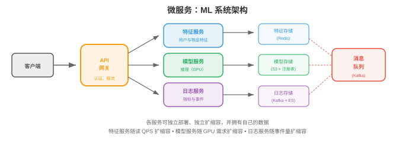
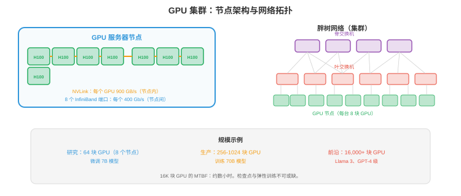

# 大规模基础设施

*要构建服务数百万用户的系统，仅有单台服务器远远不够。本节涵盖可扩展性模式、分布式系统基础、微服务、数据流水线、数据库扩展、搜索与向量系统、可观测性、可靠性工程和 CI/CD。*

- 每秒服务 1 个请求的模型可运行在笔记本上；以 99.9% 可用性服务每秒 100,000 个请求，需要分布式系统、自动故障切换和精心设计的数据流水线。本节介绍跨越这一差距的模式。

## 可扩展性

- **纵向扩展（scale up）**：使用更大的机器，更多 CPU、更多 RAM、更大 GPU。方法简单，却有硬上限，最大可用机器，且存在单点故障。

- **横向扩展（scale out）**：增加更多机器，每台处理一部分流量。没有单机上限，但需要负载均衡，第 01 节、数据分区和分布式状态处理。

- **无状态服务**默认可横向扩展：在负载均衡器后增加实例即可。启动时加载权重、独立处理请求的模型推理服务器是无状态的，任意实例都能处理任意请求。

- **有状态服务**，数据库、KV-cache、特征存储，更难扩展。状态必须在机器间分区，分片，第 01 节，并为容错复制。

- **可扩展性方程**：一个有 $n$ 台服务器的系统：
    - **理想情况**：吞吐量线性扩展，$n$ 台服务器 → $n\times$ 吞吐量。
    - **实际情况**：协调、负载均衡和数据传输的开销使吞吐量次线性扩展。Amdahl 定律，第 13 章，仍适用：串行部分，共享状态、协调，限制加速比。

## 分布式系统

- **分布式系统**是一组协调提供服务的机器，根本挑战包括：

- **网络分区**：机器并不总能通信，可能是网线断开、交换机故障或数据中心断电。系统必须处理部分失败。

- **时钟偏差**：不同机器的时钟不同。“机器 1 上事件 A 发生于 10:00:01”和“机器 2 上事件 B 发生于 10:00:01”不表示二者同时发生。**逻辑时钟**，Lamport 时间戳、向量时钟，不依赖物理时钟建立顺序。

- **共识（consensus）**：多台机器如何就一个值达成一致，例如谁是 leader。**Raft** 是标准共识算法：节点集群选举 leader，leader 处理全部写入；leader 失败时，其他节点选出新 leader。运行需要多数节点，5 个中 3 个，因此可容忍 $\lfloor(n-1)/2\rfloor$ 次失败。

- **分布式锁**：确保只有一台机器执行关键操作。基于 Redis 的 **Redlock** 在多个 Redis 实例上获取锁，多数实例授予锁时锁即获得。用于防止重复部署模型，确保只有一个训练任务写入 checkpoint。

## 微服务



- **微服务（microservice）**将系统分解为小型、可独立部署的服务，每个服务拥有一个领域：

```
┌─────────────┐  ┌──────────────┐  ┌─────────────┐
│ API Gateway │→ │ Feature Svc  │→ │ Feature DB  │
└─────────────┘  └──────────────┘  └─────────────┘
       │
       ├────────→ ┌──────────────┐  ┌─────────────┐
       │          │ Model Svc    │→ │ Model Store │
       │          └──────────────┘  └─────────────┘
       │
       └────────→ ┌──────────────┐  ┌─────────────┐
                  │ Logging Svc  │→ │ Log Store   │
                  └──────────────┘  └─────────────┘
```

- **优点**：独立部署，不触及特征服务即可更新模型服务；独立扩展，按请求负载扩模型服务器、按特征存储读取率扩特征服务器；技术自由，模型服务可用 Python，特征服务可用 Go。

- **缺点**：网络开销，每次服务调用都是一次网络往返；复杂性，调试跨越多服务；数据一致性，无法进行跨服务事务。

- **服务发现（service discovery）**：API 网关如何找到模型服务？可选择基于 DNS，每个服务注册 DNS 名称、K8s service，内建，或服务注册表，Consul、Eureka。

- **Saga 模式**：对跨服务操作，创建用户 + 分配资源 + 发送欢迎邮件，使用 saga：一组本地事务，任一步失败就执行补偿动作。

## 数据流水线

- ML 系统消费海量数据，**数据流水线（data pipeline）**移动、转换并提供这些数据：

### 批处理

- 在固定间隔，按小时、每天，处理大体量数据。

- **MapReduce**：原始批处理范式。Map，独立转换每条记录，→ Shuffle，按 key 分组，→ Reduce，按组聚合。概念简单，但实现冗长。

- **Apache Spark**：现代批处理引擎。内存内处理，对迭代算法比 MapReduce 快 100 倍，支持 SQL、DataFrame 和 ML 流水线，是大规模特征工程标准。

- **示例**：为推荐系统计算用户特征。输入：过去 30 天的 10 亿条用户活动事件；输出：1 亿个用户特征向量。每天运行 Spark job，并写入特征存储。

### 流处理

- 在数据到达时实时处理，亚秒延迟。

- **Apache Flink**：领先的流处理引擎，提供精确一次处理、事件时间处理，按发生而非到达时间处理事件，和窗口机制，tumbling、sliding、session window。

- **Kafka Streams**：Kafka 内置的轻量流处理，适合较简单的转换，筛选、聚合，无需部署独立集群。

- **示例**：实时欺诈检测。每笔信用卡交易是 Kafka 事件；Flink job 计算运行统计，交易频率、地点变化，并在 100ms 内标记异常。

### Lambda 架构

- 结合批处理和流处理。**批处理层**提供准确、完整但延迟的结果；**速度层**提供近似、实时结果；**服务层**合并二者。

- 实践中许多团队使用 **Kappa 架构**：仅使用流处理，将事件流作为真相来源。流可重放，Kafka 保留事件，因此重放流即可模拟批处理。

## ML 训练基础设施

- 训练前沿模型，100B+ 参数，是大规模基础设施问题：数千 GPU 持续运行数月、消耗兆瓦电力、生成 PB 数据、成本数千万美元。基础设施决定训练成败。

### GPU 集群

- 训练集群由通过高速网络连接的 GPU 服务器组成，关键组件：



- **GPU 服务器（节点）**：每台有 4-8 张 GPU。典型配置：8 × H100 GPU、2 × AMD EPYC CPU、2 TB RAM、30 TB NVMe SSD。节点内 GPU 以 **NVLink** 连接，H100 每张 GPU 900 GB/s，比 PCIe 快 30 倍。

- **集群规模**：小型训练集群有 64-256 张 GPU，8-32 个节点；前沿模型训练集群有 4,000-32,000 张 GPU，500-4000 个节点。Meta 的 Llama 3 使用 16,384 张 H100，Google 在含 8,000+ 芯片的 TPU pod 上训练。

- **粗略估算**：训练 70B 模型需约 $2M 计算成本，训练 400B+ 前沿模型需约 $50-100M。按 H100 价格计算，集群硬件本身约 $500M-$1B，$30K/GPU × 16,000 GPU = $480M。

### 网络拓扑

- GPU 节点间的网络是最关键的基础设施组件。GPU 无法足够快地交换梯度时，会空闲等待通信。

- **InfiniBand** 是 GPU 集群网络标准。NVIDIA **Quantum-2 InfiniBand** 每端口 400 Gb/s。每个节点通常有 8 个 InfiniBand 端口，每张 GPU 一个，因此每节点总二分带宽为 400 GB/s。

- **RDMA**，Remote Direct Memory Access：InfiniBand 支持 RDMA，在不同节点的 GPU 内存间直接传输数据，不经 CPU。这将延迟从约 100μs，TCP，降至约 1μs，对高效梯度 all-reduce，第 6 章，必不可少。

- **网络拓扑很重要**：**胖树（fat tree）**，Clos 网络，提供完整二分带宽，任意 GPU 都可与任意另一 GPU 全速通信。更便宜的 **rail-optimised**、**3D torus** 带宽较低、成本较低。拓扑必须匹配并行策略：
    - **数据并行**：跨所有 GPU all-reduce → 需要高二分带宽，胖树。
    - **张量并行**：节点内通信 → 由 NVLink 处理，不需要网络。
    - **流水线并行**：相邻流水线阶段间通信 → 只需特定节点对之间有带宽，rail-optimised 即可。

- **以太网替代方案**：**RoCE v2**，RDMA over Converged Ethernet，经标准以太网提供 RDMA，比 InfiniBand 便宜但延迟更高、拥塞更多。Google 在部分 TPU pod 网络使用 RoCE；Ultra Ethernet Consortium 正在为 AI 工作负载开发无损以太网。

### 训练存储

- 训练需要三层存储：

    - **数据集存储**：训练语料，1-100 TB 文本，或 PB 级多模态数据。保存在分布式文件系统或对象存储，必须支持高吞吐顺序读，data loader 以大 batch 读取。常用 HPC 文件系统是 **Lustre**、**GPFS**；云端替代品包括 **FSx for Lustre**，AWS，和 **Filestore**，GCP。
    - **Checkpoint 存储**：定期保存训练状态，模型权重 + 优化器状态 + 调度器状态。使用 Adam 的混合精度 70B 模型，每个 checkpoint 约 560 GB，70B × 4 bytes × 2 优化器。运行三个月、每小时保存一次 = 约 2000 个 checkpoint = 1.1 PB。实践中仅保留最新的 $N$ 个并删除旧项；写入必须足够快，不能明显减慢训练。
    - **日志与指标**：实验跟踪数据，损失曲线、学习率调度、梯度范数。体积较小，但必须实时写入。W&B、MLflow、TensorBoard 可处理它。

- **存储瓶颈**：16,000-GPU 集群加载训练 batch 时，需要连续读取约 100 GB/s 数据。文件系统无法持续提供此吞吐时，GPU 会空闲等数据。数据流水线优化，预取、缓存、以 WebDataset 或 Mosaic Streaming 优化格式，至关重要。

### 作业调度

- 一个 GPU 集群服务多个团队和项目，**作业调度器（job scheduler）**将 GPU 分配给训练作业：

- **SLURM**：标准 HPC 作业调度器。用户提交作业时指定 GPU 数、内存和时间限制，SLURM 分配资源并管理队列，支持基于优先级的调度、抢占和团队间公平份额分配。

- **具有 GPU 调度的 Kubernetes**，第 18 章第 02 节：云原生方案。K8s GPU device plugin 把 GPU 暴露为可调度资源。**Volcano** 和 **Run:ai** 增加 ML 专属特性：gang scheduling，一次为作业分配全部 GPU、而非逐张，优先级队列和 GPU 时间共享。

- **调度挑战**：
    - **碎片化**：1000 张 GPU 的集群可能有 200 张空闲，却分散在 50 个节点，每节点仅 4 张。需要 128 张连续 GPU 的作业无法运行，即使总量足够。通过**去碎片化**，迁移作业以集中空闲 GPU，或**拓扑感知调度**，分配连接良好的 GPU，解决。
    - **优先级与抢占**：紧急实验应抢占低优先级作业，但抢占一个已运行 2 天的训练作业会浪费计算。调度器必须平衡优先级与效率。
    - **公平份额**：即使某团队提交的作业多于份额，也应在时间维度获得已分配计算份额。

### 容错

- 数千 GPU 持续运行数月时，硬件失败不是例外而是常态。16,000-GPU 集群的平均故障间隔按小时而非按月计。

- **常见故障**：GPU 内存错误，ECC 可纠正或不可纠正，NVLink 故障，节点内 GPU 通信，InfiniBand 链路故障，节点间通信，节点崩溃，kernel panic、PSU 故障，存储失败，磁盘或控制器故障。

- **Checkpointing**是主要防线。每 $N$ 步保存完整训练状态，模型、优化器、data loader 位置。失败时：定位失败节点，替换或移除，之后从最新 checkpoint 重启。故障成本就是上次 checkpoint 与故障之间的计算。

- **Checkpoint 频率权衡**：频繁 checkpoint，每 10 分钟，故障时浪费较少计算，但会减慢训练，写 560 GB 需要时间；不频繁，每 2 小时，训练较快，但故障时最多浪费 2 小时计算。多数团队每 20-60 分钟 checkpoint 一次。

- **弹性训练（elastic training）**：现代框架，PyTorch Elastic、DeepSpeed，支持不重启地调整训练规模。500 个节点中失败 2 个时，训练仍以 498 个节点继续；失败节点被替换，回到线上时训练会自动纳入它们。

- **健康监控**：持续监控全部 GPU，温度、内存错误、计算吞吐量，网络链路，丢包、延迟，及存储，吞吐量、错误率。对异常自动告警。一些集群执行周期性 GPU 健康检查，短计算测试，在硬件真正故障前主动发现退化。

- **在大规模下**：训练 Meta Llama 3，16,384 张 H100、54 天，约发生 466 次作业中断。有效训练时间仅占实际时间约 90%，10% 损失于故障和恢复。达到 90%，而非 50% 或 70%，的基础设施能力，正是能否训练前沿模型的分水岭。

### 成本与效率

- 训练基础设施成本以 GPU 小时为主：

| 组件 | 总成本占比 |
|-----------|----------------|
| GPU 计算 | 70-80% |
| 网络，InfiniBand | 10-15% |
| 存储 | 5-10% |
| 制冷与供电 | 5-10% |

- **GPU 利用率**，Model FLOPs Utilisation，MFU，衡量 GPU 理论峰值性能中真正用于有效计算的比例。H100 峰值是 989 TFLOPS，FP8。40-50% MFU 已较好，50-60% 很出色。差距来自通信开销，all-reduce、流水线气泡，内存带宽限制，以及 checkpoint 和数据加载时的空闲。

- **提升 MFU**：重叠计算和通信，第 6 章，使用高效注意力，Flash Attention，第 16 章，优化数据加载，避免 GPU 饥饿，降低 checkpoint 开销，异步 checkpoint、先写快速 NVMe 再后台复制到持久存储。

- **自建还是购买**：小规模，小于 256 GPU，云更便宜，无前期成本、按小时付费；大规模，大于 1000 GPU、连续使用 6 个月以上，拥有硬件更便宜，3 年 TCO 低约 2-3 倍。多数 AI 公司混用：自有集群做持续训练，云做突发容量和实验。

## 数据库扩展

- **读副本（read replica）**：将读查询路由至主数据库的副本。主库处理写，副本处理读。绝大多数工作负载读密集，95%+ 是读，读吞吐量随副本数线性扩展。

- **分区**，第 01 节的 sharding：将数据拆到多个数据库，每个分区独立，可并行读写。挑战是跨分区查询，从不同 shard join 数据。

- **连接池（connection pool）**：数据库连接容量有限。连接池，PostgreSQL 的 PgBouncer，在请求间复用连接，防止数百个服务实例都尝试连接时耗尽连接。

## 搜索与向量系统

### 文本搜索

- **倒排索引（inverted index）**是文本搜索基础。对每个词保存包含该词的文档列表，查询时求每个查询词列表的交集。**Elasticsearch** 是标准产品：分布式、实时，支持全文搜索、聚合和地理空间查询。

- **BM25**：标准文本检索评分函数，按词频、逆文档频率和文档长度归一化对文档评分。它简单但有效，对关键词密集查询仍与神经方法竞争。

### 向量搜索

- **向量数据库**保存嵌入，高维向量，并支持快速**近似最近邻（ANN）**搜索。给定查询嵌入，找到最相似的 $k$ 个存储嵌入。

- **FAISS**，Facebook AI Similarity Search：ANN 搜索库，不是数据库，支持多种索引：
    - **Flat**：精确搜索，$O(n)$，用于小数据集或 ground truth。
    - **IVF**，Inverted File：将向量分入 cluster，仅搜索最近 cluster，每查询 $O(n/k)$。
    - **HNSW**，Hierarchical Navigable Small World：基于图，构建层次图后由粗到细导航，极快且准确，是多数应用默认选择。
    - **产品量化（PQ）**：将向量压缩为紧凑 code，用于内存高效搜索，以精度换内存。

- **托管向量数据库**：Pinecone、Weaviate、Milvus、Qdrant，处理 FAISS 不处理的扩展、复制和实时更新。

- **用于 RAG**，检索增强生成：用户查询 → 用文本编码器嵌入 → 在向量数据库检索相关文档 → 将检索到的文档置于 LLM 提示词前。检索质量直接决定 LLM 响应质量。

## 可观测性

- **可观测性（observability）**是从系统外部输出理解系统内部发生了什么的能力，有三个支柱：

### 日志

- **结构化日志**，JSON，可搜索、可解析；非结构化日志，例如 “ERROR: something failed”，则不能。始终记录：时间戳、服务名、请求 ID，用于跨服务跟踪、严重级别和相关上下文。

- **ELK 栈**，Elasticsearch、Logstash、Kibana：标准日志流水线。Logstash 收集并转换日志，Elasticsearch 建立索引，Kibana 可视化与搜索。

### 指标

- **指标（metric）**是随时间变化的数值测量：请求率、错误率、延迟百分位、GPU 利用率、队列深度。**Prometheus** 从服务抓取指标，**Grafana** 以告警仪表板可视化。

- 服务使用 **RED 方法**：**R**ate，请求/秒、**E**rrors，错误率、**D**uration，延迟。每项服务都应监控它们。

- 资源使用 **USE 方法**：**U**tilisation，使用百分比、**S**aturation，队列深度、**E**rrors。每种资源，CPU、GPU、内存、磁盘、网络，都应监控。

### 跟踪

- **分布式跟踪（distributed tracing）**沿多个服务跟随单个请求。用户请求依次经过 API gateway → feature service → model service → postprocessing；一条 **trace** 记录每次跳转的时间，显示延迟花在何处。

- **OpenTelemetry**：trace、metric 和 log 的开放标准。只需一次埋点，就可导出至任意后端，Jaeger、Zipkin、Datadog。

## 可靠性

- **SLO**，服务等级目标（Service Level Objective）：目标可靠性。“99.9% 的请求在 <200ms 内完成。”这给出具体错误预算：0.1% 请求，每月约 43 分钟，可变慢或失败。

- **SLI**，服务等级指标（Service Level Indicator）：测量项。“过去 5 分钟的第 99 百分位延迟。”

- **SLA**，服务等级协议（Service Level Agreement）：带后果的合同承诺。“可用性低于 99.95% 时，客户获得赔付。”

- **错误预算**：SLO 为 99.9%、实际为 99.99% 时，可将预算用于有风险的变更，部署新模型、迁移数据库；实际为 99.85% 时，应冻结所有变更并专注可靠性。错误预算把可靠性从抽象目标变为可量化资源。

- **混沌工程（chaos engineering）**：有意注入故障，杀掉服务器、增加网络延迟、破坏数据，测试系统能否正确处理。Netflix 的 Chaos Monkey 会随机终止生产实例；系统仍可运行说明有韧性，系统倒下说明在用户发现前找到了 bug。

## CI/CD

- **持续集成（Continuous Integration）**：自动构建、测试每项代码变更。每次 push 触发 lint、类型检查、单元测试、集成测试；任一步失败，变更被拒绝，从而在进入生产前发现 bug。

- **持续部署（Continuous Deployment）**：自动部署通过 CI 的变更。部署策略：

    - **蓝绿（blue-green）**：运行两个相同环境，blue 为当前、green 为新版本，立即将流量从 blue 切至 green；green 失败时切回 blue，实现即时回滚。
    - **金丝雀（canary）**：先将小部分流量，1-5%，路由到新版本并监控错误，指标良好则逐渐提高流量，限制错误部署的爆炸半径。
    - **功能开关（feature flag）**：部署新代码但以 flag 隐藏，仅向部分用户开启，内部测试者、beta 用户、全部用户。将部署，代码已上线，与发布，用户看见功能，解耦。

- 对 ML：CI/CD 含模型专属步骤。模型变更触发：单元测试，shape test、gradient check，保留集评估，准确率不得回归，影子部署，新旧模型同时运行并比较输出，渐进发布，canary 从 1% → 100%。
