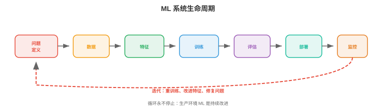
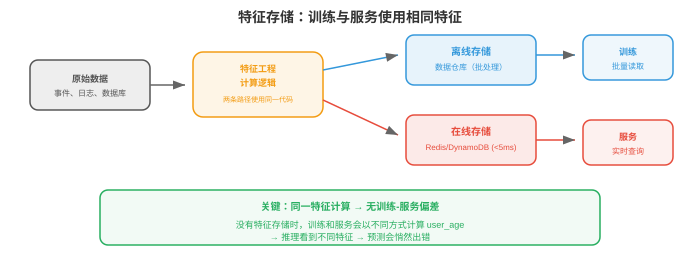
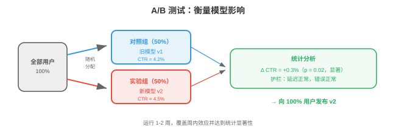

# ML 系统设计

*ML 系统设计将第 01-03 节的基础设施模式用于机器学习的特有挑战。本节涵盖 ML 生命周期、数据管理、训练基础设施、模型评估、服务策略、特征工程、ML 流水线和监控。*

- “为 YouTube 设计一个推荐系统”这类系统设计面试题，并非要求描述推荐算法，而是要求设计**整个系统**：数据流水线、特征工程、模型训练、评估、服务、监控和迭代。本节提供框架。

## ML 系统生命周期



- 每个 ML 系统，无论垃圾邮件分类器还是基础模型，都遵循同一生命周期：

```
Problem Framing → Data → Features → Training → Evaluation → Deployment → Monitoring → Iteration
       ↑                                                                                    │
       └────────────────────────────────────────────────────────────────────────────────────┘
```

### 问题定义

- 在接触数据或模型前，先定义：
    - 预测**什么**？点击概率、下一个 token、对象边界框。
    - 用户**是谁**？终端用户、内部分析师、其他 ML 模型。
    - **约束是什么**？延迟 < 100ms、可离线批处理、必须在设备端运行。
    - **业务指标是什么**？收入、参与度、准确率；ML 指标与它如何关联？
    - **基线是什么**？启发式、规则系统、现有模型；必须胜过它才能证明 ML 系统合理。

- **常见错误**：未理解问题就跳到模型架构。“我们该用 transformer”不是系统设计回答；“我们要在 200ms 内为 1000 万候选预测点击概率，因此需两阶段系统：快速检索再接小型排序模型”才是。

## 数据管理

### 数据收集与标注

- **显式标签**：人工标注数据，点击/未点击、对象边界框、对话质量评分。成本高，每标签约 $0.02-$10，取决于复杂度，缓慢且主观。

- **隐式标签**：从用户行为推导标签，如点击、停留时间、购买、跳过。便宜、丰富却有噪声，点击不等于满意、跳过不等于不喜欢。

- **程序化标注**，Snorkel：编写标注函数，启发式、regex、现有模型，对每个样本投票，再统计聚合投票产生概率标签。以中等准确率扩展至数百万样本。

- **主动学习（active learning）**：模型识别最不确定的样本并请求人工标注，最大化标签效率；1000 个主动选择标签可匹配 10,000 个随机标签。

### 数据质量

- **数据验证**：检查每一批传入数据的 schema 违规，字段缺失、类型错误，分布漂移，平均值显著变化，和数量异常，预期 1M 行却得到 500K。

- **Great Expectations** 和 **TFX Data Validation** 可定义数据预期，并在违反时告警。

- **数据版本化**：每次训练运行都应可复现。**DVC**，第 15 章，将数据文件与代码一起跟踪，每个数据集版本取得 hash，训练配置引用该 hash。

### 特征存储



- **特征存储（feature store）**，第 15 章，为训练和服务提供一致特征，关键概念：

    - **离线特征**：由批处理流水线，Spark，计算，保存于数据仓库。用于训练和批量推理，例如用户 30 天平均会话时长、商品总购买数。
    - **在线特征**：实时计算，或预计算后从低延迟存储，Redis、DynamoDB，提供。用于实时推理，例如用户最近 5 个动作、当前购物车内容。
    - **训练-服务偏差（training-serving skew）**：训练与服务的特征计算不同，模型推理时看到的值就不同于训练时。特征存储通过两条路径使用相同计算来消除它。

## 训练基础设施

- 本书面向的读者已在第 6 章深入学习分布式训练，数据并行、模型并行、混合精度、扩展定律。这里聚焦**系统**层面：

- **实验跟踪**，W&B、MLflow，第 15 章：每次训练记录超参数、指标、git commit、数据版本和硬件，是模型的版本控制等价物。

- **超参数调优**：自动搜索超参数。方法：网格搜索，穷举且昂贵，随机搜索，效果出人意料地好，贝叶斯优化，建模目标并采样可能改进的位置，**ASHA**，异步连续减半：启动许多试验，及早终止表现差的。

- **训练流水线编排**，Airflow、Kubeflow，第 15 章：自动执行数据准备 → 训练 → 评估 → 注册，按天安排重训练，并在失败时告警。

## 模型评估

### 离线评估

- **保留测试集**：在模型训练未见的数据上评估。这是标准做法，但测试集不代表生产数据时会误导。

- **基于切片的评估**：在子群体上评估，用户人口特征、内容类型、语言、时间段。总体 95% 准确率的模型，特定少数群体可能仅有 70%，不可接受。

- **回测（backtesting）**：对于时间序列或序列预测，按时间顺序在历史数据上评估。训练截至时刻 $t$ 的数据，在 $t$ 至 $t + \Delta t$ 的数据上评估，避免将未来数据用于训练的泄漏。

### 在线评估



- **A/B 测试**：将实时流量随机分到对照组，旧模型，和实验组，新模型，以统计显著性比较业务指标，收入、参与度、留存。它是评估 ML 变更的金标准。

    - **样本量**：需要足够数据发现预期效应量。点击率提高 0.1% 需要数百万曝光才能显著检测。
    - **持续时间**：至少运行一个完整周期，大多数产品为 1-2 周，捕捉星期效应。
    - **护栏指标**：目标指标之外，还监控不应变化的指标，页面加载时间、错误率、崩溃率。提高收入却增加崩溃的模型总体是负收益。

- **影子部署（shadow deployment）**：在生产中让新模型与旧模型并行运行，二者收到相同请求，但只向用户提供旧模型预测，比较输出。它无用户风险地发现 bug 和质量问题。

- **交错（interleaving）**：对于排序问题，在同一列表中交错旧新模型结果，用户与交错列表交互，再度量哪一个模型的结果获得更多参与。它达到显著性需要的用户少于 A/B 测试。

## 模型服务

### 批处理与实时

- **批量推理**：为所有可能输入预计算预测，保存到数据库/缓存，从缓存提供。适用于：输入空间有限，每晚为全部用户推荐，数据新鲜度不关键，每天一次预测即可，且延迟容忍度高。

- **实时推理**：每个请求按需计算预测。适用于：输入空间无限，任意用户查询，数据新鲜度重要，此刻预测特定查询，且延迟必须低。

- 许多系统**两者皆用**：批处理预计算候选集，便宜且覆盖 80% 流量，实时处理余项，昂贵且覆盖长尾查询和新用户。

### 模型版本和注册表

- **模型注册表（model registry）**，MLflow、W&B、SageMaker，保存训练模型及元数据：
    - 版本号和训练日期。
    - 训练配置和数据版本。
    - 评估指标，准确率、延迟、内存使用量。
    - 阶段：开发 → 预发布 → 生产 → 已归档。

- **回滚**：新模型在生产中使指标退化时，立即回退到上一版本。注册表可使其一键完成。

## 特征工程

- **特征工程**将原始数据变为模型所需输入，常是 ML 中杠杆最高的活动：更好的特征改进每个模型，而更好模型仍受其获得特征的限制。

### 在线与离线特征

- **离线特征**经预计算且变化慢，用户人口特征、30 天聚合，由批处理流水线，Spark，计算并存入特征存储。

- **在线特征**反映当前状态且变化快，购物车中商品、最后一次操作、当前位置，从事件流实时计算或从快速存储查找。

- **特征新鲜度**：一些特征需秒级新鲜，欺诈检测：最近 5 笔交易背景下此交易是否异常；另一些可陈旧数小时，推荐：该用户基于历史偏好哪些类型。更鲜的特征计算和服务更昂贵。

### 常见特征模式

- **计数特征**：时间窗口内的事件数，过去 7 天购买、过去 24 小时登录。
- **嵌入特征**：类别变量学习出的 embedding，用户嵌入、商品嵌入、查询嵌入，是双塔模型及相似架构的输入。
- **交叉特征**：两个或更多特征组合，`user_age × item_category`，捕捉单独特征遗漏的交互。
- **时间特征**：距上次操作的时间、星期几、一天中的小时，捕捉时间模式。
- **聚合特征**：一个组上数值特征的均值、中位数、最小、最大、标准差，例如此卖家商品的平均评分。

## ML 流水线

- ML 流水线从数据到已部署模型编排全部工作流：

```
Data ingestion → Validation → Feature engineering → Training → Evaluation → Registration → Deployment → Monitoring
```

- 每一步都是编排器，Airflow、Kubeflow、Metaflow，第 15 章，中的任务。流水线：
    - 按计划，每日重训练，或触发器，新数据可用，运行。
    - 是幂等的，重复运行产生相同结果。
    - 有重试逻辑，特征计算失败时采用退避重试 3 次。
    - 产出并版本化保存 artifact，训练模型、评估报告、特征统计。

- **Metaflow**，Netflix/Outerbounds，特别适合 ML：同时版本化代码、数据和模型；同一代码支持本地开发与云端执行；集成 K8s 与 AWS。

## 监控

- 第 15 章已介绍监控基础，Prometheus、Grafana、告警。本节聚焦**ML 专属监控**：

### 数据漂移

- **数据漂移（data drift）**是传入数据分布相对训练数据改变。夏季数据训练的模型可能在冬季表现差，用户行为和商品可用性不同。

- **检测**：用统计测试比较传入特征分布与训练分布：
    - **KS 检验**，Kolmogorov-Smirnov：比较两个经验分布，测试是否来自同一底层分布。
    - **PSI**，Population Stability Index：衡量分布移动程度。PSI < 0.1 稳定、0.1-0.25 中等移动、> 0.25 显著。
    - **嵌入漂移**：使用质心距离或 MMD，Maximum Mean Discrepancy，比较传入查询嵌入分布和训练集。

### 概念漂移

- **概念漂移（concept drift）**是输入与输出的关系改变。特征看起来相同，但正确预测变了。例如文化事件、疫情或产品变化后用户偏好发生转变。

- 概念漂移比数据漂移难检测，因为它需要标签数据。应监控代理指标：点击率、转化率、用户满意度分数；持续下降提示概念漂移。

### 模型退化

- 模型会因多种原因随时间退化：数据漂移、概念漂移、特征流水线 bug，某特征开始返回 null，和上游数据变化，第三方 API 改变响应格式。

- **响应**：检测到退化后，行动取决于严重性：
    - 轻微：在近期数据上重训练，计划性重训练会处理。
    - 中等：调查根因，哪个特征变了、哪个用户分群受影响。
    - 严重：立即回滚到先前模型版本，然后调查。

### 反馈回路

- ML 系统会形成**反馈回路**：模型预测影响用户行为，用户行为成为下个模型版本的训练数据，回路可良性也可恶性。

- **正反馈回路**，危险：推荐模型主要展示热门商品 → 用户点击热门商品，因为只能看到它们 → 模型学到热门商品更热门 → 多样性崩溃。模型创造了证实自身偏见的数据。

- **负反馈回路**，也危险：欺诈模型捕获所有 A 类欺诈 → 没有 A 类欺诈进入训练数据 → 下个模型学不会检测 A 类 → A 类欺诈再次出现。

- **缓解措施**：
    - **探索（exploration）**：展示模型不确定的一些项目，epsilon-greedy、Thompson sampling，生成多样训练数据。
    - **反事实日志（counterfactual logging）**：记录模型*本会*预测什么，不仅记录用户看到什么；使用反事实数据训练以去偏。
    - **保留组（holdout set）**：随机让部分流量不经模型筛选，未过滤数据为评估模型质量提供 ground truth。
    - **延迟标签**：在真实结果出现前不将数据用于训练。今天被点击的推荐明天可能被后悔；欺诈预测必须等待拒付窗口，30-90 天。

### 嵌入表管理

- 大规模 ML 系统通常有含 100M+ 条目的 embedding table，每个用户、商品、广告或实体一个 embedding。大规模管理它是系统挑战：

- **存储**：100M 实体 × 256 维 × float16 = 50 GB，无法装入 GPU 内存。解决方案：存到 CPU 内存并用 GPU 侧缓存、分片到多台机器，或使用**哈希嵌入（hash embedding）**，将实体哈希到固定大小表并接受冲突。

- **更新**：模型重训练时 embedding 改变。部署新 embedding table 到服务时，需要在不中断在线流量下把 50 GB 加载到内存、验证正确性，并在指标退化时回滚。对 embedding table 使用蓝绿部署。

- **陈旧性**：新建用户没有 embedding，即冷启动问题。使用默认 embedding、经特征到 embedding 模型从用户特征导出 embedding，或回退到非个性化模型。

### 公平性与偏差

- ML 系统可能系统性地差别对待不同群体，通常反映训练数据的偏差。**公平性监控**是责任，不是可选功能。

- **要监控的指标**：
    - **人口统计均等（demographic parity）**：正向预测率是否在群体，性别、族群、年龄，之间不同？
    - **机会均等（equal opportunity）**：真阳性率是否在群体间不同？招聘模型应同样善于识别各群体合格候选人。
    - **校准（calibration）**：模型对群体 A 说 $P(qualified) = 0.7$ 时，群体 A 是否确有 70% 合格？群体 B 是否同样成立？

- **实践步骤**：
    - 在切片，子群体，而不只整体指标上评估模型表现。
    - 将公平性指标纳入模型评估流水线，总体准确率提高却使特定群体退化的模型，未经审查不应部署。
    - 记录已知限制与失败模式。
    - 为敏感领域，招聘、贷款、刑事司法、医疗，部署的模型建立审查流程。
