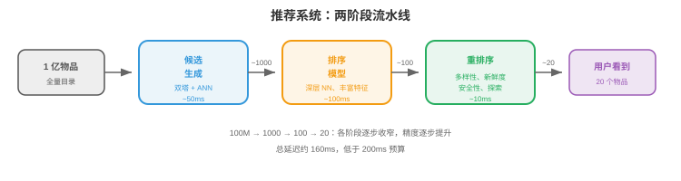
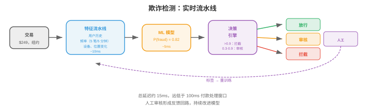

# ML 设计案例

*学习 ML 系统设计的最好方式是阅读完整案例。本节依次讲解七个完整设计：推荐系统、搜索排序、广告点击预测、欺诈检测、内容审核、对话式 AI 和大规模图像搜索。*

- 每个案例遵循统一框架：
    1. **问题定义**：构建什么、用户是谁、约束是什么？
    2. **数据**：有什么数据、如何收集、如何标注？
    3. **特征**：模型需要哪些特征？
    4. **模型**：采用什么架构和训练方法？
    5. **服务**：模型如何部署和提供服务？
    6. **评估**：如何衡量成功？
    7. **迭代**：会随时间做哪些改进？

---

## 1. 推荐系统，例如 YouTube、Netflix、Spotify

### 问题定义

- **目标**：向用户展示他们会喜欢的内容，最大化参与度，观看时长、收听、点击。
- **规模**：10 亿以上用户、1 亿以上项目、每秒 1 万以上推荐。
- **延迟**：完整推荐流水线 <200ms。
- **关键挑战**：候选空间极大，1 亿项目，无法为每位用户实时为所有项目评分。

### 架构：两阶段流水线



```
100M items → Candidate Generation (fast, coarse) → 1000 candidates
          → Ranking (slow, precise) → 100 ranked items
          → Re-ranking (business rules) → 20 shown to user
```

### 候选生成

- **目标**：将 1 亿项目降至约 1000 个候选，必须快速，<50ms。
- **双塔模型（two-tower model）**：将用户和项目编码到同一 embedding space。用户 embedding 表示偏好，项目 embedding 表示内容特征；得分是二者点积。
- **训练**：对 `(user, positive_item, negative_items)` 三元组做对比学习。正样本为用户互动过的项目，负样本为随机项目加 hard negative，用户未互动的热门项目。
- **服务**：预计算全部项目 embedding。请求到达时计算用户 embedding，通过 ANN 搜索，向量数据库中 HNSW，找到最近的 1000 个项目 embedding。

### 排序

- **目标**：精确评分 1000 个候选，可使用约 100ms。
- **模型**：接收丰富特征的深度神经网络，MLP 或 transformer：用户特征，人口属性、历史、上下文，项目特征，内容、热度、新鲜度，和交叉特征，用户-项目交互历史、上下文相关性。
- **输出**：预测参与概率，点击、观看 50% 以上、点赞、分享。可组合多个目标：$\text{score} = w_1 \cdot P(\text{click}) + w_2 \cdot P(\text{watch}) + w_3 \cdot P(\text{like})$。

### 重排序

- 应用业务规则：多样性，不展示同一创作者的 5 个视频，新鲜度，提升新内容，安全性，过滤被标记内容，及个性化探索，展示用户可能发现的一些较低排序项目。

### 粗略估算

- **项目 embedding 索引**：1 亿项目 × 256 维 × float16 = 50 GB。HNSW 索引增加约 2 倍开销 → 约 100 GB。可装入有 128 GB RAM 的单机，或分片到 4 × 32 GB 机器。
- **用户 embedding 计算**：每用户约 5ms，用户特征上的小 MLP。10K QPS 下需要约 50 个模型副本。
- **ANN 搜索**：HNSW 从 1 亿向量中取 top-1000 约 2ms。10K QPS 下每个索引副本处理约 500 QPS → 需要 20 个副本。
- **排序模型**：1000 候选 × 每候选约 0.1ms = 每请求 100ms。10K QPS 下每秒需要 1000 GPU-seconds → 仅排序约需 10 张 A10G GPU。
- **总基础设施**：约 20 个 embedding 索引副本 + 约 50 个用户 embedding 服务器 + 约 10 张排序 GPU + 缓存 + 负载均衡器。按云价格每月约 $50K-$100K。

### 冷启动

- **新用户**，没有历史：使用人口属性、设备/位置上下文和基于热度的推荐；5-10 次互动后切换到个性化模型。
- **新项目**，没有参与数据：使用基于内容的特征，标题、描述、缩略图 embedding。分配探索预算，向部分用户展示新项目以快速收集参与数据；提升期后仍无参与的项目会被降权。
- **冷启动是系统问题**：特征存储必须优雅处理缺失特征，返回默认值而非错误；模型必须带缺失特征训练，训练时对用户历史特征做 dropout 来模拟新用户。

### 评估

- **离线**：保留集上的 NDCG，Normalized Discounted Cumulative Gain、recall@K、precision@K。
- **在线**：测量观看时长、DAU、留存的 A/B 测试；使用以周计的长期 A/B 测试，捕捉短期测试遗漏的用户留存影响。

---

## 2. 搜索排序，例如 Google、Bing

### 问题定义

- **目标**：给定用户查询，从数十亿文档的语料中返回最相关结果。
- **延迟**：总计 <500ms，100ms 检索 + 200ms 排序 + 100ms 渲染 + 开销。

### 架构：查询理解 → 检索 → 排序

### 查询理解

- 在检索前处理原始查询以改善结果：

- **拼写纠正**：reccomendation systm → recommendation system。使用编辑距离模型，或以搜索日志中拼错、纠正样本对训练的 sequence-to-sequence 模型。
- **查询扩展**：添加相关术语提高召回。Python 机器学习 → Python 机器学习 scikit-learn PyTorch。使用同义词词典、词嵌入（embedding）或 LLM 生成扩展。
- **意图分类**：确定用户想要什么。“购买 Nike 鞋”是**交易型（transactional）**，展示商品页；“反向传播如何工作？”是**信息型（informational）**，展示文章；facebook.com 是**导航型（navigational）**，直接前往网站。不同意图应触发不同检索策略和结果布局。
- **实体识别**：从查询提取实体。“时代广场附近最好的餐厅” → 位置：时代广场，实体类型：餐厅，路由至位置感知搜索流水线。

### 检索

- **BM25**，传统：基于倒排索引的词项匹配检索，快且对关键词查询有效，但没有语义理解，dog food 不匹配 canine nutrition。
- **稠密检索（dense retrieval）**：将查询和文档编码成 embedding，使用 DPR 或 ColBERT 等 bi-encoder，通过 ANN 搜索检索。它捕捉语义相似性，dog food 匹配 canine nutrition，比 BM25 慢，却更适合自然语言查询。
- **混合检索（hybrid retrieval）**：组合 BM25 与稠密检索。BM25 找精确关键词匹配，稠密检索找语义匹配，再合并去重，兼得两者优势。

### 排序

- **学习排序（learning to rank）**：模型为每个 `(query, document)` 对评分，有三种方式：
    - **Pointwise**：独立预测每篇文档的相关性分数，简单但忽略相对顺序。
    - **Pairwise**：预测两篇文档中哪个更相关。LambdaMART，梯度提升树，是经典方法。
    - **Listwise**：直接为列表级指标，NDCG，优化整个排序列表，更复杂但结果最佳。

- **交叉编码器（cross-encoder）**：以 `[query, document]` 为输入、输出相关性分数的 transformer。它比独立编码查询和文档的 bi-encoder 更准确，因为可捕捉细粒度交互；但对完整语料过慢，仅用于重排序检索结果中的 top 100-1000 候选。

### 特征

- **查询特征**：查询长度、语言、意图分类，导航、信息、交易。
- **文档特征**：PageRank、新鲜度、内容质量分数、域名权威度。
- **查询-文档特征**：BM25 分数、embedding 相似度、精确匹配数、历史日志中此 `(query, document)` 对的点击率。

---

## 3. 广告点击预测

### 问题定义

- **目标**：预测用户点击广告的概率，由此决定实时拍卖中的出价。
- **规模**：每秒 100K+ 次拍卖，每次须在 10ms 内给出预测。
- **收入影响**：点击预测准确率提升 0.1%，可转化为数百万额外收入。

### 架构

- **特征工程**是广告系统核心，特征包括：
    - **用户特征**：人口属性、浏览历史、购买历史、设备、位置、一天中的时间。
    - **广告特征**：创意，图像/文本、广告主、类别、历史 CTR、出价金额。
    - **上下文特征**：页面内容、广告位置、设备类型、连接速度。
    - **交叉特征**：`user_category × ad_category` 交互、`user_region × ad_campaign` 交互。

- **模型**：历史上使用逻辑回归，简单、快速、可解释；现代系统使用深度学习：**DLRM**，Deep Learning Recommendation Model，对类别特征使用 embedding table，对稠密特征使用 MLP。
- **校准（calibration）**：预测概率必须准确。模型说 $P(\text{click}) = 0.05$ 时，此类展示中实际应有 5% 被点击。由于预测概率直接决定出价，校准至关重要。
- **探索-利用（exploration-exploitation）**：始终展示预测最好的广告在长期并非最优，因为无法发现新广告可能更好。Thompson sampling 或 $\epsilon$-greedy 探索使一部分展示流量进入不确定性更高的广告以收集数据。

### 实时竞价

- 用户加载页面时，广告拍卖在 <100ms 内运行：
    1. 发布者向多个广告交易平台发送竞价请求，用户信息、页面上下文。
    2. 每个广告主的竞价服务器预测自身广告 CTR。
    3. 出价 = CTR × value_per_click，出价更高者赢得拍卖。
    4. 展示获胜广告；若被点击，广告主付费。

---

## 4. 欺诈检测

### 问题定义

- **目标**：实时检测欺诈交易，信用卡欺诈、账户接管、虚假评论。
- **延迟**：<100ms，付款处理前必须批准或标记该交易。
- **关键挑战**：类别极度不平衡，欺诈率 0.1%。假阳性会阻止合法用户，假阴性会造成金钱损失。

### 架构



### 特征

- **交易特征**：金额、币种、商户类别、一天中的时间、`is_international`。
- **用户特征**：账户年龄、平均交易金额、近期交易数、设备指纹。
- **速度特征**，实时、来自流式流水线：过去 5 分钟交易数、过去一小时不同商户数、与上一笔交易的地理距离。
- **图特征**：该商户是否与已知欺诈团伙相连？该设备是否由已标记账户共享？

### 模型

- **梯度提升树（gradient-boosted tree）**，XGBoost、LightGBM，是表格型欺诈检测标准。它们处理混合特征类型、具备可解释性，特征重要性，且训练快。
- **处理不平衡**：对多数类欠采样、对少数类过采样，SMOTE，或在损失函数中使用类别权重。Focal loss，第 8 章，降低简单负样本权重。
- **成本矩阵**：假阳性，阻止合法交易，有用户挫败、失去销售的成本；假阴性，漏掉欺诈，有金融损失。决策阈值应最小化总期望成本，而非最大化准确率。

### 人在回路

- 不确定预测，模型置信度在 0.3-0.7，发送至人工审核。审核决定成为重训练标签，形成反馈回路：模型随看到更多带标签欺诈案例而持续改进。

---

## 5. 内容审核

### 问题定义

- **目标**：从平台自动检测和移除有害内容，仇恨言论、暴力、错误信息、CSAM。
- **规模**：每天数十亿帖子，文本、图像、视频。
- **挑战**：依赖上下文，讽刺、戏仿、文化细微差别，必须平衡言论自由与安全。

### 架构

- **多模态分类**：文本、图像、视频分别使用模型，再通过融合层组合其信号。
- **文本审核**：微调语言模型将文本分类为骚扰、仇恨言论、错误信息、垃圾信息等类别，多语言模型处理 100 多种语言。
- **图像审核**：视觉模型检测显式内容，裸露、暴力，图中文字，OCR + 文本分类器，和已知有害内容，与已知 CSAM 数据库进行 hash 匹配。
- **视频审核**：按固定间隔采样帧，对每帧运行图像分类器，并结合音频转录，ASR → 文本分类器。
- **策略即代码（policy-as-code）**：审核策略定义为将模型输出映射至动作的结构化规则：

```python
if text_model.hate_speech_score > 0.9:
    action = "remove"
elif text_model.hate_speech_score > 0.7:
    action = "human_review"
else:
    action = "allow"
```

- 策略经常变化，新法规、规范演进。将策略与模型分离，可在不重训练时部署变更。

### 主动与被动审核

- **主动审核**，发布前：内容上线前运行分类器，高置信度违规项自动阻止。它避免有害内容被看到，但增加发布延迟并有假阳性风险，误拦合法内容。
- **被动审核**，发布后：内容立即上线，用户可举报违规；举报触发分类器 + 人工审核。发布者延迟较低，但有害内容会在检测前可见。
- **大多数平台两者都用**：高严重度类别采用主动审核，CSAM：零容忍、发布前阻止；细微类别采用被动审核，错误信息需要人工判断、举报后复核。

### Hash 匹配

- 对已知有害内容，CSAM、恐怖主义宣传，使用**感知哈希（perceptual hashing）**：计算对轻微修改，裁剪、缩放、压缩，鲁棒的图像/视频 hash。与已知有害内容数据库，NCMEC 的 hash 数据库、GIFCT 共享 hash 数据库，比较；匹配后无需分类器立即移除。
- **PhotoDNA**，Microsoft，是 CSAM 检测的标准感知 hash。在许多法域中，这是法律义务，不只是技术选择。

### 粗略估算

- **规模**：每天 10 亿帖子 = 每秒约 12K 帖子。每帖需要：文本分类，约 5ms，图像分类，约 20ms，hash 匹配，约 1ms。12K QPS 下，需约 60 个文本分类器、240 个图像分类器、12 个 hash 匹配器，外加冗余。
- **人工审核**：若 2% 帖子被标记审核 = 每天 20M；每位审核员每天 100 条审核，需 200K 审核员。这说明自动准确率为何重要：假阳性每降低 0.1%，每天节省 1M 次审核。
- **延迟预算**：主动审核须在发布流水线内完成，约 500ms。文本 5ms + 图像 20ms + hash 1ms + 开销，完全在预算内。视频例外：即使每秒采一帧，10 分钟视频也需要 600 次分类器调用，应异步处理。

### 升级工作流

- 自动移除 → 人工审核申诉 → 专家审核，法律、文化专家 → 策略团队处理模糊案例。每一层处理更少案例、拥有更多细微判断。
- **反馈给模型**：人工审核决定是重训练的最高质量标签。模型与审核员不一致的案例被优先纳入主动学习，因为它们是模型处理最差的案例。

---

## 6. 对话式 AI，基于 RAG 的聊天机器人

### 问题定义

- **目标**：使用公司文档回答公司产品问题的聊天机器人。
- **需求**：准确，不产生幻觉，引用来源、处理追问，并保持在产品领域内。


### 架构：检索增强生成（RAG）

```
User query → Query Embedding → Vector Search (documentation) → Top-K chunks
                                                                      ↓
User query + Retrieved chunks → LLM → Response (with citations)
```

### 组件

- **文档摄取**：切分文档并嵌入。**切分策略**影响很大：

    - **固定大小切分**：每 $N$ 个 token，例如 500，切分，并有 $M$ token，例如 50，重叠。简单、块大小可预测，但可能在句子或段落中间切开、丢失上下文。
    - **语义切分**：在段落或章节边界切分，每块是连贯的信息单元。块大小可变，有些 100 token、有些 800 token，因此检索系统须处理可变长度。
    - **递归切分**：先尝试按段落边界切；段落过长时按句子边界；句子仍过长时按固定大小。这在连贯性与大小一致性间最平衡。
    - **嵌入**：使用文本编码器，E5、BGE、Cohere embed，嵌入每个块，并保存至向量数据库。

- **检索**：嵌入用户查询，在向量数据库检索最相似的 $k$ 个块，通常 $k = 5$-$10$，可选用 cross-encoder 重排序以获得更高精度。
- **生成**：将检索块作为上下文构造提示词：

```
System: You are a helpful assistant. Answer based ONLY on the provided context.
If the answer is not in the context, say "I don't know."

Context:
[chunk 1]
[chunk 2]
...

User: {question}
```

- **护栏（guardrail）**：阻止 LLM 回答产品领域外问题、生成有害内容，或与检索上下文矛盾。实现方式：输入过滤，拒绝跑题查询，输出过滤，检查回答是否符合检索上下文，宪法式提示，指示模型拒绝某些请求。
- **对话记忆**：保存最近 $n$ 轮对话并放入提示词，使模型理解追问。例如“价格怎么样？”需要知道前文讨论的产品。

### 查询重写

- 用户经常提出模糊追问：“价格怎么样？”，哪一个产品的价格？**查询重写**使用对话历史产生独立查询：

    - 输入：对话历史 + “价格怎么样？”
    - 重写：“产品 X 的企业版方案价格是多少？”

- 将重写查询嵌入并在向量数据库检索。没有重写时，检索只会搜索 pricing，缺少上下文而返回无关块。
- 查询重写可用小型 LLM 调用，约 50ms，或微调 sequence-to-sequence 模型，约 5ms，完成。

### 粗略估算

- **文档语料**：10K 页面、每页平均 2000 token = 20M token。每块 500 token、重叠 50 = 约 44K 块。
- **Embedding 索引**：44K 块 × 768 维 × float16 = 约 65 MB，轻松装入内存。即使 10M 块也约 15 GB。
- **延迟分解**：查询 embedding 5ms + 向量检索 2ms + cross-encoder 重排序，top-50，20ms + LLM 生成 500-2000ms = 总计约 600-2100ms。LLM 占主导，应使用流式输出降低感知延迟。
- **成本**：按 $3/1M token，Claude/GPT-4 API，每天 1000 查询、每次约 2K token = 约 $6/天。大规模，每天 1M 查询，使用 2 张 A10G GPU 自托管 7B 模型，约 $50/天，成本降低 100 倍。

### 评估

- **检索质量**：Recall@K，top-K 块是否包含答案，MRR，Mean Reciprocal Rank。
- **生成质量**：事实准确性，回答是否符合检索上下文，groundedness，是否引用正确块，答案相关性。
- **端到端**：用户满意度，赞/踩，转人工客服的升级率。

---

## 7. 大规模图像搜索

### 问题定义

- **目标**：给定一张图像，从 10 亿以上图像语料中找出视觉相似图像。
- **应用**：以图搜图、商品搜索，照片 → 匹配商品、重复检测。
- **延迟**：含网络往返 <500ms。

### 架构

```
Query image → Embedding Model (ViT/CLIP) → 512-dim vector → ANN Search → Top-K results
```

### Embedding 提取

- **模型**：预训练视觉编码器，ViT、CLIP 的图像编码器、DINOv2；需要时在特定领域，时尚、电商、医学影像，微调。
- **训练**：对比学习，第 10 章。正样本对为同一图像的不同视图，或图像 + 匹配文本；负样本对为随机图像。模型学习对相似图像产生相似 embedding、对不同图像产生不相似 embedding。

### 建索引

- **离线**：嵌入全部 10 亿图像并构建 ANN 索引。HNSW，第 03 节，建索引需要数小时，索引保存在内存中，10 亿 × 512 维 × float16 加图开销约 128 GB。
- **分片**：索引拆至多台机器，每台保存一个 shard。查询时并行搜索全部 shard，再合并 top-K 结果。
- **增量更新**：新图像，上传、新商品，必须加入索引。HNSW 支持无需重建的增量插入，Milvus、Pinecone 等向量数据库原生处理此事。

### 服务

- **Embedding 服务**：运行 ViT 模型的 GPU 服务器，每图延迟约 20ms，以 batch 处理多个查询提高吞吐。
- **搜索服务**：ANN 索引服务器，HNSW 在 10 亿向量上检索 top-100 延迟约 10ms。
- **缓存**：缓存热门查询结果。做重复检测时，缓存近期上传图像 embedding，在完整索引检索前先把新上传与缓存比较。

### 评估

- **Precision@K**：top-K 结果是否实际相似？
- **Recall@K**：语料中全部真正相似图像里，有多少在 top-K？
- **平均精度均值（mAP）**：precision-recall 曲线下的面积。
- **人工评估**：对主观相似性，由人工评分员判断检索图像是否相关。

---

## 面试框架

- 遇到系统设计题时，遵循该框架：

1. **澄清需求**，2-3 分钟：询问规模、延迟、一致性需求和边界情况。多少用户？可接受什么延迟？故障时怎样？
2. **高层设计**，5-7 分钟：画出主要组件及交互，从 happy path 开始，使用第 01-03 节模式。
3. **深入设计**，15-20 分钟：选择最有趣或最具挑战的组件详细设计，展示深度。对 ML 系统，通常深入模型架构、特征流水线或服务架构。
4. **评估与监控**，3-5 分钟：如何衡量成功？什么会出错？如何发现和响应问题？
5. **迭代**，2-3 分钟：有更多时间/资源会改进什么？这显示你理解取舍且能确定优先级。

- **面试官关注点**：结构化思考，不直接跳向方案，取舍意识，每种选择都有成本，实践知识，确实构建过系统，和沟通能力，能否清晰说明设计。
